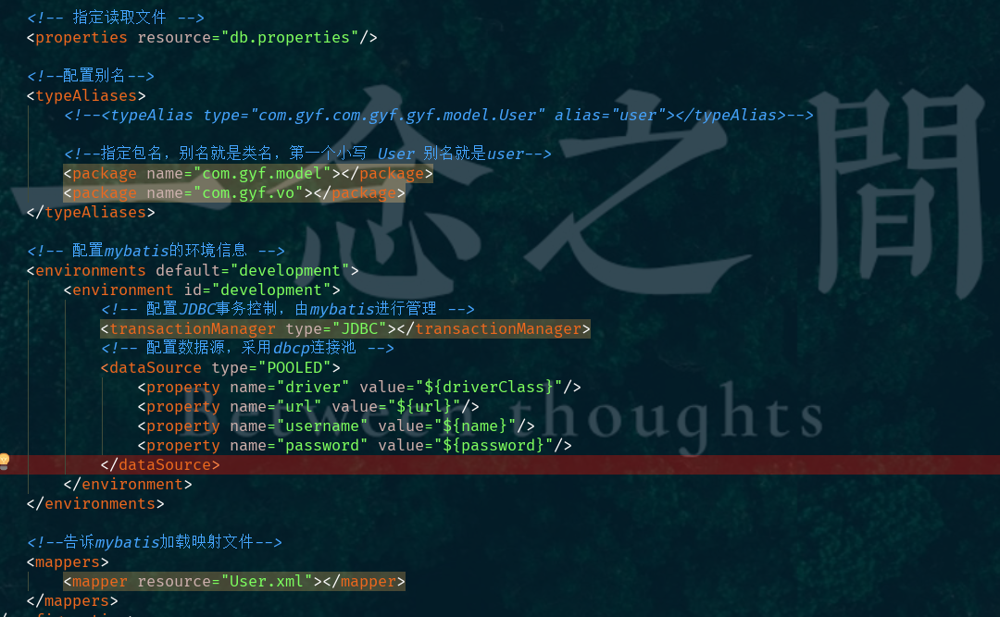
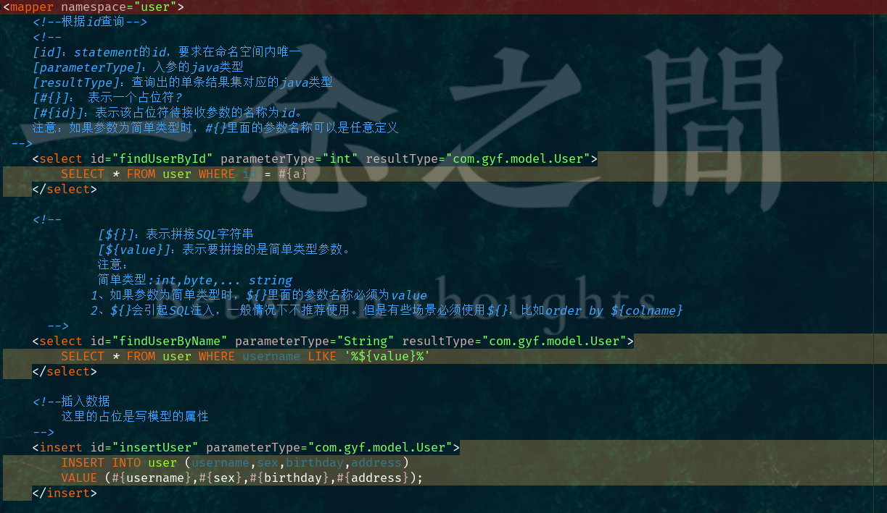
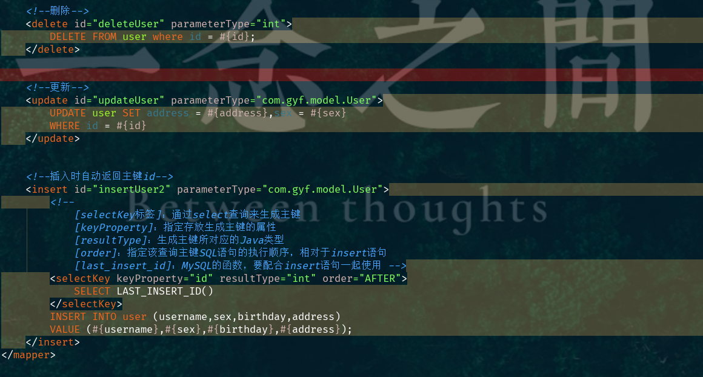
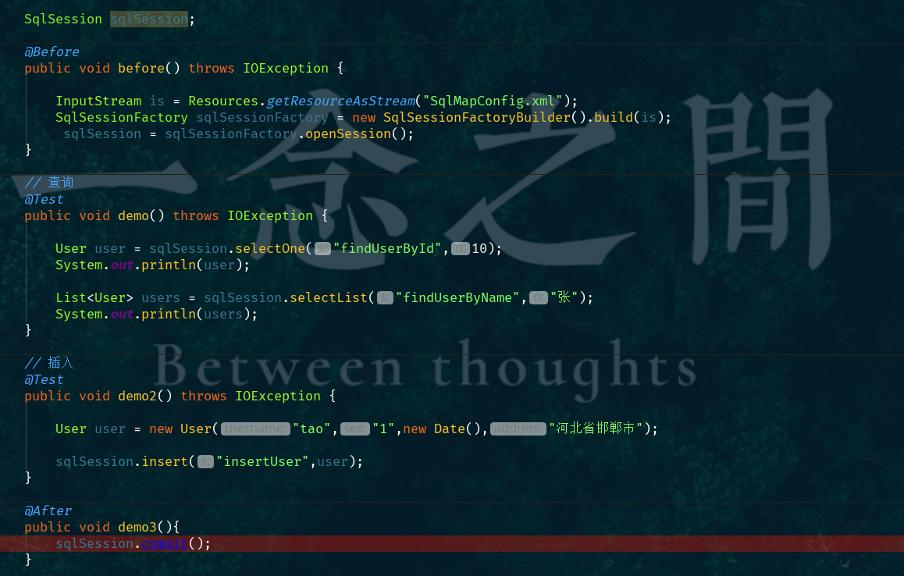
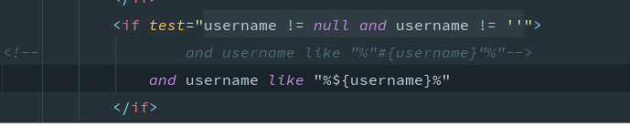
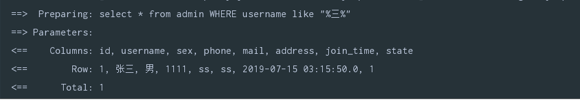

	MyBatis:对jdbc的操作数据库的过程进行封装,通过xml或注解的方式将要各种statement配置,并通过java对象和stataement中的sqp进行映射生成 最终的 sql语句,最后由mybatis框架 执行sql并将结果 映射成 Java 对象 并返回

​	核心:

1、  mybatis配置文件，包括**Mybatis****全局配置文件和Mybatis映射文件**，其中全局配置文件配置了数据源、事务等信息；映射文件配置了SQL执行相关的 信息。

2、  mybatis通过读取配置文件信息（全局配置文件和映射文件），构造出**SqlSessionFactory****，**即会话工厂。

3、  通过SqlSessionFactory，可以创建**SqlSession**即会话。Mybatis是通过SqlSession来操作数据库的。

4、  SqlSession本身不能直接操作数据库，它是通过底层的**Executor**执行器接口来操作数据库的。Executor接口有两个实现类，一个是普通执行器，一个是**缓存执行器（默认）**。

5、  Executor执行器要处理的SQL信息是封装到一个底层对象**MappedStatement**中。该对象包括：SQL语句、输入参数映射信息、输出结果集映射信息。其中输入参数和输出结果的映射类型包括**HashMap****集合对象、POJO****对象类型**。

​	mybatis配置:

```
<?xml version="1.0" encoding="UTF-8" ?>
<!DOCTYPE configuration
        PUBLIC "-//mybatis.org//DTD Config 3.0//EN"
        "http://mybatis.org/dtd/mybatis-3-config.dtd">
<configuration>

    <!-- 指定读取文件 -->
    <properties resource="db.properties"/>

    <!--配置别名-->
    <typeAliases>
        <!--<typeAlias type="com.gyf.com.gyf.gyf.model.User" alias="user"></typeAlias>-->

        <!--指定包名，别名就是类名，第一个小写 User 别名就是user-->
        <package name="com.gyf.model"></package>
        <package name="com.gyf.vo"></package>
    </typeAliases>

    <!-- 配置mybatis的环境信息 -->
    <environments default="development">
        <environment id="development">
            <!-- 配置JDBC事务控制，由mybatis进行管理 -->
            <transactionManager type="JDBC"></transactionManager>
            <!-- 配置数据源，采用dbcp连接池 -->
            <dataSource type="POOLED">
                <property name="driver" value="${driverClass}"/>
                <property name="url" value="${url}"/>
                <property name="username" value="${name}"/>
                <property name="password" value="${password}"/>
            </dataSource>
        </environment>
    </environments>

    <!--告诉mybatis加载映射文件-->
    <mappers>
        <mapper resource="UserMapper.xml"></mapper>
    </mappers>
</configuration>
```

​		

​	 映射文件(被执行语句的配置文件):



 

​	具体执行步骤



​	

```
<?xml version="1.0" encoding="UTF-8" ?>
<!DOCTYPE mapper
        PUBLIC "-//mybatis.org//DTD Mapper 3.0//EN"
        "http://mybatis.org/dtd/mybatis-3-mapper.dtd">
```


​	mybaits的Dao编写,mapper代理方式实现 

​	创建接口,映射文件中mapper的namespace需要与其接口名称(全类名)一致

​	语句id和方法名一致,参数只能写一个,parameterType 返回结果 resultType

​	

#### 	模糊查询,参数类型时map集合

```
<!-- 通过map查询 模糊查询username map的键是对象的属性 值是对象对应的值 -->
<select id="findUserByMap" parameterType="hashmap" resultType="user">
    SELECT u.* FROM  user u where username like '%${username}%'
    and sex = #{sex}
</select>
```

```
// 模糊查询username
@Test
public void demo2(){

    User user = new User();

    Map<String,Object> map = new HashMap<>();

    map.put("username","张");
    map.put("sex","1");

    List<User> userByMap = mapper.findUserByMap(map);
    System.out.println(userByMap);

}
```


#### 返回结果类型resultType/resultMap(常用)

​	resultType 查询的列名和映射的模型的属性一致	

​	resultMap  就是自己告诉数据库要查询的字段	


错误:idea 2019 数据库连接异常

原因: 时区不对

解决方式: 登入mysql修改时区

 show variables like '%time_zone%';
 set global time_zone='+8:00';


?useUnicode=true&amp;characterEncoding=UTF-8


##### 动态SQL:

​	where和if:

```
<mapper namespace="com.czxy.mapper.CustMapper" >// 指定对应的类型
    <resultMap id="zz" type="com.czxy.domain.Cust"> // id:为该结果集命名 为后面的查询提供引用 
        <id column="cid" property="cid"/>
        <result column="cust_name" property="custName"/>
        <result column="cust_type" property="custType"/>
        <result column="cust_phone" property="custPhone"/>
        <result column="cust_address" property="custAddress"/>
<!--        <collection property="orders" select="cn.czxy.dao.OrderMapper.findOrdersByUid" column="id" />-->
        <association property="user" select="com.czxy.mapper.UserMapper.selectByPrimaryKey" column="cust_link_user"/>
    </resultMap>
    // id 对应方法名 写好参数类型和返回值类型
    // 演示方法参数为一个对象 在参数位置添加@Param()注解 以便和下面的查询相对应
    <select id="findByNameOrType" resultType="com.czxy.domain.Cust" parameterType="com.czxy.domain.Cust" resultMap="zz">
        select * from s_cust
        // 分别判断是否为空 注意添加@Param("")注解中的名称
        <where>
            <if test="cust.custName != null and cust.custName != '' ">
                cust_name like "%" #{cust.custName} "%"
            </if>
            <if test="cust.custType != null and cust.custType != '' ">
                and cust_type like "%" #{cust.custType} "%"
            </if>
        </where>
    </select>
</mapper>
```


**注意模糊查询**

​	





 	**#{} : 再带引号**

​	 **${}:不带引号直接把值带入**

