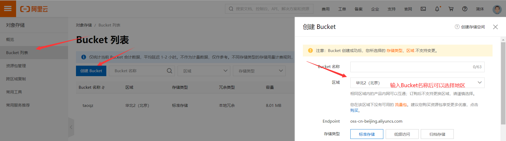
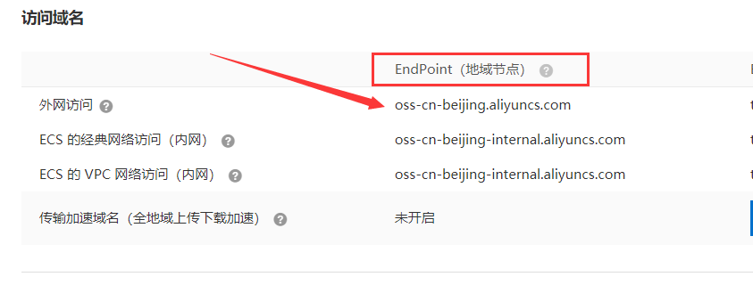
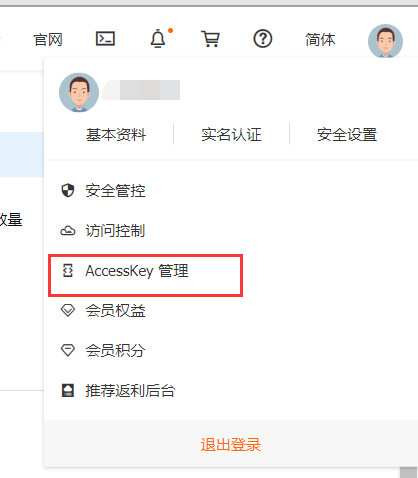
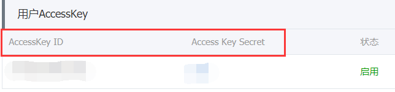
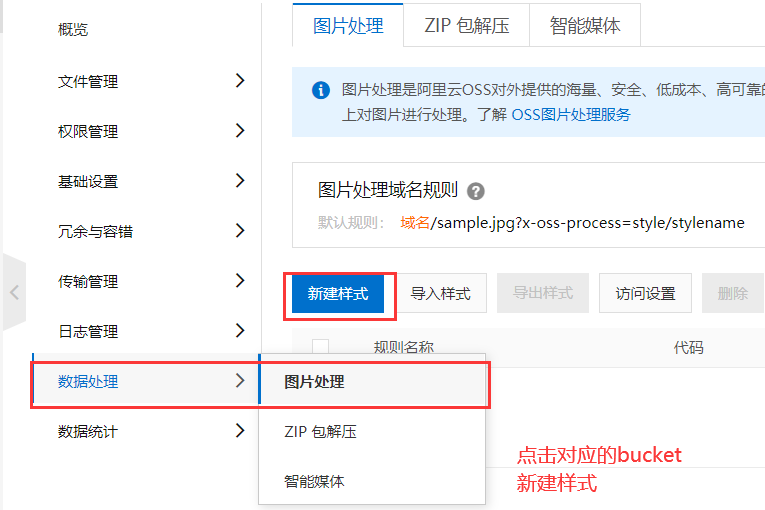
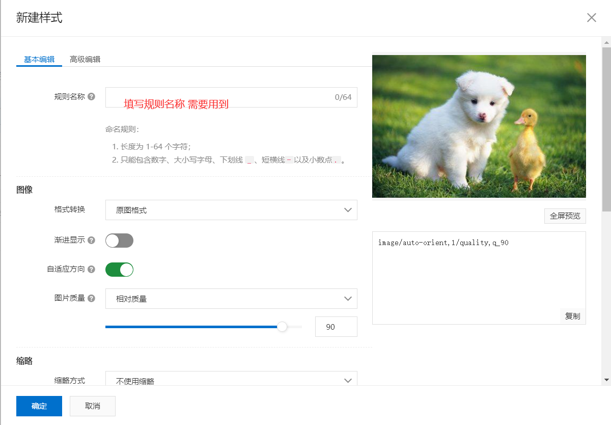
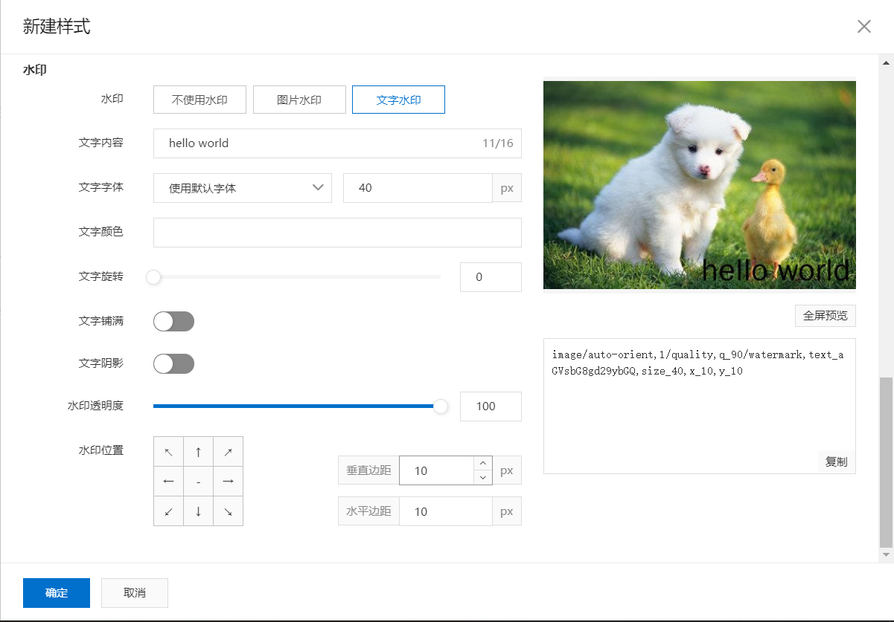
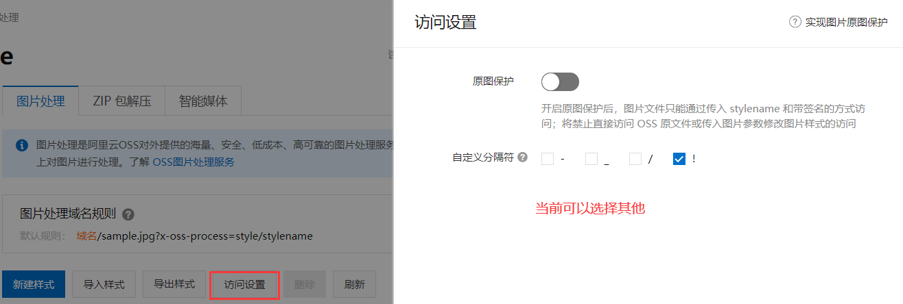

# 阿里云OSS

登录阿里云搜索对象存储 OSS进行开通

# 基本概念

文档:https://help.aliyun.com/document_detail/31827.html?spm=a2c4g.11186623.2.7.549b58d5qcqqsh#concept-izx-fmt-tdb


所需配置(概念)所在位置

首先需要进入对象存储OSS的控制台

## 存储空间(bucket)

注意下方还有一个读写权限,选择为公共读



## 访问域名(endpoint)

点击进入指定的bucket



## 访问秘钥(AccessKey)






# 结合springboot使用

jdk 1.8

springboot 2.1.0

## pom依赖

```xml
 <!--   阿里云sdk     -->
        <dependency>
            <groupId>com.aliyun.oss</groupId>
            <artifactId>aliyun-sdk-oss</artifactId>
            <version>2.8.3</version>
        </dependency>
        <!--  简化实体类-->
        <dependency>
            <groupId>org.projectlombok</groupId>
            <artifactId>lombok</artifactId>
            <version>1.18.4</version>
        </dependency>
        <!-- 主要作用:创建时间戳作为文件名称       -->
        <dependency>
            <groupId>joda-time</groupId>
            <artifactId>joda-time</artifactId>
            <version>2.9.9</version>
        </dependency>
		<!-- 工具类 -->
		<dependency>
            <groupId>org.apache.commons</groupId>
            <artifactId>commons-lang3</artifactId>
            <version>3.7</version>
        </dependency>		
```

## 配置文件

创建alioss.properties文件,文件名可自定义

```properties
# 填写在基本概念中找到的值
aliyun.endpoint=
aliyun.accessKeyId=
aliyun.accessKeySecret=
aliyun.bucketName=
# 访问前缀,可以在具体的上传的文件中找到url
aliyun.urlPrefix=
# 测试用
#aliyun.param=
```

如果上传的文件过大,在主配置文件中添加

```properties
spring.servlet.multipart.max-file-size=10MB
spring.servlet.multipart.max-request-size=20MB
```

## 具体代码

config

```java
// lombok 简化实体类操作
@Data
// 指定该类是一个配置类
@Configuration
// 指定配置文件
@PropertySource("classpath:alioss.properties")
// 指定配置参数的前缀
@ConfigurationProperties(prefix = "aliyun")
public class AliOSSConfig {

    private String endpoint;
    private String accessKeyId;
    private String accessKeySecret;
    private String bucketName;
    private String urlPrefix;

    // 另一种方式从配置文件中读取参数
    @Value("${aliyun.param}")
    private String param;

    // 将OSSClient对象交由spring管理
    @Bean
    public OSSClient ossClient(){
        return new OSSClient(endpoint,accessKeyId,accessKeySecret);
    }

}
```

controller

```java
@RestController
@RequestMapping("/pic/upload")
public class PicUploadController         {

    @Autowired
    private PicUploadService picUploadService;

    @PostMapping
    public PicUploadResult upload(@RequestParam("file") MultipartFile file){
        return picUploadService.upload(file);
    }

}
```

service

```java
@Service
public class PicUploadService {

    // 允许上传的格式
    private static final String[] IMAGE_TYPE = new String[]{".bmp", ".jpg",
            ".jpeg", ".gif", ".png"};

    @Autowired
    private OSS ossClient;

    @Autowired
    private AliOSSConfig aliOSSConfig;

    public PicUploadResult upload(MultipartFile uploadFile) {
    // 校验图片格式
        boolean isLegal = false;
        for (String type : IMAGE_TYPE) {
            if (StringUtils.endsWithIgnoreCase(uploadFile.getOriginalFilename(),
                    type)) {
                isLegal = true;
                break;
            }
        }

        // 封装Result对象，并且将文件的byte数组放置到result对象中
        PicUploadResult fileUploadResult = new PicUploadResult();
        if(!isLegal){
            fileUploadResult.setStatus("error");
            return fileUploadResult;
        }

        // 文件新路径
        String fileName = uploadFile.getOriginalFilename();
        String filePath = getFilePath(fileName);

        // 上传到阿里云
        try {
            ossClient.putObject(aliOSSConfig.getBucketName(), filePath, new
                    ByteArrayInputStream(uploadFile.getBytes()));
        } catch (Exception e) {
            e.printStackTrace();

        //上传失败
            fileUploadResult.setStatus("error");
            return fileUploadResult;
        }

        fileUploadResult.setStatus("done");
        fileUploadResult.setName(this.aliOSSConfig.getUrlPrefix() + filePath);
        fileUploadResult.setUid(String.valueOf(System.currentTimeMillis()));
        return fileUploadResult;
    }

//    用于生成文件夹及以时间戳命名的文件名
    private String getFilePath(String sourceFileName) {
        DateTime dateTime = new DateTime();
        return "images/" + dateTime.toString("yyyy")
                + "/" + dateTime.toString("MM") + "/"
                + dateTime.toString("dd") + "/" + System.currentTimeMillis() +
                RandomUtils.nextInt(100, 9999) + "." +
                StringUtils.substringAfterLast(sourceFileName, ".");
    }

}	
```

将返回的数据进行封装

```java
@Data
public class PicUploadResult {

    // 文件唯一标识
    private String uid;
    // 文件名
    private String name;
    // 状态有：uploading done error removed
    private String status;
    // 服务端响应内容，如：'{"status": "success"}'
    private String response;

}
```

# 添加水印





修改水印样式





## 访问

保存规则后之前的文件也会生效,只需在图片的路径后添加在访问设置时的自定义分隔符及水印规则名称

例如

```html


```

## 原图保护

也就是在访问设置自定义分隔符的上方有一个原图保护,其功能为只有添加水印后才可访问,需要点击开启,选择*号应用于所有文件即可