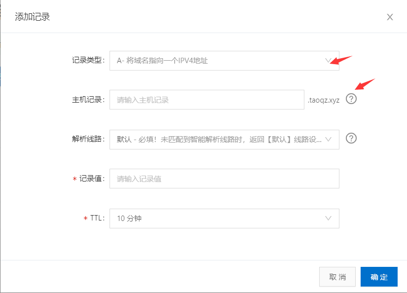

# 阿里云购买域名

​	想要搭建一个网站肯定少不了一个域名,分享一下自己在阿里云购买域名的经验

​	还有一个提供免费域名的网站,我没有购买成功,每次购买都会有未知错误,所以就没有后续了,哈哈

[    https://www.freenom.com/zh/index.html?lang=zh]: 

## 注册并登陆阿里云	

​	可以选择直接使用支付宝登陆

## 挑选并购买域名

------

------

### 进入控制台备案

​	购买成功后点击右上角进入控制台,在顶部搜索栏输入域名进入域名控制台.

​	现在还不能使用我们的域名,需要我们进行备案,添加域名模板

​		**注意事项:**

​			**身份证照片:会控制大小,55k-1MB左右需要注意一下.如果手机像素太高,可以拍完后使用QQ截图**

​			**地址信息:最好和你的身份证上一致**

​			**邮箱:可能会让你验证一下,记不太清楚了**

​	备案验证成功后进入左侧列表中的域名列表,点击解析

------

## 解析域名

​	解析域名就是将你的域名指向网站IP,方便记忆

​	进入解析设置页面后点击添加记录,其中每个选项都有解释,添加记录的旁边还有新手引导

​	更详细的解释有阿里提供的文档:https://help.aliyun.com/knowledge_detail/29725.html

​	10分钟左右就可以通过域名访问你的网站了

