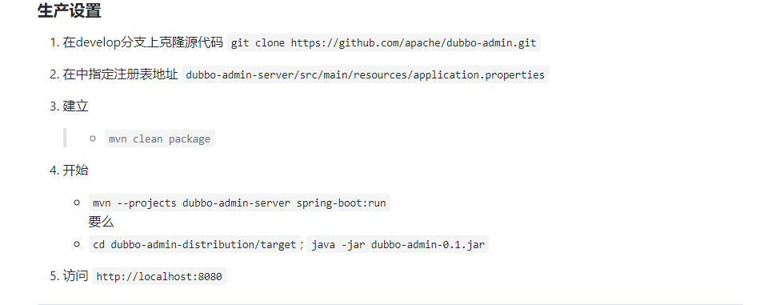

# 环境准备

​	linux ubuntu 18.04

​	docker 19.03.6

​	jdk 1.8

​	maven 3.6.0

​	springboot 2.1.0

​	zookeeper 3.4.13

​	dubbo 2.6.4

# 安装docker

## 卸载旧版本

```shell
apt-get remove docker docker-engine docker.io containerd runc
```

## 使用apt安装

```shell
# 更新数据源
apt-get update
# 安装所需依赖
apt-get -y install apt-transport-https ca-certificates curl software-properties-common
# 安装 GPG 证书
curl -fsSL http://mirrors.aliyun.com/docker-ce/linux/ubuntu/gpg | sudo apt-key add -
# 新增数据源
add-apt-repository "deb [arch=amd64] http://mirrors.aliyun.com/docker-ce/linux/ubuntu $(lsb_release -cs) stable"
# 更新并安装 Docker CE
apt-get update && apt-get install -y docker-ce
```

## 验证是否安装成功

```shell
docker version
# 输出如下
Client:
 Version:           18.09.6
 API version:       1.39
 Go version:        go1.10.8
 Git commit:        481bc77
 Built:             Sat May  4 02:35:57 2019
 OS/Arch:           linux/amd64
 Experimental:      false
Server: Docker Engine - Community
 Engine:
  Version:          18.09.6
  API version:      1.39 (minimum version 1.12)
  Go version:       go1.10.8
  Git commit:       481bc77
  Built:            Sat May  4 01:59:36 2019
  OS/Arch:          linux/amd64
  Experimental:     false
```

## 配置Docker镜像加速器

阿里云搜索容器镜像服务,在最低下有镜像加速器,复制加速器地址

通过修改 daemon 配置文件 `/etc/docker/daemon.json` 来使用加速器

```shell
tee /etc/docker/daemon.json <<-'EOF'
{
  "registry-mirrors": ["https://xxxxxxxx.mirror.aliyuncs.com"]
}
EOF
# 重启 Docker
systemctl daemon-reload
systemctl restart docker
```

## 验证是否成功

```shell
docker info
# 输出如下
Containers: 38
 Running: 18
 Paused: 0
 Stopped: 20
Images: 10
Server Version: 18.09.6
Storage Driver: overlay2
 Backing Filesystem: extfs
 Supports d_type: true
 Native Overlay Diff: true
Logging Driver: json-file
Cgroup Driver: cgroupfs
Plugins:
 Volume: local
 Network: bridge host macvlan null overlay
 Log: awslogs fluentd gcplogs gelf journald json-file local logentries splunk syslog
Swarm: inactive
Runtimes: runc
Default Runtime: runc
Init Binary: docker-init
containerd version: bb71b10fd8f58240ca47fbb579b9d1028eea7c84
runc version: 2b18fe1d885ee5083ef9f0838fee39b62d653e30
init version: fec3683
Security Options:
 apparmor
 seccomp
  Profile: default
Kernel Version: 4.15.0-51-generic
Operating System: Ubuntu 18.04.2 LTS
OSType: linux
Architecture: x86_64
CPUs: 2
Total Memory: 1.924GiB
Name: kubernetes-master
ID: PJ4H:7AF2:P5UT:6FMR:W4DI:SSWR:IQQR:J6QO:ARES:BOAC:ZVMO:SV2Y
Docker Root Dir: /var/lib/docker
Debug Mode (client): false
Debug Mode (server): false
Registry: https://index.docker.io/v1/
Labels:
Experimental: false
Insecure Registries:
 127.0.0.0/8
## 这里是你配置的镜像加速器
Registry Mirrors:
 https://xxxxxxxx.mirror.aliyuncs.com/
Live Restore Enabled: false
Product License: Community Engine
WARNING: No swap limit support
```

## 使用docker拉取zookeeper镜像并运行

```shell
#拉取zk镜像
docker pull zookeeper:3.5
#创建容器
docker create --name zk -p 2181:2181 zookeeper:3.5
#启动容器
docker start zk
```


# 案例

## 父项目依赖

```xml
 <!--添加SpringBoot parent支持-->
    <parent>
        <groupId>org.springframework.boot</groupId>
        <artifactId>spring-boot-starter-parent</artifactId>
        <version>2.1.0.RELEASE</version>
    </parent>
    
    <dependencies>
        <!--添加SpringBoot测试-->
        <dependency>
            <groupId>org.springframework.boot</groupId>
            <artifactId>spring-boot-starter-test</artifactId>
            <scope>test</scope>
        </dependency>
        <!--添加dubbo的springboot依赖-->
        <dependency>
            <groupId>com.alibaba.boot</groupId>
            <artifactId>dubbo-spring-boot-starter</artifactId>
            <version>0.2.0</version>
        </dependency>
        <!--添加dubbo依赖-->
        <dependency>
            <groupId>com.alibaba</groupId>
            <artifactId>dubbo</artifactId>
            <version>2.6.4</version>
        </dependency>
<!--      引入zookeeper依赖  -->
        <dependency>
            <groupId>org.apache.zookeeper</groupId>
            <artifactId>zookeeper</artifactId>
            <version>3.4.13</version>
        </dependency>
        <dependency>
            <groupId>com.github.sgroschupf</groupId>
            <artifactId>zkclient</artifactId>
            <version>0.1</version>
        </dependency>
    </dependencies>

    <build>
        <plugins>
            <!--添加springboot的maven插件-->
            <plugin>
                <groupId>org.springframework.boot</groupId>
                <artifactId>spring-boot-maven-plugin</artifactId>
            </plugin>
        </plugins>
    </build>
```


## 服务提供者

### 依赖

```xml
<dependencies>
        <!--添加springboot依赖，非web项目-->
        <dependency>
            <groupId>org.springframework.boot</groupId>
            <artifactId>spring-boot-starter</artifactId>
        </dependency>
    <!-- 由于服务提供者和服务消费者(本质也可是提供者)都需要注册,提取到父项目中  -->
       <!--        <dependency>-->
<!--            <groupId>org.apache.zookeeper</groupId>-->
<!--            <artifactId>zookeeper</artifactId>-->
<!--            <version>3.4.13</version>-->
<!--        </dependency>-->
<!--        <dependency>-->
<!--            <groupId>com.github.sgroschupf</groupId>-->
<!--            <artifactId>zkclient</artifactId>-->
<!--            <version>0.1</version>-->
<!--        </dependency>-->
    </dependencies>
```

### 配置

application.properties

```properties
# Spring boot application
spring.application.name = czxy-dubbo-service
server.port = 9090
# Service version
dubbo.service.version = 1.0.0
# 服务的扫描包
dubbo.scan.basePackages = xyz.taoqz.service
# 应用名称 可以在dubbo ops 中按照此名称搜索
dubbo.application.name = dubbo-provider-demo
# 协议以及端口  如果修改负载均衡策略 可以在此修改端口号测试
dubbo.protocol.name = dubbo
# dubbo.protocol.port = 20881
dubbo.protocol.port = 20881
# zk注册中心 ip:port
dubbo.registry.address = zookeeper://xxxxxx:2181
dubbo.registry.client = zkclient
```

### 启动类

主要演示非web的项目的启动类,也可使用web项目的方式

```java
import org.springframework.boot.WebApplicationType;
import org.springframework.boot.autoconfigure.SpringBootApplication;
import org.springframework.boot.builder.SpringApplicationBuilder;

@SpringBootApplication
public class DubboProvider {

    public static void main(String[] args) {
        new SpringApplicationBuilder(DubboProvider.class)
                .web(WebApplicationType.NONE) // 非 Web 应用
                .run(args);
    }

}
```

web方式

需将默认的依赖改为

```xml
<dependency>
	<groupId>org.springframework.boot</groupId>
	<artifactId>spring-boot-starter-web</artifactId>
</dependency>
```

```java
@SpringBootApplication
public class DubboProvider {

    public static void main(String[] args) {
        SpringApplication.run(DubboProvider.class,args);
    }

}
```

### 接口(负载均衡策略)

接口正常写

需要注意的是实现类

```java
import com.alibaba.dubbo.config.annotation.Service;

// 声明这是一个dubbo服务
// 这里的version对应的是配置文件中的配置
@Service(version = "${dubbo.service.version}") 
public class UserServiceImpl implements UserService {

    @Override
    public String query() {
         // return "service1"
         return "service2";
    }

}
```

## 服务消费者

### 依赖

```xml
<dependencies>
        <!--添加springboot依赖，非web项目-->
        <dependency>
            <groupId>org.springframework.boot</groupId>
            <artifactId>spring-boot-starter-web</artifactId>
        </dependency>
        <!--引入具体的service(服务提供者)的依赖-->
        <dependency>
            <groupId>xyz.taoqz.dubbo</groupId>
            <artifactId>czxy-dubbo-service</artifactId>
            <version>1.0-SNAPSHOT</version>
        </dependency>
        <dependency>
            <groupId>junit</groupId>
            <artifactId>junit</artifactId>
        </dependency>
        <dependency>
            <groupId>org.springframework.boot</groupId>
            <artifactId>spring-boot-test</artifactId>
        </dependency>
    </dependencies>
```


### 配置

application.properties

```properties
# Spring boot application
spring.application.name = czxy-dubbo-consumer
server.port = 9091
# 应用名称 在dubbo ops中的服务提供者点击detail后consumer处
dubbo.application.name = dubbo-consumer-demo
# zk注册中心 注册中心地址ip+port
dubbo.registry.address = zookeeper://xxx:2181
dubbo.registry.client = zkclient
```


### 调用接口(服务提供者)

```java
import com.alibaba.dubbo.config.annotation.Reference;

@RequestMapping("/user")
@RestController
public class ConsumerController {
	
	// loadbalance为负载均衡策略,此处是轮询,默认时随机
    @Reference(version = "1.0.0",loadbalance = "roundrobin")
    private UserService userService;

    @GetMapping
    public String fun(){
        return userService.query();
    }

}
```

# dubbo的管理页面

github地址:https://github.com/apache/dubbo-admin

在服务器中下载并解压

```shell
#下载 git clone https://github.com/apache/dubbo-admin.git
```

配置及生产设置



```shell
# 依次执行即可
mvn clean package
mvn --projects dubbo-admin-server spring-boot:run
http://服务器ip:8080
```

启动后会自动监测本地的2181端口(zookeeper注册中心),如果不在本地或者端口号不同可以按照上图第二点进行修改

账号密码都为root

# 注意事项

1.实体类需要实现序列化接口Serializable