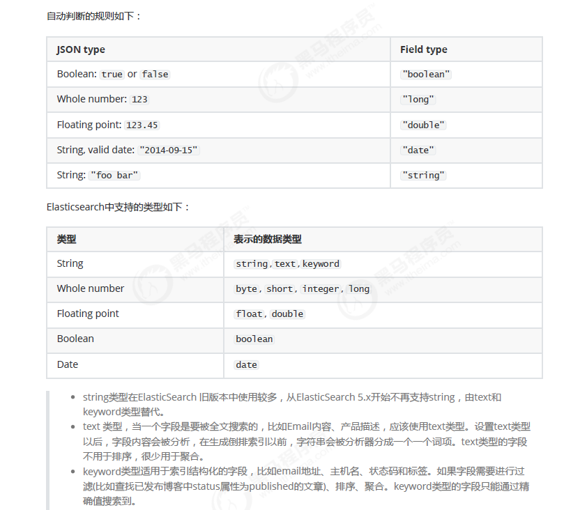

# Elastic Stack

## 简介

如果你没有听说过Elastic Stack，那你一定听说过ELK，实际上ELK是三款软件的简称，分别是Elasticsearch、
Logstash、Kibana组成，在发展的过程中，又有新成员Beats的加入，所以就形成了Elastic Stack。所以说，ELK是
旧的称呼，Elastic Stack是新的名字。

## 下载

该案例使用的windows版本,直接使用bin目录下的 .bat文件启动,默认端口9200

最新版: https://www.elastic.co/cn/downloads/elasticsearch

历史版: https://www.elastic.co/cn/downloads/past-releases

IK分词器: https://github.com/medcl/elasticsearch-analysis-ik

ElasticSearch Head: 界面化工具,可以在谷歌浏览器的插件商店搜索安装 

安装IK分词器:

​	在elasticsearch的bin目录下运行(可能需要使用5.5-6.3版本)

```shell
elasticsearch-plugin install https://github.com/medcl/elasticsearch-analysis-ik/releases/download/v6.3.0/elasticsearch-analysis-ik-6.3.0.zip
```

## 基本概念

**索引**
		索引（index）是Elasticsearch对逻辑数据的逻辑存储，所以它可以分为更小的部分。
可以把索引看成关系型数据库的表，索引的结构是为快速有效的全文索引准备的，特别是它不存储原始值。Elasticsearch可以把索引存放在一台机器或者分散在多台服务器上，每个索引有一或多个分片（shard），每个分片可以有多个副本（replica）。

**文档**
		存储在Elasticsearch中的主要实体叫文档（document）。用关系型数据库来类比的话，一个文档相当于数据库表中的一行记录。Elasticsearch和MongoDB中的文档类似，都可以有不同的结构，但Elasticsearch的文档中，相同字段必须有相
同类型。文档由多个字段组成，每个字段可能多次出现在一个文档里，这样的字段叫多值字段（multivalued）。每个字段的类型，可以是文本、数值、日期等。字段类型也可以是复杂类型，一个字段包含其他子文档或者数组。

**映射**
		所有文档写进索引之前都会先进行分析，如何将输入的文本分割为词条、哪些词条又会被过滤，这种行为叫做映射（mapping）。一般由用户自己定义规则。

**文档类型**
		在Elasticsearch中，一个索引对象可以存储很多不同用途的对象。例如，一个博客应用程序可以保存文章和评论。每个文档可以有不同的结构。不同的文档类型不能为相同的属性设置不同的类型。例如，在同一索引中的所有文档类型中，一个叫title的字段必须具有相同的类型。

## 基本操作

ElasticSearch中提供了丰富的RestfulAPI,可以进行基本的CRUD,创建删除索引等。


### 插入数据

```
POST /索引/类型/id
```

```
{"id":"1001","name": "张三","age": 18,"sex": "男"}
```

```json
# 返回的结果
{
    "_index": "es",
    "_type": "user",
    "_id": "2772IXIBDTn7N9ThVkY8", # 如果不写id,会默认添加一个id 32位长度的字符串
    "_version": 1,
    "result": "created",
    "_shards": {
        "total": 2,
        "successful": 1,
        "failed": 0
    },
    "_seq_no": 0,
    "_primary_term": 1
}
```

### 更新数据

在ElasticSearch中不支持使用PUT方式进行更新,但可以使用覆盖的方式进行更新

```
PUT|POST es/user/2772IXIBDTn7N9ThVkY8
```

```json
{"id":"1001","name":"李四","age":18,"sex":"女"}
```

```json
{
    "_index": "es",
    "_type": "user",
    "_id": "2772IXIBDTn7N9ThVkY8",
    "_version": 2, # 更新后其版本发生了变化
    "result": "updated", # 更新
    "_shards": {
        "total": 2,
        "successful": 1,
        "failed": 0
    },
    "_seq_no": 1,
    "_primary_term": 1
}
```

或者使用POST方式加在请求路径上添加 _update的方式

```
POST es/user/2772IXIBDTn7N9ThVkY8/_update
```

```json
{
    "doc":{
        "age":100
    }
}
```

### 删除数据

```
DELETE es/user/2772IXIBDTn7N9ThVkY8
```

```json
{
    "_index": "es",
    "_type": "user",
    "_id": "2772IXIBDTn7N9ThVkY8",
    "_version": 5,
    "result": "deleted",
    "_shards": {
        "total": 2,
        "successful": 1,
        "failed": 0
    },
    "_seq_no": 4,
    "_primary_term": 1

```

注意:	删除一个文档也不会立即从磁盘上移除，它只是被标记成已删除。Elasticsearch将会在你之后添加更多索引的时候才会在后台进行删除内容的清理。

### 搜索数据

```
# 根据指定id进行搜索
GET es/user/1001
# 查询所有数据
es/user/_search
# 包含搜索条件
es/user/_search?q=age:24
# 显示指定字段
es/user/1001?_source=name,sex
# 只显示原数据
es/user/1001/_source
# 只显示原数据的情况下指定子段
es/user/1001/_source?_source=name,age
```

### DSL搜索

可以构建更加丰富灵活的查询语言,以JSON请求体出现

```
POST es/user/_search	
```

```
# 请求体
{"query": {"match": {"age": 18}}}
```

```
# 查询年龄大于18的数据
{"query": {"bool": {"filter": {"range": {"age": {"gt":18}}}}}}
```

```
# 查询名字为李四或者王五的数据 并且name字段高亮显示
{"query": {"match": {"name": "张三李四"}},"highlight": {"fields": {"name": {}}}}
```

```json
# 结果
{
    "took": 3,
    "timed_out": false,
    "_shards": {
        "total": 5,
        "successful": 5,
        "skipped": 0,
        "failed": 0
    },
    "hits": {
        "total": 2,
        "max_score": 1.3862944,
        "hits": [
            {
                "_index": "es",
                "_type": "user",
                "_id": "1001",
                "_score": 1.3862944,
                "_source": {
                    "name": "张三",
                    "age": 24,
                    "sex": "女"
                },
                "highlight": {
                    "name": [
                        "<em>张</em><em>三</em>"
                    ]
                }
            }
            ,
            {
                "_index": "es",
                "_type": "user",
                "_id": "1002",
                "_score": 1.3862944,
                "_source": {
                    "name": "李四",
                    "age": 18,
                    "sex": "女"
                },
                "highlight": {
                    "name": [
                        "<em>李</em><em>四</em>"
                    ]
                }
            }
        ]
    }
}
```

### 聚合

```
POST es/user/_search
```

```
# 对sex字段进行分组操作时,会出现以下错误
{"aggs": {"all_interests": {"terms": {"field": "sex"}}}}
```

```json
    {
    "error": {
    "root_cause": [
    {
    "type": "illegal_argument_exception",
    "reason": "Fielddata is disabled on text fields by default. Set fielddata=true on [sex] in order to load fielddata in memory by uninverting the inverted index. Note that this can however use significant memory. Alternatively use a keyword field instead."
    }
    ],
    "type": "search_phase_execution_exception",
    "reason": "all shards failed",
    "phase": "query",
    "grouped": true,
    "failed_shards": [
    {
    "shard": 0,
    "index": "es",
    "node": "7uI7DaOfRIKx0FHb8o6G2g",
    "reason": {
    "type": "illegal_argument_exception",
    "reason": "Fielddata is disabled on text fields by default. Set fielddata=true on [sex] in order to load fielddata in memory by uninverting the inverted index. Note that this can however use significant memory. Alternatively use a keyword field instead."
    }
    }
    ],
    "caused_by": {
    "type": "illegal_argument_exception",
    "reason": "Fielddata is disabled on text fields by default. Set fielddata=true on [sex] in order to load fielddata in memory by uninverting the inverted index. Note that this can however use significant memory. Alternatively use a keyword field instead.",
    "caused_by": {
    "type": "illegal_argument_exception",
    "reason": "Fielddata is disabled on text fields by default. Set fielddata=true on [sex] in order to load fielddata in memory by uninverting the inverted index. Note that this can however use significant memory. Alternatively use a keyword field instead."
    }
    }
    },
    "status": 400
    }
```

```json
# 可改为 字段.keyword方式
{
  "size": 0, 
  "aggs": {
    "group_count": {
      "terms": {"field": "sex.keyword"}
    }
  }
}
```

```json

{
    "took": 1,
    "timed_out": false,
    "_shards": {
        "total": 5,
        "successful": 5,
        "skipped": 0,
        "failed": 0
    },
    "hits": {
        "total": 4,
        "max_score": 0,
        "hits": [ ]
    },
    "aggregations": {
        "group_count": {
            "doc_count_error_upper_bound": 0,
            "sum_other_doc_count": 0,
            "buckets": [
                {
                    "key": "女",
                    "doc_count": 2
                }
                ,
                {
                    "key": "男",
                    "doc_count": 2
                }
            ]
        }
    }
}
```

### 批量操作

```
POST es/user/_mget
```

```json
{
    "ids" : [ "1001", "1003" ]
}
```

如果有一条数据不存在,不影响整体查询,不存在的数据有如下结构

```json
{
    "_index": "es",
    "_type": "user",
    "_id": "1006",
    "found": false
}
```

#### 批量插入

```
POST /_bulk
```

需要在最后一行加一个换行

```json
{"create":{"_index":"es","_type":"user","_id":2001}}
{"id":2001,"name":"name1","age": 20,"sex": "男"}
{"create":{"_index":"es","_type":"user","_id":2002}}
{"id":2002,"name":"name2","age": 20,"sex": "男"}
{"create":{"_index":"es","_type":"user","_id":2003}}
{"id":2003,"name":"name3","age": 20,"sex": "男"}
```


```json
{
  "took": 252,
  "errors": false,
  "items": [
    {
      "create": {
        "_index": "es",
        "_type": "user",
        "_id": "2001",
        "_version": 1,
        "result": "created",
        "_shards": {
          "total": 2,
          "successful": 1,
          "failed": 0
        },
        "_seq_no": 0,
        "_primary_term": 2,
        "status": 201
      }
    },
    {
      "create": {
        "_index": "es",
        "_type": "user",
        "_id": "2002",
        "_version": 1,
        "result": "created",
        "_shards": {
          "total": 2,
          "successful": 1,
          "failed": 0
        },
        "_seq_no": 0,
        "_primary_term": 2,
        "status": 201
      }
    },
    {
      "create": {
        "_index": "es",
        "_type": "user",
        "_id": "2003",
        "_version": 1,
        "result": "created",
        "_shards": {
          "total": 2,
          "successful": 1,
          "failed": 0
        },
        "_seq_no": 1,
        "_primary_term": 2,
        "status": 201
      }
    }
  ]
}
```

#### 批量删除

```json
{"delete":{"_index":"es","_type":"user","_id":2001}}
{"delete":{"_index":"es","_type":"user","_id":2002}}
{"delete":{"_index":"es","_type":"user","_id":2003}}
```

### 分页

和SQL中的limit类似,其接受from和size参数

```
size: 结果数，默认10
from: 跳过开始的结果数，默认0
```

from参数的计算 (页数-1)*size

```
GET /_search?size=5
GET /_search?size=5&from=5
GET /_search?size=5&from=10
```

## 映射

​		前面我们创建的索引以及插入数据，都是由Elasticsearch进行自动判断类型，有些时候我们是需要进行明确字段类型的，否则，自动判断的类型和实际需求是不相符的。



创建明确类型的索引

```
PUT dell
```

```json
{
    "settings":  {
        "index": {
            "number_of_shards": "2",
            "number_of_replicas": "0"
        }
    },
    "mappings": {
        "person": {
            "properties": {
                "name": {
                    "type": "text"
                },
                "age": {
                    "type": "integer"
                },
                "mail": {
                    "type": "keyword"
                },
                "hobby": {
                    "type": "text"
                }
            }
        }
    }
}
```

查看映射

```
GET dell/_mapping
```

插入数据

```
POST /_bulk
```

```json
{"index":{"_index":"dell","_type":"person"}}
{"name":"张三","age": 20,"mail": "111@qq.com","hobby":"羽毛球、乒乓球、足球"}
{"index":{"_index":"dell","_type":"person"}}
{"name":"李四","age": 21,"mail": "222@qq.com","hobby":"羽毛球、乒乓球、足球、篮球"}
{"index":{"_index":"dell","_type":"person"}}
{"name":"王五","age": 22,"mail": "333@qq.com","hobby":"羽毛球、篮球、游泳、听音乐"}
{"index":{"_index":"dell","_type":"person"}}
{"name":"赵六","age": 23,"mail": "444@qq.com","hobby":"跑步、游泳"}
{"index":{"_index":"dell","_type":"person"}}
{"name":"孙七","age": 24,"mail": "555@qq.com","hobby":"听音乐、看电影"}
```

```
# 查询 
POST /dell/person/_search
```

请求体:查询hobby中包含音乐的

```json
{
    "query" : {
        "match" : {
            "hobby" : "音乐"
        }
    }
}
```

### 结构化查询

**term** 主要用于精确匹配哪些值，比如数字，日期，布尔值或 not_analyzed 的字符串(未经分析的文本

```json
{ "term": { "age": 26 }}
{ "term": { "date": "2014-09-01" }}
{ "term": { "public": true }}
{ "term": { "tag": "full_text" }}
```

```json
POST /dell/person/_search
{
    "query" : {
        "term" : {
            "age" : 20
        }
    }
}
```

terms查询

terms 跟 term 有点类似，但 terms 允许指定多个匹配条件。 如果某个字段指定了多个值，那么文档需要一起去做匹配：

```json
{
    "query" : {
        "terms" : {
            "age" : [20,21]
        }
    }
}
```

range 过滤允许我们按照指定范围查找一批数据：

gt 大于
gte 大于等于
lt 小于
lte 小于等于

```json
{
    "query": {
        "range": {
            "age": {
                "gte": 20,
                "lte": 22
            }
        }
    }
}
```

**exists** 查询可以用于查找文档中是否包含指定字段或没有某个字段，类似于SQL语句中的IS_NULL 条件

```json
{
    "query": {
        "exists": {
            "field": "age"
        }
    }
}
```

**match** 查询是一个标准查询，不管你需要全文本查询还是精确查询基本上都要用到它。如果你使用 match 查询一个全文本字段，它会在真正查询之前用分析器先分析match 一下查询字符：如果用match 下指定了一个确切值，在遇到数字，日期，布尔值或者not_analyzed 的字符串时，它将为你搜索你
给定的值：

**bool** 查询可以用来合并多个条件查询结果的布尔逻辑，它包含一下操作符：
must :: 多个查询条件的完全匹配,相当于 and 。
must_not :: 多个查询条件的相反匹配，相当于 not 。
should :: 至少有一个查询条件匹配, 相当于 or 。

## 分词 

```json
POST /_analyze
{
    "analyzer":"standard",
    "text":"hello world"
}
```

```json
POST /dell/_analyze
{
    "analyzer": "standard",
    "field": "hobby",
    "text": "听音乐"
}
```

使用IK分词器

```json
"analyzer": "ik_max_word"
```

