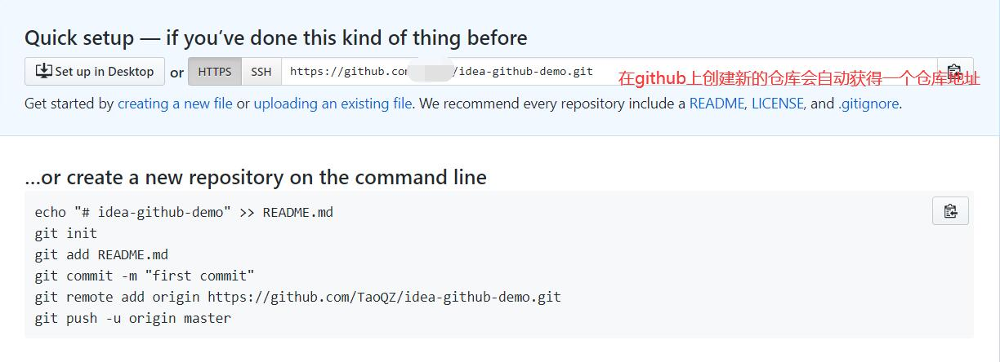
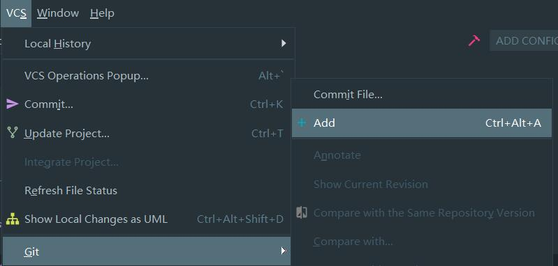
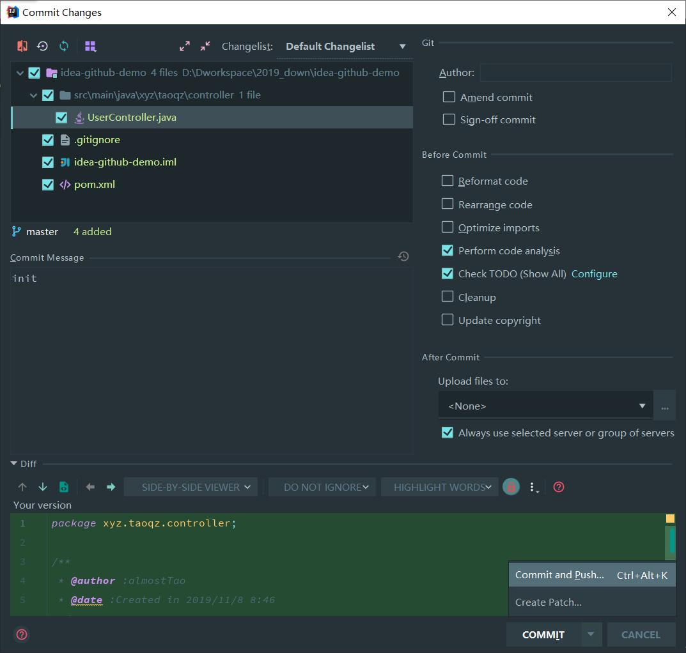
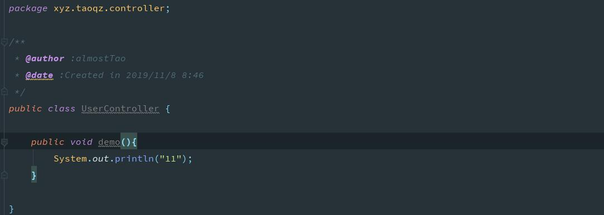
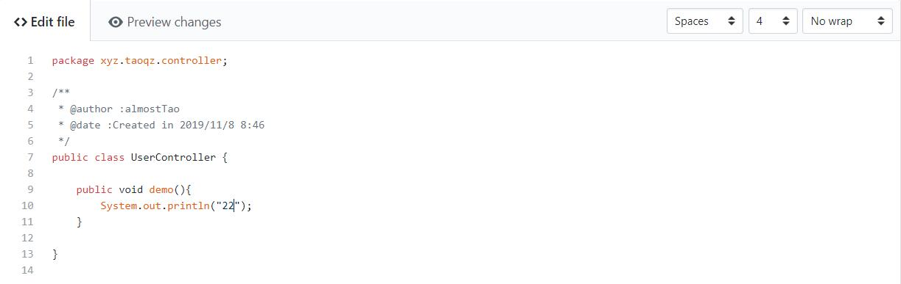
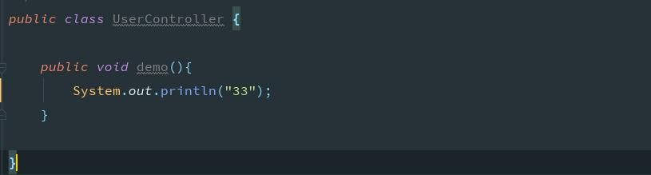
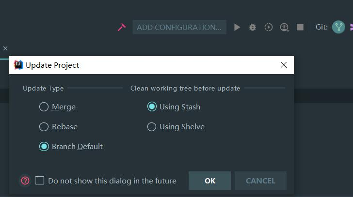
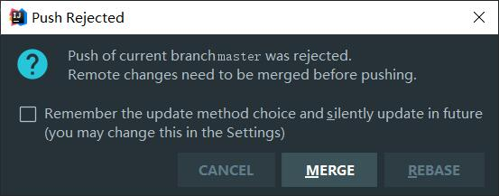
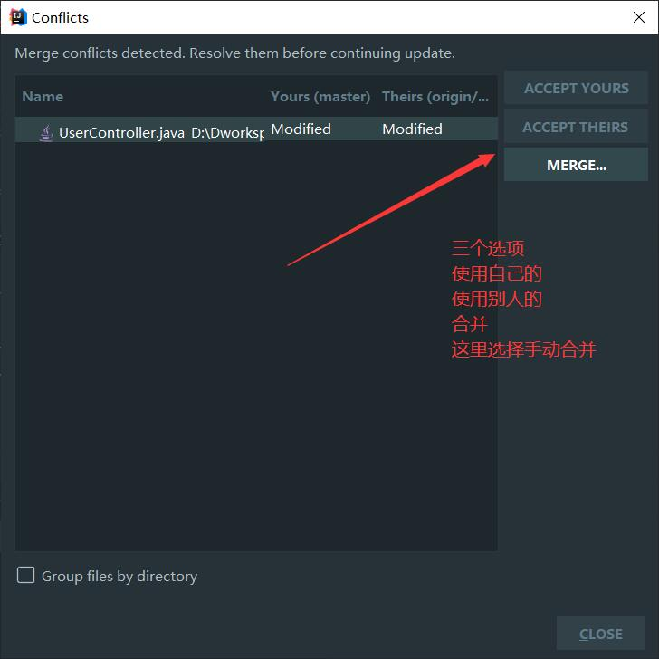
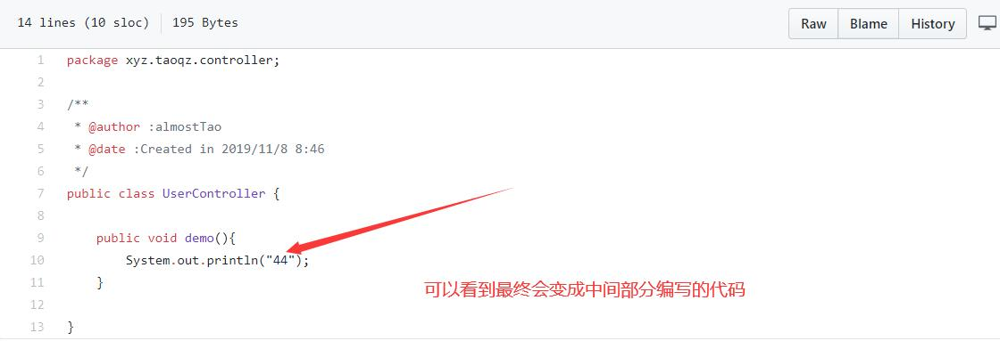

# 配置

​	在git一章中有写在Idea中如何配置git

# 使用

## 	1. 创建项目 

​		 idea中创建项目 相当于 init 将当前项目变为工作空间

​	 	github中创建新的仓库

## 	2. 添加文件 

​		相当于 add (文件)

​		

##  	3. 提交并推送

​		   在idea菜单栏VSC选项 相当于 commit 

​		选择需要提交的文件,在Commit Message 中填写信息,选择commit and push 

​	选择commit和push后,在第一次push时会遇到下图,需要将当前工作空间与远程仓库进行关联

​	填写完成后便可以进行推送

​	

## 	4. 冲突

​	不同的人在对相同行数的代码进行修改时,一方已经提交,另一方在拉取或者推送时会遇到冲突的问题

案例: 

​	第一次提交的代码

​	假设有人修改了代码,并上传成功

​	同时修改idea中的代码

​	进行commit 提交后进行pull 拉取

​	会出现冲突提示 ,点击中间的合并按钮

​	进行合并

​	合并后重新提交

