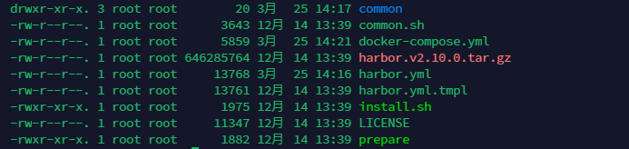

# Harbor使用指南


## 下载harbor tar包 解压后生成如下文件



## harbor.yml 

其中 harbor.yml 是由 harbor.yml.tmpl 复制而来

harbor的主要配置在harbor.yml，根据需求修改即可（目前接触的配置 hostname 和 密码）

配置完成后先运行 

```shell
./prepare
```

运行完成后会生成docker-compose.yml文件

再运行

```shell
./install
```

install后会 下载harbor镜像至docker 

## docker-compose

使用docker compose命令进行启停（在docker-compose.yml文件 目录下执行）

```shell
# 启动
docker compose up -d
# 停止
docker compose down
```

所有镜像下载并启动成功即可

默认账号密码 

```
admin Harbor12345
```


## /etc/docker/daemon.json

修改所有部署服务器上的docker配置

```shell
vim /etc/docker/daemon.json

# 追加如下内容 harbor服务器地址
#"insecure-registries": ["192.168.91.51:5000"]
```

修改后要重启docker服务

```shell
systemctl restart docker
```


## 服务构建完成后执行

```shell
# 查看当前所在文件夹
pwd &&

# 根据当前目录下的Dockerfile打镜像
docker build --build-arg JAR_FILE=./target/hello-harbor-1.0.jar -t hello-harbor . &&

# 给这个镜像打tag
docker tag hello-harbor 192.168.91.51:5000/harbor-cloud/hello-harbor:v1 &&

# 登录到harbor服务器
docker login -u admin -p Harbor12345 192.168.91.51:5000 &&

# 将镜像推送到harbor服务器
docker push 192.168.91.51:5000/harbor-cloud/hello-harbor:v1 &&

# 原来的镜像tag会变成none 这条命令是清楚所有tag为none的镜像
docker rmi $(docker images -f "dangling=true" -q) &&

# 目标服务器-1
ssh root@192.168.91.51 sh /home/project/hello-harbor/start.sh 

# 目标服务器-2
ssh root@192.168.91.52 sh /home/project/hello-harbor/start.sh 
```


## 启动服务（容器）执行

目标服务器的 start.sh

```shell
# stop container
docker stop hello-harbor

# rm container
docker rm hello-harbor

# rmi images
docker rmi $(docker images | grep "hello-harbor" | awk '{print $3}')

# login harbor
docker login -u admin -p Harbor12345 192.168.91.51:5000

# pull image
docker pull 192.168.91.51:5000/harbor-cloud/hello-harbor:v1

# run container
docker run --name hello-harbor -p 9098:9098 -v /home/log:/logs -v /etc/localtime:/etc/localtime --net=host -d 192.168.91.51:5000/harbor-cloud/hello-harbor:v1
```


## jenkins远程执行其他服务器上的shell脚本


A为jenkins所在机器（ip: 192.168.91.50）

B为项目要部署的机器（ip：192.168.91.51）

 A，B都为CentOS


### 在A（jenkins）上执行命令：

1. `ssh-keygen -t rsa` （连续三次回车，即在A上生成公钥和私钥，不设置密码）
2. 确保B机器上有/root/.ssh 目录，没有的时候mkdir /root/.ssh 新建，而且.ssh目录的权限是700
3. 把A上的/root/.ssh/id_rsa.pub文件发送到B的/root/.ssh目录下： `scp id_rsa.pub root@192.168.91.51:/root/.ssh/id_rsa.pub`

### 在B（服务）上执行命令：

1. `touch /root/.ssh/authorized_keys`（如果已经存在这个文件就不用新建了）
2. `chmod 600 /root/.ssh/authorized_keys`（必须将/root/.ssh/authorized_keys的权限改为600，该文件用于保存ssh客户端生成的公钥，可以修改服务器的ssh服务端配置文件/etc/ssh/sshd_config来指定其他文件名）
3. `cat /root/.ssh/id_rsa.pub >> /root/.ssh/authorized_keys`（蒋id_rsa.pub的内容**追加**到authorized_keys中，注意不要覆盖authorized_keys的原先内容（如果之前有的话））

此时再在A上登录B: `ssh  root@192.168.91.51`
