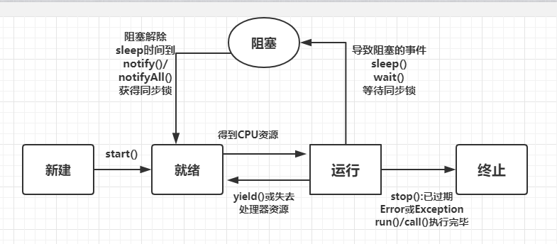
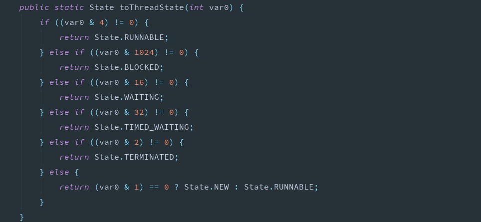

# 多线程

## 进程与线程

进程:像QQ、微信、网易云音乐这些软件运行后就是一个进程。进程可以独立运行,进程有自己独立的内存空间,不与其他进程共享数据。一个进程可以包含1~N个线程

线程:线程是进程中的一个单元,一个子任务执行者,线程不能独立运行,必须依赖进程而运行,同一个进程中的线程可以共享数据。

## 并行和并发

并发:指在同一时间段内多个任务高速频繁切换执行

并行:指在同一时刻(间)内多个任务同时执行

## jvm是不是多线程的

```java
public class JvmThread {

    public static void main(String[] args) {

        for (int i = 0; i < 1000000; i++) {
            System.out.println(new JvmThread());
        }

    }

    @Override
    protected void finalize() throws Throwable {
        System.out.println("清理垃圾");
    }
}
// console
xyz.taoqz.jia.JvmThread@e8d1eee
xyz.taoqz.jia.JvmThread@16a432f8
清理垃圾
清理垃圾
清理垃圾
xyz.taoqz.jia.JvmThread@4017b606
xyz.taoqz.jia.JvmThread@3610d58b
```

从结果可以看出jvm至少启动了两个线程,一个是main一个是垃圾回收

## 入门案例

```java
public class TestQuick {

    public static void main(String[] args) {

        // 使用匿名内部类的方式
        new Thread(new Runnable() {
            @Override
            public void run() {
                for (int i = 0; i < 100; i++) {
                    System.out.println(Thread.currentThread().getName()+"..."+i);
                }
            }
        }).start();

        for (int i = 0; i < 100; i++) {
            System.out.println(Thread.currentThread().getName()+"..."+i);
        }
        
    }
}
```

```
// 部分console
main...0
Thread-0...0
main...1
Thread-0...1
Thread-0...2
Thread-0...3
Thread-0...4
Thread-0...5
Thread-0...6
Thread-0...7
main...2
Thread-0...8
main...3
Thread-0...9
```

## 创建多线程的几种方式

### 继承Thread类

```java
public class MyThread extends Thread{

    @Override
    public void run() {
        System.out.println("我是继承Thread类开启线程后执行的任务");
    }

    public static void main(String[] args) {
        MyThread myThread = new MyThread();
        // 开启一个线程,并不是调用run方法
        // 如果调用run方法就是交由main函数去调用,依次执行
        myThread.start();
        System.out.println(Thread.currentThread().getName());
    }
}
```

### 实现Runnable接口

```java
public class MyRunnable implements Runnable{
    @Override
    public void run() {
        System.out.println("我是实现Runnable接口开启线程后执行的任务");
    }

    public static void main(String[] args) {
//        创建线程任务类
        MyRunnable myRunnable = new MyRunnable();
//        将任务类对象传递到Thread的构造中并开启线程
        Thread thread = new Thread(myRunnable);
        thread.start();
        System.out.println(Thread.currentThread().getName());
    }
}
```

### 实现Callable接口结合FutureTask类

以上两种方式,开启线程后只能执行任务,拿不到执行任务的返回值,这种方式解决了这个问题

```java
/**
 * 实现Callable接口,返回代表返回值的类型
 */
public class MyCallable implements Callable<Integer> {

    @Override
    public Integer call() throws Exception {
        System.out.println("我是实现Callable接口结合FutureTask开启线程后执行的任务");
        return 666;
    }

    public static void main(String[] args) throws Exception {

//        创建任务类添加到FutureTask的构造中
        MyCallable myCallable = new MyCallable();
        FutureTask<Integer> result = new FutureTask<>(myCallable);
//        再将FutureTask添加到Thread的构造中开启线程
        Thread thread = new Thread(result);
        thread.start();
//        打印主线程的名称
        System.out.println(Thread.currentThread().getName());
//        获取自定义线程的返回值
        System.out.println(result.get());
    }

}
```

### 三种方式的比较

首先这三种方式最后都需要通过Thread来间接或直接开启线程执行线程任务

继承Thread类(也实现了Runnable接口)的方式最简单,并且可以直接调用start()开启线程,但这种方式不宜扩展(也就是java中类的单继承多实现),实现Runnable接口和Callable接口可以解决这个问题

虽然实现Runnable接口可以解决日后有继承类的需求,但是如果我们需要拿到线程执行的任务的返回值,Runnable接口中run方法同样不支持,也便是实现Callable接口的好处,其提供了带返回值的call()方法


## 线程名称

设置获取线程名称

```java
public class MyThread implements Runnable{
    @Override
    public void run() {
        System.out.println(Thread.currentThread().getName()+"===执行任务");
    }

    public static void main(String[] args) {
        MyThread myThread = new MyThread();
//        使用构造设置名称
        Thread thread = new Thread(myThread,"自定义线程名称");
//        使用方法设置名称
//        thread.setName("123");
        thread.start();
//        获取当前线程的名称
        System.out.println(Thread.currentThread().getName()+"===主线程的名称");
    }
}
```

## 多线程中的异常处理机制

```java
public class MyThread extends Thread{

    @Override
    public void run() {
        for (int i = 0; i < 5; i++) {
//            使用的是Thread类的方法,可以直接调用getName获取当前线程的名称
            System.out.println(getName()+"=="+i);
        }
    }

    public static void main(String[] args) {
        MyThread myThread = new MyThread();
        myThread.setName("自定义线程");
        myThread.start();
        int i = 1/0;
    }
}
```

从打印结果看,main线程出异常并不会影响自定义线程的执行。

同样自定义中如果有异常也不会影响main线程,可以得出jvm只会终止出异常的线程,并不会影响其他线程的执行

```
Exception in thread "main" 自定义线程==0
自定义线程==1
自定义线程==2
自定义线程==3
自定义线程==4
java.lang.ArithmeticException: / by zero
	at xyz.taoqz.threadexception.MyThread.main(MyThread.java:21)
```


## 线程休眠

调用Thread类的静态方法sleep(毫秒值),休眠只会让出CPU资源但不会让出锁资源

```java
public class MyThread extends Thread{
    @Override
    public void run() {
        for (int i = 0; i < 10; i++) {
            System.out.println(i);
//            当i到6时会休眠1秒钟后运行
            if (i == 6){
                try {
//                    静态方法,参数为毫秒数
//                    该方法会抛出一个中断异常,只能捕获,因为子类抛出的异常级别不能大于父类,父类没有抛异常子类也不能抛
                    Thread.sleep(1000);
                } catch (InterruptedException e) {
                    e.printStackTrace();
                }
            }
        }
    }

    public static void main(String[] args) {
        MyThread myThread = new MyThread();
        myThread.start();
    }
}
```

## 守护线程

setDaemon(boolean)设置一个线程为守护线程,该线程不会单独执行,当其他非守护线程都执行结束后,自动退出(相当于下象棋,老帅如果死了就结束了,守护线程就是守护老帅的)

效果:其他非守护线程执行结束后,守护线程并不会立即停止,会有一个缓冲期

```java
public class MyDaemonThread {

    public static void main(String[] args) {

        Thread t1 = new Thread(){
            @Override
            public void run() {
                for (int i = 0; i < 2; i++) {
                    System.out.println(getName()+"aaaaaaaaaa");
                }
            }
        };
        
        // 不设置守护线程的效果会打印50次,设置为守护线程后上面的t1结束,t2随之结束
        Thread t2 = new Thread(){
            @Override
            public void run() {
                for (int i = 0; i < 50; i++) {
                    System.out.println(getName()+"bb");
                }
            }
        };

//        将t2设置为守护线程,当t1结束后,t2自动结束
        t2.setDaemon(true);
        // 开启两个线程
        t1.start();
        t2.start();
    }

}
//Thread-0aaaaaaaaaa
//Thread-0aaaaaaaaaa
//Thread-1bb
//Thread-1bb
//Thread-1bb
//Thread-1bb
//Thread-1bb
//Thread-1bb
//Thread-1bb
//Thread-1bb
//Thread-1bb
```


## 线程优先级

效果不明显,默认优先级是5

```java
        t1.setPriority(1);
//        t1.setPriority(Thread.MAX_PRIORITY); 10
//        t2.setPriority(10);
//        t2.setPriority(Thread.MIN_PRIORITY); 1
//        t2.setPriority(Thread.NORM_PRIORITY); 5
```


## 线程让步

yield()让出cpu资源,也就是回到就绪状态(效果不明显,因为让步的线程还有可能被线程调度程序再次选中)

```java
 Thread.yield();
```


## 线程插入

join(),当前线程暂停,等待指定的线程执行结束后,当前线程再继续

join(int),等待指定的毫秒后继续

```java
public class MyThreadJoin {

    public static void main(String[] args) {

        Thread t1 =  new Thread(new Runnable() {
            @Override
            public void run() {
                for (int i = 0; i < 10; i++) {
//                    让其先休眠10毫秒方便测试
                    try {
                        Thread.sleep(10);
                    } catch (InterruptedException e) {
                        e.printStackTrace();
                    }
                    System.out.println("aa");
                }
            }
        });

        Thread t2 =  new Thread(new Runnable() {
            @Override
            public void run() {
                for (int i = 0; i < 5; i++) {
//                    当i==2时让t1线程插入
                    if (i == 2){
                        try {
//                            t1插入执行完毕后本线程再执行
                            t1.join();
//                            t1插入指定时间后两条线程继续无规则交替执行
//                            t1.join(30);
                        } catch (InterruptedException e) {
                            e.printStackTrace();
                        }
                    }
                    System.out.println("bb");
                }
            }
        });

        t1.start();
        t2.start();
    }
}

// console
bb
bb
aa
aa
aa
aa
aa
aa
aa
aa
aa
aa
bb
bb
bb
```


## 线程中断

interrupt():可以在t2线程中使用t1线程对象调用该方法,通知t1停止,t1可以调用isInterrupted()判断状态,如果为true,便接到了通知,可以选择中断或者继续执行。如果该线程处于终止状态或者被中断过,那么调用isInterrupted()依然返回false。

当t2通知t1终止,但t1本身调用wait、join、sleep等阻塞方法的时候,就会抛出一个异常,同时会清除被标记的死亡状态(也就是isInterrupted的值改为false),继续执行,当然也可以选择捕捉后终止运行

```java
java.lang.InterruptedException: sleep interrupted
	at java.lang.Thread.sleep(Native Method)
	at xyz.taoqz.threadinterrupt.MyInterrupt2$1.run(MyInterrupt2.java:17)
	at java.lang.Thread.run(Thread.java:748)
```


```java
public class MyThreadInterrupt {

    public static void main(String[] args) {

        Thread t1 = new Thread(new Runnable() {
            @Override
            public void run() {
                for (int i = 0; i < 30; i++) {
                    System.out.println(Thread.currentThread().getName()+"=="+i);
                    // 如果接到通知标志改为true,选择进行终止
                    if (Thread.currentThread().isInterrupted()){
                        return;
                    }
                }
            }
        });

        Thread t2 = new Thread(new Runnable() {
            @Override
            public void run() {
                for (int i = 0; i < 10; i++) {
                    System.out.println(i);
                    // 当i==5通知t1终止
                    if (i == 5){
                        t1.interrupt();
                    }
                }
            }
        });

        t1.start();
        t2.start();
    }
}
// console
Thread-0==0
Thread-0==1
Thread-0==2
Thread-0==3
Thread-0==4
Thread-0==5
Thread-0==6
0
1
2
3
4
5
Thread-0==7
6
7
8
9
```


## 线程状态图



可以使用getState()获取线程状态



```
NEW : 尚未启动的线程的线程状态
RUNNABLE : 可运行线程的线程状态
BLOCKED : 线程阻塞（等待锁，或者在同步代码块，同步方法中）
WAITING : 等待线程的线程状态（处于等待状态的线程正在等待另一个线程执行特定操作，例如在对象上调用Object.wait()的线程在等待另一个线程使用该对象调用Object.notify()或notifyAll(),调用Thread.join()的线程在等待指定线程终止）
TIMED_WAITING : 具有指定等待时间的等待线程的线程状态（调用Thread.sleep,Object.wait(timeout),Thread.join(timeout)）
TERMINATED : 线程已完成执行(终止状态)
```

