# Logstash技术分享

## 介绍

​	Elasticsearch是当前主流的分布式大数据存储和搜索引擎，可以为用户提供强大的全文本检索能力，广泛用于日志检索、全站搜索等领域。Logstash作为Elasticsearch常用的实时数据采集引擎，可以采集来自不同数据源的数据，并对数据进行处理后输出到多种输出源，是Elastic Stack的重要组成部分。

​	**logstash支持的input和output插件有很多，该分享主要针对Es-To-Es 及 Kafka-To-Es 两种情况。**

## 数据处理流程

​	Logstash的数据处理过程主要包括：**Inputs、Filters、Outputs**，另外在Inputs和Outputs中可以使用Codecs对数据格式进行处理，这四个部分均已插件的形式存在。


Inputs：输入源，也就是数据源，常见的插件如Kafka、File、Redis等。

Filter: 过滤，对数据源的数据进行过滤清洗，如格式转换、数据派生等，常见的插件如grok、mutate、drop等。

Outputs：用于数据输出，将数据输出到指定的组件中比如Elasticsearch、Mysql等，主要是作为ElasticSearch数据的输入源。

Codecs：Codecs不是一个单独的流程，而是在输入和输出等插件中用户数据转换的模块，用于对数据进行编码处理，常见的插件如json、multiline。


## 安装部署

### 下载地址

https://www.elastic.co/cn/downloads/logstash

### Elastic Stack组件版本对应表

https://www.elastic.co/cn/support/matrix#matrix_compatibility

注意：Logstash的运行环境依赖JDK，Logstash中自带了这部分，如果有需要也支持灵活使用其他JDK。


## 文件目录

主要目录

- bin：bin目录，执行命令
- config：配置目录
- logs：日志目录
- data：数据目录

主要文件

都在config目录下

- logstash.yml：用于控制logstash的执行过程[[参考链接](https://www.elastic.co/guide/en/logstash/current/logstash-settings-file.html)]
- pipelines.yml: 如果有多个pipeline时使用该配置来配置多pipeline执行[[参考链接](https://www.elastic.co/guide/en/logstash/current/multiple-pipelines.html)]
- jvm.options：jvm的配置
- log4j2.properties:log4j 2的配置，用于记录logstash运行日志[[参考链接](https://www.elastic.co/guide/en/logstash/current/logging.html#log4j2)]
- startup.options: 仅适用于Lniux系统，用于设置系统启动项目！


## Hello World

在logstash根目录下创建conf目录，新建hello-world.conf，内容如下

```shell
input {
 stdin {} # 标准输入
}

output {
 stdout {} # 标准输出 
}
```

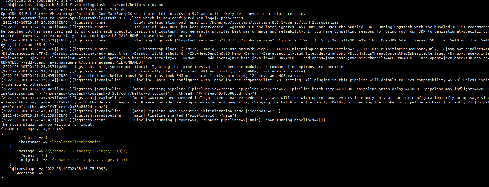

可以看到输出的数据会自动添加 host、hostname、@timestamp、@version等数据。


## 启动命令

验证配置文件

```shell
./bin/logstash -f ./conf/es-to-es.conf --config.test_and_exit
```

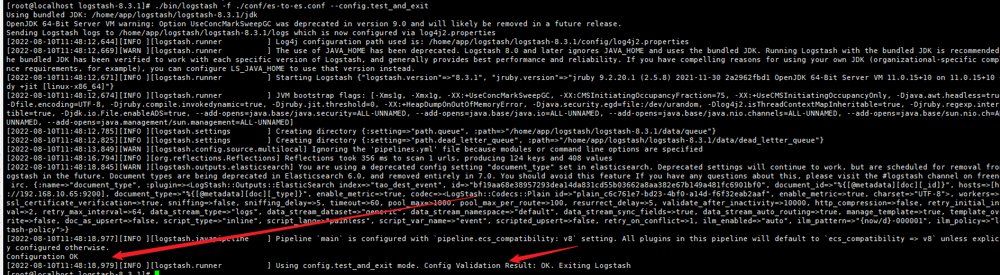

启动

```shell
./bin/logstash -f ./conf/es-to-es.conf
```

配置文件热加载（默认3s重新加载一次）

```shell
./bin/logstash -f ./conf/es-to-es.conf --config.reload.automatic
```


## Es-To-Es

以下配置意为将在线的机器信息输出到另一个索引中

```sh
input {
    elasticsearch {
        hosts => ["http://192.168.10.65:9200"]        # Elasticsearch集群主机列表
        index => "zc_machine"                         # 索引	
        query => '{                                   
				    "query":{
				        "term":{
				            "onlineStatus":{
				                "value":1
				            }
				        }
				    }
				}'                                  # query查询过滤数据
        size => 500                                   # 每个滚动返回的最大命中数
        scroll => '5m'                                # 控制滚动请求的保活时间（单位：秒）
        docinfo => true                               # 设置为true时，则在事件中包含Elasticseach文档信息，例如索引、类型和id
        docinfo_target => "[@metadata][doc]"          # 如果docinfo选项请求文档元数据存储，则此选项将存储元数据字段的字段命名为子字段。
    }
}


output {
    elasticsearch {
        hosts => ["http://192.168.10.65:9200"]
        index => "tao_dest_event"
        action => 'index'                                # 操作
        document_type => "%{[@metadata][doc][_type]}"    # 由于ElasticSearch从7.x后废弃该字段，所以无关紧要
        document_id => "%{[@metadata][doc][_id]}"        # 如果有更新操作，则作用与覆盖原文档
    }
}

# 一个conf文件中可以存在多个input和output
output {
    stdout { codec => rubydebug }
}
```

###  

运行后可以看到数据已经被插入到了新的索引中

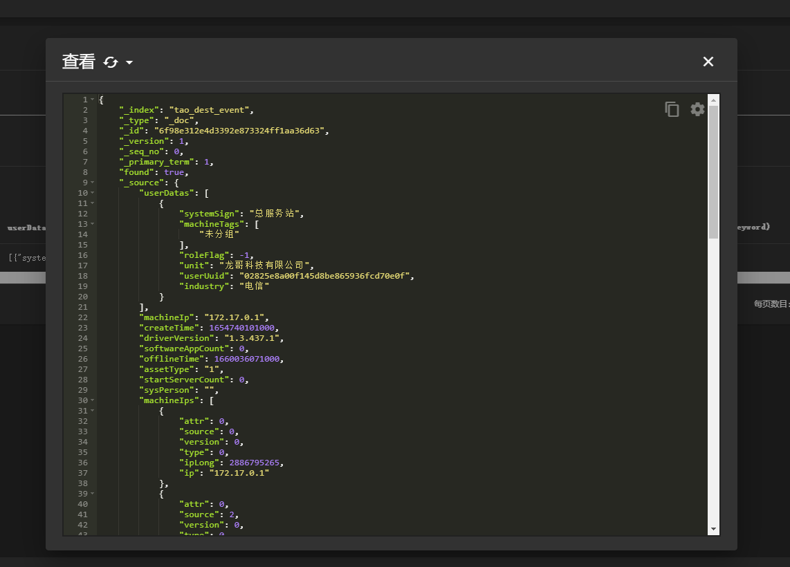


## elasticsearch-output-plugin action

action是 logstash elasticsearch-output-plugin中的重要参数，代表数据入库elasticsearch时的操作。

- index：

  没有 document_id：将数据入库到Elasticsearch中，由Elasticsearch生成该文档的Id，因为没有指定document_id，重复的数据会生	成多条内容相同但 id 不同的文档。

  有 document_id：

  ​	如果 document_id 在Elasticsearch中不存在，创建一条新的文档，使用 document_id作为该文档的 id。

  ​	如果 document_id 在Elasticsearch中存在，直接更新文档。

  

- create：

  没有 document_id : 不指定，直接返回失败

  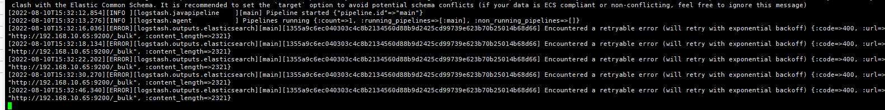

​		有 document_id：
​			如果 document_id 在Elasticsearch中不存在，创建一条新的文档，使用 document_id作为该文档的 id。
​			如果 document_id 在Elasticsearch中存在，直接返回失败，提示原因为该 id 的文档已存在。

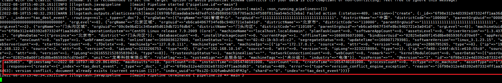


- delete：
  没有 document_id：必须设置 document_Id,，否则将抛出错误

  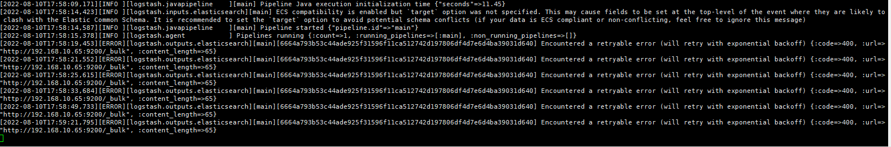

  

- update：
  没有 document_id：必须设置document_id，否则将排除错误

  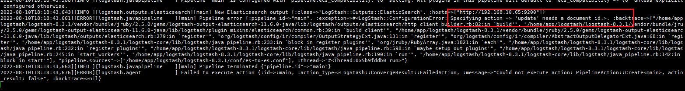

  

  有 document_id：
    如果 document_id 在Elasticsearch中不存在，创建一条新的文档，使用 document_id 作为该文档的id。

  ​      doc_as_upsert 为 true 时，使用event的值作为文档的值。

  ​      scripted_upsert 为 true 时， 使用script作为文档的值。

  ​      其余情况，使用upsert作为文档的值。

    如果 document_id 在Elasticsearch中存在，直接更新该文档。

   

**注意：es-to-es时，一条数据只会执行一次，源索引发生更新时，并不会通过logstash更新目标索引的数据。**

Elasticsearch Input Plugin:  https://www.elastic.co/guide/en/logstash/current/plugins-inputs-elasticsearch.html

Elasticsearch Output Plugin: https://www.elastic.co/guide/en/logstash/current/plugins-outputs-elasticsearch.html


## Kafka-To-Es

使用Kafka作为数据源，将数据写入Elasticsearch。

### kafka-to-es.conf

```sh
input {
  # 配置kafka数据源
  kafka {
    # kafka服务器地址，多个地址使用逗号分隔
    bootstrap_servers => "192.168.181.128:9092,192.168.181.129:9092,192.168.181.130:9092"
    # sasl验证
    #security_protocol => "SASL_PLAINTEXT"
    #sasl_mechanism => "PLAIN"
    #sasl_jaas_config => "org.apache.kafka.common.security.plain.PlainLoginModule required username="admin" password="g011234";"
    # 订阅的主题,支持订阅多个主题
    topics => ["logstash-kafka-to-es"]
    # 消费者线程数
    consumer_threads => 3
    # 消费组Id
    group_id => "logstash-kafka-to-es"

    # 此属性会将当前topic、offset、group、partition等信息也带到message中
    decorate_events => true
    # 添加json插件 
    codec => json {  
      charset => "UTF-8"
    }
  }
}

filter {
   # 解决@timestamp 少8小时问题
   ruby {
    code => "event.set('index_date', (event.get('@timestamp').time.localtime).strftime('%Y-%m-%d'))"
   }

   mutate {
    convert => ["index_date", "string"]
   }
}


filter{
  mutate{
     # 删除字段event: 原始信息会存一份到event
    remove_field => ["event"]
     # 添加字段
    add_field => { "kafka-metadata" => "%{[@metadata][kafka][topic]}-%{[@metadata][kafka][partition]}-%{[@metadata][kafka][offset]}" }
  }
}


output {
  elasticsearch {
    hosts => ["http://192.168.10.63:9200", "http://192.168.10.64:9200", "http://192.168.10.65:9200"]
#    user => "elastic"
#    password => "123qweasdZXC"
    index => "tao_index-%{index_date}"
    document_id => "%{[id]}"
    # 是否覆盖ES中的template，默认是false
    template_overwrite => true
    # 模板名称 默认 文件名
    template_name => "kafka-to-es-template"
    # 指定映射的模板文件，可以设置setting、mapping、aliases等等
    template => "/home/app/logstash/logstash-8.3.1/conf/template/kafka-to-es-template.json"
    sniffing => true
    action => "update"
    doc_as_upsert => true
  }
}


output {
    stdout { codec => rubydebug }
}

```


### kafka-to-es-template.json

可以设置 settings、mappings、aliases，比如我们想传输到另一个索引中时想修改某些字段的mapping，也可以选择在这边进行处理

```sh
{
    "template":"tao_index-*",
    "settings":{
        "index":{
            "refresh_interval":"5s"
        }
    },
    "mappings":{
    
    },
    "aliases":{
        "{index}-alias":{

        }
    }
}
```

发送消息到kafka

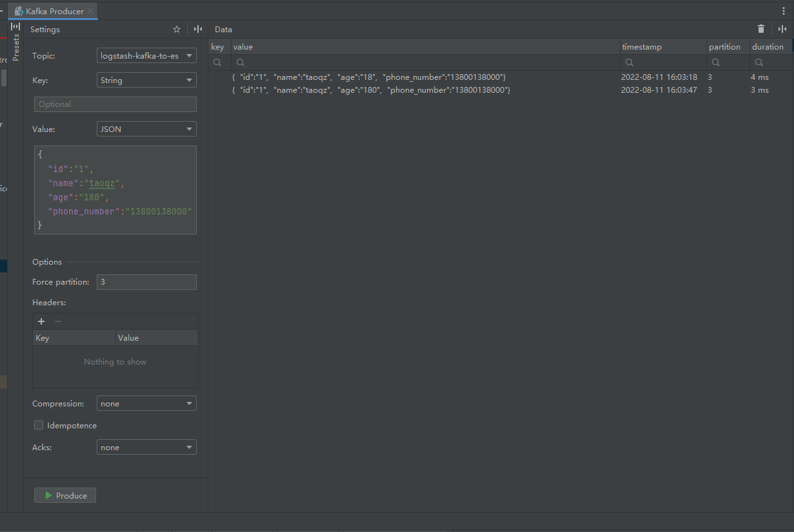


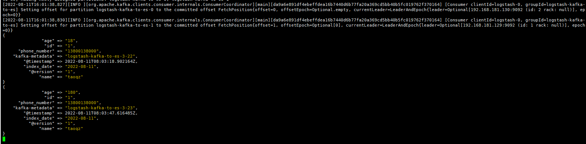


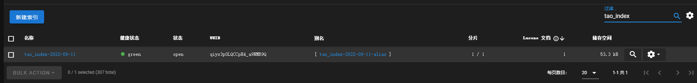

**增量更新**

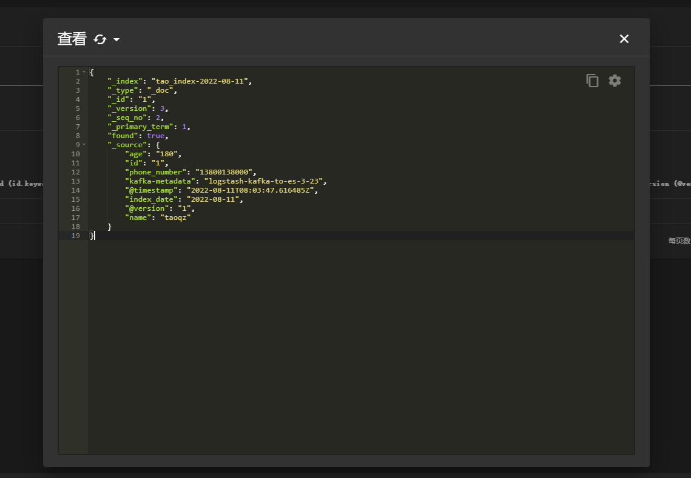


### script 脚本更新

在开发过程中也有很多是通过script脚本来进行更新的场景

kafka-to-es-script-upsert.conf （重点关注在 output elasticsearch 中的 script 配置）

```sh
input {
  kafka {
    bootstrap_servers => "192.168.181.128:9092,192.168.181.129:9092,192.168.181.130:9092"
    topics => ["logstash-kafka-to-es"]
    consumer_threads => 3
    group_id => "logstash-kafka-to-es"
    decorate_events => true
    codec => json {  
      charset => "UTF-8"
    }
  }
}

filter {
   ruby {
    code => "event.set('index_date', (event.get('@timestamp').time.localtime).strftime('%Y-%m-%d'))"
   }

   mutate {
    convert => ["index_date", "string"]
   }
}


filter{
  mutate{
    remove_field => ["event"]
    add_field => { "kafka-metadata" => "%{[@metadata][kafka][topic]}-%{[@metadata][kafka][partition]}-%{[@metadata][kafka][offset]}" }
  }
}


output {
  elasticsearch {
    hosts => ["http://192.168.10.63:9200", "http://192.168.10.64:9200", "http://192.168.10.65:9200"]
    index => "tao_index-%{index_date}"
    document_id => "%{[id]}"
    action => "update"
    doc_as_upsert => true
    script_lang        => "painless"
    script_type        => "inline"
    script             => 'ctx._source.count += params.event.get("count"); '
  }
}


output {
    stdout { codec => rubydebug }
}

```


插入数据

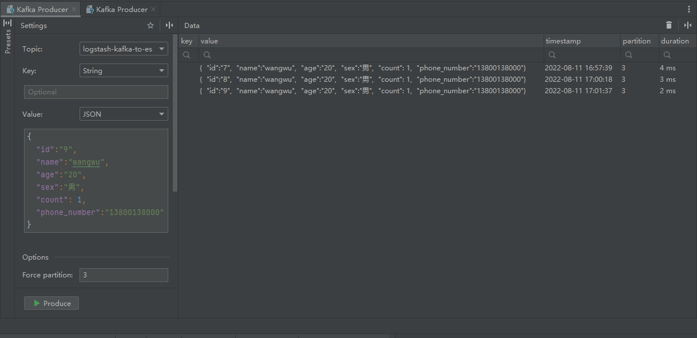


增量更新

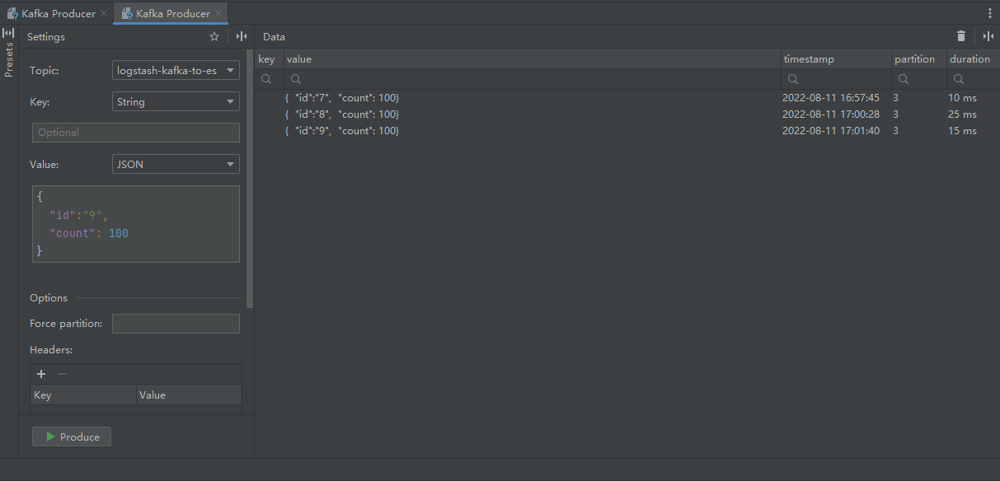


logstash打印消息

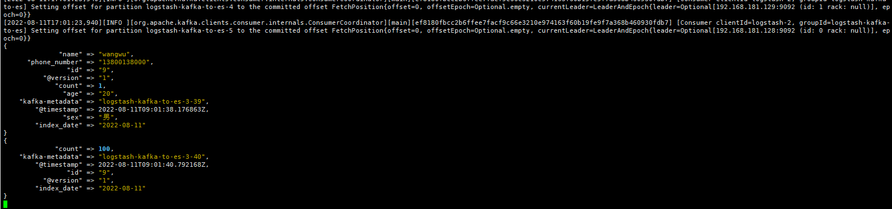


查看修改后的数据

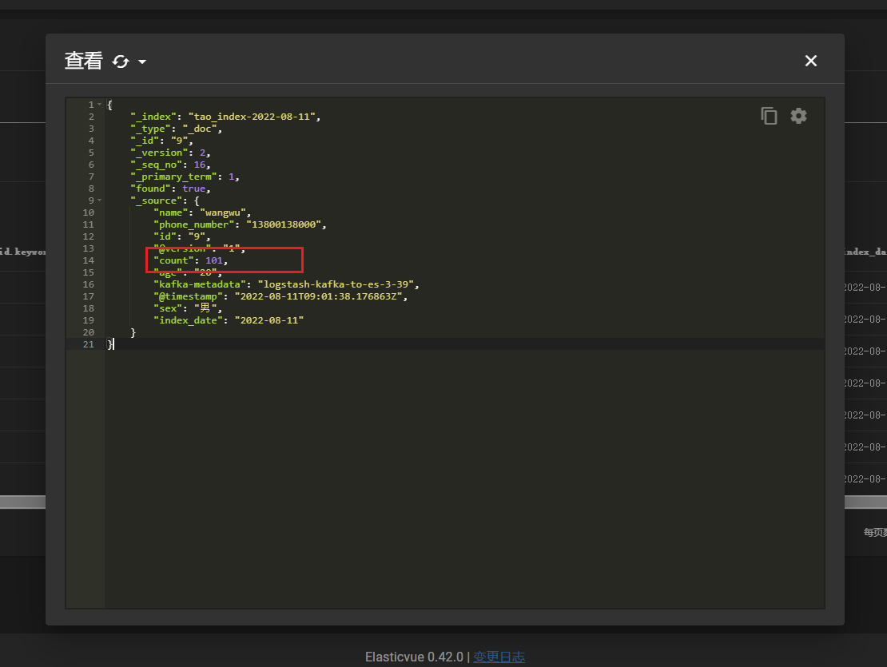


## 多配置文件

​	在使用过程中我们可能会有要起多个配置文件的需要，这里不再演示使用 指定配置文件（多配置文件的方式），可以使用 **pipelines** 配置文件

文件位置

```sh
/home/app/logstash/logstash-8.3.1/config/pipelines.yml
```

配置完成后直接启动

```sh
./bin/logstash
```

创建两个配置文件，内容如下

```sh
input {
  kafka {
    bootstrap_servers => "192.168.181.128:9092,192.168.181.129:9092,192.168.181.130:9092"
    topics => ["logstash-kafka-to-es"]
    consumer_threads => 3
    group_id => "logstash-kafka-to-es"
    decorate_events => true
    codec => json {  
      charset => "UTF-8"
    }
  }
}

filter {
   ruby {
    code => "event.set('index_date', (event.get('@timestamp').time.localtime).strftime('%Y-%m-%d'))"
   }

   mutate {
    convert => ["index_date", "string"]
   }
}


filter{
  mutate{
    remove_field => ["event"]
    add_field => { "kafka-metadata" => "%{[@metadata][kafka][topic]}-%{[@metadata][kafka][partition]}-%{[@metadata][kafka][offset]}" }
  }
}


output {
  elasticsearch {
    hosts => ["http://192.168.10.63:9200", "http://192.168.10.64:9200", "http://192.168.10.65:9200"]
    index => "tao_index-%{index_date}"
    document_id => "%{[id]}"
    action => "update"
    doc_as_upsert => true
  }
}


output {
    stdout { codec => rubydebug }
}

```


pipelines.yml 配置

```sh
- pipeline.id: muti1
  pipeline.workers: 1
  pipeline.batch.size: 2
  pipeline.batch.delay: 5000
  path.config: "/home/app/logstash/logstash-8.3.1/conf/muti_conf/muti1.conf"

- pipeline.id: muti2
  pipeline.workers: 1
  pipeline.batch.size: 1
  path.config: "/home/app/logstash/logstash-8.3.1/conf/muti_conf/muti2.conf"

```


这个topic我们设置了6个分区，因为每个配置文件配置了3个消费者线程，启动后可以看到共有6个消费者线程

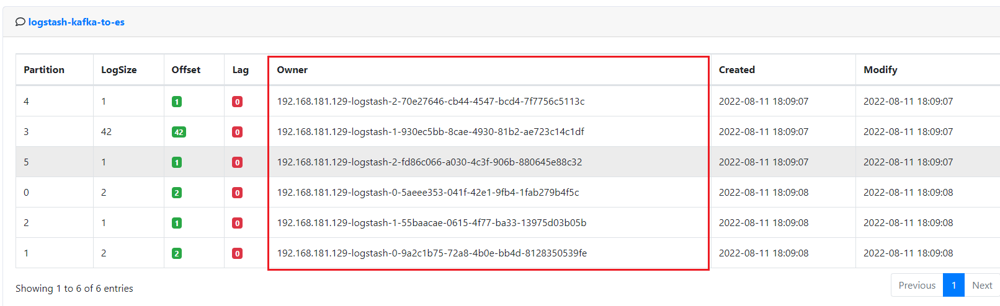


## pipelines.yml

```sh
- pipeline.id: muti1
  # pipeline线程数，官方建议是等于CPU内核数 
  pipeline.workers: 1
  # 每次发送的事件数 默认 125  可能需要在jvm.options配置文件中增加堆内存
  pipeline.batch.size: 20000
  # 发送延时 毫秒 默认 50
  pipeline.batch.delay: 5000
  path.config: "/home/app/logstash/logstash-8.3.1/conf/muti_conf/muti1.conf"
```

​	以上面的配置为例 Logstash 会努力攒到 20000 条数据一次性发送出去，但是如果 5 秒钟内也没攒够 20000 条，Logstash 还是会以当前攒到的数据量发一次。也就是两个条件满足其一即可。

​	经过我的实际测试 当 pipeline.batch.delay 设置为 5000 时会等待 10s ，设置为 10000 时会等待20s，也就是两倍。


## 性能优化及扩展

​	当单个Logstash无法满足性能需求时，可以采用横向扩展的方式来提高Logstash的处理能力。横向扩展的多个Logstash相互独立，采用相同的pipeline配置，另外可以在这多个Logstash前增加一个LoadBalance，以实现多个Logstash的负载均衡。

​	在 **kafka-to-es** 的场景下，我们可以利用kafka有分区和消费者组的天然优势做负载均衡。

​	由于多个Logstash之间是相互的独立的，所以在使用相同的配置文件时，还需要注意数据的处理，比如插入es时，如果希望相同的数据只存在一份，那我们必须在输入时指定document_id，同时在输出时声明出来（这里的指定不代表非要自定义es的document_id，而是输入源的数据要有document_id的属性值），输出时选择create、update或upsert。

​	

## 其他问题

### @timestamp 少8小时问题

```sh
filter {
#   # 解决timestamp少8小时问题
#   # 1.添加字段timestamp，将原始字段@timestamp添加8小时赋值到timestamp
#   ruby {
#     code => "event.set('timestamp', event.get('@timestamp').time.localtime + 8*60*60)"
#   }
#   # 2.重新设置@timestamp值
#   ruby {
#     code => "event.set('@timestamp',event.get('timestamp'))"
#   }
#   # 3.删除临时字段timestamp
#   mutate {
#     remove_field => ["timestamp"]
#   }
#
#   # 格式化@timestamp字段赋值到新字段index_date上
#   ruby {
#    code => "event.set('index_date', (event.get('@timestamp').time.localtime - 8*60*60).strftime('%Y-%m-%d'))"
#   }
#   # 将index_date字段转换为string类型
#   mutate {
#     convert => ["index_date","string"]
#   }
   ruby {
    code => "event.set('index_date_time', (event.get('@timestamp').time.localtime).strftime('%Y-%m-%d - %H:%M:%S'))"
   }
   ruby {
    code => "event.set('timestamp_origin', (event.get('@timestamp').time.localtime - 8*60*60).strftime('%Y-%m-%d - %H:%M:%S'))"
   }
}
```

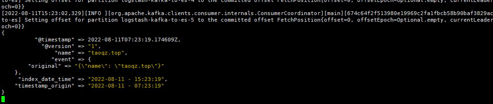


