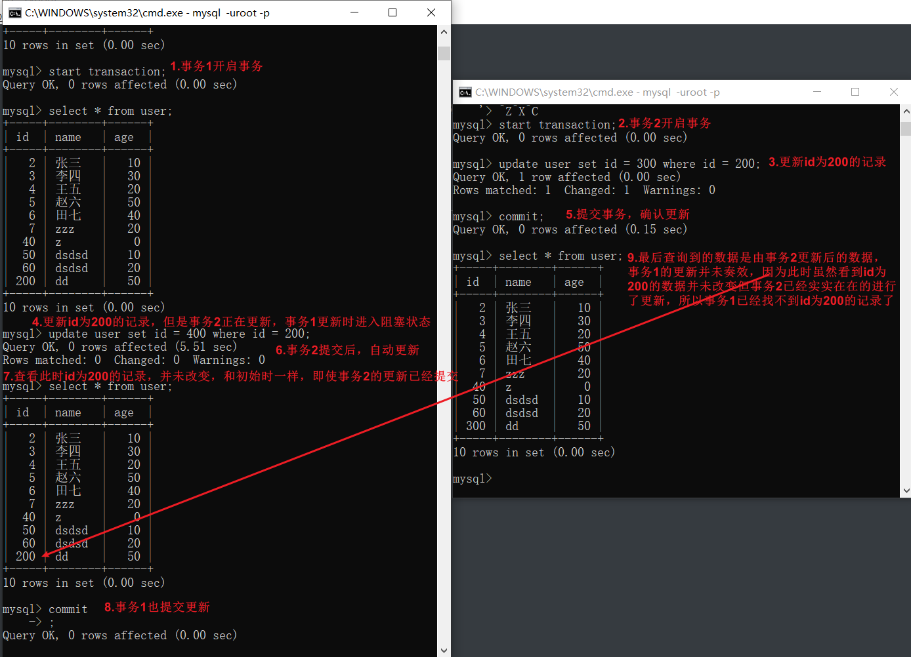
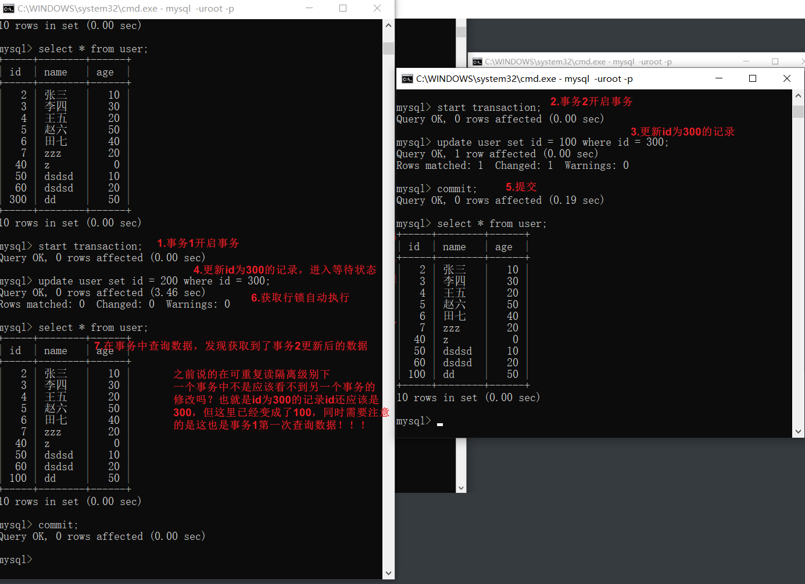
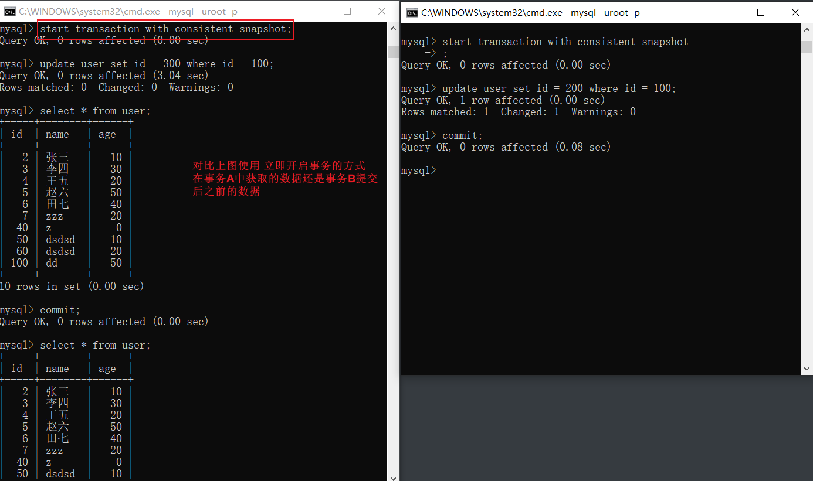

# MySQL事务

情景1

​	在可重复读隔离级别下，开始事务A后即使在事务B里更新了数据提交后，事务A看到的数据仍然和启动时看到的数据一样，但是在事务A中更新时却会影响到事务B中插入的数据。

情景2

​	在可重复读隔离级别下，事务A要更新一行，但这一行正在被事务B更新，此时事务A进入阻塞状态，那么等到事务B更新完毕提交之后，事务A会看到什么样的数据。

快照读？

极客的例子

事务A先开启事务，到最后查询的K值还是1。

事务B开启事务。

事务C开启事务并且更新id为1的K为2，自动提交。

事务B更新id为1的K值，这是的K值已经变为2了，更新后查询则为3。

这里，我们需要注意的是事务的启动时机。

begin/start transaction 命令并不是一个事务的起点，在执行到它们之后的第一个操作 InnoDB 表的语句，事务才真正启动。如果你想要马上启动一个事务，可以使用 start transaction with consistent snapshot 这个命令。

> 第一种启动方式，一致性视图是在第执行第一个快照读语句时创建的；
> 第二种启动方式，一致性视图是在执行 start transaction with consistent snapshot 时创建的。

在 MySQL 里，有两个“视图”的概念：

- 一个是 view。它是一个用查询语句定义的虚拟表，在调用的时候执行查询语句并生成结果。创建视图的语法是 create view … ，而它的查询方法与表一样。
- 另一个是 InnoDB 在实现 MVCC 时用到的一致性读视图，即 consistent read view，用于支持 RC（Read Committed，读提交）和 RR（Repeatable Read，可重复读）隔离级别的实现。

可重复读情况下

事务A 看不到事务B的更改

