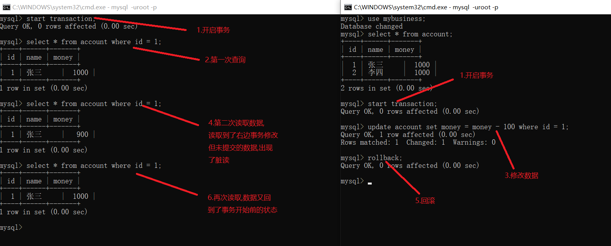
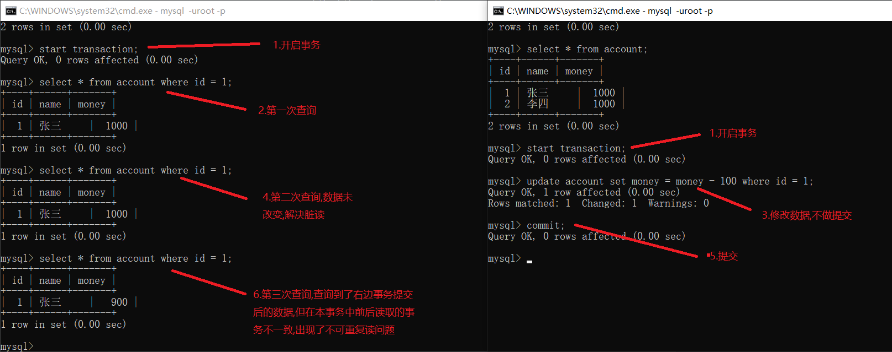
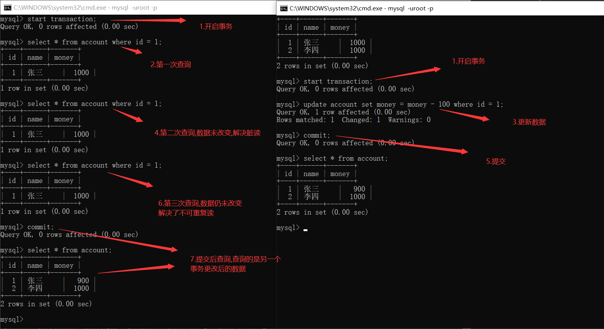
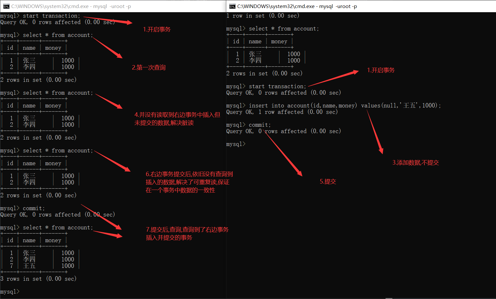
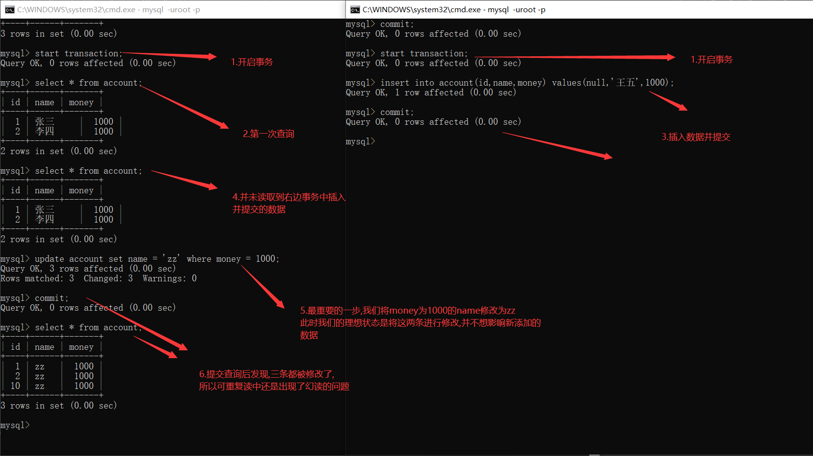

# 事务

事务指的是逻辑上的一组操作,组成这组操作的各个单元要么全部成功,要么全部失败

事务的作用:保证一个事务在多次操作中,要么全部成功,要么全部失败(当程序出现异常时,可以将所在事务中的数据恢复到原来的状态)

mysql中并非所有的存储引擎都支持事务,其中MyISAM和InnoDB是最为常用的两种引擎,而前者不支持事务后者支持,同时这也是mysql将其定为默认的存储引擎的重要原因

# ACID

InnoDB存储引擎中的事务完全支持ACID特性

原子性(Atomicity):原子性是指事务是一个不可分割的工作单位,事务中的操作,要么全部发生,要么不发生

一致性(consistency):事务前后的数据必须保持一致

隔离性(isolation):指在多个用户访问数据库时,一个用户的事务不能被其他用户的事务所干扰,多个并发事务之间数据要相互							隔离(即该事务提交前对其他事务都不可见,通常使用锁来实现)

持久性(durability):事务一旦提交,其结果就是永久性的,即使数据库发生故障崩溃而需要恢复时,也能保证提交后的数据都不会丢失(保证了应用的高可靠性,而并非高可用)


# mysql事务操作

|      sql语句       |   描述   |
| :----------------: | :------: |
| start transaction; | 开启事务 |
|      commit;       | 提交事务 |
|     rollback;      | 回滚事务 |

创建一张表

```sql
CREATE TABLE `account` (
  `id` int(11) NOT NULL AUTO_INCREMENT,
  `name` varchar(20) DEFAULT NULL,
  `money` double DEFAULT NULL,
  PRIMARY KEY (`id`)
) ENGINE=InnoDB AUTO_INCREMENT=3 DEFAULT CHARSET=utf8

insert into account(id,name,money) values (null,'张三',1000);
insert into account(id,name,money) values (null,'李四',1000);
```

mysql中有两种方式进行事务的管理

​	自动提交:mysql默认是自动提交的,及执行一条sql语句提交一次事务

​	手动提交:先开启事务,再提交

```
# 查看当前的提交方法,是否自动提交 0=OFF(否)  1=ON(是)
show variables like '%commit%';
# 设置自动提交的参数为OFF
set autocommit = 0;
```

假如现在有一个转账的需求

此时设置的是自动提交,将两条sql执行后会持久化到数据库中

```
update account set money = money - 100 where name = '张三';
update account set money = money + 100 where name = '李四';
```

现在把自动提交改为手动提交

```sql
show variables like '%commit%';
set autocommit  = 0;
show variables like '%commit%';
```

```sql
# 开启事务并进行转账
start transaction ;
update account set money = money - 100 where name = '张三';
update account set money = money + 100 where name = '李四';
```

你会发现在数据库中没有做任何的改变,因为数据库还没有得到指令是提交还是回滚

```
# 回滚
rollback ;
# 提交
commit ;
```

需要注意的是,在提交后是无法进行回滚的,因为数据已经磁盘中做了持久化,同样的回滚后,再次提交也是没有意义的,可以把这两条语句当做是事务的结束语句


# 并发访问问题

如果不考虑隔离性,事务存在几种并发访问问题

1.脏读:一个事务读到了另一个事务中未提交的数据。

例如:	当一个事务访问数据库并对数据进行了修改,但该事务还没有结束,也就是还没有完成提交。此时另一个事务中读取到了这条并未提交的数据,这条数据便是脏数据,依据脏数据所做的操作可能是不正确的

2.丢失数据:指在一个事务读取一个数据时,另外一个事务也访问了这个数据,第一个事务中修改了这个数据后,第二个事务也修改了这个数据,这样第一个事务的修改结果就被丢失

 例如:	事务1读取某表中的数据A=20，事务2也读取A=20，事务1修改A=A-1，事务2也修改A=A-1，最终结果A=19，事务1的修改被丢失。

3.不可重复读:一个事务读到了另一个事务已经提交(update)的数据。引发另一个事务中多次查询结果不一致。

例如:	第一个事务读取到了一条数据,但并未结束事务。此时第二个事务对该条数据进行了修改并提交。当第一个事务再次读取这条数据时,发现可能和第一次读取的数据不一致,因此被称为不可重复读。

4.虚读/幻读:一个事务读取到了另一个事务已经提交(insert)的数据。导致另一个事务,在事务中多次查询的结果不一致。

例如:	幻读和不可重复读类似。一个事务读取了几行数据,接着另一个事务插入了一些数据并进行了提交,此时第一个事务会发现多了一些原本不存在的数据,就好像发生了幻觉一样,所以被称为幻读。


不可重复读和幻读的区别:

不可重复读的重点在修改,幻读的重点在与新增或者删除


# 事务隔离级别

读未提交(READ-UNCOMMITTED):最低的隔离级别,允许读取没有提交的数据,可能会导致脏读,幻读和不可重复读

读已提交(READ-COMMITTED):允许事务读取已经提交的数据,可以防止脏读,但是幻读和不可重复读仍有可能发生

可重复读(REPEATABLE-READ):对同一字段的读取结果是一致的,除非事务本身对数据进行修改,可以阻止脏读和不可重复读,但幻度仍有可能发生。

串行化(SERIALIZABLE):最高的隔离级别,完全服从ACID的隔离级别,所有事务依次执行,可以防止脏读,幻读和不可重复读

安全和性能对比

隔离级别的安全和性能成反比,越安全的性能越低

安全性:serializable > repeatable read > read committed > read uncommitted

性能:serializable < repeatable read < read committed < read uncommitted

MySQL InnoDB存储引擎默认支持的隔离级别是可重复读(repeatable-read)


## 示例

```sql
# 两条命令都适用于查看当前的事务隔离级别
show variables like '%isolation%';
select @@tx_isolation;
```

可更改设置事务的隔离级别

```sql
# 其中session可替换为global session代表当前连接 global代表全局
# 设置全局的隔离级别后需要重新连接
set session transaction isolation level read uncommitted;
set session transaction isolation level read committed ;
set session transaction isolation level repeatable read ;
set session transaction isolation level serializable ;
```

创建一张表

```sql
CREATE TABLE `account` (
  `id` int(11) NOT NULL AUTO_INCREMENT,
  `name` varchar(20) DEFAULT NULL,
  `money` double DEFAULT NULL,
  PRIMARY KEY (`id`)
) ENGINE=InnoDB AUTO_INCREMENT=3 DEFAULT CHARSET=utf8

# 示例每次演示开始的时候都将数据恢复到这个状态
insert into account(id,name,money) values (null,'张三',1000);
insert into account(id,name,money) values (null,'李四',1000);
```

### 读未提交

开启两个连接(窗口),将隔离级别设置为读未提交(read uncommitted)



### 读已提交

将左右的隔离级别都设置为读已提交(read committed)



### 不可重复读

左右设置隔离级别为可重复读(repeatable read)



保证了一个事务中读取同一条数据是一致的



前面我们说可重复读可能会出现幻读,也就是一个事务中会读到另一个事务插入并提交的数据,我们从上图看到并未发生这种情况,这不是和串行化没啥区别了吗,上网查资料

https://juejin.im/post/5c9040e95188252d92095a9e

进行验证



总结:从这两张图中的执行结果来看,可重复读其实并未完全解决了幻读的问题,只是解决了读数据情况下的幻读问题,对于修改依旧会出现幻读问题。


### 串行化


串行化:可以看到串行化对事务的要求很高,即使是进行了一次查询的操作,也必须提交,否则其他事务只能在等待状态,等待其他事务结束后再执行


