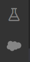

# VSCode搭建Salesforce环境

## 工具准备

使用VS Code配置Salesforce环境之前,需要先安装Salesforce CLI

Salesforce CLI (选择对应系统安装即可) : https://developer.salesforce.com/tools/sfdxcli

VS Code (选择对应系统安装,Windows选择System Installer避免出现小问题) : https://code.visualstudio.com/download

可能还需要安装node,在前端篇可以找到地址和历史版本地址

## 配置

安装好Salesforce CLI之后,验证安装

```shell
# 验证
sfdx --version
# 结果
sfdx-cli/7.59.0-05e06e37e0 win32-x64 node-v10.15.3
```

打开VS Code

安装插件(直接搜索安装即可):[Salesforce Extension Pack](https://marketplace.visualstudio.com/items?itemName=salesforce.salesforcedx-vscode)

按下

```shell
shift+ctrl+p
```

搜索 Create Project with Manifest 选择 Standard  创建项目即可

搜索 Authorize an Org 选择 正式OR测试环境 选择输入Org Alias,登录成功后代表连接成功

连接成功后,会在右侧多出两个图标



选择云形状的图标,找到对应的数据文件(Apex,Page等)点开后下载到本地即可

同样可以通过搜索,完成soql查询等操作

上传合并文件操作,在需要进行操作的文件处右击即可


