# Apex

Salesforce为开发者提供了Apex语言,语法类似java

## 特点:

​	面向对象,完全在云端处理,包括保存编译执行,强类型,大小写不敏感

​	强类型语言:指是一种强制类型定义的语言,即一旦定义某一个变量,如果不进行强制类型转换,他就是永远是该数据类型,所对应的弱类型语言则可以根据环境变化自动进行转换,不需要进过强制类型转换来实现。

## 数据类型

### 	基本数据类型

```java
// 声明为一个测试类
@isTest
public class BaseDataType {

    // 必须为静态的,可以使用@isTest注解和testMethod来进行替换,表述这是一个测试方法
    static testMethod void test(){
        // 整型
        Integer num = 100;
        System.debug(num);
        // 双精度类型
        Double a = 12.10;
        System.debug(a);
        // 字符串类型,只能使用单引号来引用,不可以使用双引号
        //        String name = "taoqz";
        String name = 'taoqz';
        System.debug(name);

        // 布尔值
        Boolean flag;
        // 默认为null,也可以为true或false
        System.debug(flag);
        System.debug(1111111);

        // 小数类型
        Decimal dec = 1.78;
        System.debug(dec);

        //        这是Salesforce特有的一种类型，系统中的对象都是继承自sObject类型，
        //        sObject sobj = new Account(name='精琢科技');
        //        System.debug(sobj.name);

        //        Date(日期)和DateTime(日期时间)都需要使用其静态方法newInstance创建
        //        并且这些变量之间无法直接进行运算,需要使用其静态方法
        //        1999-10-09 00:00:00
        Date d =  Date.newInstance(1999,10,09);
        System.debug(d);
        Datetime dt = Datetime.newInstance(2020,5,1);
        //        2020-04-30 16:00:00
        System.debug(dt);


        //        salesfoce中ID类型是一个特有的基本类型,有18个大小写敏感的字符组成
        //        也有包含15个字符的,这时是区分大小写敏感的

    }
}
```

### sObject

所有的对象都是sObject类型，所以当创建任何一个对象时，可以声明为sObject类型。

```java
@IsTest
static void sObjectTest(){
    SObject obj = new Account(Name='obj');
    //        {Name=obj}
    System.debug(obj);

    //        sObject类型可以转换为某一对象类型，反之则不行。
    //        另外，新建sObject类型的实例只能通过函数newSObject()，而不能通过new关键字。
    // 这里还是需要声明创建的sObject类型，比如这里的“Account”

    sObject sObj = Schema.getGlobalDescribe().get('Account').newSObject();
    System.debug(sObj);
    // sObject obj = new sObject(); // 错误的用法
}
```

### 集合类型

#### List

List类型时最常用的一种集合类型,和数组等价,可以相互转换

如果需要判断集合中是否存在值,需要使用 集合.size() == 0进行判断,默认是()代表长度为空

```java
@IsTest
static void listTest(){

    // List类型,不能使用list作为变量名,因为apex是大小写不敏感的
    List<String> list1 = new List<String>();
    //        ()
    System.debug(list1);

    // 在创建集合时就添加数据
    List<String> list2 = new List<String>{'hello','world','apex'};
    // (hello, world, apex)
    System.debug(list2);

    List<String> list3 = new String[10];
    list3[1] = '测试数据';
    //        (null, 测试数据, null, null, null, null, null, null, null, null)
    System.debug(list3);
    String[] list4 = new String[10];
    //        (null, null, null, null, null, null, null, null, null, null)
    System.debug(list4);
            
    //        apex ,角标也是从0开始的
    System.debug(list2.get(2));

}
```

#### Set

```java
@IsTest
static void setTest(){
    Set<String> strings = new Set<String>();
    strings.add('北京');
    strings.add('上海');
    // 这条记录不会被添加到set集合,set集合的特性
    strings.add('上海');
    System.debug(strings);
    for (String str : strings) {
        System.debug(str);
    }
    //        false 可以使用contains方法检查元素是否存在于set集合中
    System.debug(strings.contains('广州'));
}
```

#### Map

```java
@IsTest
static void mapTest(){
    Map<String, String>  mapsStrings = new Map<String, String>();
    mapsStrings.put('company','jingzhuo');
    //        {company=jingzhuo}
    System.debug(mapsStrings);

    Map<String, String> strings = new Map<String, String>{'a' => 'b', 'c' => 'd'.toUpperCase()};
    //        {a=b, c=D}
    System.debug(strings);
    // 迭代获取数据
    for (String str : strings.keySet()) {
        System.debug('key:'+str+'  value:'+strings.get(str));
    }
}
```

## 定义常量

```java
// 再类中定义常量
public static final String COMPANY_NAME = '北京**有限公司';

@IsTest
static void finalTest(){
System.debug(COMPANY_NAME);
}
```

## 类型转换

```java
@IsTest
static void formatTest(){

    // 由低到高的进行自动赋值
    Integer num = 100;
    Long l = num;
    Double d = l;
    Decimal dec = d;

    //        会报语法错误
    //        Integer i = dec;
    //        System.debug(i);

    //        将Integer类型转换为String类型
    String str = num.format()+100;
    //        100100
    System.debug(str);

    //        将String类型转换为Integer类型
    num = Integer.valueOf(str);
    System.debug(num);
}
```

## 创建类

每一个自定义的类在创建对象时都会默认加后缀__c,并且每个自定义字段使用时也需要添加后缀 (两条下划线c),不添加在对数据进行操作时会识别不到 

```java
public class Student {

    public String name;
    String studentNumber;

    public String showName() {
        return name;
    }

    public void setName(String sName){
        name = sName;
    }

    public String getNumber() {
        return studentNumber;
    }

    private void setNumber(String num) {
        studentNumber = num;
    }

}
```

```java
@IsTest
static void studentTest(){
    Student student = new Student();
    student.name = '123';
    //        student.setName('zzzz');
    //        属性默认是private 
    //       student.studentNumber = '123456';
    System.debug(student);
    System.debug(11111111);
}
```

### 命名规则

我们建议遵循Java命名标准，即类以大写字母开头，方法以小写动词开头，变量名应该有意义。

在同一类中定义具有相同名称的类和接口是不合法的。内部类与其外部类同名也是不合法的。但是，方法和变量在类中具有自己的名称空间，因此这三种类型的名称不会相互冲突。特别是，在一个类中的变量，方法和类具有相同的名称是合法的。

### 类的继承，与接口实现

- 父类需要  virtual  关键字， 子类需要  override 关键字来重写方法

- 具体看代码：

- 父类 Marker：

  ```java
  public virtual class Marker {
      //要被子类继承的方法，用 virtual 虚拟关键字
      public virtual void write(){
          System.debug('父类的方法');
      }
  }
  ```

- 父接口 Myinterface：

  ```js
  //需要 virtual 关键字，给子类实现
  public virtual interface Myinterface {
      void method(); //方法不需要 virtual关键字
  }
  ```

- 实现类 子类 YellowMarker ： 

  ```java
  //子类要实现接口，需要 virtual 关键字 ， 如果但继承 Marker则不需要
  public virtual class YellowMarker extends Marker implements Myinterface{
      //继承重写 父类的 write方法 用override关键字
      public override void write(){
          System.debug('子类的方法');
      }
  
      //重写接口中的 method方法 , 用virtual关键字
      public virtual void method(){
          System.debug('重写的接口中反方');
      }
  }
  ```


### 注意事项

自定义对象时,系统会默认为所有自定义对象添加如下几个字段

​	Name : 名称

​	LastModifiedById: 上次修改人

​	CreatedById : 创建人

​	OwnerId : 所有人(所属)

默认情况下方法和类是final,使用virtual关键字表示该类允许扩展和覆盖(在方法中添加override关键字用于重写)

可以使用super关键字调用父类的构造函数

this代表当前实例,可以调用变量,方法以及构造方法this()

Transient关键字的作用是,被其修饰的变量将不作为Visualforce页面的视图状态的一部分,也就是每次都会进行更新(被static修饰的变量也有此效果)

## 单元测试

单元测试中所有的数据都是独立于实际的数据库的,在单元测试结束后,所有往数据库添加,修改的数据都会被清理掉。

### @isTest

### @TestSetUp

```java
/**
 * Created by T on 2020/4/28.
 */

@IsTest
public with sharing class ExampleTestSetUp {

    /**
     * 在运行标记有@IsTest注解上的方法之前会先执行该方法,相当于java中的before
     * 测试设置方法仅在测试类的默认数据隔离模式下受支持
     * 每个测试类别只能有一个测试设置方法
     */
    @TestSetup
    static void setUp(){
        List<Account> accounts = new List<Account>{
            new Account(name='谷歌',phone='123'),
            new Account(name='亚马逊',phone='456'),
            new Account(name='微软',phone='188'),
            new Account(name='salesforce',phone='789')
        };
        insert accounts;
        System.debug('我执行了!!');
    }

    @IsTest
    static void test(){
        // 可以查询到,setUp方法中初始的数据,但是不会查询到实际数据库中的数据
        List<Account> accounts = [SELECT Id,Name,Phone FROM Account];
        for (Account account : accounts) {
            System.debug(account);
        }
        System.debug(accounts.size());
    }
}
```

### @isTest(SeeAllData=true)

```java
@isTest
// 该注解会使测试类可以访问到数据库中真实数据
// 添加在类上则该类中所有的方法都有此特性
// 如果在类上添加了该注解的同时在方法上也添加该注解但其值为false,该false是无效的
// 也可以单独将该注解添加到方法上
//@isTest(SeeAllData=true)
public with sharing class ApexTest {
    @isTest(SeeAllData=true)
    public static void test(){
        List<Account> obj = Database.query('select Id,name from account');
        for(Account ac : obj){
            System.debug(ac);
        }
        System.debug('---------------------------');
    }

    @isTest(SeeAllData=true)
    public static void test2(){
        Account acc = new Account(Name = 'IDEA');
        // 测试打开权限后,是否可以在数据库中添加
        insert acc;
        List<Account> obj = Database.query('select Id,name from account');
        // 迭代获取时可以拿到上述添加的数据
        // 但在真实数据库中并未添加该数据
        for(Account ac : obj){
            System.debug(ac);
        }
    }
}
```

## 断言

需要注意的是多个断言只会执行一次,也就是说只要有一个断言成功执行,那么下面的语句则不会执行

```java
@IsTest
static void assertTest(){
    // 前面的参数为条件表达式,后面则是表达式不成立时打印的数据
    //        System.AssertException: Assertion Failed: 1大于2
    System.assert(1 > 2,'1大于2');
    //        条件成立则不会打印
    System.assert(1 < 2,'1小于2');
    System.debug(222);
    // 比较两个表达式是否相同,如果不同给出msg
    System.assertEquals(123,456,'不相同');
    //        比较两个表达式是否不同,如果相同给出msg
    System.assertNotEquals(123,123,'相同');
    
     System.debug('不会执行');
}
```

## 数据库操作

Salesforce为用户和开发者提供了四种基本的数据库操作方式

```java
// 初始化一些数据
@TestSetup
static void setUp(){
    List<Account> accounts = new List<Account>{
        new Account(name='谷歌',phone='123'),
        new Account(name='亚马逊',phone='456'),
        new Account(name='微软',phone='188'),
        new Account(name='salesforce',phone='789')
    };
    // 批量插入
    insert accounts;
    System.debug('我执行了!!');
}
```

### 1.DML语句

主要用于插入,更新,删除数据

```java
@IsTest
static void test(){
    List<Account> accounts = [SELECT Id,Name,Phone FROM Account];
    for (Account account : accounts) {
        System.debug(account);
    }
    // 查询指定数据
    Account ac = [SELECT Id,Name,Phone FROM Account WHERE Name = '微软'];
    ac.Name = 'MicroSoftware';
    // 进行更新
    update ac;
    // 再次查询数据 已被更新
    System.debug([SELECT Id,Name,Phone FROM Account]);

    // 删除多条数据
    try {
        delete accounts;
    } catch (DmlException e) {
		// 如果出现错误进行处理
    }
    System.debug([SELECT Id,Name,Phone FROM Account]);

    System.debug(22222);
}
```

#### update和delete

注意事项,如果在单独使用时需要指定id,否则会出现以下错误

```
Line: 5, Column: 1
System.DmlException: Update failed. First exception on row 0; first error: MISSING_ARGUMENT, Id not specified in an update call: []
```

#### upsert

特点:

- 如果密钥不匹配，则会创建一个新的对象记录。
- 如果密钥匹配一次，则现有对象记录将更新。
- 如果键多次匹配，则会生成错误，并且对象记录不会插入或更新。

默认使用ID进行比较,由于在添加对象时会自动分配一个id,所以我们也可以自定义字段进行比较

由于默认使用id,所以在使用DML的upsert的操作时需要指定id

原本的数据

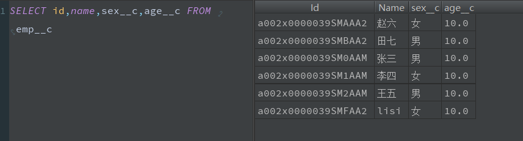

```java
Emp__c emp = new Emp__C(Name='lisi',age__c=20,sex__c='男');
upsert emp;
```

执行后的数据,这是默认使用id比较,由于自动分配,所以表中数据没有与之相同的id,直接进行了添加

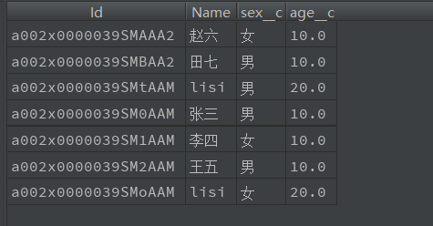

由于upsert的特性,不能同时处理多条匹配的数据

```java
// 修改年龄和性别
Emp__c emp = new Emp__C(Name='lisi',age__c=180,sex__c='男');
// 删除指定ID的对象
Database.delete('a002x0000039SMtAAM');
// 根据指定的字段进行匹配,如果匹配成功修改否则添加
upsert emp Emp__c.Fields.Name;
```

修改后的数据

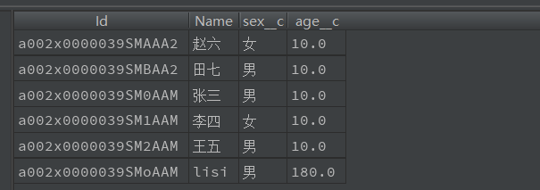

#### undelete

数据删除后在数据库中会有一个保留期也就是不会立即删除,相当于电脑中回收站的操作,可以使用该语句对数据进行恢复操作

```java
// 需要在查询时添加 All rows,代表查询所有行,包括已被标记为删除的行
List<Emp__C> emps = [select Id,Name from emp__C where name = 'lisi' all rows];
// 没有添加all rows不会有效果
//List<Emp__C> emps = [select Id,Name from emp__c where name = 'lisi'];
System.debug(emps);
undelete emps;
```


#### 注意事项

最好不要直接使用DML语句操作对象

### 2.SOQL

主要用于查询数据

SOQL 基本语法和SQL类似,select后面声明的字段需要用逗号隔开,并且不能使用 * 来选取所有字段,必须声明每个要查询的字段

对于不存在于 SELECT 语句的字段，系统不会去查询其值，所以后面的语句无法使用这些字段的值

如果需要在SOQL中引用对象的属性使用  :对象名.属性名

```java
List<Account> accList = [SELECT Id, Name FROM Account];
// 使用 Phone 字段会出错
//         accList[0].Phone = '12345678';
```

#### 子查询

只支持查询ID

```java
Contact con = [SELECT id,Name FROM Contact where name = 'Green Avi'];
System.debug(con);
Account accs = [SELECT Id,Name FROM Account WHERE Name = :con.Name];
System.debug(accs);
String name = 'Green Avi';
//        System.QueryException: semi join sub selects can only query id fields, cannot use: 'Name'
//        Account acc = Database.query('SELECT Id,Name FROM Account WHERE name in (SELECT name FROM Contact where name = \'Green Avi\')');
System.debug('acc');
System.debug(acc);
```


#### map映射

```java
// 会将查询结果直接映射到map中
// Populate map from SOQL query
Map<ID, Account> m = new Map<ID, Account>([SELECT Id, Name FROM Account LIMIT 10]);
// After populating the map, iterate through the map entries
for (ID idKey : m.keyset()) {
    Account a = m.get(idKey);
    System.debug(a);
}
```

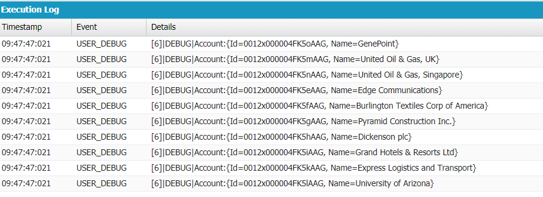

#### 案例

根据时间删除

```java
List<Account> accs = [SELECT id,name,CreatedDate FROM Account];
for (Account account : accs) {
    if (account.CreatedDate.date() == Date.today()) {
        System.debug(account.Name+'  '+account.CreatedDate.date());
        delete account;
    }
}
```


### 3.SOSL

可以返回同时查询多个对象中含有相同字符串的对象

基本语法

```
FIND 要查询的字符串 IN 要查找的字段 RETURNING 查询结果包含的对象和字段名
```

规则:

- 要查询的字符串是无关大小写的
- 要查找的字段是可选参数，默认是所有字段，即 “ALL FIELDS”，也可以在此声明只在某几个字段中查询，可以使用的仅限于：“NAME FIELDS”、“EMAIL FIELDS”、“PHONE FIELDS”、“SIDEBAR FIELDS”
- 查询结果包含的对象和字段名可以包含一个或多个想要查询的对象，并声明哪些字段保存在查询结果中

```java
List<List<SObject>> searchList = [FIND 'sale' IN ALL FIELDS RETURNING Account (Id, Name),Contact];
System.debug(searchList);
```

### 4.DataBase类

可以在数据操作时,拿到操作的状态,其有两个参数,第二个删除表示在进行数据更新操作时其中的数据不符合条件或者出错是否继续执行

其中包含了一组静态函数，它们的作用和 DML 语句类似, 与 DML 语句不同的是，每个函数都有一个可选布尔型参数，可以决定当操作的一组数据中部分数据出现错误时，是否将没有出错的数据继续执行相应的命令。

```
Database.insert(accList, false);
SObject s = Database.query('SELECT Id FROM Account LIMIT 1');
```

如果插入的一组数据 accList 中有不符合条件的数据，那么系统会跳过这些数据，将剩下的数据成功插入数据库，并且不会报错。

该布尔型参数默认为“真”（true）。当有部分数据出错时，所有数据都不会被执行相应的操作，并报错。

#### 事务

```java 
// 设置保存点
Savepoint sq = Database.setSavepoint();

// 根据保存点进行回滚
Database.rollback(sq);
```


```java
System.debug('first print start');
for (Account account  : [SELECT id,Name FROM Account]) {
    System.debug(account);
}
System.debug('first print end');

Savepoint sq = Database.setSavepoint();
Account acc = new Account(Name='zs!!!!!!!!!!');
insert acc;
System.debug('point print start');
for (Account account  : [SELECT id,Name FROM Account]) {
    System.debug(account);
}
System.debug('point print end');
Database.rollback(sq);

System.debug('done print start');
for (Account account  : [SELECT id,Name FROM Account]) {
    System.debug(account);
}
System.debug('done print end');
```


### 注意事项

使用SOQL进行变量引用模糊查询时不需要对%的引号进行转义,如果使用DataBase类的query方法在传入字符串时需要对其中的引号进行转义。

```java
String nameCondition = '%' + String.escapeSingleQuotes(query.replaceAll('%', '\\%')) + '%';
```

```java
List<Account> accs;
// 查询符合条件的特约经销商
// 直接使用SOQL的方式进行模糊查询时不需要对引号进行转义
// 如果使用DataBase类的query方法则传入的字符串中如果有引号需要对其进行转义
// Date.Today() 可以拿到当前日期
accs = [SELECT id,Parentid
        FROM Account
        WHERE  Parent.Name like :nameCondition
        AND Contract_Decide_Start_Date__c <= :Date.Today()
        AND Contract_Decide_End_Date__c >= :Date.Today()];
```

## Trigger触发器

[http://www.ponybai.com/2017/12/07/salesforce%E8%A7%A6%E5%8F%91%E5%99%A8/](http://www.ponybai.com/2017/12/07/salesforce触发器/)

触发器是一种特殊的Apex类,主要作用是在一条记录被插入,修改删除之前或者之后自动执行的一系列操作,每一个Trigger类必须对应一种对象

创建Trigger类

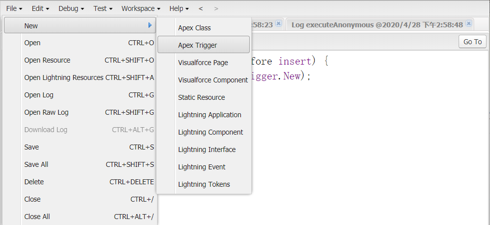

定义Trigger类的名称和对应的对象

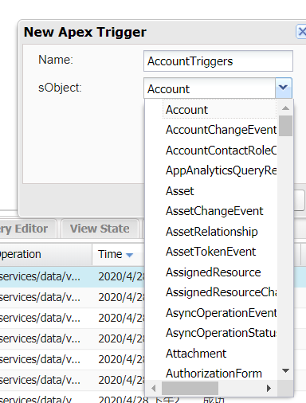

IDEA中创建Trigger类

在trigger包中直接创建即可

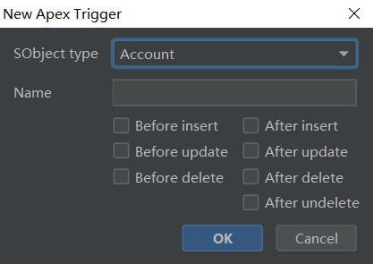


定义Trigger类中的内容

```java
trigger AccountTriggers on Account (before insert) {
    // Trigger.New可以拿到添加的数据,代表即将被插入和更新的数据
    // 如果有多条数据,可以通过迭代获取,或者使用角标访问 比如[0]
    System.debug('添加了一条新数据'+Trigger.New);
}
```

在匿名的Debug窗口执行

```java
Account ac = new Account(Name='new account');
insert ac;
```

打印的日志

```
14:58:48:022 USER_DEBUG [2]|DEBUG|添加了一条新数据(Account:{Id=null, IsDeleted=false, MasterRecordId=null, Name=new account, Type=null, ParentId=null, BillingStreet=null, BillingCity=null, BillingState=null, BillingPostalCode=null, BillingCountry=null, BillingLatitude=null, BillingLongitude=null, BillingGeocodeAccuracy=null, ShippingStreet=null, ShippingCity=null, ShippingState=null, ShippingPostalCode=null, ShippingCountry=null, ShippingLatitude=null, ShippingLongitude=null, ShippingGeocodeAccuracy=null, Phone=null, Fax=null, AccountNumb
```

Trigger 的触发事件分为以下几种：

- before insert：插入数据之前
- before update：更新数据之前
- before delete：删除数据之前
- after insert：插入数据之后
- after update：更新数据之后
- after delete：删除数据之后
- after undelete：恢复数据之后

Trigger.New和Trigger.Old是两个预定义的变量,New即将被插入和更新的数据,Old代表更新和删除之前的数据,如果有多条数据可以使用迭代集合的方式获得,也可以通过[0]角标的方式获取

new:返回sObject的记录的最新的数据的列表;

newMap:返回一个ID映射到最新的数据列表的Map集合;

old:返回sObject的记录修改以前的数据的列表;

oldMap:返回一个ID映射到修改以前的数据列表的Map集合;


除了这两个可以拿到运行时的数据之外,还预定义了许多返回值为布尔类型用来判断数据的状态

```java
if (Trigger.isInsert) {
    if (Trigger.isBefore) {
        // Process before insert
    } else if (Trigger.isAfter) {
        // Process after insert
    }        
}
else if (Trigger.isDelete) {
    // Process after delete
}
```

最常用的有：

- isInsert：是否是 insert 操作
- isUpdate：是否是 update 操作
- isDelete：是否是 delete 操作
- isBefore：是否是操作之前
- isAfter：是否是操作之后

### 阻止保存或者删除

案例:在添加之前使用触发器判断客户名称

客户数据

```java
List<Account> accs = new List<Account>{
	new Account(Name='张三'),
	new Account(Name='李四'),
	new Account(Name='王五')
};
insert accs;
```

```java
trigger AccountTriggers on Account (before insert) {

	for (Account acc : Trigger.new) {
		// 判断新添加的客户名称是否为王五,如果是王五则给出提示信息,会显示在操作的页面的上
		// 需要注意的是,该操作会导致整个事务进行回滚
		if (acc.Name == '王五') {
			acc.addError('不能插入名称为王五的客户');
		}else {
			System.debug('添加成功:'+acc.Name);
		}
//		System.debug('添加成功:'+acc.Name);
	}

}
```


## 异常处理

Apex中和Java中处理异常的方式很像,同样使用try,catch,finally,throw等关键字

```java
try{
    Account ac = Null;
    insert ac;
}catch(NullPointerException e){
    System.debug('空指针异常!');
    System.debug('异常出现在第'+e.getLineNumber()+'行');
}finally{
    System.debug('我无论如何都会执行!!!');
}
```

系统定义的异常类型有：

- DmlException：关于数据库操作的异常
- ListException：关于列表操作的异常
- NullPointerException：关于空指针的异常
- QueryException：关于查询语句的异常
- SObjectException：关于SObject对象的异常

他们共有的方法:

- getCause()：给出异常原因
- getLineNumber()：给出发生异常的行数
- getMessage()：给出异常的详细信息
- getStackTraceString()：给出异常发生的栈信息
- getTypeName()：给出异常的类型，比如 DmlException、NullPointerException 等

## 发送网络请求

方法文档:https://developer.salesforce.com/docs/atlas.en-us.apexcode.meta/apexcode/apex_classes_restful_http_httprequest.htm

### 设置远程站点

使用Apex发送网络请求需要在salesforce中设置远程站点

进入设置 --> 搜索 远程站点 --> 新建

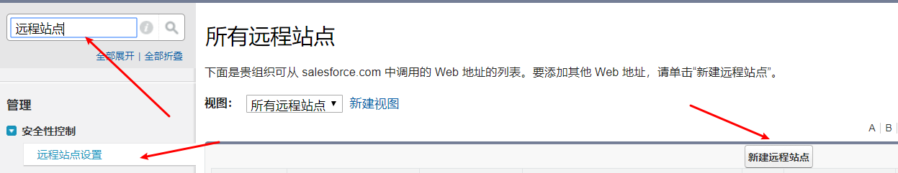

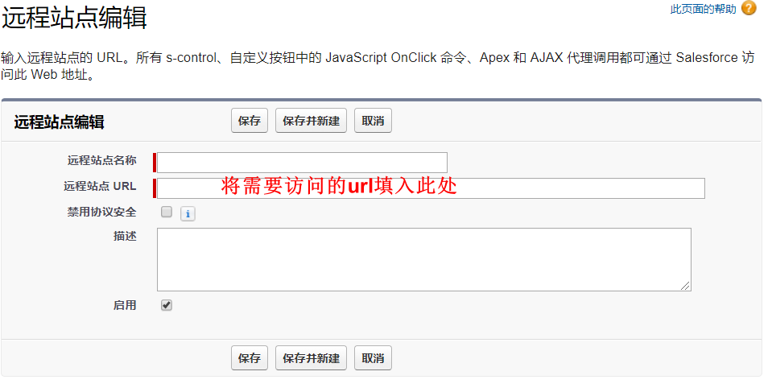

在Developer console中打开open Execute Anonymous Window,测试以下代码

### GET

接口数据

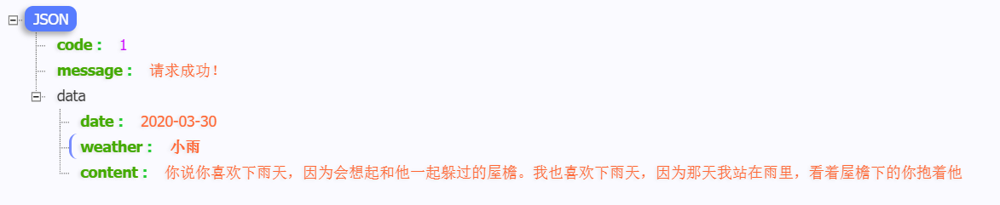

```java
Http http = new Http();
HttpRequest request = new HttpRequest();
// 设置网络服务接口的地址,需要在salesforce中设置远程站点
request.setEndpoint('https://www.somekey.cn/tiangou/random.php');
// 设置REST方法
request.setMethod('GET');

// 发送HTTP请求
HttpResponse response = http.send(request);

// 检查HTTP通信结果状态代码
if (response.getStatusCode() == 200) {
    //            将拿到的数据(JSON)进行转换为键值对
    Map<String, Object> results = (Map<String, Object>) JSON.deserializeUntyped(response.getBody());
    //            根据不同的JSON的数据结构获取,这里是为了获取data中的数据
    Map<String, Object> data = (Map<String, Object>) results.get('data');
    System.debug(results.get('data'));
    System.debug(data.get('content'));
}
```

### POST

数据转JSON:https://developer.salesforce.com/docs/atlas.en-us.apexcode.meta/apexcode/apex_class_System_Json.htm#apex_class_System_Json

```java
Http http = new Http();

HttpRequest request = new HttpRequest();

// 设置网络服务接口的地址
request.setEndpoint('http://47.102.119.200:8080/user-service/user/login');
// 设置REST方法
request.setMethod('POST');
// 设置请求的Header，类型为JSON
request.setHeader('Content-Type', 'application/json;charset=UTF-8');
// 将一个JSON对象传入请求的Body，设置编程语言的名字
request.setBody('{"username":"admin","password":"123"}');

// 发送HTTP请求
HttpResponse response = http.send(request);

// 检查HTTP通信结果状态代码
if (response.getStatusCode() == 200) {
    // 在控制台输出通信结果   
    System.debug(response.getBody());
}
```

## 创建Rest服务

将Apex作为Rest接口提供访问

文档:https://trailhead.salesforce.com/en/content/learn/modules/apex_integration_services/apex_integration_webservices

通过Java访问:https://cloud.tencent.com/developer/article/1014133

```java
// Apex的基本端点是 https://yourInstance.salesforce.com/services/apexrest/URL
// URL映射区分大小写,可以包括通配符
@RestResource(urlMapping='/account')
global with sharing class MyRestResource {
    @HttpGet
    global static List<Account> getRecord() {
        // 添加你的代码
        List<Account> accs = [select ID,Name from account];
        return accs;
    }
}
```

导航至https://workbench.developerforce.com/login.php进行访问

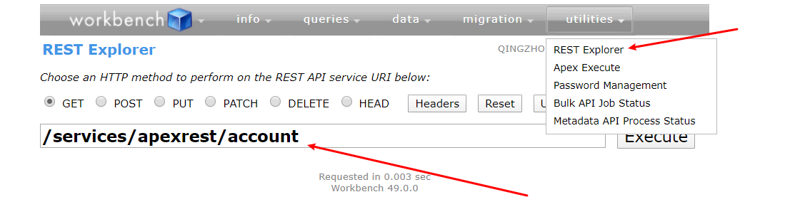


## 数据批处理

参考:https://www.cnblogs.com/zero-zyq/p/5287343.html

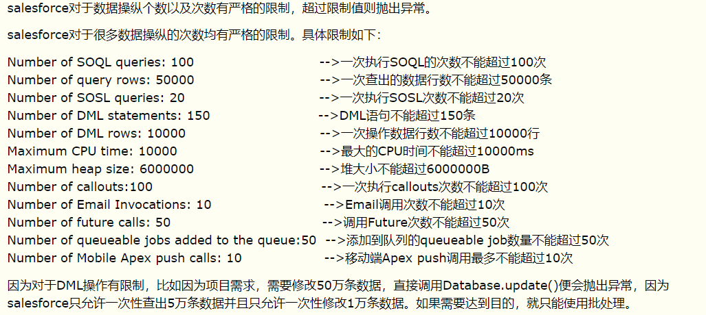

### 处理流程及注意事项

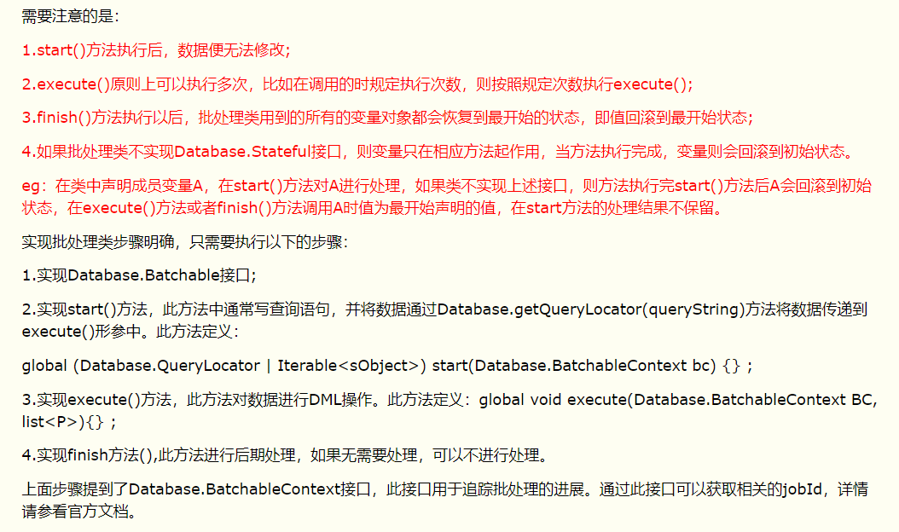

### 代码实现

```java
global with sharing class GoodsBatch implements Database.Batchable<sObject>,Database.Stateful{
    Integer queryCount = 0;
    
    String myEmailAddress = 'xxx@gmail.com';
    
    global Database.QueryLocator start(database.BatchableContext bc )
    {
        String query = 'select goodsDescribe__c,Id from GOODS__c';
        return Database.getQueryLocator(query);
    }
    
    global void execute (Database.BatchableContext bc, List<GOODS__c> goodsList)
    {	
        System.debug(goodsList.size());
        for(GOODS__c goods : goodsList) {
            String price = goods.goodsDescribe__c;
            // 修改数据
            goods.goodsDescribe__c = 'new describe';
            queryCount += 1;
        }
        System.debug('----------------------------------------');
        upsert goodsList;
    }
    
    global void finish(Database.BatchableContext bc)
    {
        /*--------execute finish----------*/
        /*注意：如果不实现Database.Stateful接口，则queryCount为0
              因为在execute执行完成便会回滚到初始状态*/
        System.debug('query count:' + queryCount);
        //send email 可以完成发送邮件
        Messaging.SingleEmailMessage email = new Messaging.SingleEmailMessage();
        email.setToAddresses(new String[]{myEmailAddress});//set mail getter
        email.setSubject('show count'); //set subject
        email.setHtmlBody('query Count' + queryCount);
        Messaging.sendEmail(new Messaging.SingleEmailMessage[] { email });
    }
}

```

执行

```java
// 创建对象
GoodsBatch gb = new GoodsBatch();
// 执行
Database.executeBatch(gb);
```

## SelectOption 

```
SelectOption option =  new SelectOption(value, label, isDisabled);
```

在自定义控制器或控制器扩展中,可以通过该方式实例化SelectOption

其中，value是如果用户选择了该选项，则返回给控制器的String ，label是作为选项选择显示给用户的String，isDisabled是一个布尔值，如果为true，则指定用户不能选择该选项，但仍可以查看。

```
SelectOption option = new SelectOption(value, label);
```

其中，value是如果用户选择了选项，则返回给控制器的字符串，而label是作为选项选择显示给用户的字符串。由于未指定isDisabled的值，因此用户可以查看和选择该选项。

## String类

### format

该方法可以将集合或者数组中的字符串替换至指定字符中

```java
String str = 'select {0},{1}';
List<String> strings = new List<String>();
strings.add('tao');
strings.add('qz');
strings.add('!!!');
//        同样可以用
//        String[] strings = new String[]{'jingzhuo','keji'};
System.debug(String.format(str,strings));
```

### escapeSingleQuotes

可以保留 \ 符号不将其作为转义符,貌似还有放置sql注入功能

```java
static void escapeSingleQuotesTest(){

    String str = 'L\'Oreal'; //<-- get the escaped name

    System.debug(str); // <--debug output: L'Oreal

    String strEsc = String.escapeSingleQuotes(str); //<-- pass through escape method

    System.debug(strEsc); //<-- output: L\'Oreal

    String wQuotes = '\'%'+strEsc+'%\''; //<-- try to create just the like string

    System.debug(wQuotes);  //<--output: '%L\'Oreal%'

    System.debug('Select Id FROM Account WHERE Name like \'%'+strEsc+'%\'');

    //        效果一样
    List<Account> accts = Database.query('Select Id FROM Account WHERE Name like'+wQuotes);
    //        List<Account> accts = Database.query('Select Id FROM Account WHERE Name like \'%'+strEsc+'%\'');
    //        Select Id FROM Account WHERE Name like '%L\'Oreal%'
    //        Select Id FROM Account WHERE Name like '%L\'Oreal%'
    //debug of SOQL statement reads: Select Id FROM Account WHERE Name like '%L\'Oreal%'

}
```


## 数据库操作使用技巧

查询时如果不指定id,会默认查出id

### IN操作

```java
String[] str = new String[]{'0012x000004FK5oAAG'};
//        可以直接在字符串方式中直接引用可以 迭代 的变量
List<Account> accounts = Database.query('select id,name from account where id in :str');
```

