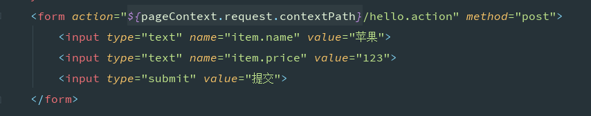
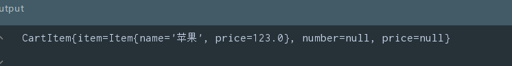
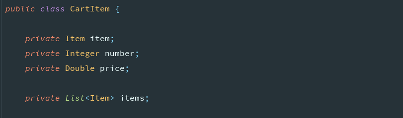

# 1.SpringMVC是什么:

​	Spring web mvc是表现层的框架,它是Spring框架的一部分

​	执行流程:客户端发送请求,springMVC的前端控制器DispatcherServlet接收并分配请求到对应的Controller执行对应的

方法,方法会返回视图,DispatherServlet解析视图,返回客户端进行渲染

# 2.视图解析器:

​	视图:简单理解为浏览器向用户展示的界面

​	为什么使用?

​		浏览器想要展示页面需要有一个请求的地址,拿到路径,但路径通常会在一个文件夹中,而文件夹可能会有多层,所

以SpringMVC中的视图解析器,可以帮我们减少一些重复的代码,把绝对路径可以写成我们的逻辑路径

​	需要在配置类中添加:用户在返回视图时,会经过该解析器,帮我们拼接字符串

​	配置类继承**WebMvcConfigurerAdapter**,**注意spring5后一律推荐使用实现WebMvcConfigurer接口**

```java
@Bean
public InternalResourceViewResolver viewResolver(){
    InternalResourceViewResolver viewResolver = new InternalResourceViewResolver();
    // 这是视图的前缀
    viewResolver.setPrefix("/");
    // 这是视图的后缀
    viewResolver.setSuffix(".jsp");
    return viewResolver;
}

// properties 方式配置
spring.mvc.view.prefix=
spring.mvc.view.suffix=
```

# 3.参数绑定:

## 	3.1.注意事项(重要)

​		其中前台的name必须和属性值名称一致,使用set方法赋值

​		其中方法的参数类型如果是基本数据类型推荐使用包装类型,因为基本数据类型不能为null,如果请求中没有改参数,会抛异常

## 	3.2.@RequestParam

​	作用:当请求参数的名称与方法参数名称不一致时,可以使用该注解标记对应关系

​	该注解中的参数:

​		**name = "对应的在前台的name名称":与方法中的参数名对应**

​		**required:表示是否必须有该参数有两个值,,默认为false**

​		**defaultValue:表示如果前台没有传递该参数时的默认值**

​	引用数据类型的映射(POJO):

​		在方法参数声明一个对象变量,请求时如果name和对象中的属性值一致,会自动注入到该对象中

​		简单说就是在对象中又有其他对象:

​			在前台传递参数时,参数名称为该对象的名称再点属性

​			例子:

两个javaBean				

```
@Data
public class CartItem {

    private Item item;
    private Integer number;
    private Double price;
}

@Data
public class Item {

    private String name;
    private Double price;
}
```

前台要提交的表单



Controller层处理,及控制台输出




## 	3.3.数组绑定

​		(比如类中说有一个成员变量是数组(爱好)):

​		前台表单传递一个相同name的一组数据,可以在方法的参数中写一个数组类型进行赋值,其中数组的名称也要和

前台name的名称相同		

## 	3.4.集合类型:

​		如果在方法参数中直接写集合类型是赋值不了的,需要使用数组或者在Bean中添加一个集合属性进行赋值,如果需

要给指定索引赋值,在name中指定索引即可

​		例子:在上面的基础之上CartItem类中添加了一个集合属性

​			

​	前台数据传递的方式以及后台打印结果

# 4.多路径映射/请求方法限定/窄化路径:

## 	4.1多路径映射:

​	**@RequestMapping**:请求路径映射

​		常用的参数:

​			**value**:"指定访问的路径"可以多个{"路径1","路径2"}

​			**headers** :指定请求头中的参数

 		       **params** :你可以让多个处理方法处理到同一个URL 的请求, 而这些请求的参数是不一样的。也就是请求时的

不同参数,调用的方法也会不同	

```java
    @RequestMapping(value = "/hello.action",params = {"id=10"})
    public String fun(String id){
        System.out.println(id);
        return "index";
    }

    @RequestMapping(value = "/hello.action",params = {"id=20"})
    public String fun2(String id){
        System.out.println(id);
        return "index";
    }
```


## 	**4.2请求方法限定(也是该注解的一个参数)**

​			**method:**指定请求的类型,也可以是数组	

​				method = {RequestMethod.GET,RequestMethod.POST}

## 	**4.3窄化路径:**

​	在类上添加相当于设置请求的前缀	

​	在方法上添加,设置方法对应的请求路径						

# 5. @PathVaraible注解的使用:

​	**@RequestMapping** 注解可以同 **@PathVaraible** 注解一起使用，用来处理动态的 URI

​	将 @**PathVaraible**注解写到方法的参数前,对应方法中的参数,可以将URL中的对应的位置的值赋值到变量中,还可以使用正则表达式

```java
 @RequestMapping(value = "/fetch/{id}.action", method = RequestMethod.GET)
    public String getDynamicUriValue(HttpServletRequest request, @PathVariable("id") String id) {
        System.out.println("ID is " + id);
        return "index";
    }
```

​	如果设置参数不是必须的,需要有对应的路径映射

```java
// required 设置参数为非必须项
@GetMapping({"/path/{id}","/path"})
public void fun(@PathVariable(required = false) Integer id){
    System.out.println(id);
}
```

# 6.Controller方法返回值以及跳转方式:	

​		返回值为**ModelAndView**:创建ModelAndView对象,或者在方法形参中给出,可以在构造方法中直接给(返回的页面,存在域中的名称,存在域中的数据),或者分别使用**addObject**(name,value),**setViewName**(地址),会经过视图解析器

​		返回值为**String**:在方法的形参上添加**Model**,使用**addAttribute**()存储数据,返回值写地址

​		还可以使用 return "redirect:tao.jsp";

​				    return "forward:tao.jsp";		

​		这两种方法存储的域都是request(想要存储到别的域中,可以使用原生)

​		返回值为void使用方式和BaseServlet时一样,并且不会经过SpringMVC中的视图解析器

​		想要重定向或请求转发,在字符串中分别拼接redirect:和forward:,MVC会帮我们解析返回值,并在底层调用不同的方法

# 7.异常处理器:

​	SpringMVC异常处理机制:

​		系统的dao、service、controller出现异常都通过throws Exception向上抛出，最后由springmvc前端控制器交由

异常处理器进行异常处理。springmvc提供全局异常处理器（一个系统只有一个异常处理器）进行统一异常处理。

具体代码实现:

​	创建一个自己的异常类,继承Exception

​	定义统一异常处理器类:实现**HandlerExceptionResolver**接口并交由spring管理,重写方法

​	

```java
@Component
public class CustomExceptionResolver implements HandlerExceptionResolver {
    @Override
    public ModelAndView resolveException(HttpServletRequest httpServletRequest, HttpServletResponse httpServletResponse, Object o, Exception ex) {

        //统一处理异常
        CustomException customException = null;
        // 如果是自定义异常直接类型转换赋值,并显示错误信息
        // 如果不是创建自定义异常,提示未知错误
        if(ex instanceof CustomException){
            customException = (CustomException) ex;
        } else {
            customException = new CustomException("系统错误，请与系统管理 员联系！");
        }

        //设置数据
        ModelAndView modelAndView = new ModelAndView();
        modelAndView.addObject("message", customException.getMessage());
        modelAndView.setViewName("WEB-INF/error");

        return modelAndView;
    }
}
```

# 8.图片上传:

​	在写具体代码时,先了解一下表单的一个属性

​		**enctype**:该属性有三个属性值

​			**application/x-www-form-urlencoded:**默认值,请求方式为get时,会将表单中的数据以键值对的方式加到url后面中间用?分隔,为post时,浏览器把form数据封装到http body中，然后发送到服务器

​			**text/plain：**表单以纯文本形式进行编码

​			**multipart/form-data：**当上传的含有非文本数据时,设置为该属性值,将表单数据变成二进制数据进行上传,这时使用request是获取不到表单响应的值的

​	在了解这点后,看具体上传图片的代码:

​		在配置类中添加文件上传解析器:

​		需要导入**commons-io**和**commons-fileupload**依赖

​			

```java
 @Bean

    public CommonsMultipartResolver multipartResolver[1] (){

        CommonsMultipartResolver multipartResolver = new CommonsMultipartResolver();

        // 设置所有的上传文件的总大小 10M

        multipartResolver.setMaxInMemorySize(10*1024*1024);

        // 设置单个文件上传的大小 4M

        multipartResolver.setMaxUploadSize(4*1024*1024);

        multipartResolver.setDefaultEncoding("utf-8");

        return multipartResolver;

    }
```

注解方式:

```java
spring.servlet.multipart.max-file-size= 文件大小
spring.servlet.multipart.max-request-size= 请求大小
```


Controller中写方法接受表单数据,需要设置一个参数**MultipartFile**表示文件上传对象,其他参数可以正常获取

​	该类常用方法:

```java
			方法名							描述
String getOriginalFilename()		获得原始上传文件名
transferTo(File file)				将上传文件转换到一个指定的文件中
String getContentType()				获取文件MIME类型，如image/pjpeg、text/plain等
String getName()					获取表单中文件组件的名字
```

​	直接写一个数组(没试过)
​	如果是多文件上传,可以写一个VO类,里面添加一个成员变量List<MultipartFile> MultipartFiles

# 9.JSON数据交互:

​	需要导入的依赖:	

```java
<dependency>

  <groupId>com.fasterxml.jackson.core</groupId>

  <artifactId>jackson-databind</artifactId>

  <version>2.9.7</version>

</dependency>
```

​	前端发送json格式的数据,如果对应的Controller方法中的对象或者变量名相同可以直接封装赋值

​	后台想要把数据返回到前台页面显示,需要**在配置类上添加@EnableWebMvc**开启配置

​	有两种方式:

​		1.在类上添加**@Controller**在方法返回值前加**@ResponseBody**

​		2.直接在类上添加**@RestController**,因为该注解包含上面两个注解

# 10.拦截器:

​	自定义拦截器需要实现**HandlerInterceptor接口**重写其方法

1. preHandle方法是controller方法执行前拦截的方法

   可以使用request或者response跳转到指定的页面

   return true放行，执行下一个拦截器，如果没有拦截器，执行controller中的方法。

   return false不放行，不会执行controller中的方法。

   

2. postHandle是controller方法执行后执行的方法，在JSP视图执行前。

   可以使用request或者response跳转到指定的页面

    如果指定了跳转的页面，那么controller方法跳转的页面将不会显示。

   

3. afterCompletion方法是在JSP执行后执行

   request或者response不能再跳转页面了

使用配置类配置拦截器:

​	配置类继承**WebMvcConfigurerAdapter**

​	重写方法:

```java
@Override
public void addInterceptors(InterceptorRegistry registry) {
	// 添加拦截器
    InterceptorRegistration interceptorRegistration1 = registry.addInterceptor(myInterceptor1);
    InterceptorRegistration interceptorRegistration2 = registry.addInterceptor(myInterceptor2);
    interceptorRegistration1.addPathPatterns("/**");
    interceptorRegistration2.addPathPatterns("/**");
}
```

​	多个拦截器执行流程:

​		会先按顺序执行preHandle方法,在Controller方法执行完成并且在jsp视图执行前反顺序执行postHandle方法,然后

在返回视图,在返回视图完成后在反顺序执行afterCompletion方法


# 11.序列化

@JsonInclude注解的使用

有时前台获取数据时,数据中有为null或者""空字符串的字段,为了解决不必要的麻烦,可以在实体类的字段上添加该注解

```java
@JsonInclude(JsonInclude.Include.NON_NULL) // 字段的值为空时跳过序列化
@JsonInclude(JsonInclude.Include.NON_EMPTY)// 包含上面注解,同时字段值为空字符时跳过序列化
```


# 12.@RequestBody

配合post请求使用

该注解主要作用用于解析请求体中的数据

如果不添加该注解,那么获取形参的数据为null

```java
 	// 不添加注解
 	@PostMapping
    public void fun(String student){
        System.out.println(student);
    }

    // 请求体中的数据
    {"sname":"taoqz"}
    // 控制台输出
    console : null
        
        
        
    // 添加注解    
    @PostMapping
    public void fun(@RequestBody String student){
        System.out.println(student);
    }

 	// 请求体中的数据
    {"sname":"taoqz"}
    // 控制台输出 会将数据当做字符串解析赋值
    console : {"sname":"taoqz"}	
 
```

​	传递对象

​	只需将参数设置为需要的对象,mvc会将请求中的数据自动封装到对象中,前提是请求体中的字段与实体类中的属性名称一致

```java
@PostMapping
public void fun(@RequestBody Student student){
    System.out.println(student);
}

// 请求体中数据
{
   "sname":"taoqz",
   "address":"北京"
}
// 控制台输出
Student(sid=null, sname=taoqz, address=北京, teachers=null)

```

​	结合@RequestParam使用

​	@RequestBody注解只能使用一次,如果有特殊需要可以结合@RequestParam使用

```java
    @PostMapping("/test")
    public void add(@RequestBody Student student, @RequestParam("arr") String[] arr){
        System.out.println(student);
        System.out.println(Arrays.toString(arr));
    }
	// 请求路径  mvc会将路径中相同名称的参数封装到数组中
	http://localhost:8080/test/zz?arr=1&arr=2
	// 请求体 自动封装到对象中
	{
 		 "sname": "zs",
	 	 "address": "江苏省南京市"
	}
	// 控制台输出
	student: Student(sid=null, sname=zs, address=江苏省南京市, teachers=null)
	arr : [1, 2]
```


