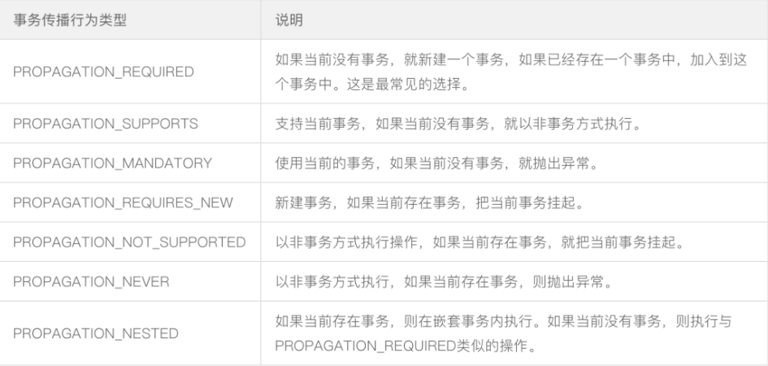

# @Transactional

本人理解:其实单个或多个方法的事务,主要是看他们的数据库连接是否为同一个,也就是把事务方法里的mysql语句集合当作原子操作

## 作用域

类、接口、方法

作用在类上时表示该类下的所有public的方法都会有事务

作用在接口上时不管是注入接口或者接口的实现类,调用实现类的方法都会有回滚的效果(无论是否为重写的接口的方法)

注解添加在public的方法上才会生效

## 事务的传播行为

事务的传播行为用来描述一个事务方法被嵌套入另一个事务方法时事务的行为

### spring中七种事务传播行为



### 常用的传播行为以及使用注意事项

Propagation.REQUIRED : 外围方法没有开启事务时,会开启自己的事务,且开启的事务相互独立
外围方法开启事务时,内部方法会加入到外部方法的事务中,其中只要有一个方法回滚,整个事务均回滚

Propagation.REQUIRES_NEW :  外围方法未开启事务,会在内部开启新的事务,且相互独立,外围方法开启事务,被修饰的内部方法依然开启新的事务,且与内外部事务方法相互独立

Propagation.NESTED : 外围方法未开启事务时,内部方法开启新的事务,且相互之间独立(外围方法没有事务时与REQUIRED作用一致),外围方法开启事务时,内部方法的事务是外部事务的子事务,即外围事务回滚,子事务一定回滚,而内部子事务可以单独回滚而不影响外围事务和其他子事务

### REQUIRED、REQUIRES_NEW和NESTED 的异同

REQUIRED和NESTED修饰的内部方法都属于外围方法事务,只要外围事务方法抛出异常,这两种传播机制的事务方法也会回滚。但是区别在于 REQUIRED事务抛出异常外围事务也会回滚,而NESTED是外围事务的子事务,内部方法抛出异常不会影响外围事务

NESTED和REQUIRES_NEW修饰的方法都可以做到内部事务方法抛出异常不会影响外部事务方法,但是区别在于NESTED是外部事务的子事务,会受到外部事务的影响而回滚,而REQUIRES_NEW不会受到外部事务的影响

## 注解失效场景

应用在非public方法上

同一类中方法调用(this)

异常被try catch,下面这段代码,mybatis()和jpa()方法都没有添加@Transactional(跟事务传播行为没有关系),mybatis()方法内部会抛出异常,但是被捕捉后没有影响整体事务的提交(需要结合)

```java
@Transactional
public void demo() {
    // jpa和mybatis上都没有加@Transactional注解
    jpaService.jpa();
    try {
        // 该方法内部会抛出异常
        // 如果该方法添加@Transactional注解,还会抛出如下异常
        // org.springframework.transaction.UnexpectedRollbackException: Transaction silently rolled back because it has been marked as rollback-only
        // 事务以静默方式回滚，因为它已被标记为“仅回滚”
        // 因为@Transactional注解的propagation的默认值为Propagation.REQUIRED
        // 表示内部方法和外部方法是同一个事务,内部方法报错需要回滚,虽然外部方法捕捉异常,但此时的事务已经被标记为回滚了
        mybatisService.mybatis();
    } catch (Exception e) {
        e.printStackTrace();
    }
}
```

数据库引擎不支持事务:针对mysql来说,默认呢引擎为innodb支持事务,切换为myisam则从底层就不支持事务了

## 使用注意事项

该注解是通过aop来保证事务的,所以只有是通过代理的对象调用的方法,才会管用(this无效)

常用的两个属性

rollbackFor: 表示被该注解修饰的方法在遇到什么类型的异常时回滚,如果是非RuntimeException，是要显示用rollbackFor指定的,不然不会回滚

propagation: 表示该注解修饰的事务方法在遇到另一个事务方法时的传播行为,属性值默认为Propagation.REQUIRED

当事务的传播行为是REQUIRED时,方法内部抛出异常但是在**外围事务中try catch**还是会被感知导致外围和内部事务都会回滚

```java
// springboot还提供了回滚当前事务的接口方法
TransactionAspectSupport.currentTransactionStatus().setRollbackOnly();
```


学习链接

https://mp.weixin.qq.com/s/IglQITCkmx7Lpz60QOW7HA

https://mp.weixin.qq.com/s/XTPlEIDfak_1Ocyn9c5-IA	