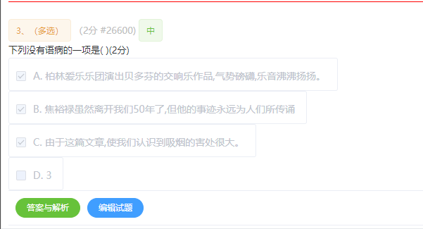

块级元素水平垂直居中

```css
.screen-center {
    width: 500px;
    height: 500px;
    background: white;
    position: absolute;
    left: 0;
    top: 0;
    bottom: 150px;
    right: 0;
    margin: auto;
}
```


 选项按照内容长度显示

```
   <el-radio-group v-if="questionObj.type == '1' " :disabled="true"
                              v-model="questionObj.answer" size="small">
                <div v-for="item in questionObj.itemArr" :key="questionObj.qid + '_' + item.ans" class="taoqz">
                  <el-radio style="padding-top: 5px" :label="item.ans">
                    <span class="pNon" v-html="item.ans + '. '+item.dec"></span>
                  </el-radio>
                </div>
              </el-radio-group>
```

```css
.taoqz {
  height: auto;
  display: table;
  background: #FFF;
  padding: 8px 15px 8px 10px;
  border-radius: 3px;
  border: 1px solid #ebeef5;
}
```

