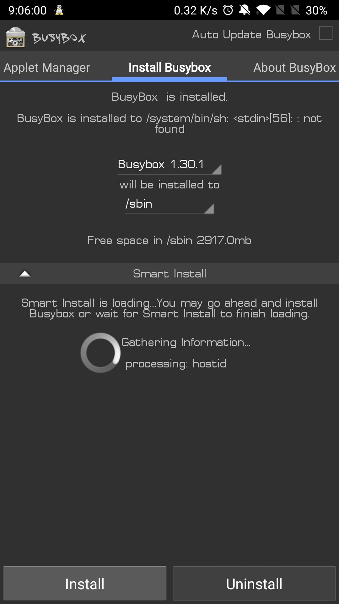
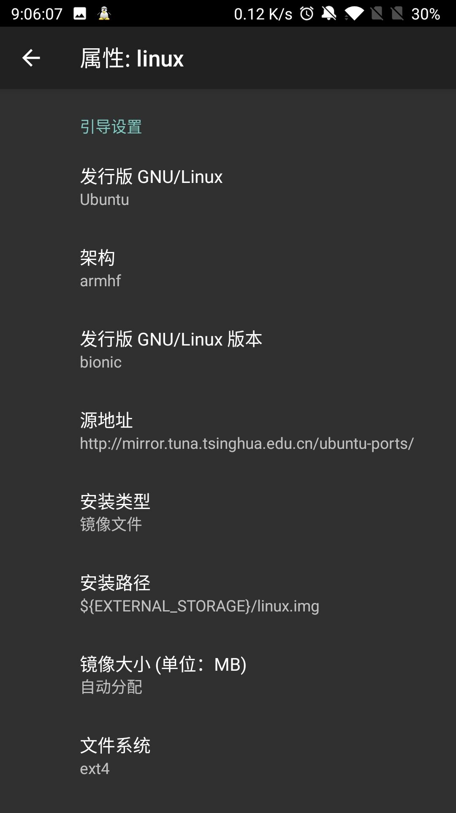
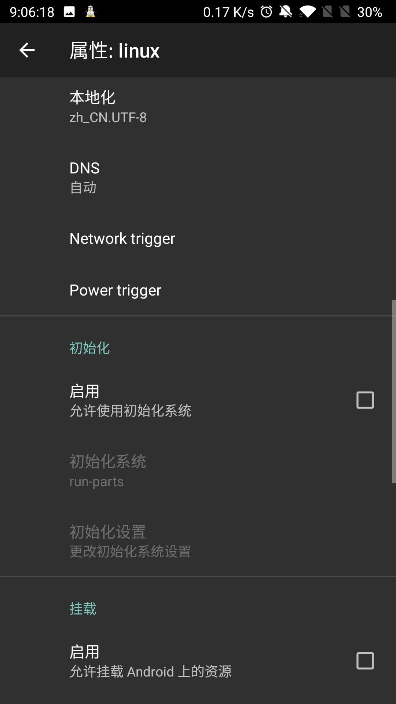
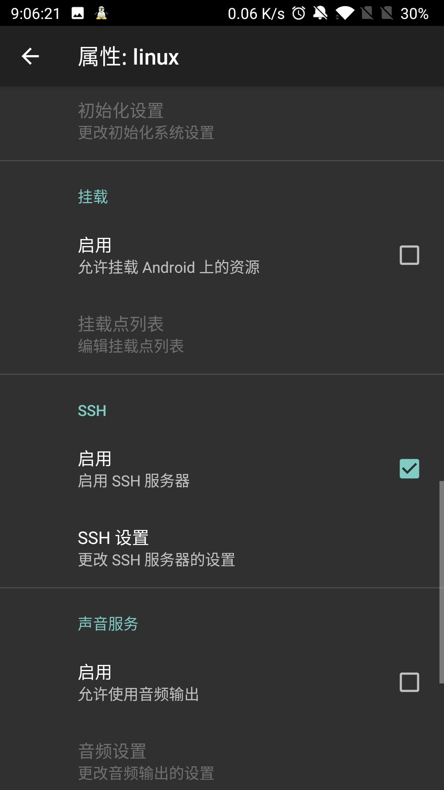
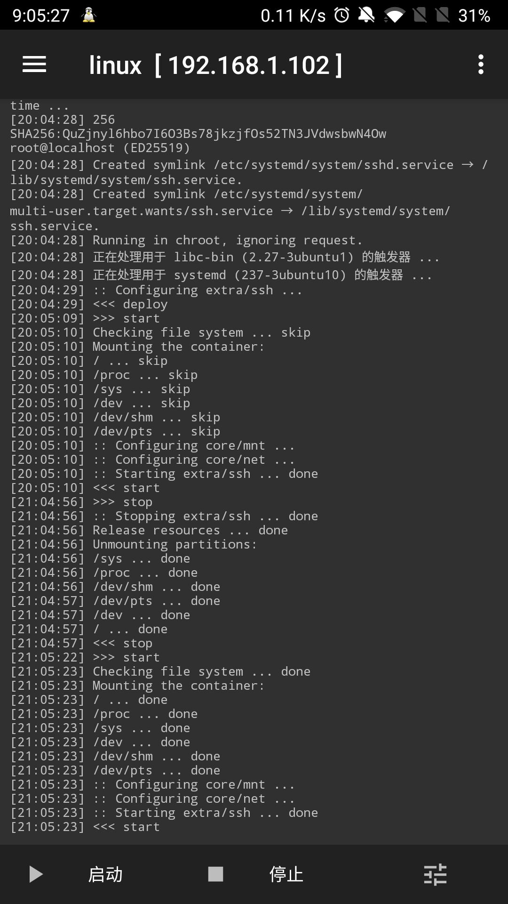
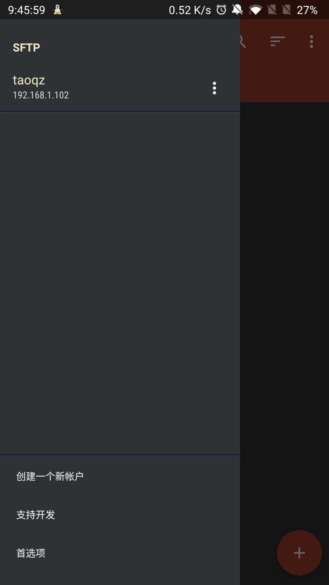
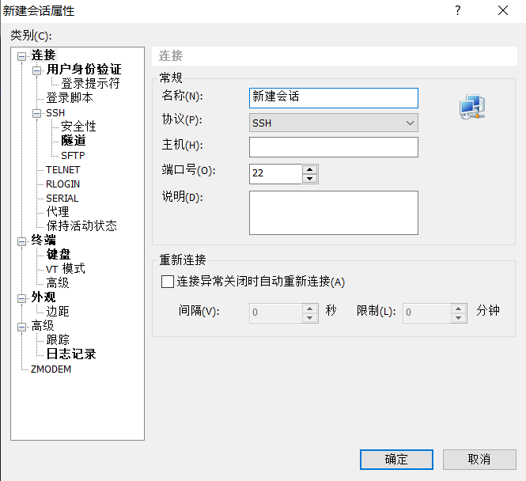
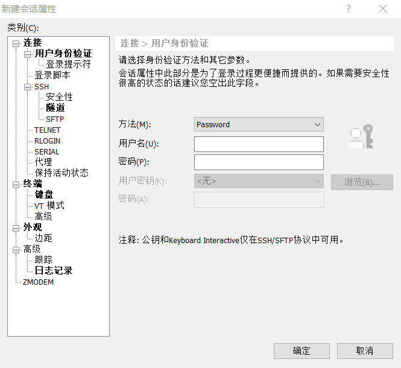
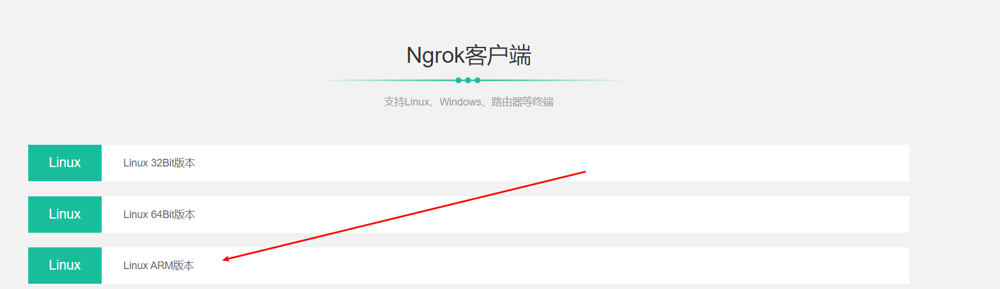

# 教程

Android改造为服务器,完成内网穿透

## 环境

​	手机: OnePlus3T Android 9.0 需ROOT

​	所需软件: BusyBox Free、Linux Deploy、Turbo客户端(可管理服务器上的文件)

​	内网穿透: https://www.ngrok.cc/

​	ssh连接工具: xshell或final shell

## 配置

### BusyBox Free

点击install安装,安装完成后看到sucessful字样即可



### Linux Deploy

其中的架构根据自己手机cpu架构而定

Ubuntu源使用清华的:http://mirror.tuna.tsinghua.edu.cn/ubuntu-ports/

本地化选择zh_CN.UTF-8

启用SSH







配置好点击右上角按钮选择安装,看到 <<< deploy字样代表安装成功

左下角便是启用按钮,最上方的ip是路由器分配给Android设备的IP,为了避免每次变化可以在路由器设置中进行绑定(IP与MAC绑定)



### Turbo

左下角选择创建一个新用户,选择SFTP,输入IP和账号密码即可,可以修改linux中的html查看效果,可配合MT管理器使用




### xshell

名称随便输入即可,主机直接写在Linux Deploy中显示的IP即可,用户名和密码同样写在Linux Deploy中配置的即可





### ngrok

注册登录完成后,开通隧道,ngrok提供了一种免费的内网穿透方案(购买使用体验更加)

可以使用官方提供的使用文档:http://www.ngrok.cc/_book/


下载对应的客户端:https://www.ngrok.cc/download.html

手机端的话选择Linux ARM版本即可



下载完成后将解压后的文件上传至服务器中即可

根据官方文档的命令启动即可

```shell
# 直接启动
./sunny clientid yourClientID
# 后台启动
setsid ./sunny clientid yourClientID &
```

### nginx

配置nginx.conf

```shell
user www-data;
worker_processes auto;
pid /run/nginx.pid;
include /etc/nginx/modules-enabled/*.conf;

events {
	worker_connections 768;
	# multi_accept on;
}

http {

    server {
        listen       80;       # 配置监听的端口
        server_name  localhost;    # 配置的域名

        location / {
            root   /usr/share/nginx/html;  # 网站根目录
            index  index.html index.htm;   # 默认首页文件
        }
    }

	##
	# Basic Settings
	##

	sendfile on;
	tcp_nopush on;
	tcp_nodelay on;
	keepalive_timeout 65;
	types_hash_max_size 2048;
	# server_tokens off;

	# server_names_hash_bucket_size 64;
	# server_name_in_redirect off;

	include /etc/nginx/mime.types;
	default_type application/octet-stream;

	##
	# SSL Settings
	##

	ssl_protocols TLSv1 TLSv1.1 TLSv1.2; # Dropping SSLv3, ref: POODLE
	ssl_prefer_server_ciphers on;

	##
	# Logging Settings
	##

	access_log /var/log/nginx/access.log;
	error_log /var/log/nginx/error.log;

	##
	# Gzip Settings
	##

	gzip on;

	# gzip_vary on;
	# gzip_proxied any;
	# gzip_comp_level 6;
	# gzip_buffers 16 8k;
	# gzip_http_version 1.1;
	# gzip_types text/plain text/css application/json application/javascript text/xml application/xml application/xml+rss text/javascript;

	##
	# Virtual Host Configs
	##
	
	# 需要将以下两行注释,conf.d文件夹下的*.conf文件默认会被该主配置文件加载
	# 在centos7中使用正常,在此处使用时出现修改文件,访问时一直是欢迎页面
	#include /etc/nginx/conf.d/*.conf;
	#include /etc/nginx/sites-enabled/*;
}


#mail {
#	# See sample authentication script at:
#	# http://wiki.nginx.org/ImapAuthenticateWithApachePhpScript
# 
#	# auth_http localhost/auth.php;
#	# pop3_capabilities "TOP" "USER";
#	# imap_capabilities "IMAP4rev1" "UIDPLUS";
# 
#	server {
#		listen     localhost:110;
#		protocol   pop3;
#		proxy      on;
#	}
# 
#	server {
#		listen     localhost:143;
#		protocol   imap;
#		proxy      on;
#	}
#}

```

#### nginx相关命令

```shell
# 查看nginx状态(启动端口)
ps -ef|grep nginx
# 停掉指定的端口
kill -TERM 2132
# 检查配置文件是否正确
nginx -t
# 启动
nginx -c /etc/nginx/nginx.conf
# 重启
nginx -s reload
# 停止
nginx -s stop
```

## 参考链接

https://blog.csdn.net/qq_20084101/article/details/80913951

https://cloud.tencent.com/developer/article/1159800

