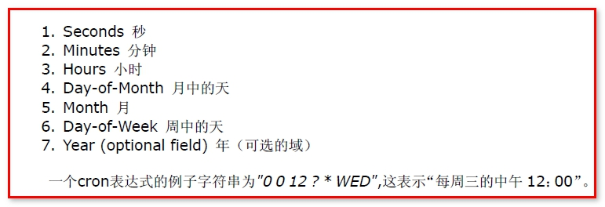
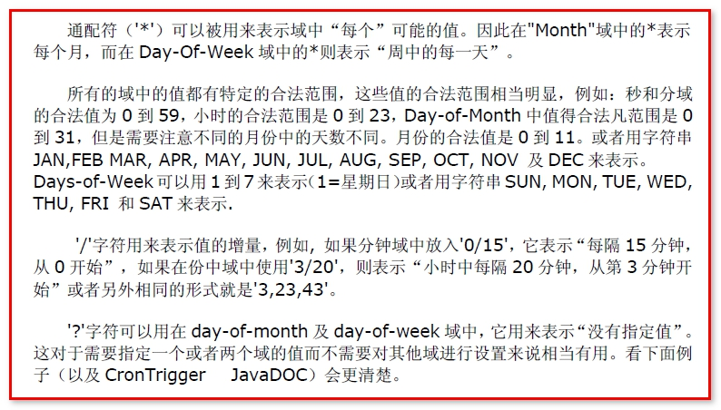

# SpringTask

springboot集成了springtask,不用导依赖可以直接开启定时任务

需要在启动类上添加注解开启定时任务

```java
@EnableScheduling
```

示例

```java
// 项目启动后可以被spring扫描到
@Component
public class QuickStart {

    private int count = 0;
    // 每一秒钟执行一次
//    @Scheduled(cron = "*/1 * * * * ?")
//    上一次开始执行时间点之后2秒再执行,与上面corn参数形式一致
//    @Scheduled(fixedRate = 2000)

//    上一次执行完毕时间点之后2秒再执行
//    @Scheduled(fixedDelay = 2000)

//    第一次延迟6秒后执行,以后每1秒执行一次
    @Scheduled(initialDelay=6000, fixedRate=1000)
    private void process() {
        System.out.println("定时任务1：" + (count++)+"当前时间:"+ LocalDateTime.now());
    }
}
```

**CronTrigger 的使用** 

也就是cron参数值应该怎么写

这个定时任务表达式代表：



一些符号的用法：



调度工作, CronTriggerBean调度器介绍

     一个cron表达式有至少6个（也可能是7个）由空格分隔的时间元素。从左至右，这些元素的定义如下
    
    参数1：秒  0 - 59
    
    参数2：分钟  0-59
    
    参数3：小时  0-23
    
    参数4：月份中的日期  0-30
    
    参数5：月份 0-11或JAN-DEC
    
    参数6：星期中的日期 1-7或SUN-SAT
    
    参数7：年份1970-2099
    
     每一个元素都可以显式地规定一个值(如6),一个区间(如9-12)，一个列表(如9，11，13)或一个通配符（如*）。“月份中的日期”和“星期中的 日期”这两个元素是互斥的，因此应该通过设置一个问号(?)来表明你不想设置的那个字段

【案例】

       0 0 10,14,16 * * ? 每天上午10点，下午2点，4点
    
       0 0/30 9-17 * * ?   朝九晚五工作时间内每半小时，从0分开始每隔30分钟发送一次
    
       0 0 12 ? * WED 表示每个星期三中午12点 
    
      "0 0 12 * * ?" 每天中午12点触发 
    
      "0 15 10 ? * *" 每天上午10:15触发 
    
      "0 15 10 * * ?" 每天上午10:15触发 
    
      "0 15 10 * * ? *" 每天上午10:15触发 
    
      "0 15 10 * * ? 2005" 2005年的每天上午10:15触发 
    
     "0 * 14 * * ?" 在每天下午2点到下午2:59期间的每1分钟触发 
    
     "0 0/55 14 * * ?" 在每天下午2点到下午2:55期间的每5分钟触发 
    
     "0 0/55 14,18 * * ?" 在每天下午2点到2:55期间和下午6点到6:55期间的每5分钟触发 
    
     "0 0-5 14 * * ?" 在每天下午2点到下午2:05期间的每1分钟触发 
    
     "0 10,44 14 ? 3 WED" 每年三月的星期三的下午2:10和2:44触发 
    
     "0 15 10 ? * MON-FRI" 周一至周五的上午10:15触发 
    
     "0 15 10 15 * ?" 每月15日上午10:15触发 
    
     "0 15 10 L * ?" 每月最后一日的上午10:15触发 
    
     "0 15 10 ? * 6L" 每月的最后一个星期五上午10:15触发 
    
     "0 15 10 ? * 6L 2002-2005" 2002年至2005年的每月的最后一个星期五上午10:15触发 
    
     "0 15 10 ? * 6#3" 每月的第三个星期五上午10:15触发 
