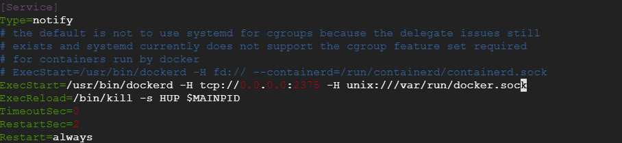

# IDEA配置docker

## 1.配置Docker的远程访问

```shell
vim /lib/systemd/system/docker.service
```

## 2.替换内容

```shell
# ExecStart=/usr/bin/dockerd -H fd:// --containerd=/run/containerd/containerd.sock
# 将改行替换为如下
ExecStart=/usr/bin/dockerd -H tcp://0.0.0.0:2375 -H unix:///var/run/docker.sock
```



## 3.重启Docker服务

```shell
systemctl daemon-reload
systemctl restart docker
```

## 4.查看2357端口监听情况

```shell
netstat -nlpt
```

## 5.测试

浏览器访问

```shell
# 在服务器上访问
curl http://127.0.0.1:2375/version
# 或者使用本地浏览器窗口访问访问
```

## 6.IDEA配置Docker

双击shift键,搜索plugins搜索Docker插件并安装

在Settings ---> Docker ---> Registry ---> Address中配置阿里云中国区加速镜像

在Settings ---> Docker ---> TCP socket ---> Engine API URL 配置docker地址

```shell
tcp://服务器IP:2375
```

显示Connection successful后表示连接成功!!!

## 7.参考链接

[http://xuewei.world:8000/2020/02/13/idea%e9%9b%86%e6%88%90docker%e7%9a%84%e5%bf%ab%e6%8d%b7%e9%83%a8%e7%bd%b2/](http://xuewei.world:8000/2020/02/13/idea集成docker的快捷部署/)