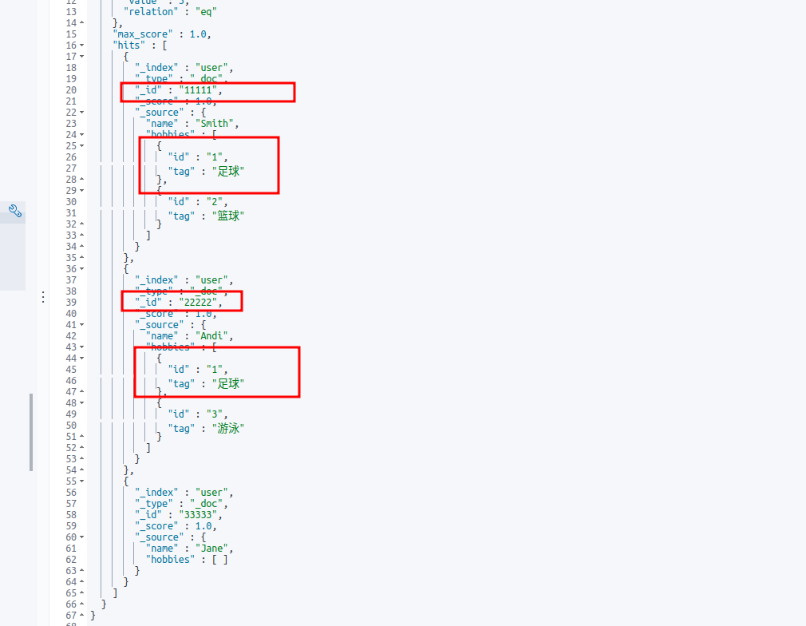

# ElasticSearch Nested类型对文档的影响


## 对聚合操作的影响

存在的问题：如果索引中存在对象数组的属性，在聚合时会出现数据不准确的错误，跟他的存储结构也有关系

### 不使用nested

#### mapping

```json
{
  "user" : {
    "mappings" : {
      "properties" : {
        "hobbies" : {
          "properties" : {
            "id" : {
              "type" : "text",
              "fields" : {
                "keyword" : {
                  "type" : "keyword",
                  "ignore_above" : 256
                }
              }
            },
            "tag" : {
              "type" : "text",
              "fields" : {
                "keyword" : {
                  "type" : "keyword",
                  "ignore_above" : 256
                }
              }
            }
          }
        },
        "name" : {
          "type" : "text",
          "fields" : {
            "keyword" : {
              "type" : "keyword",
              "ignore_above" : 256
            }
          }
        }
      }
    }
  }
}
```

#### 插入数据进行测试

```json
POST user/_doc/11111
{
  "name":"Smith", 
  "hobbies": [
    {
      "id": "1",
      "tag": "足球"
    },
    {
      "id": "2",
      "tag": "篮球"
    }
  ]
}

POST user/_doc/22222
{
  "name":"Andi", 
  "hobbies": [
    {
      "id": "1",
      "tag": "足球"
    },
    {
      "id": "3",
      "tag": "游泳"
    }
  ]
}

POST user/_doc/33333
{
  "name":"Jane", 
  "hobbies": []
}


POST user/_search
{
  "query": {
    "match_all": {
      
    }
  }
}
```

#### 聚合

这段聚合的意思是根据 hobbies.id + hobbies.tag 两个字段加起来进行分组算出count

```json
POST user/_search
{
    "query":{
        "match_all":{

        }
    },
    "aggs":{
        "hobbies_agg":{
            "terms":{
                "field":"hobbies.id.keyword",
                "size":10
            },
            "aggs":{
                "tag_aggs":{
                    "terms":{
                        "field":"hobbies.tag.keyword",
                        "size":10
                    }
                }
            }
        }
    }
}

```

#### 聚合结果

可以看到 key为 “1” 的 对应的buckets 出现了篮球以及游泳，我们的原意是只想查询id为1的tag出现了几次，id为1的tag为足球，出现了两次，所以正确数据应该是2

```json
{
  "aggregations" : {
    "hobbies_agg" : {
      "doc_count_error_upper_bound" : 0,
      "sum_other_doc_count" : 0,
      "buckets" : [
        {
          "key" : "1",
          "doc_count" : 2,
          "tag_aggs" : {
            "doc_count_error_upper_bound" : 0,
            "sum_other_doc_count" : 0,
            "buckets" : [
              {
                "key" : "足球",
                "doc_count" : 2
              },
              {
                "key" : "游泳",
                "doc_count" : 1
              },
              {
                "key" : "篮球",
                "doc_count" : 1
              }
            ]
          }
        },
        {
          "key" : "2",
          "doc_count" : 1,
          "tag_aggs" : {
            "doc_count_error_upper_bound" : 0,
            "sum_other_doc_count" : 0,
            "buckets" : [
              {
                "key" : "篮球",
                "doc_count" : 1
              },
              {
                "key" : "足球",
                "doc_count" : 1
              }
            ]
          }
        },
        {
          "key" : "3",
          "doc_count" : 1,
          "tag_aggs" : {
            "doc_count_error_upper_bound" : 0,
            "sum_other_doc_count" : 0,
            "buckets" : [
              {
                "key" : "游泳",
                "doc_count" : 1
              },
              {
                "key" : "足球",
                "doc_count" : 1
              }
            ]
          }
        }
      ]
    }
  }
}

```

#### 为什么会这样？

我们先不看es的原理可以根据索引中的数据进行分析推测一下，为什么会这样

id为1,tag为足球的数据存在两条数据中，分别是id为 11111 和 id为 22222




### 使用nested

#### mapping

```json
{
  "user_nested" : {
    "mappings" : {
      "properties" : {
        "hobbies" : {
          "type" : "nested",
          "properties" : {
            "id" : {
              "type" : "text",
              "fields" : {
                "keyword" : {
                  "type" : "keyword",
                  "ignore_above" : 256
                }
              }
            },
            "tag" : {
              "type" : "text",
              "fields" : {
                "keyword" : {
                  "type" : "keyword",
                  "ignore_above" : 256
                }
              }
            }
          }
        },
        "name" : {
          "type" : "text",
          "fields" : {
            "keyword" : {
              "type" : "keyword",
              "ignore_above" : 256
            }
          }
        }
      }
    }
  }
}
```


#### 插入数据进行测试

```json
POST user_nested/_doc/123456
{
  "name":"Smith", 
  "hobbies": [
    {
      "id": "1",
      "tag": "足球"
    },
    {
      "id": "2",
      "tag": "篮球"
    }
  ]
}

POST user_nested/_doc/789123
{
  "name":"Andi", 
  "hobbies": [
    {
      "id": "1",
      "tag": "足球"
    },
    {
      "id": "3",
      "tag": "游泳"
    }
  ]
}

POST user_nested/_doc/456789
{
  "name":"Jane", 
  "hobbies": []
}


POST user_nested/_search
{
  "query": {
    "match_all": {
      
    }
  }
}
```


#### 聚合

```json
POST user_nested/_search
{
    "query":{
        "match_all":{

        }
    },
    "aggs": {
      "nested_agg": {
        "nested": {
          "path": "hobbies"
        },
        "aggs": {
          "id_agg": {
            "terms": {
              "field": "hobbies.id.keyword",
              "size": 10
            },
            "aggs": {
              "tag_agg": {
                "terms": {
                  "field": "hobbies.tag.keyword",
                  "size": 10
                }
              }
            }
          }
        }
      }
    }
}
```


#### 聚合结果

可以看到这次的结果和我们预期的结果是一致的

```json
{
  "aggregations" : {
    "nested_agg" : {
      "doc_count" : 4,
      "id_agg" : {
        "doc_count_error_upper_bound" : 0,
        "sum_other_doc_count" : 0,
        "buckets" : [
          {
            "key" : "1",
            "doc_count" : 2,
            "tag_agg" : {
              "doc_count_error_upper_bound" : 0,
              "sum_other_doc_count" : 0,
              "buckets" : [
                {
                  "key" : "足球",
                  "doc_count" : 2
                }
              ]
            }
          },
          {
            "key" : "2",
            "doc_count" : 1,
            "tag_agg" : {
              "doc_count_error_upper_bound" : 0,
              "sum_other_doc_count" : 0,
              "buckets" : [
                {
                  "key" : "篮球",
                  "doc_count" : 1
                }
              ]
            }
          },
          {
            "key" : "3",
            "doc_count" : 1,
            "tag_agg" : {
              "doc_count_error_upper_bound" : 0,
              "sum_other_doc_count" : 0,
              "buckets" : [
                {
                  "key" : "游泳",
                  "doc_count" : 1
                }
              ]
            }
          }
        ]
      }
    }
  }
}

```

### 总结

索引中存在对象数组的属性，并且需要聚合时，要考虑数据正确性的问题时，需使用nested类型，但这种类型非常消耗性能，也需谨慎使用，尽量在定义结构时更加的合理化。

另外嵌套文档：nested类型的属性其实在lucene内部是独立的文档，只不过在ES这一层隐藏了这些细节。

查看文档个数

GET /_cat/count/user?v					结果：3

GET /_cat/count/user_nested?v       结果：3


GET _cat/indices/user?v                   结果：3

GET _cat/indices/user_nested?v       结果：7