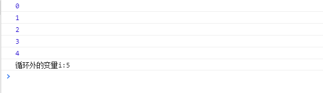
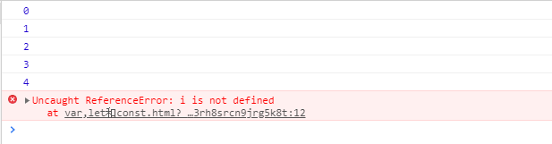
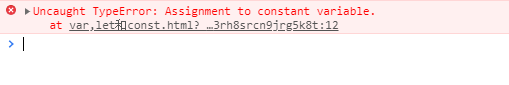
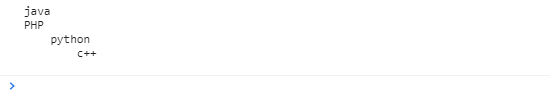
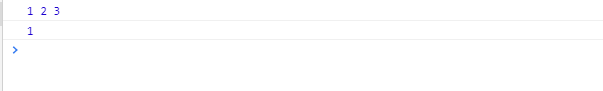
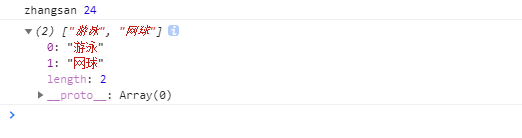
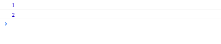

# ES6

ECMAScript 和 JavaScript 的关系是，前者是后者的规格，后者是前者的一种实现（另外的 ECMAScript 方言还有 JScript 和 ActionScript）。日常场合，这两个词是可以互换的。

## var,let和const

### var

```javascript
    for (var i = 0; i < 5; i++) {
        console.log(i);
    }
    console.log('循环外的变量i:'+i);
```

控制台打印结果



可以看到在循环外依然可以获得使用var定义的变量i的值并且进行了一次自增,可以得出var定义的变量是全局变量

### let

将var改为let

```javascript
for (let i = 0; i < 5; i++) {
    console.log(i);
}
console.log('循环外的变量i:'+i);
```

控制台打印结果



此时的打印结果 i未定义 说明在循环外是拿不到使用let定义的变量的值的
let定义的变量是局部变量

### const

```javascript
    const num = 1;
    console.log(num);

    num = 2;
    console.log(num);	
```

在idea中这样写是会报编译错误的,同时可以看到控制台也会报同样的错误
不能重新复制给常量,同时该常量在声明时必须进行初始化




## 字符串模板

`` 符号中的字符串可以任意换行

```javascript
    let str = `java
PHP
    python
        c++
    `;

    console.log(str);
```




## 解构表达式

在ES6可以使用一中格式从数组或者对象中提取值,然后对变量赋值

### 数组

```javascript
    let arr = [1,2,3];
    
    // 之前是通过数组的索引拿值,现在可以有直接将数组中的值赋值到对应的变量上
    let[a,b,c] = arr;
    console.log(a,b,c)
    
    // 也可以进行单个变量的结构并赋值
    const[d] = arr;
    console.log(d);

```




### 对象

```javascript
    let person = {
        name : 'zhangsan',
        age : 24,
        hobbies : ['游泳','网球']
    };

    // 结构对象,跟数组不同的是将中括号改为了大括号
    // 如果需要该名称按照name的写法便可改变,前面的name是对象中的属性	    	// 后面是新的变量名 
    const{name:newName,age,hobbies} = person;
	// 使用新的变量名获取值
    console.log(newName,age);
    console.log(hobbies);
```




## 函数

### 函数参数默认值

```javascript
    function fun(a = 1) {
        console.log(a)
    }

    fun();
    fun(2)	
```




### 箭头函数

```javascript
// 一个参数时
    let print = function (obj) {
        console.log(obj);
    };
    // 可以省略小括号
    let print2 = obj => console.log(obj);

    // 两个参数时
    let sum = function (a , b) {
        return a + b;
    };
    // 简写为 当有返回值并且只有返回值一行代码,可以省略大括号以及return 反之必须加大括号
    let sum2 = (a,b) => a+b;
    console.log(sum2(1,2))

    // 没有参数,使用小括号进行占位
    let noParam = () => console.log('es6')

    // 多行代码,用大括号括起来
    let fun = () =>{
        console.log('PHP');
        console.log('python');
    };

    fun();
```

### 对象中的函数进行简写

```javascript
let person = {
    name: "jack",
    // 以前：
    eat: function (food) {
   	  console.log(this.name + "在吃" + food);
    },
    // 箭头函数版：
    // 这里拿不到this
    eat2: food => console.log(person.name + "在吃" + food),
    // 简写版：
    eat3(food){
   	  console.log(this.name + "在吃" + food);
    }
}

```


### 箭头函数结合解构表达式

```javascript
 let person = {
      name:'zhangsan'
  }

  function printName(person) {
      console.log(person.name)
  }

  printName(person)

  // 进行结合
    var printName2 = ({name}) => console.log('使用箭头函数打印的:'+name)
    printName2(person)
```

## map和reduce

### map

map(): 接收一个函数,将原数组中的所有元素经过该函数处理后放入新数组返回

```javascript
    // 将数组中的所有字符转为数字
    let arr = ['1','2','3']

    let newArr = arr.map(ele => parseInt(ele))
    console.log(newArr)
```

### reduce

reduce(): 接收一个函数(必须)和一个初始值(可选),该函数接收两个参数

​				第一个参数是上一次reduce处理的结果

​				第二个参数是数组中要处理的下一个参数

reduce会将数组的元素从左向右依次经过该函数处理后进行返回,函数的第一个参数是上一次经过函数处理的返回值,如果没有初始值,会从前两个参数开始,如果有初始值,从初始值开始

```javascript
    let arr = [1,2,-3,4]
	// 会将数组从左向右进行相加
    console.log(arr.reduce((a,b) => a+b))
	// 效果同上一样,只不过第一次是a是该函数的初始值
    console.log(arr.reduce((a,b) => a+b,10))
```


## 扩展运算符

扩展运算符是三个点(...),将数组转为用逗号分隔的参数数列

```javascript
 console.log(...[1,2,4])
    var array = [6,7,8]
    console.log(5,...array)

    // 传参
    function add(a,b) {
        return a+b;
    }
    var arr = [1,2,3]
    var result = add(...arr)
    console.log(result)

    // 与结构表达式结合
    const [start,...others] = [1,2,3,4]
    console.log(start,others)

    // 将字符串转成字符数组
    const str = 'java'
    console.log(...str)
```


## set和map

### set

本质与数组类似,但set中不能存储相同的元素,与java中set集合类似

```javascript
// Set构造函数可以接收一个数组或空
let set = new Set();
set.add(1);// [1]
// 接收数组
let set2 = new Set([2,3,4,5,5]);
```

常用方法

```javascript
set.add(1);// 添加
set.clear();// 清空
set.delete(2);// 删除指定元素,并不是索引
set.has(2); // 判断是否存在
set.forEach(function(){})//遍历元素
set.size; // 元素个数。是属性，不是方法。
```

### map

map中的键和值可以是任何类型,如果添加时有相同的key则会将对应的value替换成新值

```javascript
    // map接收一个数组，数组中的元素是键值对数组
    const map = new Map([
        ['key1','value1'],
        ['key2','value2'],
    ])

    console.log(map)

    // 或者接收一个set
    const set = new Set([
        ['key1','value1'],
        ['key2','value2'],
    ])
    const map2 = new Map(set)

    // 或者其它map
    const map3 = new Map(map);

    console.log(map2)
    console.log(map3)

```

常用方法

```javascript
map.set(key, value);// 添加
map.clear();// 清空
map.delete(key);// 删除指定元素
map.has(key); // 判断是否存在
map.forEach(function(key,value){})//遍历元素
map.size; // 元素个数。是属性，不是方法
map.values() //获取value的迭代器
map.keys() //获取key的迭代器
map.entries() //获取entry的迭代器
用法：
for (let key of map.keys()) {
console.log(key);
}
或：
console.log(...map.values()); //通过扩展运算符进行展开
```


## class(类的基本用法)

### 创建class

自定义类并创建对象调用类属性和方法

```javascript
 class Person{
        // 构造方法
        constructor(name,age = 20){
            this.name = name;
            this.age = age;
        }

        // 普通方法,需要创建对象调用
        printAge(){
            console.log(this.age)
        }

        // 静态方法,可以使用类名直接调用
        static printPerson(obj){
            console.log('我是静态方法'+obj)
        }

    }

    Person.printPerson(123)
    let person = new Person('zhangsan');
    person.printAge()
```

### 类的继承

结合上个类使用

```javascript
 class Programmer extends Person{
        constructor(){
            super('java程序员',30)
            this.address = '河北'
        }
    }

    let programmer = new Programmer();
    console.log(programmer.address)
    programmer.printAge()
    Programmer.printPerson('子类调用父类继承的静态方法')
```


## 修饰器(Decorator)

是一个函数,用来修改类的行为,需要配合转码器进行使用

```javascript
<script>
    //通过@符号进行引用该方法，类似java中的注解
    @T
    class User {
        constructor(name, age = 20){
      	  this.name = name;
      	  this.age = age;
        }
    }
    //定义一个普通的方法
    function T(target) { 
  	   console.log(target); //target对象为修饰的目标对象，这里是User对象
 	   target.country = "中国"; //为User类添加一个静态属性country
    }
    console.log(User.country); //打印出country属性值
</script>
```


