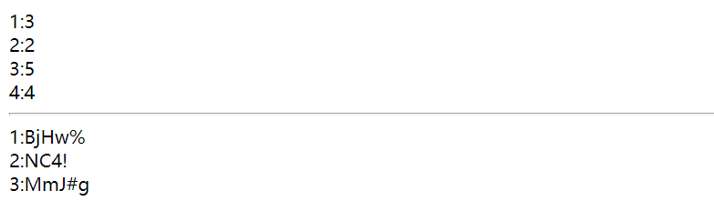
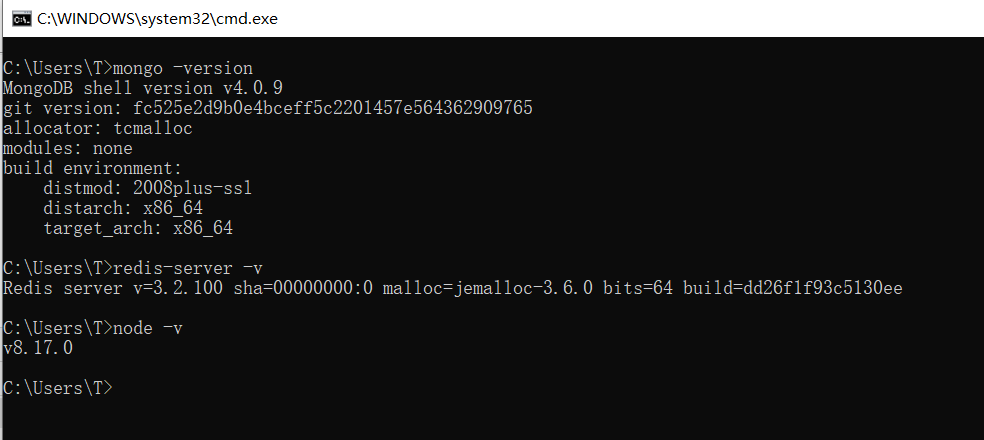
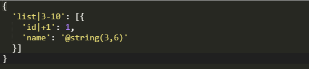
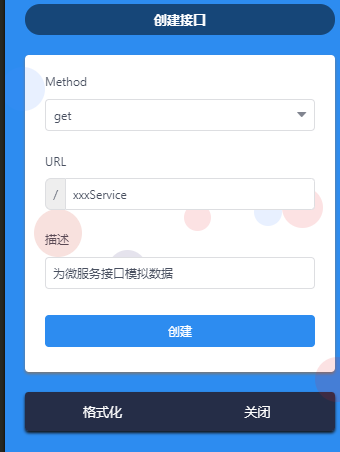
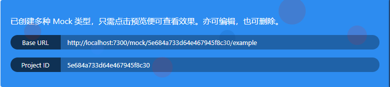
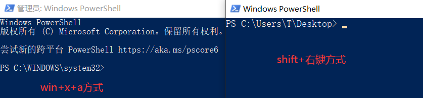
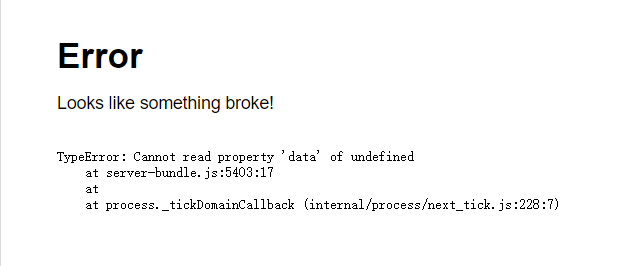
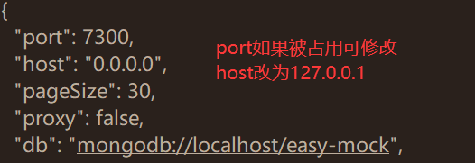

# Mock


## 1.什么是mock.js

​	Mock.js是一款模拟数据生成器,旨在帮助前端工程师独立于后端进行开发,可以拦截ajax请求生成模拟数据进行接口测试,其模拟的数据有随机性,可以自行配置,支持的数据类型丰富,包括不限于文本,邮箱,图片,颜色等

​	官方文档很详细

[官网]: http://mockjs.com/
[文档]: https://github.com/nuysoft/Mock/wiki


## 2.入门使用

了解mock.js功能后,还需要结合项目使用,该示例在vue下

### 2.1测试

安装

```
npm install mockjs
```

在script标签中使用

```javascript
// 使用 Mock
var Mock = require('mockjs')
var data = Mock.mock({
    // 属性 list 的值是一个数组，其中含有 1 到 10 个元素
    'list|1-10': [{
        // 属性 id 是一个自增数，起始值为 1，每次增 1
        'id|+1': 1
    }]
})
// 输出结果 参数4为数据打印格式,空格
console.log(JSON.stringify(data, null, 4))
```


### 2.2全局使用

需要先安装axios和mockjs

```
npm install axios
npm install mockjs
```

在src下创建mock/mock.js文件

示例

```javascript
// es6语法引入mock模块
import Mock from 'mockjs';
// 导出接口
export default Mock.mock(
    '/api/get', {
        'list|1-10':[{
            'id|+1': 1,
            'age|1-10': 10
        }]
        //还可以自定义其他数据
    }
);
Mock.mock(
    '/api/post', {
        'list|3':[{
            'number|+1': 1,
            'string': '@string(3,5)'
        }]
    }
)
```

在main.js中全局引入

名字随便起,mock会自动拦截ajax请求

```javascript
import mymock from './mock/mock.js';
```

创建vue文件并且使用

```vue
<template>
    <div>
        <div v-for="ele in list">{{ele.id}}:{{ele.age}}</div>
        <hr>
        <div v-for="ele in arr">{{ele.number}}:{{ele.string}}</div>
    </div>
</template>

<script>
    export default {
        name: "MockDemo",
        data() {
            return {
                list : [],
                arr : [],
            }
        },
        methods: {
            async fun1(){
                let {data} = await this.axios.get('/api/get')
                this.list = data.list
            },
            async fun2(){
                let {data} = await this.axios.post('/api/post')
                this.arr = data.list
            }
        },
        created() {
           this.fun1()
           this.fun2()
        }
    }
</script>
```

启动测试

```
npm run serve
```




## 3.使用EasyMock

采用自行搭建的方式


### 3.1 环境准备

环境准备,其中node版本可能需要使用8(从10降下来的)

[node历史版本]: https://nodejs.org/zh-cn/download/releases/



克隆EasyMock并且安装依赖

```
$ git clone https://github.com/easy-mock/easy-mock.git
$ cd easy-mock && npm install
```

运行

```
npm run dev
```

默认端口7300,可以在config/default.json中修改配置


### 3.2 创建接口

访问http://127.0.0.1:7300

注册账号登陆后,创建接口

自定义数据模板





### 3.3 在Vue中配合axios使用

默认路径配合axios的配置

在main.js指定请求路径前缀

```javascript
import axios from 'axios'
// axios.defaults.baseURL='后端真实接口'
// 设置为下图的Base URL即可
axios.defaults.baseURL='http://localhost:7300/mock/5e684a733d64e467945f8c30/example'
```



```javascript
  methods: {
	  async fun(){
 		 let {data} = await this.axios.get('/xxxServie')
		 console.log(data.list)
	  }
  },
```

可以看到模拟数据和使用真实数据,只需要更改main.js中的axios的默认请求路径即可

mockjs会自动拦截请求


### 3.4 可能出现的问题

node的版本过高,需要使用8的版本

redis和mongo的环境变量设置

注册服务或者开启服务需要使用管理员命令窗口,有两种命令行可用

```
win+x+a
```

或者在文件夹中

```
shift+右键
```



EasyMock运行后报错,可以尝试修改其config/default.json中的

该错误可能是node8.9.4版本的错误






