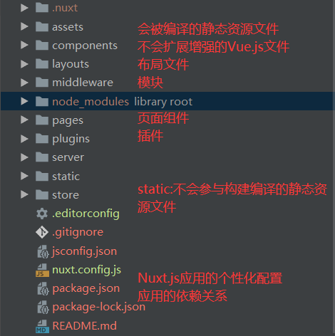
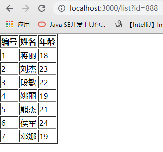
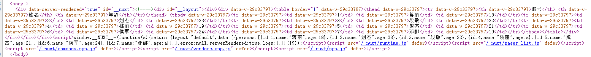

# Nuxt

Nuxt是一个服务器端渲染技术(SSR server side render),基于Vue之上

官网 : https://zh.nuxtjs.org/guide

​		之前使用的Vue是客户端渲染,也就是客户端向服务器发送请求,服务端将数据返回给客户端,客户端将数据填充到占位符中,但这种方式不利于SEO

​		SEO:搜索引擎只会采集页面中的静态数据,对网站进行收录,可以让更多人访问到,并不会采取ajax返回的数据,服务器端渲染技术可以处理这个缺点

​		服务器端渲染技术,其实在学传统web开发时就已经接触过了,jsp时代便是使用tomcat进行编译,将数据提前填充拼接到HTML中返回给客户端,客户端直接渲染HTML就可以了,以及其他的模板引擎,比如freemark等

​		Nuxt使用Node作为服务器进行渲染,但也并不是所有代码都运行在Node中,比如alert、localStorage、window、location、document这些客户端特有的代码(当然也有使用运行的时机,在之前单纯的Vue中就是可以的),该方式固然对服务器性能要求高,所以根据业务进行选用即可,比如新闻,博客,资讯等


## 1.安装及创建

### 1.1 环境准备

安装node

安装vue-cli，nuxt是基于vue之上的

Vue文档 https://cli.vuejs.org/zh/guide/installation.html

```
npm install -g vue-cli
```

安装nuxt项目

```
 yarn global add create-nuxt-app
```

### 1.2 创建项目

```
npx create-nuxt-app <项目名> 
```

创建项目的选项


同时Nuxt也支持热更新,即在修改代码后会自动重新编译,并且影响页面显示

### 1.3 项目结构



### 1.4 编译运行

```
# 安装项目所有依赖
npm run install 
# 服务在热重载状态下运行在localhost:3000
npm run dev
# 编译成上线项目并且启动服务
npm run build
npm run start
```


## 2.路由

### 2.1静态路由

没有参数的路由,在Nuxt中页面组件都是放在pages中,并且会根据文件夹及文件名称进行路由,如果vue页面名称为index则默认为当前文件夹的默认访问页面,页面组件名称一般为小写(大写也可访问),并且在浏览器输入地址路由是也可不区分大小写

| 文件名                | URL访问     |
| :-------------------- | ----------- |
| pages/index.vue       | /           |
| pages/home.vue        | /home       |
| pages/goods/index.vue | /goods      |
| pages/goods/list.vue  | /goods/list |


### 2.2动态路由

带有参数的路由地址

#### 2.2.1 /路由地址/参数

页面组件: pages/goods/_id.vue

访问地址: http://localhost:3000/goods/123

获取数据 : this.$route.params.id // 此处的id同样根据组件的名称获取


如果需要获取多个参数如

 /pages/路由/参数1/参数2

只需进行文件夹的嵌套,只需在前面加_(下划线)即可,如下

/pages/路由/_文件夹/ _xxx.vue

获取方式和上面一样,根据文件夹名称和组件名称分别获取(去掉下划线)即可

```
第一个参数:{{this.$route.params.文件夹名称}}
第二个参数:{{this.$route.params.vue组件页面名称}}
```


可能出现的问题

```
 ERROR  [Vue warn]: Invalid component name: "_id". Component names should conform to valid custom element name in html5 specification. 
```

解决方法:将组件name中的_去掉


#### 2.2.2 /路由地址?key=value

页面组件: pages/home.vue

访问地址: http://localhost:3000/home?id=123&name=111

获取数据 : 

```
id:{{this.$route.query.id}}
name:{{this.$route.query.name}}
```


同样可以使用 this.$router.push的方式跳转路由并且传递参数,同样支持params和query两种方式


## 3.布局文件

在项目的layouts文件夹中默认有default.vue文件,项目中所有页面默认使用该布局

定义布局在layouts中创建布局文件(.vue)

在head中设置头信息

```
<template>
  <div>
    <h1>页头</h1>
    // 引入该布局的页面组件会在这里显示
    <nuxt />
    <h1>页尾</h1>
  </div>
</template>

// 添加头信息(添加在布局文件和页面组件都可以),导入css和js
<script>
    export default {
      name: "MyLayout",
      head:{
        title : 'XXX页面',
        meta:[
          {charset:'utf-8'},  
          {name:'keywords',content:'关键字'},
          {name:'description',content:'描述'}
        ],
        link:[
          {rel:'stylesheet' , href :"/style/header.css"},
          {rel:'stylesheet' , href :"/style/footer.css"}
        ],
        script:[
          {type:'text/javascript',src:'js/jquery-1.8.3.min.js'}
        ]
      },
        data() {
            return {}
        },
        methods: {}
    }
</script>
```

在需要该布局的页面组件中引用

```
<script>
    export default {
     // 根据布局组件名称引用
      layout : 'MyLayout',
      name: "home",
    }
</script>
```


1.可以在nuxt.config,js中可以使用head设置所有页面公共的head信息(标题、编码、meta等)
2.在每个页面中可以使用head属性设置这个页面的head信息
3.如果页面中的head信息如果添加hid属性,就会把公共的相同的hid属性要盖掉，否则就添加
两次


## 4.结合Axios

8个生命周期函数,除了以下两个之外,其余6个基本在客户端执行,所以选择在(mounted)挂载前初始化数据

创建前beforeCreated:执行两次,客户端和服务端都会执行一次

创建后created:执行两次,客户端和服务端都会执行一次

### 4.1使用axios

安装axios

```
npm install axios
```

该方式需要注意的是如果在多个页面同时引用的话会被打包两次,在nuxt.config.js中配置避免该情况

```
  build: {
    /*
    ** You can extend webpack config here
    */
    extend (config, ctx) {
    },
    vendor: ['axios']
  }
```

```
<script>
  import axios from 'axios'
    export default {
      name: "list",
      data(){
          return{
            persons:[]
          }
      },
      methods: {
        async findAll() {
          let {data} = await axios.get('url')
          this.persons = data.list
        },
     },
      mounted() {
        this.findAll()
      }
    }
</script>
```


### 4.2使用 @nuxtjs/axios

在项目创建时会有该选项,也可手动安装

```
npm install @nuxtjs/axios
```

在nuxt.config.js中进行配置

```
  modules: [
    '@nuxtjs/axios',
  ],
  axios: {
    // proxyHeaders: false
  },
```

使用

```
<script>
  // import axios from 'axios'
    export default {
      name: "list",
      data(){
          return{
            persons:[]
          }
      },
      methods: {
        async findAll() {
          // 少了axios中的data属性,直接解构数据即可
          console.log(this.$axios.$get('url'))
          let {list} = await this.$axios.$get('url')
          console.log(list)
          this.persons = list
        },
     },
       mounted() {
        this.findAll()
      },
  
    }
</script>
```

### 设置baseURL

在src下创建SysConfig.js文件

```javascript
var sysConfig = {
  apiURL: '',
  staticURL: '',
  baseURL: 'http://127.0.0.1:7300/mock/5e702522021bfd53ec2f7309/'
  };

var person = {
  name : 'Tao'
}

export {sysConfig,person}
```

其他组件中引入使用

```
<script>
  import {sysConfig} from "@/plugins/SysConfig";
  import VerifyCode from '@/components/VerifyCode'
  export default {
    name: "regist",
    layout:"loginAndRegister",
    components:{
      VerifyCode
    },
    data(){
      return{
        regForm:{}
      }
    },
    methods:{
      async register(){
        let {data} = await this.$axios.$post(sysConfig.baseURL+'/web-service/regist',this.regForm)
        console.log(data)
        if (data.errno == 1){
          this.$router.push("/login")
        }
      },

    }
  }
</script>
```


## 5.异步数据

​		使用 AJAX 获取的数据都属于异步数据，这种数据默认是无法直接写在页面中的，也就是说在页面 的源代码中是看不到 AJAX 的数据的（在网页源代码中并没有）。
​		AJAX获取的数据并不利于SEO，所以为了解决这个问题，Nuxt中提供了一个 asyncData ，可以让 我们在服务器端获取 AJAX 的数据，返回给客户端一个已经拥有AJAX数据的页面

```
// 与methods平级
async asyncData({$axios}){
      let {list} = await $axios.$get('url')
      console.log(list)
      // 特殊的返回数据方式,必须要有返回值
      return {persons:list}
 }
```

接收参数数据

```
 async asyncData({$axios,params,query}){
        console.log(params.id)
        console.log(query.id)
        let {list} = await $axios.$get('url')
        console.log(list)
        return {persons:list}
  }
```

分别使用params和query的方式传递参数

在其他页面组件中添加点击事件

```
   goList(){
      this.$router.push({
        name : 'list',
        params: {
          id : 456
        }
      })

      // this.$router.push({
      //   path : 'list',
      //   query: {
      //     id : 888
      //   }
      // })
    }
```

使用地址栏的方式

```
http://localhost:3000/list?id=888
配合this.$route.query.key获取数据
```

浏览器展示数据

## 


开发工具控制台打印,使用console.log的方式,但是打印在了开发工具中,并没有在浏览器中,说明在服务器端已经获取到数据了


此时在看网页源代码已经有ajax请求的数据了(使用vue和nuxt比较死数据时,nuxt的网页源代码也会有数据,而普通的vue的网页源代码中并没有)



