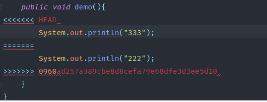
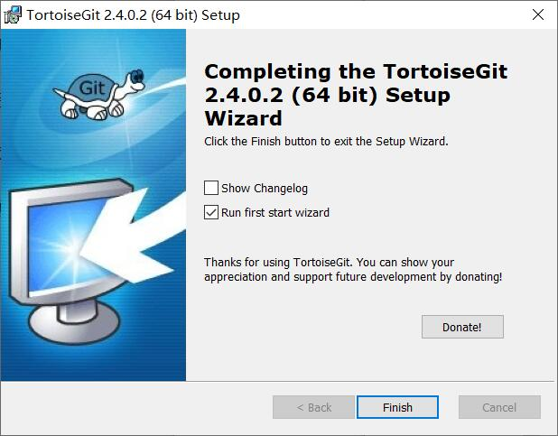
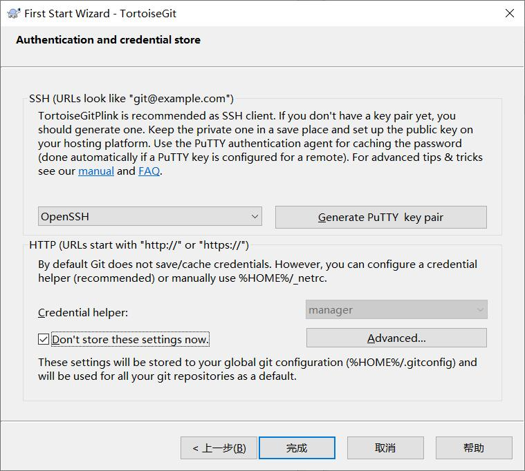
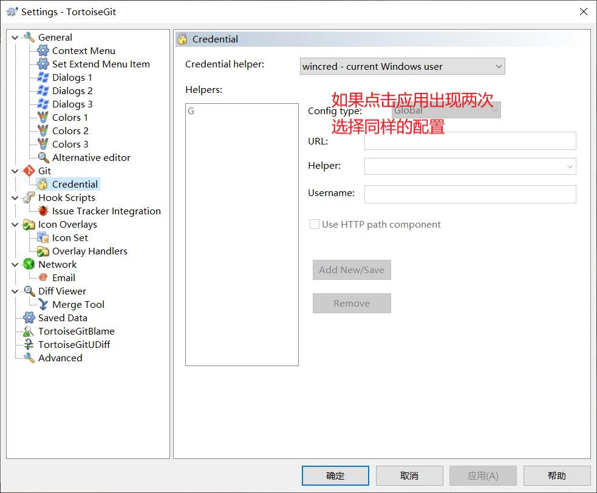
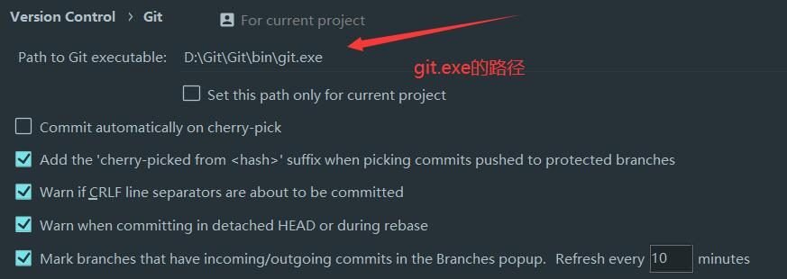
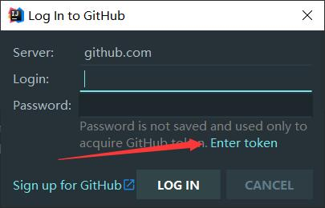
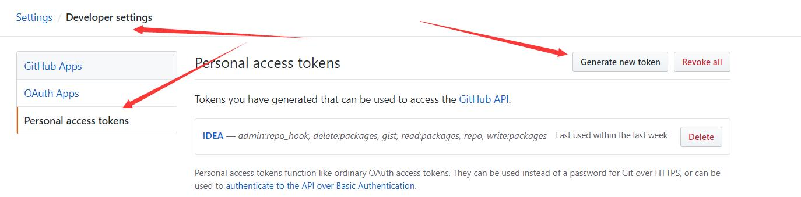
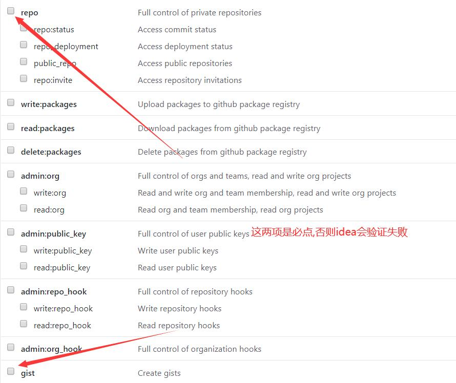

# Git


## 是什么及为什么使用

​	git是一个强大的版本控制工具

​	例如在企业团队开发中,需要协同开发,每个人负责不同的模块,但又有可能依赖其他的模块

​	使用git可以解决这些问题,同时还可以对版本进行严格的控制与管理


## 安装及配置

​	官网:<https://git-scm.com/download>

​	一路点击下一步,取消最后的两个选项,点finish

​	安装完成后

```java
配置用户名和邮箱

git config --global user.name "用户名"

git config --global user.email "邮箱地址"
    
配置后的文件在 C:\用户\{用户名}\.gitconfig文件中
```

​	

```java
   生成ssh 秘钥与 github相关联

1. ssh-keygen -t rsa -C "邮箱地址"
    
默认生成到当前用户 C:\用户\{当前用户}\.ssh\id_rsa.pub

2. 进入github官网,登陆后

3. Settings --> SSH and GPG keys --> New SSH key

4. 将文件中的秘钥全部复制到 key 中
```

 	

## 基本概念介绍

```java
master : 默认开发分支
origin : 默认远程版本库
Index/Stage : 暂存区(工作区和版本库之间)  add后的区域
workspace : 工作区  init后的区域
repository : 本地仓库  commit后的区域
remote : 远程仓库 github
head : 指针 可以通过指针切换版本
```


## 常用流程

```java
git init : 初始化仓库 把这个目录变成Git可以管理的仓库

git add 文件名: 添加文件 直接写符号.将(全部文件) 把文件添加到本地仓库的暂存区

git commit -m  "提交 注释" 提交到当前分支

git remote add origin 远程仓库地址 ：远程仓库与本地仓库添加关联  有关联后,就不用再写这行

git pull origin master : 在推之前先拉 更新代码

git push  -u origin master 将代码推到远程仓库
```


## 冲突

​	**对同一行或者同一块区域的代码进行修改后,导致本地仓库与远程仓库无法合并,因为软件也不知道采用哪一段代码,需要人工解决**



**这是出现冲突后在推时出现的情况**

**冲突:不同的人修改了相同位置的代码**

**<<<<<<<HEAD  自己(当前分支)的代码  =======**

**=======  其他人的代码 >>>>>>>版本号(具体的版本号可以在命令行中查询)**

**手动解决冲突后提交或合并后提交即可**


# TortoiseGit:

​	使用git bash 需要很多重复的操作克隆 提交 推送,可以使用视图化工具简化操作

​	官网:<https://tortoisegit.org/download/>	

​	

​	点击finish后,会进入配置

​	填入用户名和邮箱

​		

安装完成后可能会需要重启

重启完成后点击鼠标右键会出现

​	TortoiseGit --> settings 选择下方选项进行配置




安装完成后,在任意位置鼠标右键,可以完成快速克隆 提交...

# Idea配置git

​		Settings --> Version Control



​		登录




​		如果选择上方的Enter token 登录

​		需要登录github官网 创建token

​		

​	



# 可能出现的问题

## 1. 解决git clone 克隆慢

​	开启代理(本人使用的ssr 默认端口是1080):

```java
git config --global http.proxy socks5://127.0.0.1:1080
```

​	关闭代理:

```java
git config --global http.proxy ""
```

​	如果代理没有关闭可能也会出现

```java
fatal: unable to access 'https://github.com/xxx/xxx.git/': Failed to connect to 127.0.0.1 port 1080: Connection refused
```

​	可以使用命令关闭也可以在

```java
C:\Users\{用户名}\\.gitconfig 中删除proxy代理
```

## 2. 解决github.com 无法访问连接超时

​	先在命令行ping官网 github.com

​	如果ping不通

​		在 C:\Windows\System32\drivers\etc\hosts 末尾添加

```java
192.30.255.112  github.com git 
185.31.16.184 github.global.ssl.fastly.net  
```

​	

## 3.删除所有文件

```bash
git rm * -r
```

