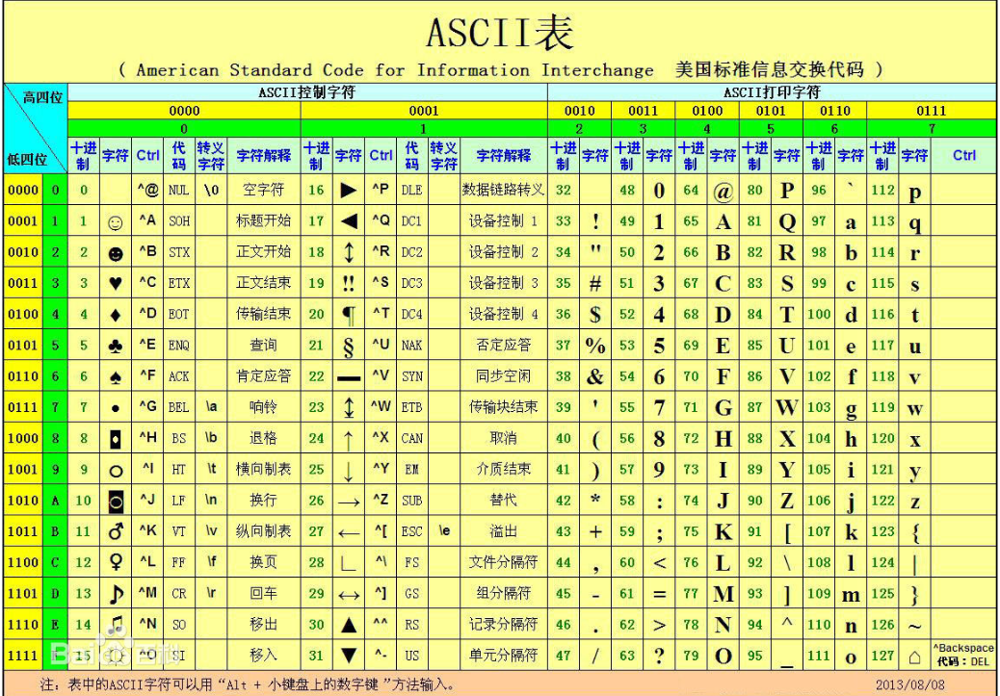
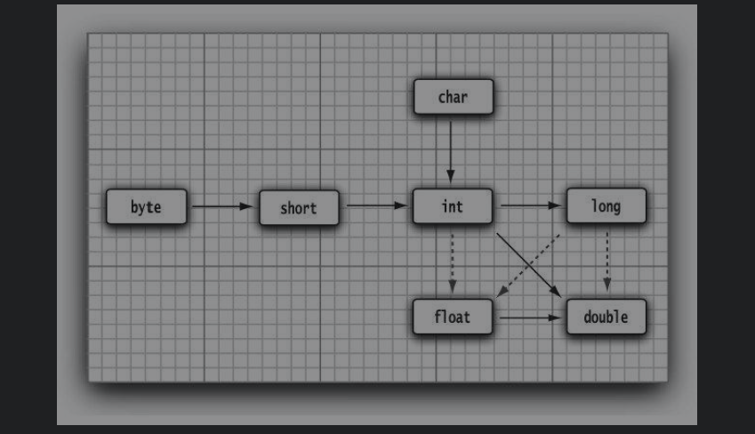
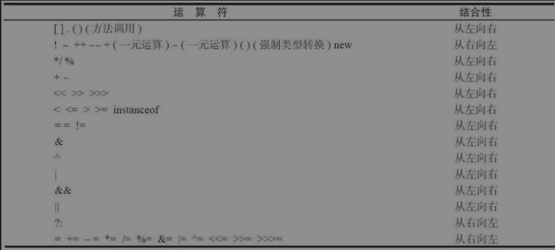
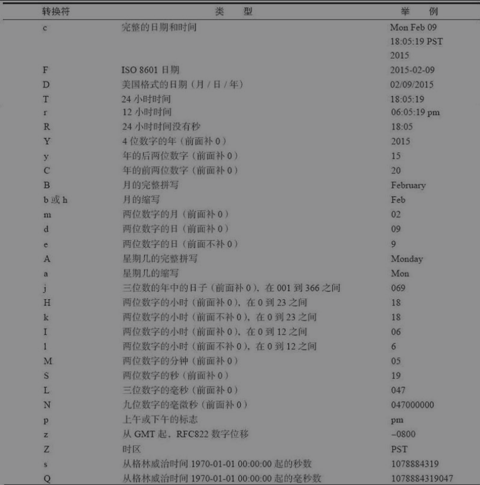

# Java的基本程序设计结构

## 注释

Java中的注释不会出现在可执行程序中,提供了三种注释

// : 单行注释

/**/ : 多行注释

/** */ : 文档注释,可以生成doc文档

## 数据类型

Java是一种强类型语言,意味着每一个变量声明时必须指定一个类型

Java中有8种基本数据类型

### 四种整型

| 类型  | 占用存储大小 |                        取值范围                        | 默认值 |
| :---: | :----------: | :----------------------------------------------------: | ------ |
|  int  |   4个字节    |              -2147 483 648 - 2147 483 647              | 0      |
| short |   2个字节    |                     -32768 - 32767                     | 0      |
| long  |   8个字节    | -9 223 372 036 854 775 808 - 9 223 372 036 854 775 807 | 0L     |
| byte  |   1个字节    |                       -128 - 127                       | 0      |

可以使用其包装类的静态属性MIN_VALUE和MAX_VALUE获取其取值范围

long类型的数值需要在后面加l或者L表示long类型

int类型的值可以这样表示,加下划线更加易读,java编译器会去除这些下划线

```java
int a = 2147_483_647;
```

在java中所有的数值类型所占的字节数量与平台无关

### 两种浮点型

| 类型   | 占用存储大小 | 取值范围                                        | 默认值 |
| ------ | ------------ | ----------------------------------------------- | ------ |
| float  | 4字节        | 1.4E-45 - 3.4028235E38(有效位数6~7)             | 0.0f   |
| double | 8字节        | 4.9E-324 - 1.7976931348623157E308(有效位数15位) | 0.0    |

```java
// 浮点型默认使用double类型
//        不会报错
double b = 1.0;
//        后缀d可加可不加
double b = 1.0d;
//        在编译器内会报错,需加f后缀
//        float f = 1.0;
//        正确写法
float f = 1.0f;
```

浮点型转换为整型

```java
// 转换时会丢弃小数部分,如果想要四舍五入加上0.5后再转即可
// 12
int i = (int)12.7;
// -12
int i2 = (int)-12.7;
```

想要精确的进行浮点型的计算使用

```java
// 一律使用String类型的构造
BigDecimal bigDecimal = new BigDecimal("100.00");
BigDecimal bigDecimal1 = new BigDecimal("100.000");
// false,equals表示两个属于同一个数但换算值不同
System.out.println(bigDecimal.equals(bigDecimal1));
// 0
// 0:相等 -1:表示调用方小与参数 1:表示调用方大于参数
System.out.println(bigDecimal.compareTo(bigDecimal1));
```

### char字符类型

表示一个字符,可以是汉字也可以是Unicode字符

| 类型 | 占用存储大小 | 取值范围 | 默认值 |
| :--: | :----------: | :------: | :----: |
| char |    2字节     | 0-65535  | \u0000 |


可以与int类型相互转换

```java
// 小转大,自动类型提升
char c = 'A';
int i = c;

// 可以直接为char赋值int类型值
// 隐式转换
char c1 = 65;

// 但如果声明了类型则需要强转
int i = 65;
char c = (char)i;
```

比较常用的ASCII表



### boolean类型

用来判定逻辑条件,不能与整型相互转换

|  类型   | 占用存储大小 |   取值范围    | 默认值 |
| :-----: | :----------: | :-----------: | :----: |
| boolean |   1个字节    | true or false | false  |


## 变量

### 变量定义

java中是对大小写敏感的,即name和Name是两个变量,不可以使用java中的关键字作为变量名

java中每一个变量都要一个类型,变量名在变量后,其定义规则如下(可参考阿里巴巴java开发手册)

不要使用$和_作为变量名的开始和结束,虽然两者都可以使用但是请避免使用

其他的命名规范

类名 : UpperCamelCase,即每一个单词首字母大写

变量名(方法,参数,成员和局部) : lowerCamelCase,即变量名的第一个小写其余单词首字母大写,可以在一行中定义多个变量,但为了代码可读性请不要这么做

包名 : 统一小写

常量 : 常量命名全部大写，单词间用下划线隔开，力求语义表达完整清楚，不要嫌名字长。

### 变量初始化

局部变量在使用之前必须先赋值(显式初始化),成员变量是有默认值的,在数据类型一章中有声明

```java
// 表示将一个字符串赋值给一个String类型的变量name
String name = "taoqz";
```

## 常量

在变量类型前加final关键字,被final修饰的成员变量必须在定义时进行初始化(除了构造方法也可以使用构造代码块的方式),局部变量需在使用之前初始化(所有的局部变量在使用之前都必须初始化)

被final修饰的变量为常量,只能赋值一次,不可被修改

被final修饰的方法不可被重写

被final修饰的类不可被继承

## 运算符

常用的+ - * / 表示加减乘除,%表示取余操纵

java提供了java.lang.Math类,该类提供了许多数学运算的函数

## 类型转换

实心箭头表示无信息丢失的转换,虚线箭头表示会有精度损失



### 数值的二元操作

·如果两个操作数中有一个是double类型,另一个操作数就会转为double类型。
·否则，如果其中一个操作数是float类型，另一个操作数将会转换为float类型。·否则，如果其中一个操作数是long类型，另一个操作数将会转换为long类型。·否则，两个操作数都将被转换为int类型。

### 强制类型转换

小转大自动类型提升,大转小需要强制转换

隐式类型提升:一个小与变量类型的值在赋值时,如果该值在该值所属的范围内会自动类型提升,该值的类型可以是(byte/char/short/int),java中整型默认使用int类型,浮点默认使用double,所以在使用long和float时需要在后面指出l或f来进行区分

自动类型提升

```java
char c = 'A';
int a = c;
System.out.println(a);
```

隐式类型提升

```java
char c = 65;
System.out.println(c);
```

强制类型转换

```java
int i = 300;
byte b = (byte)i;
// 44 大转小,会出现信息丢失问题
System.out.println(b);
```

```java
int i = 200;
byte b = 100;
b += i;
// 44 结果一样,但是 += 会自动进行强制类型转换
System.out.println(b);
```

## 运算符

### 自增与自减运算符

以自增为例,自减道理相同

```java
int i = 10,result;
// 先运算再自增 10
result = i++;
// 先自增再运算 11
// result = ++i;
System.out.println(result);
```

### 逻辑运算符

以&符号做示例

```java
int i = 10;
// & 与 表示有一方为则为true,没有短路效果,后面的表达式还会执行
if (i != 0 & i++ > 10){
    // && 与 表示同时为true时,才会执行，如果前面是false后面的表达式无论如何都不会执行有短路效果
    //      if (i == 0 && i++ > 10){
    System.out.println("执行了...");
}
System.out.println(i);
```

总结:

& : 条件都为true时才执行,没有短路效果,后面的表达式无论如何都会执行

&& : 条件都为true时才执行,有false则不执行,有短路效果,后面的表达式无论如何都不会执行

| : 有true则true,没有短路效果,后面的表达式无论如何都会执行

|| : 有true则true,有短路效果,后面的表达式无论如何都不会执行

! : 取反,true则false,false则true

### 位运算符

待补充二进制相关知识

```java
int i = 5;
// int类型应为32位,为了方便使用8位
// 0000 0101
// 左移两位,低位补0 0001 0100 转为十进制为20
System.out.println(i << 2);
// 0000 0101
// 0000 0001 右移两位转为二进制为1
System.out.println(i >> 2);
```

### 括号与运算符级别

如果是同一级别的运算符,从左向右依次计算(除了表中的右结合运算符除外)



```java
// true
System.out.println(false && true || true);
// true 下面两种表达式等价
System.out.println(true || true && false);
System.out.println(true || (true && false));
```

## 字符串

Java中用来表示字符串的类String是被final修饰的,是不可变字符串,也就是每一次操作都会生成一个新的字符串对象

字符串比较(==,equals())

==常用来比较基本数据类型的值和对象的地址值是否相同

equals()方法继承自Object类,String类中常用来比较连个字符串的字符序列是否相同

常见的面试题

```java
String st1 = "abc";
String st2 = "abc";
// true
System.out.println(st1 == st2);
// true
System.out.println(st1.equals(st2));
```


步骤:使用直接赋值的方式,会在常量池中创建一个字符串"abc"对象,当str2创建时发现常量池中已经有了会直接赋值给str2,所以两者指向的内存地址是相同的

```java
String str = new String("abc");
```

这句话会创建两个对象,使用new创建的对象都是存储在堆内存中,而字串"abc"是一个常量应该在常量池中创建,根据API中的String(String str)构造的解释来看,堆中的对象其实是参数字符串的副本


```java
String st1 = new String("abc");
String st2 = "abc";
// false
System.out.println(st1 == st2);
// true
System.out.println(st1.equals(st2));
```

根据上面使用new创建字符串的情况来看,此处的str1 == str2自然是false,因为str1指向的是堆内存空间,str2指向的是常量池

```java
String st1 = "a" + "b" + "c";
String st2 = "abc";
// true 常量池有常量优化机制 a b c三个字符串拼接后变成abc,在常量池中会在创建一个abc的字符串常量,而st2则直接引用
System.out.println(st1 == st2);
// true
System.out.println(st1.equals(st2));
```


下面使用对象与+拼接时会使用StringBuffer或者StringBuilder对象来进行拼接,再使用toString方法将对象转换为String字符串对象,所以st3指向的是堆内存空间的字符串对象

```java
String st1 = "ab";
String st2 = "abc";
String st3 = st1 + "c";
// false
System.out.println(st2 == st3);
// true
System.out.println(st2.equals(st3));
```


## 日期和时间的转换符




循环

java中有三种循环方式

```java
int i = 10;
while (i-- > 0){
    //        while (--i > 0){
    System.out.println(i);
}
System.out.println(i+" ===");
```

```java
int i = 10;
do {
    i--;
    System.out.println("我总会执行一次");
}while (i > 10);
```

```java
//        for (int i = 10; i > 0; i--){
int i;
for (i = 10; i > 0; i--){
    System.out.println(i);
}
```

可以使用break和continue语句控制循环的次数,并且支持在循环上定义标签,根据标签操作具体的循环体

break:终止本次循环

continue:跳过本次循环继续下一次循环

```java
flag:
for (int i = 0; i < 10; i++) {
    for (int j = 0; j < 10; j++) {
        if (j == 8){
            break flag;
            //continue flag;
        }
        System.out.println("j==="+j);
    }
    System.out.println("i==="+i);
}
```


## switch选择语句

switch语句中支持char,byte,short,int,从JDK7开始可以使用字符串控制switch语句

case语句具有穿透性,也就是说如果不加break语句,即使case匹配到后还会继续执行,直到遇到break语句或者执行到default执行完毕

```java
String str = new Scanner(System.in).nextLine();
switch (str){
    case "min":
        System.out.println("min");
        break;
    case "mid":
        System.out.println("mid");
        break;
    case "max":
        System.out.println("max");
        break;
    default:
        System.out.println("no match");
}
```

## 大数值

```java
// 两种大数值都在java.math包下,并不能使用+-这样的运算符,而是提供了对应的方法
// 计算结果可以直接打印(重写了toString方法)
// BigInteger实现了任意精度的整数运算
BigInteger add = BigInteger.valueOf(1213).add(BigInteger.ONE);
System.out.println(add.toString());

// 0.8999999999999999
System.out.println(2.0 - 1.1);
// BigDecimal实现了任意精度的浮点数运算
// 建议使用String参数的构造
BigDecimal bigDecimal = new BigDecimal("2.0");
BigDecimal add1 = bigDecimal.subtract(new BigDecimal("1.1"));
System.out.println(add1.toString());
System.out.println(add1);
```

## 数组

数组是一种可以存储任意类型的数据结构,可以存储基本数据类型也可以存储引用数据类型

可以通过数组的索引访问元素索引从0开始,但数组一旦创建其长度不可变,如果使用指定长度的方式创建数组,数组中每个元素都有其默认值,基本数据类型参照数据类型一篇,引用数据类型则为null

获取数组的长度使用其属性length,并不是方法

java还提供了类java.util.Arrays该类是一个专门操作数组的工具类,提供了大量的方法用于排序,比较,复制数组等操作

创建数组的三种方式

```java
// 1.创建时指定数组长度
int[] arr1 = new int[10];
// 2.使用new的方式创建并且给出值
boolean array2[] = new boolean[]{false,true,false};
// 3.直接赋值
String array3[] = {"1","2","3"};
char[] array4 = {'A',65,'a'};
System.out.println(array4[1]);
System.out.println(array3[0]);
System.out.println(array2.length);
```

数组存储在堆内存中,数组同样支持将其赋值给另一个数组类型,赋值给arr2的是arr在内存的地址值,所以当操作arr2时,arr中的元素也会发生变化

```java
int[] arr = {1,2,5};
int[] arr2 = arr;
arr2[1] = 10;
System.out.println(arr);
System.out.println(arr2);
System.out.println(arr == arr2);
System.out.println(Arrays.toString(arr));
```

### 多维数组

```java
// 定义二维数组
// 表示创建一个二维数组,该二维数组中有两个数组每个数组的长度为2
int[][] arr1 = new int[2][2];
// 也可以直接赋值,并且每个数组的长度可以很灵活
int[][] arr = {
    {1,2,3},
    {4,5,6},
    {7,8}
};
// 遍历二维数组
for (int i = 0; i < arr.length; i++) {
    for (int j = 0; j < arr[i].length; j++) {
        System.out.println(arr[i][j]);
    }
}
// 可以从二维数组中提取出一个一维数组进行赋值
int[] array = arr[1];
System.out.println(Arrays.toString(array));
```