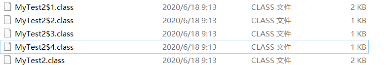

# 接口、对象克隆、内部类

## 接口

继承时类与类之间的关系是is a,而接口则是like a,接口更加强调功能

定义一个接口

```java
public interface MyInterface {

    //    public static final String name = "";
    // 默认使用 public static final 修饰
    String name = "";
    default void print(String mess){
        System.out.println("print"+mess);
    }
    // 方法默认使用public abstract修饰
    //    public abstract void say();
    void say();
    static void eat(){
        System.out.println("eat");
    }
}
```

### 接口与抽象类的区别

接口:

​	接口使用interface定义,接口也是一种特殊的类,没有构造方法,不能创建对象,接口中不能定义静态(static method)方法和实例域,接口中只有常量并且默认使用public static final修饰,接口中的方法默认使用public修饰,在java8之前接口中只能有抽象方法,java8之后可以声明使用default修饰的带有默认方法体的方法

抽象类:

​	抽象类使用class关键字定义,可以定义普通的成员变量,有构造方法,不能创建对象,有构造方法的原因是为了让其子类进行初始化,抽象类中可以有抽象方法也可以有普通方法

​	抽象类中可以定义静态方法和实例域

java中类与类之间只有单继承,可多重继承,类可以实现多个接口 extends关键字要在implements关键字前,实现多个接口使用逗号分隔。接口与接口之间可以多继承。所以多使用接口可以使类的扩展性更强,普通类必须重写抽象类和接口中的抽象方法


### 注意事项

1. 如果类实现了多个接口,接口中重复的默认方法(方法名和参数列表都相同),实现类必须重写这个方法

```java
public interface MyInterface {
    default void print(){
        System.out.println("interface print");
    }
}
```

```java
public interface MyInterface2 {
    default void print(){
        System.out.println("MyInterface2 print");
    }
}
```

```java
public class SubClass implements MyInterface,MyInterface2{
    // 如果实现的接口中有相同默认方法(方法名,参数相同)
    // 子类必须重新实现方法,在方法体内可以任意调用接口中的默认方法
    @Override
    public void print() {
        MyInterface.super.print();
        MyInterface2.super.print();
    }
}
```

       2. 如果实现类的超类中的方法由和实现的接口中的默认方法相同,将会永远调用类中的方法,也就是类优先规则,所以不要再接口中重新定义和Object类中相同的方法

```java
public class SuperClass {
    public void print(){
        System.out.println("class print");
    }
}
```

```java
public interface MyInterface {
    default void print(){
        System.out.println("interface print");
    }
}
```

```java
public class SubClass extends SuperClass implements MyInterface{
    public static void main(String[] args) {
        SubClass subClass = new SubClass();
        subClass.print(); // class print
    }
}
```


## 对象克隆

对象克隆分为浅克隆和深克隆,浅克隆和深克隆的根本区别就是是否复制了对象中的引用类型而不是复制了一份引用

java中实现克隆的方式有两种,一种是使用Object类中的clone()方法,另一种则是使用序列化,前者需要类实现Cloneable接口,后者需要实现Serializable接口,区别是序列化克隆是深克隆,而使用clone()则需要类中的引用类型的成员变量也支持克隆(实现Cloneable接口),并且手动创建其对象,如果一个类中引用了多个其他类的对象,或者这些对象中又有多层的引用,使用clone()的方式将会很麻烦

### clone()浅克隆

```java
@Data
@AllArgsConstructor
@NoArgsConstructor
public class OrderItem implements Cloneable{

    private Integer id;
    private Integer count;
    private Product product;
    private BigDecimal totalPrice;
    private List<Product> products;

    @Override
    protected Object clone() throws CloneNotSupportedException {
        return super.clone();
    }
}
```

```java
@Data
@AllArgsConstructor
@NoArgsConstructor
public class Product {
    private String pid;
    private String name;
    private BigDecimal price;
}
```

```java
Product product = new Product();
product.setPid("1001");
product.setName("数码产品");

OrderItem orderItem = new OrderItem();
orderItem.setId(128);
orderItem.setProduct(product);
System.out.println(orderItem);

OrderItem cloneItem = (OrderItem) orderItem.clone();
System.out.println(cloneItem);
System.out.println("============================");

// 修改cloneItem中类型为Integer的变量id并没有影响原对象
// 包括String都是复制的值
cloneItem.setId(127);
System.out.println(orderItem);
System.out.println(cloneItem);
System.out.println("============================");

// 修改cloneItem中的引用的其他对象中的变量,此时原对象受到了影响
// 如果对象中引用了其他类的对象,复制的只是引用类型变量的地址值
cloneItem.getProduct().setName("生活用品");
System.out.println(orderItem);
System.out.println(cloneItem);
```

### clone()深克隆

```java
@Data
@AllArgsConstructor
@NoArgsConstructor
public class OrderItem implements Cloneable{

    private Integer id;
    private Integer count;
    private Product product;
    private BigDecimal totalPrice;

    // 可以选择将修饰符由改为public,还可以将返回值改为对应的类型,避免类型转换
    @Override
    //    protected Object clone() throws CloneNotSupportedException {
    public OrderItem clone() throws CloneNotSupportedException {
        OrderItem orderItem = (OrderItem) super.clone();
        orderItem.setProduct(product.clone());
        return orderItem;
    }
}
```

```java
@Data
@AllArgsConstructor
@NoArgsConstructor
public class Product implements Cloneable {

    private String pid;
    private String name;
    private BigDecimal price;

    //    @Override
    //    protected Object clone() throws CloneNotSupportedException {
    //        return super.clone();
    //    }

    @Override
    public Product clone() throws CloneNotSupportedException {
        return (Product) super.clone();
    }
}
```

```java
Product product = new Product();
product.setPid("1001");
product.setName("数码产品");

OrderItem orderItem = new OrderItem();
orderItem.setId(128);
orderItem.setProduct(product);
System.out.println(orderItem);
System.out.println("==============");
OrderItem cloneItem = orderItem.clone();

//  这次修改克隆的对象中的Product并没有影响原对象中的Product实现了深度克隆
cloneItem.getProduct().setName("生活用品");
System.out.println(orderItem);
System.out.println(cloneItem);

// console
OrderItem(id=128, count=null, product=Product(pid=1001, name=数码产品, price=null), totalPrice=null)
    ==============
    OrderItem(id=128, count=null, product=Product(pid=1001, name=数码产品, price=null), totalPrice=null)
    OrderItem(id=128, count=null, product=Product(pid=1001, name=生活用品, price=null), totalPrice=null)

```

### 序列化

在类中定义方法

```java
public OrderItem myClone(){
    OrderItem clone = null;
    try {
        ByteArrayOutputStream bos = new ByteArrayOutputStream();
        ObjectOutputStream oos = new ObjectOutputStream(bos);
        oos.writeObject(this);

        ByteArrayInputStream bis = new ByteArrayInputStream(bos.toByteArray());
        ObjectInputStream ois = new ObjectInputStream(bis);
        clone = (OrderItem) ois.readObject();
        oos.close();
        ois.close();

    }catch (Exception e){
        e.printStackTrace();
    }
    return clone;
}
```

在文件中读写

```java
Product product = new Product();
product.setPid("1001");
product.setName("数码产品");

OrderItem orderItem = new OrderItem();
orderItem.setId(128);
orderItem.setProduct(product);

System.out.println(orderItem);
ByteArrayOutputStream bos = new ByteArrayOutputStream();
ObjectOutputStream oos = new ObjectOutputStream(bos);
oos.writeObject(orderItem);
FileOutputStream fos = new FileOutputStream(new File("d:\\temp\\objects.txt"));
fos.write(bos.toByteArray());
fos.flush();
fos.close();

BufferedInputStream fis = new BufferedInputStream(new FileInputStream("d:\\temp\\objects.txt"));
ObjectInputStream objectInputStream = new ObjectInputStream(fis);
OrderItem clone = (OrderItem) objectInputStream.readObject();
clone.getProduct().setName("zzzzz");
System.out.println(clone);
fis.close();
```

## 内部类

内部类: 一个类定义在另一个类的内部(成员位置),该类就叫做内部类,而包含这个内部类的类则被称为外部类,内部类被编译后会独自生成一个class文件,文件的名字: 外部类$内部类.class

内部类的特点: 内部类可以使用任意的权限修饰符以及final、static修饰符修饰,而外部类只能使用public或者不写修饰符默认本包访问,内部类可以直接访问外部类成员,包括私有成员	

### 成员内部类

分为普通的成员内部类和静态成员内部类

普通的成员内部类不允许有静态成员,原因为我们常常设置一个静态的成员是为了让该类所有实例共享这块区域,而实例都保存了自己的一份内部类

静态成员内部类创建对象不需要new,可以使用在内部定义静态成员

```java
public class Outer {

    private String name = "my name is outer";

    public class Inner {
        private Integer age = 18;
        //        不能定义为static 方法也一样,都可以使用final修饰
        //        private static Integer age = 18;

        // 成员内部类可以访问任意的外部类的成员
        public void printOuterName(){
            System.out.println(name);
            Outer.staticMethon();
        }
    }

    public static class StaticInner{
        public static void print(){
            System.out.println("static inner");
        }
    }

    // 外部类访问内部类成员时,必须创建其对象
    public void printInnerAge(){
        // 在外部类中创建内部类的方式
        Inner inner = new Inner();
        System.out.println(inner.age);
    }

    static void staticMethon(){
        System.out.println("static method");
    }
}
```

```java
Outer outer = new Outer();
// outer.printInnerAge();

// 也可以将外部类导出,省略前面的声明
// import xyz.taoqz.chapter4.innerclass.Outer.Inner;
// Inner inner = new Outer().new Inner();
// 创建成员内部类对象的格式: 外部类.内部类 变量 = new 外部类().new 内部类();
Outer.Inner inner = new Outer().new Inner();
inner.printOuterName();

// 创建静态内部类对象的格式: 外部类.内部类 变量 = new 外部类.内部类();
// 静态内部类创建对象不需要new
Outer.StaticInner staticInner = new Outer.StaticInner();
// 外部类.内部类.静态方法
Outer.StaticInner.print();
```


### 局部内部类

```java
public class InnerInterface {
    //    void fun();
    public void fun(){
        System.out.println("父类");
    }
}
```

```java
/**
     * 局部内部类
     */
public static InnerInterface partInnerClassdemo(){
    String name;
    // 和方法中的变量一样,不允许有任何权限修饰符,final除外(static也不能声明)
    // 作用域只在本方法中,但可以通过实现接口或者继承的方式,进行多态调用
    //        class PartInner implements InnerInterface{
    class PartInner extends InnerInterface{
        private String name = "partInnerClass";
        private boolean flag = true;
        @Override
        public void fun() {
            super.fun();
            System.out.println("我是局部内部类");
        }
    }
    PartInner partInner = new PartInner();
    System.out.println(partInner.name);
    return partInner;
}
```

```java
InnerInterface innerInterface = MyTest.partInnerClassdemo();
innerInterface.fun();
```

局部内部类编译后生成的class文件


### 匿名内部类

匿名内部类: 是内部类的简化写法,本质是一个带具体实现的父类或接口的匿名的子类对象

当我们需要使用一个接口时,需要创建类实现该接口重写接口中方法,再创建子类对象调用重写后的方法,匿名内部类的语法可以方便快捷的创建一个其子类,匿名类的前提是必须继承一个父类或者父接口

格式

```java
new 父类或者接口名{
    // 方法重写
    @Override
    public void method() {
        // 执行语句
    }
}
```

```java
public interface MyAnonymityInterface {
    int add(int a,int b);
}
```

```java
@Test
public void demo() {
    // 父类引用指向子类对象
    MyAnonymityInterface my = new MyAnonymityInterface() {
        @Override
        public int add(int a, int b) {
            return a + b;
        }
    };
    System.out.println(my.add(2,3));

    // 直接使用子类对象调用方法,返回结果
    int add = new MyAnonymityInterface() {
        @Override
        public int add(int a, int b) {
            return a + b;
        }
    }.add(1, 2);
    System.out.println(add);
}
```

```java
public static void main(String[] args) {
    // jdk中常用的匿名内部类的写法
    // 1. 创建一个线程
    new Thread(new Runnable(){
        @Override
        public void run() {
            for (int i = 0; i < 10; i++) {
                System.out.println(Thread.currentThread().getName()+"  "+i);
            }
        }
    }).start();

    // 2.使用比较器
    Integer[] arr = {4,6,1,3,7};
    Arrays.sort(arr, new Comparator<Integer>() {
        @Override
        public int compare(Integer o1, Integer o2) {
            return o2 - o1;
        }
    });
    System.out.println(Arrays.toString(arr));
}
```

匿名内部类编译后也会生成class文件(因为在这个类里一共使用了4个匿名内部类的写法,对应的也生成了四个class文件)

