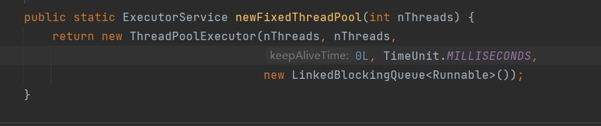
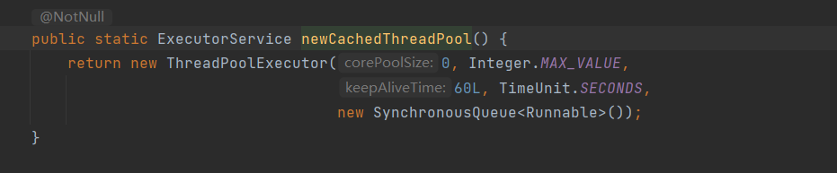
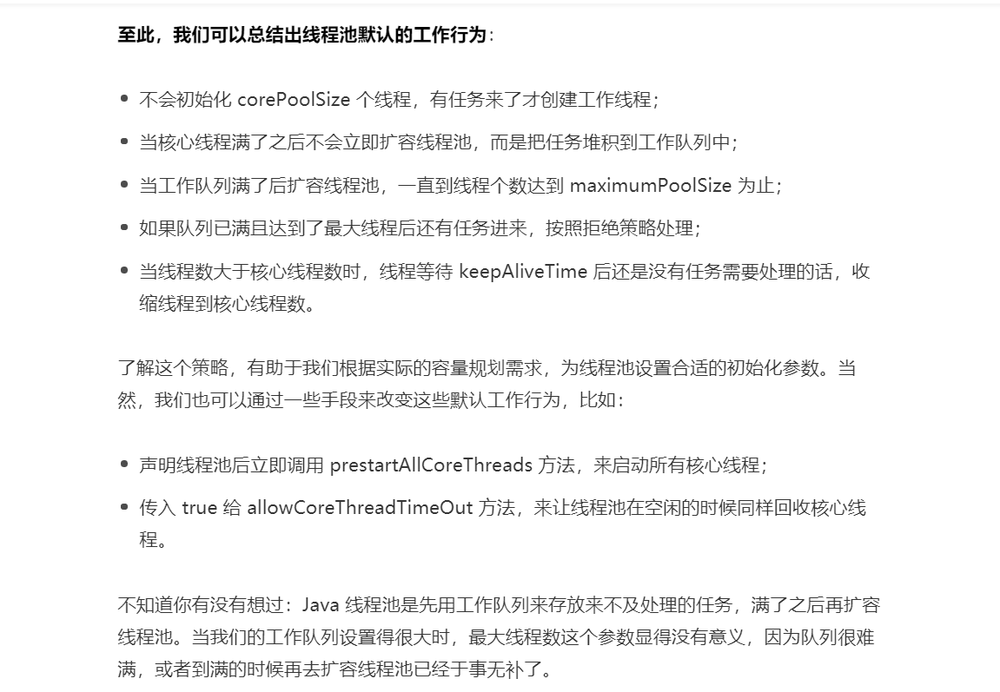

# 线程池

## 该怎样创建线程池?

应该手动new ThreadPoolExecutor创建线程池

newFixedThreadPool和newCachedThreadPool容易造成OOM,内存溢出

## newFixedThreadPool

newFixedThreadPool可以控制最大线程数量,但是LinkedBlockingQueue是一个Integer.MAX_VALUE长度的队列,可以认为是无界的,如果任务较多并且执行较慢时,队列很可能会快速积压,撑爆内存导致OOM



## newCachedThreadPool

newCachedThreadPool的最大线程数量是Integer.MAX_VALUE,可以认为是没有上限的,而其工作队列是一个SynchronousQueue,是一个没有存储空间的阻塞队列,这意味着,只要有请求来,就必须找到一条工作线程处理,如果当前没有空闲线程会创建一条新的,这意味着,如果任务需要长时间执行,那么大量任务进来后会创建大量的线程,从而导致OOM



## 手动创建线程池

**创建线程没有固定的公式,任何时候都是根据实际情况而定**
**当任务执行较慢时(计算或有IO操作),可以将线程数量适当调大一点**
**当任务执行较快但是任务数量较多时,可以将线程数适当放小,将工作队列数量放大**

```java
// 核心线程数: 可以设置线程启动后是否立刻创建
int corePoolSize = 2;
// 最大线程数: 工作队列满时会扩容线程,该参数控制池中允许的最大线程数
int maximumPoolSize = 3;
// 存活时间: 当线程数大于内核数时，这是多余的空闲线程将在终止之前等待新任务的最长时间
long keepAliveTime = 10;
// keepAliveTime参数的时间单位
TimeUnit unit = TimeUnit.SECONDS;
// 用于在执行任务之前保留任务的队列。此队列将仅保存execute方法提交的Runnable任务。
BlockingQueue<Runnable> workQueue = new ArrayBlockingQueue<>(2);
// 执行程序创建新线程时要使用的工厂 (自定义)实现ThreadFactory接口
ThreadFactory threadFactory = new NameTreadFactory();
// 因达到线程边界和队列容量而被阻止执行时使用的处理程序,默认抛出 (自定义)实现接口RejectedExecutionHandler
RejectedExecutionHandler handler = new MyIgnorePolicy();
ThreadPoolExecutor executor = new ThreadPoolExecutor(corePoolSize, maximumPoolSize, keepAliveTime, unit,
                                                     workQueue, threadFactory, handler);
// 使用默认的线程工厂  new DefaultThreadFactory();
// 和默认的拒绝策略 RejectedExecutionHandler defaultHandler = new AbortPolicy();
//        ThreadPoolExecutor executor = new ThreadPoolExecutor(corePoolSize, maximumPoolSize, keepAliveTime, unit,
//            workQueue);
//        corePoolSize 核心线程默认是不会回收的(即使是空闲状态),通过该方法让核心线程也受到keepAliveTime限制
//        executor.allowCoreThreadTimeOut(true);
// 核心线程默认不会在线程池创建时创建,可以通过该预启动所有核心线程
executor.prestartAllCoreThreads();
//        executor.execute();
```

```java
// 必须指定容器大小,且 > 0
ArrayBlockingQueue<Integer> list = new ArrayBlockingQueue<Integer>(3);
list.add(1);
//        list.add(2);
//        list.add(3);
// 队列满时,阻塞
//        list.put(4);
// 队列已满时,添加报错
//        list.add(4);
// 队列已满时,不添加不报错
//        list.offer(4);
// 队列为空时阻塞,等待消费
//        list.take();
// 返回队列头位置元素
//        list.peek();
// 返回队列头部元素,并将元素从集合中移除
//        list.poll();
System.out.println(list);
```

## 线程池默认行为




