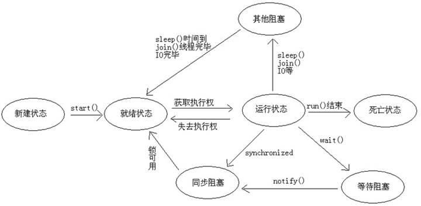

# 线程安全问题

多个线程并发执行时其实是我们的CPU在多个线程之间高速切换执行,以至于让我们认为是在同时执行。Java使用的是抢占式的调度模式,即哪个线程抢到了CPU资源就会执行,并不会等待其他线程执行完毕,这就会引发线程安全问题,当多线程共同操作一份数据时,当t1执行到一半时被t2抢去CPU执行权并且将变量修改成t1不想要的数据。

使用经典的卖票案例演示线程安全问题

```java
public class MyTest {

    public static void main(String[] args) {

        MyTicket myTicket = new MyTicket();
        Thread t1 = new Thread(myTicket, "窗口一");
        Thread t2 = new Thread(myTicket, "窗口二");
        Thread t3 = new Thread(myTicket, "窗口三");

        t1.start();
        t2.start();
        t3.start();

    }

    static class MyTicket implements Runnable{

        //        总票数 也就是共享变量
        private int ticket = 100;

        //    用来记录窗口(线程)卖出的总票数
        private Vector<Integer> vector = new Vector<>();

        @Override
        public void run() {
            while (true){
                if (ticket > 0){
//                为了体现安全问题,休眠1秒
                    try {
                        Thread.sleep(1000);
                    } catch (InterruptedException e) {
                        e.printStackTrace();
                    }
                    System.out.println(Thread.currentThread().getName()+"卖出了第"+ticket--+"张票");
                    vector.add(ticket);
                }else {
                    System.out.println(Thread.currentThread().getName()+vector.size());
                    return;
                }
            }
        }
    }
}
```

```
窗口一卖出了第100张票
窗口三卖出了第99张票
窗口二卖出了第100张票
窗口一卖出了第98张票
窗口二卖出了第96张票
窗口三卖出了第97张票
窗口三卖出了第95张票
窗口二卖出了第94张票
窗口一卖出了第94张票
.......
窗口一卖出了第0张票
窗口一124
窗口三卖出了第-1张票
窗口三125
窗口二卖出了第1张票
窗口二126
```

从这里可以看出的确有线程问题,会出现卖同一张票的还有卖出0和负票数的,可以使用我们线程同步解决这些问题。

# 线程同步

Java中使用synchronized关键字解决多个线程操作同一份数据时引发的安全问题,也就是同步代码块,同步代码块必须要有一个锁对象,并且如果想要多个线程之间共享数据不会出现安全问题时,要保证锁对象一致。大概原理就是t1拿到锁便开始执行,t2此时进入阻塞状态等待t1释放锁,等t1执行完毕后自动释放锁,此时t2便开始执行,循环...

synchronized又分为同步代码块和同步方法

同步代码块

```java
synchronized (锁对象){
    被同步的代码
}
```

同步方法

此时的锁对象为this

```java
public synchronized void fun(){
	//   线程任务
}
```

此时的锁对象为类的class对象,也就是类名.class

```java
public static synchronized void fun(){
    //   线程任务
}
```

卖票案例可改为

```java
//		如果加在run方法上,某条线程拿到执行权直到执行完毕才会释放锁,其他线程也就没有意义了,当然也可以将同步代码块中的代码放到一个方法中,将方法设置为同步方法,在run方法中进行调用这个方法	   
	   @Override
        public void run() {
            while (true) {
//		这里的锁对象使用的this当前对象,因为我们实现的runnable接口,只创建了一个对象开启的几个线程,也可在成员变量位置创建对象作为锁                
                synchronized (this) {
//                    在这里会出现问题,也就是会出现卖0,负数票的
//                    比如窗口三抢到了CPU判断有1张票,准备去卖票,被窗口一抢去了,此时判断还有一张准备去卖时又被窗口二抢去
//                    此时窗口二顺利的卖出了最后一张票,窗口一再抢到后直接卖票便出现了第0张,窗口三则出现了卖负数票的情况
//                    所以选择在此处加同步代码块,保证任意线程在判断成功后可以顺利的卖出一张票
                    if (ticket > 0) {
//             	      为了体现安全问题,休眠1秒
                        try {
                            Thread.sleep(100);
                        } catch (InterruptedException e) {
                            e.printStackTrace();
                        }
                        System.out.println(Thread.currentThread().getName() + "卖出了第" + ticket-- + "张票");
                        vector.add(ticket);
                    } else {
                        System.out.println(Thread.currentThread().getName() + vector.size());
                        return;
                    }
                }
            }
        }
```

# 死锁

线程死锁是指两个或两个以上的线程互相持有对方所需要的资源,也就是锁嵌套,而synchronized特点是一个线程获得锁,在该线程未释放锁的情况下,其他线程获取不到这个锁会一直等待下去,造成无限的等待因此便造成了死锁

线程1拿着线程2需要的锁,线程2拿着线程1需要的锁

```java
public class DieLock {

    public static void main(String[] args) {

        Object lock1 = new Object();
        Object lock2 = new Object();

        new Thread(new Runnable() {
            @Override
            public void run() {
                synchronized (lock1){
                    System.out.println(Thread.currentThread().getName()+"获取到锁1");
//                    放弃cpu资源
                    try {
                        Thread.sleep(1000);
                    } catch (InterruptedException e) {
                        e.printStackTrace();
                    }
                    synchronized (lock2){
                        System.out.println(Thread.currentThread().getName()+"获取到锁2");
                    }
                }
            }
        },"线程1").start();


        new Thread(new Runnable() {
            @Override
            public void run() {
                synchronized (lock2){
                    System.out.println(Thread.currentThread().getName()+"获取到锁2");
//                    放弃cpu资源
                    try {
                        Thread.sleep(1000);
                    } catch (InterruptedException e) {
                        e.printStackTrace();
                    }
                    synchronized (lock1){
                        System.out.println(Thread.currentThread().getName()+"获取到锁1");
                    }
                }
            }
        },"线程2").start();
    }
}

// console
线程1获取到锁1
线程2获取到锁2
等待(产生死锁)    
```

# 等待唤醒机制

多个线程在处理同一个资源,但是处理的动作(线层的任务)却不相同。通过一定的手段使各个线程能有效的利用资源(线程之间的通信)。而这种手段即等待唤醒机制。

涉及方法:

wait():令当前线程挂起并放弃CPU,同步资源下使别的线程可访问并修改共享数据,当前线程可在被唤醒后排队等待再次对资源的访问

notify():唤醒,随机唤醒一个正在排队等待同步资源的线程

notifyAll():唤醒全部,唤醒正在排队等待资源的所有线程，结束等待

唤醒也就是让线程获得执行资格,这些方法必须在同步中才有效,同时在使用时需要标明锁对象,都属于Object类中的方法,这些方法在使用时都需要标明锁,而锁又可以是任意对象,能被任意对象调用的方法在Object类中。

交替打印案例

```java
public class AfterNateTest {

    //    设置一个标记 用于确定线程是否需要等待
    private static boolean flag = false;
    //    锁对象
    private static Object lock = new Object();

    public static void main(String[] args) {

//        两个原数组,设置长度不一致
        String[] chars = {"a", "b", "c", "d", "e", "f", "g"};
        Integer[] arr = {1, 2, 3, 4, 5, 6, 7, 8, 9};

//        开启两个线程传入不同的数组
        new Thread(new Runnable() {
            @Override
            public void run() {
                print(chars, lock);
            }
        }).start();

        new Thread(new Runnable() {
            @Override
            public void run() {
                print(arr, lock);
            }
        }).start();

    }

    public static void print(Object[] array, Object lock) {
        for (int i = 0; i < array.length; i++) {
//            保持同步
            synchronized (lock) {
//                wait()等待需要手动唤醒,在线程开始前唤醒其他在等待的线程,让其准备就绪
                lock.notify();
//               打印当前线程的名字和字符
                System.out.println(Thread.currentThread().getName() + "===" + array[i]);
//                判断是否为最后一个元素
                if (i == array.length - 1) {
                    System.out.println(Arrays.toString(array));
//                    将标记改为true
                    flag = true;
//                    停止当前线程(循环结束的)
                    Thread.currentThread().stop();
                } else {
                    try {
//                        判断如果不是true说明还有元素,需要交替打印,在执行完输出后进入等待状态
                        if (!flag) {
                            lock.wait();
                        }
                    } catch (InterruptedException e) {
                        e.printStackTrace();
                    }
                }
            }
        }
    }
}
```

效果

```
Thread-0===a
Thread-1===1
Thread-0===b
Thread-1===2
Thread-0===c
Thread-1===3
Thread-0===d
Thread-1===4
Thread-0===e
Thread-1===5
Thread-0===f
Thread-1===6
Thread-0===g
[a, b, c, d, e, f, g]
Thread-1===7
Thread-1===8
Thread-1===9
[1, 2, 3, 4, 5, 6, 7, 8, 9]
```


调用wait()会立即进入等待状态并释放锁资源,notify()/notifyAll()可以唤醒其他等待的线程,但是需要执行完所在的synchronized代码块中的代码

```java
public class MyTest2 {

    public static void main(String[] args) {

        Object lock = new Object();

        new Thread(new Runnable() {
            @Override
            public void run() {
                System.out.println("Thread1 start");
                synchronized (lock){
                    System.out.println("Thread1 wating");
                    try {
                        lock.wait();
                    } catch (InterruptedException e) {
                        e.printStackTrace();
                    }
                    System.out.println("Thread1 continue");
                    System.out.println("Thread1 over");
                }
            }
        }).start();

        new Thread(new Runnable() {
            @Override
            public void run() {
                System.out.println("Thread2 start");
                synchronized (lock){
                    lock.notify();
                    System.out.println("Thread2 running");
                    try {
                        System.out.println("Thread2 sleep");
                        Thread.sleep(2000);
                    } catch (InterruptedException e) {
                        e.printStackTrace();
                    }
                    System.out.println("Thread2 over");
                }
            }
        }).start();
    }
}
// console
Thread1 start
Thread1 wating
Thread2 start
Thread2 running
Thread2 sleep
Thread2 over
Thread1 continue
Thread1 over
```

# Lock锁

java.util.concurrent.locks.Lock 机制提供了比synchronized代码块和synchronized方法更广泛的锁定操作, 同步代码块/同步方法具有的功能Lock都有,除此之外更强大,更体现面向对象。

Lock锁也称同步锁，加锁与释放锁方法化了，如下：

```java
// 加同步锁
public void lock()
// 释放同步锁
public void unlock() 
```

```java
public class MyTest3 implements Runnable{

    private int ticket = 100;

    private Lock lock = new ReentrantLock();

    @Override
    public void run() {
//        卖票窗口一直开启
        while (true){
//            上锁
            lock.lock();
            if (ticket > 0){
                try {
//                    模拟出票时间
                    Thread.sleep(100);
                } catch (InterruptedException e) {
                    e.printStackTrace();
                }
                System.out.println(Thread.currentThread().getName()+"=="+ticket--);
            }
//            释放锁
            lock.unlock();
        }
    }

    public static void main(String[] args) {
        MyTest3 myTest3 = new MyTest3();
        new Thread(myTest3).start();
        new Thread(myTest3).start();
    }
}
```

# 总结

## 同步锁

多个线程想保证线程安全,必须要使用同一个锁对象(可以是任意对象)

非静态同步方法的锁对象是this,静态同步方法的锁对象是类.class

## sleep()和wait()方法的区别

sleep:不释放锁(即使是在同步区域内),只释放cpu资源,在休眠时间内,不能唤醒,可以写在任意位置

wait:释放锁对象并释放cpu执行权,在等待的时间内,能唤醒,只能存在与同步中

## 为什么wait(),notify()和notifyAll()都定义在Object类中

这样锁对象便可以是任意对象(类都默认继承自Object)

# 线程状态图



