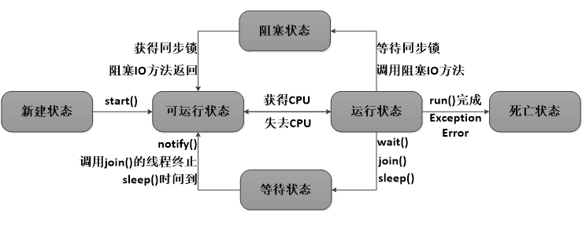

# 线程池

​	线程池,其实就是一个容纳多个线程的容器,其中的线程可以反复使用,避免频繁创建线程对象和线程而消耗过多的资源。

## 使用

通常线程池都是通过线程池工厂创建,在调用线程池中的方法获取线程,执行任务方法

主要涉及的类和方法

Executors:线程池创建工厂类

ExecutorService:线程池类

主要用两个互为重载的方法,可以分别传入Callable和Runnable接口的子类,并开启线程,调用任务方法(不能直接放入继承Thread的类)

```java
// 可获取返回值
<T> Future<T> submit(Callable<T> task);
// Thread类也是Runnable接口的子类
Future<?> submit(Runnable task);
```

### 实现Runnable接口方式

```java
public class MyRunnable implements Runnable{
    @Override
    public void run() {
        System.out.println("拿到线程池中的线程");

        try {
            Thread.sleep(2000);
        } catch (InterruptedException e) {
            e.printStackTrace();
        }
        System.out.println("线程名称:" +Thread.currentThread().getName());
        System.out.println("完成任务,归还线程");
    }
}
```

```java
public class MyTest1 {

    public static void main(String[] args) {
//        根据线程池工厂创建线程池并初始化线程数量
        ExecutorService service = Executors.newFixedThreadPool(2);
        MyRunnable runnable = new MyRunnable();

//        传入线程任务类,使用并开始线程池中的线程,如果开启数量大于线程池初始创建的数量
//        需要等待其他线程完成回到线程池中后再进行调用
        service.submit(runnable);
        service.submit(runnable);
        service.submit(runnable);

//        关闭连接
        service.shutdown();
    }
}
```

### 实现Callable接口的方式

```java
public class MyCallable implements Callable<Integer> {

    private Integer num1;
    private Integer num2;

    public MyCallable(Integer num1, Integer num2) {
        this.num1 = num1;
        this.num2 = num2;
    }

    @Override
    public Integer call() throws Exception {
        System.out.println(Thread.currentThread().getName());
        return num1+num2;
    }
}
```

```java
public class MyTest2 {

    public static void main(String[] args) throws ExecutionException, InterruptedException {

//        根据线程池工厂创建线程池并初始化线程数量
        ExecutorService service = Executors.newFixedThreadPool(2);
//        创建线程任务类
        MyCallable myCallable1 = new MyCallable(1,2);
        MyCallable myCallable2 = new MyCallable(5,2);
//        传入线程任务类,使用并开始线程池中的线程,
        Future<Integer> submit = service.submit(myCallable1);
        Future<Integer> submit1 = service.submit(myCallable2);
//        获取返回值
        System.out.println(submit.get());
        System.out.println(submit1.get());
        System.out.println(service);
        service.shutdown();
    }
}
// console
pool-1-thread-1
pool-1-thread-2
3
7
java.util.concurrent.ThreadPoolExecutor@29453f44[Running, pool size = 2, active threads = 0, queued tasks = 0, completed tasks = 2]
```


## 线程状态图

