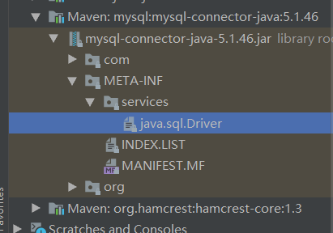

# JDBC

全名为Java DataBase Connectivity,由于市面上的数据库种类很多,根据每种数据库需要学习不同的API,sun公司为了方便统一定义了java连接数据库的接口,从此数据库厂商只需要实现对应的接口提供对应的驱动包即可

## 创建连接

添加依赖

```xml
<dependency>
    <groupId>mysql</groupId>
    <artifactId>mysql-connector-java</artifactId>
    <!--            <version>8.0.21</version>-->
    <version>5.1.47</version>
</dependency>
```

注册驱动

获取连接

```java
//			 这是java1.6之前注册驱动的方式
//			 加载驱动
//            方式一,会加载两次
//            DriverManager.registerDriver(new Driver());
//			 方式二
//            Class.forName("com.mysql.jdbc.Driver");
```

在java1.6之后,jdbc4无需手动注册驱动,程序会根据驱动包内的文件自动注册




```properties
jdbc.driver=com.mysql.jdbc.Driver
jdbc.url=jdbc:mysql://127.0.0.1/jdbc_stu?useSSL=false
jdbc.username=root
jdbc.password=123
```

```java
package xyz.taoqz.util;

import java.io.IOException;
import java.io.InputStream;
import java.sql.Connection;
import java.sql.DriverManager;
import java.sql.SQLException;
import java.util.Properties;

/**
 * @author :almostTao
 * @date :Created in 2020/8/16 14:12
 */
public class JDBCUtil {

    private static String driver = null;
    private static String url = null;
    private static String username = null;
    private static String password = null;

    static {
        try {
            InputStream resourceAsStream = JDBCUtil.class.getClassLoader().getResourceAsStream("db.properties");
            Properties properties = new Properties();
            properties.load(resourceAsStream);
            driver = properties.getProperty("jdbc.driver");
            url = properties.getProperty("jdbc.url");
            username = properties.getProperty("jdbc.username");
            password = properties.getProperty("jdbc.password");
        }
    }

    public static Connection getConnection() throws SQLException {
        return DriverManager.getConnection(url,username,password);
    }

```

```java
// 获取连接
Connection connection = JDBCUtil.getConnection();
// 创建statement对象
Statement statement = connection.createStatement();
// 通过statement执行查询语句
ResultSet resultSet = statement.executeQuery("select * from jdbc_stu.school");
while (resultSet.next()){
    System.out.println(resultSet.getString("name"));
}
```


## Connection

```java
@Test
public void insert() throws SQLException {
    Connection connection = JDBCUtil.getConnection();
    // 设置自动提交为false
    connection.setAutoCommit(false);

    try {
        String sql = "insert into jdbc_stu.school values (null,?)";
        // 获取由数据库自增的id
        PreparedStatement preparedStatement = connection.prepareStatement(sql, com.mysql.jdbc.PreparedStatement.RETURN_GENERATED_KEYS);
        preparedStatement.setString(1, "北大");
        int i = preparedStatement.executeUpdate();
        System.out.println(i);

        ResultSet resultSet = preparedStatement.getGeneratedKeys();
        resultSet.next();
        System.out.println(resultSet.getInt(1));
        //            System.out.println(2 / 0);
        // 手动提交
        connection.commit();
    } catch (SQLException e) {
        // 当我们尝试回滚时,报错
        // com.mysql.jdbc.exceptions.jdbc4.MySQLNonTransientConnectionException: Can't call rollback when autocommit=true
        connection.rollback();
        e.printStackTrace();
    }
}
```


## Statement和PreparedStatement

PreparedStatement相较于Statement多了占位符,可以有效的避免sql注入问题

```java
@Test
public void demoZhuRu() throws SQLException {

    Connection connection = JDBCUtil.getConnection();
    Statement statement = connection.createStatement();
    String param = "''or 1=1";
    String sql = "select * from jdbc_stu.school where name = " + param;
    // 相当于执行 select * from jdbc_stu.school where name = ''or 1=1
    // 直接将其拼接到了sql后
    ResultSet resultSet = statement.executeQuery(sql);
    while (resultSet.next()) {
        System.out.println(resultSet.getString("name"));
    }

    System.out.println("====================================================");

    sql = "select * from jdbc_stu.school where name = ? ";
    PreparedStatement preparedStatement = connection.prepareStatement(sql);
    //        在底层会使用 instanceof 关键字比较类型,从而调用对应的可以指定类型的方法
    //        preparedStatement.setObject(1,param);
    preparedStatement.setString(1,param);
    // 相当于执行 select * from jdbc_stu.school where name = '''or 1=1';
    // 不会把参数中的 和sql语句语法有关的当成sql的一部分执行,有效防止了sql注入
    resultSet = preparedStatement.executeQuery();
    while (resultSet.next()) {
        System.out.println(resultSet.getString("name"));
    }
}
```

其他常用方法

```java
public static void main(String[] args) throws Exception {

    Connection connection = JDBCUtil.getConnection();
    Statement statement = connection.createStatement();
    String sql = "select * from jdbc_stu.school";
    ResultSet resultSet = statement.executeQuery(sql);
    while (resultSet.next()) {
        // 获取指定名称列的结果
        System.out.println(resultSet.getString("name"));
    }

    // 结果不明确,不推荐使用
    // 查询使用executeQuery
    boolean execute = statement.execute(sql);
    System.out.println(execute);

    // 增删改使用
    String updateSql = "insert into school values (null,'哈工大')";
    statement.executeUpdate(updateSql);

    // 批处理
    String batchSql = "delete from school where id = 1;";
    String batchSql2 = "delete from school where id = 2;";
    statement.addBatch(batchSql);
    statement.addBatch(batchSql2);
    // 需要注意的是,不能执行select语句
    // Can not issue SELECT via executeUpdate() or executeLargeUpdate()
    int[] ints = statement.executeBatch();
    // 返回执行结果 0 失败或为修改 1 成功
    System.out.println(Arrays.toString(ints));
}
```

## ResultSet

```java
ResultSet resultSet = statement.executeQuery(sql);
while (resultSet.next()) {
// 获取指定名称列的结果
System.out.println(resultSet.getInt("id"));
System.out.println(resultSet.getString("name"));
}
```


## 存储过程

```sql
-- 创建存储过程
create procedure name_like(in nameparam varchar(10),out con int)
begin
    set con = 0;
    select count(*) into con from school where name like nameparam;
end;
-- 调用
call name_like('%大%',@con);
select @con;
```

```java
@Test
public void callProcedure() throws SQLException {
    Connection connection = JDBCUtil.getConnection();
    String callSql = "{call name_like(?,?)}";
    CallableStatement callableStatement = connection.prepareCall(callSql);
    // 设置参数
    callableStatement.setString(1,"%清%");
    callableStatement.registerOutParameter(2, Types.INTEGER);
    callableStatement.execute();
    // 获取返回值
    String result = callableStatement.getString(2);
    System.out.println(result);
}
```

## 事务保存点

```java
@Test
public void savepointDemo() throws Exception {
    Connection connection = JDBCUtil.getConnection();

    // 开启事务
    connection.setAutoCommit(false);

    String sql = "insert into school values(null,?)";
    PreparedStatement preparedStatement = connection.prepareStatement(sql);
    preparedStatement.setString(1,"天津大学");
    // 提交后,插入数据库
    preparedStatement.execute();
    // 设置保存点
    Savepoint savepoint = connection.setSavepoint();

    // 不会插入
    preparedStatement.setString(1,"清华大学");
    preparedStatement.execute();
    // 回滚至指定的保存点
    connection.rollback(savepoint);
    // 关闭事务,并提交
    connection.setAutoCommit(true);

}
```

事务的隔离级别

```
Connection.TRANSACTION_NONE
Connection.TRANSACTION_READ_COMMITTED
Connection.TRANSACTION_READ_UNCOMMITTED
Connection.TRANSACTION_REPEATABLE_READ
Connection.TRANSACTION_SERIALIZABLE

connection.setTransactionIsolation();
```

获取当前连接数据库的配置

queryBuf

```sql
SELECT  @@session.auto_increment_increment AS auto_increment_increment, @@character_set_client AS character_set_client, @@character_set_connection AS character_set_connection, @@character_set_results AS character_set_results, @@character_set_server AS character_set_server, @@collation_server AS collation_server, @@collation_connection AS collation_connection, @@init_connect AS init_connect, @@interactive_timeout AS interactive_timeout, @@license AS license, @@lower_case_table_names AS lower_case_table_names, @@max_allowed_packet AS max_allowed_packet, @@net_buffer_length AS net_buffer_length, @@net_write_timeout AS net_write_timeout, @@query_cache_size AS query_cache_size, @@query_cache_type AS query_cache_type, @@sql_mode AS sql_mode, @@system_time_zone AS system_time_zone, @@time_zone AS time_zone, @@transaction_isolation AS transaction_isolation, @@wait_timeout AS wait_timeout
```


## 使用元数据改造结果集

ResultSet返回的往往是列的值,而我们大多时候想直接拿到Bean对象,此时可以使用数据库的原数据改造ResultSet

- ParameterMetaData --参数的元数据

- ResultSetMetaData --结果集的元数据

- DataBaseMetaData --数据库的元数据

也可以使用DBUtils

```java
public interface ResultSetHandler<T> {
    List<T> handler(ResultSet resultSet) throws Exception;
}
```

```java
package xyz.taoqz.handler;

import java.lang.reflect.Field;
import java.sql.ResultSet;
import java.sql.ResultSetMetaData;
import java.util.ArrayList;
import java.util.List;

/**
 * @author :almostTao
 * @date :Created in 2020/8/16 17:54
 */
public class BeanHandler<T> implements ResultSetHandler {

    private Class clazz;
    private List<T> list;
    public BeanHandler(Class clazz) {
        this.clazz = clazz;
        list = new ArrayList<>();
    }

    @Override
    public List<T> handler(ResultSet resultSet) throws Exception {
        Object bean;
        while (resultSet.next()){
            bean = clazz.newInstance();
            //拿到结果集元数据
            ResultSetMetaData resultSetMetaData = resultSet.getMetaData();
            for (int i = 0; i < resultSetMetaData.getColumnCount(); i++) {
                //获取到每列的列名
                String columnName = resultSetMetaData.getColumnName(i + 1);
                //获取到每列的数据
                Object columnData = resultSet.getObject(i + 1);
                //设置Bean属性
                Field field = clazz.getDeclaredField(columnName);

                field.setAccessible(true);
                field.set(bean,columnData);
            }
            list.add((T) bean);
        }
        return list;
    }
}
```