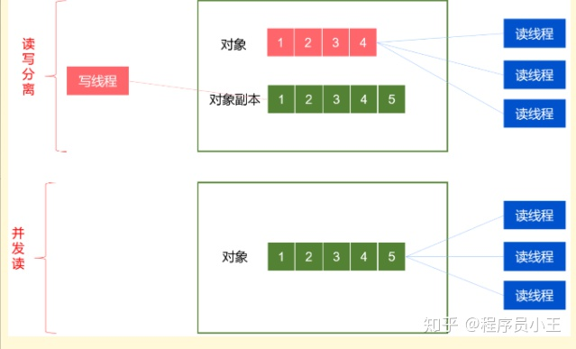

# ThreadLocal

在一个线程中保存一份变量,使用场景:同一线程但不能传参时可以使用,使用后记得调用remove(),否则会出现数据错乱问题,比如运行在Tomcat中,Tomcat使用了线程池,而线程池会复用,这就导致数据可能会串

# HashTable

是线程安全的(key和value不允许存null),size()方法也是,而ConcurrentHashMap虽然保证了在同一线程读写的原子性,但是size()没有加锁,这就导致复合操作时会出现线程安全问题(ConcurrentHashMap容器本身保证了装数据时的安全性,但没有保证获取数量时的安全性(可见性,一个线程在操作时,其他线程可以获得size))

# CopyOnWriteArrayList

适合读多写少的环境下,比如黑白名单,写(add)时会都用Arrays.copyOf创建新数组，频繁add时内存申请释放性能消耗大,高并发读的时候CopyOnWriteArray无锁，Collections.synchronizedList(包括get方法)有锁所以读的效率比较低下。



# list oom问题

Arrays.asList()将数组转换为list,转换后的list是Arrays的内部类ArrayList,没有增加和删除的方法,并且如果该数组是基本数据类型,转换后的集合中只有一个元素,那就是这个数组,并且修改数组中的元素会影响转换后的集合,因为他本质还是数组用的还是同一个地址,达不到预期效果

解决数组为基本类型时的问题

```java
// 使用java8进行装箱 
int[] a = {1,2,3};
List<Integer> collect = Arrays.stream(a).boxed().collect(Collectors.toList());
// 或者直接改为Integer[],再或者Arrays.asList后在使用new ArrayList()构造查u你创建对象
```

# hashmap线程安全问题

1.7
数据重复:如果两条线程同时put一个key相同的元素时都判断map中该key不存在,一条线程将元素添加进map后,另一条线程获取最后一个节点的位置时可能就是线程1的key的位置

死循环

1.8

数据丢失

在多线程情况下put时计算出的插入的数组下标可能是相同的，这时可能出现值的覆盖从而导致size也是不准确的

一条线程与另一条线程的key的hash值相同,但不相等,也就是hash碰撞,此时put时在计算要添加的位置时由于都还没有添加进去,计算的位置相同,会出现覆盖的情况

# volatile

当对非volatile变量读写时,每个线程先从内存拷贝变量到CPU缓存中。如果计算机有多个CPU,每个线程可能在不同的CPU上处理,这意味着每个线程可以拷贝到不同的CPU缓存中。

而声明变量为volatile,则会跳过缓存这一步骤,JVM保证每次都会从内存中读变量

# 线程状态

1.新建状态,新建一个Thread对象但是还未调用start()方法
2.就绪或运行中,调用start()方法,如果获得cpu资源就会执行
3.阻塞,如果有同步锁的操作会进入阻塞状态
4.等待,调用wait()方法,会主动释放锁
5.超时等待,调用sleep()方法,不会释放锁
6.终止状态


 