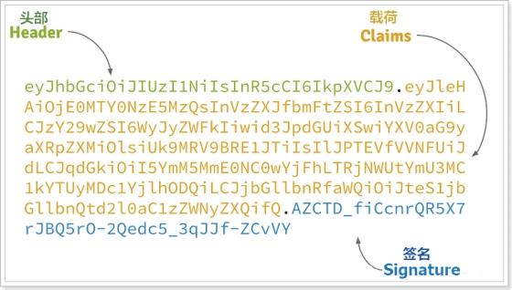

# JWT

​	官网:<https://jwt.io/>

​	JWT，全称是Json Web Token， 是JSON风格轻量级的授权和身份认证规范，可实现无状态、分布式的Web应用授权；它是分布式服务权限控制的标准解决方案！


## 为什么使用jwt

​	在之前的单体项目中,用户登录后将信息存储到session中,从而判断当前用户是否登录限定请求资源,但现在是前后端分离,如果还是用session,后端服务由于要保证高可用使用了集群,此时便需要实现session之间的共享,使用jwt避免这些麻烦的操作


## 流程

​	用户请求登录服务后,请求成功颁发jwt凭证,也就是token,将token保存到客户端中,此后的每次请求客户端都会携带此凭证到独立的验证授权中心进行校验


## token包含的内容



JWT的token包含三部分数据：

- Header：头部，通常头部有两部分信息：

  - 声明类型type，这里是JWT（type=jwt）

  - 加密算法，自定义(rs256/base64/hs256)

    我们会对**头部进行base64加密**（可解密），得到第一部分数据

- Payload：载荷，就是有效数据，一般包含下面信息：

  - 用户身份信息-userid,username（注意，这里因为采用base64加密，可解密，因此不要存放敏感信息）

  - 注册声明：如token的签发时间，过期时间，签发人等

    这部分也会采用base64加密，得到第二部分数据

- Signature：base64加密，签名，是整个数据的认证信息。一般根据前两步的数据，再加上服务的的密钥（secret，盐）（不要泄漏，最好周期性更换），通过加密算法生 JWT详解

  

  1. jwt的一个有规则的token
  2. 它有三部分组成：Header.payload.signature,每部分都是通过base64加密而成的
  3. jwt每个部分都是可以解密的


## JWT详解

#### base64编码原理

- Base64编码之所以称为Base64，是因为其使用64个字符来对任意数据进行编码，同理有Base32、Base16编码。标准Base64编码使用的64个字符如下：

  

  这64个字符是各种字符编码（比如ASCII码）所使用字符的子集，并可打印。唯一有点特殊的是最后两个字符。

  Base64本质上是一种将二进制数据转成文本数据的方案。对于非二进制数据，是先将其转换成二进制形式，然后每连续6比特（2的6次方=64）计算其十进制值，根据该值在上面的索引表中找到对应的字符，最终得到一个文本字符串。假设我们对Hello！进行Base64编码，按照ASCII表，其转换过程如下图所示： 

   

   可知Hello！的Base64编码结果为SGVsbG8h，原始字符串长度为6个字符串，编码后长度为8个字符，每3个原始字符经编码成4个字符。

  但要注意，Base64编码是每3个原始字符编码成4个字符，如果原始字符串长度不能被3整除，怎么办？使用0来补充原始字符串。

  以Hello！！为例，其转换过程为：

   

  `Hello!!` Base64编码的结果为 `SGVsbG8hIQAA` 。最后2个零值只是为了Base64编码而补充的，在原始字符中并没有对应的字符，那么Base64编码结果中的最后两个字符 `AA` 实际不带有效信息，所以需要特殊处理，以免解码错误。

  标准Base64编码通常用 `=` 字符来替换最后的 `A`，即编码结果为 `SGVsbG8hIQ==`。因为 `=` 字符并不在Base64编码索引表中，其意义在于结束符号，在Base64解码时遇到 `=` 时即可知道一个Base64编码字符串结束。

  如果Base64编码字符串不会相互拼接再传输，那么最后的 `=` 也可以省略，解码时如果发现Base64编码字符串长度不能被4整除，则先补充 `=` 字符，再解码即可。

  解码是对编码的逆向操作，但注意一点：对于最后的两个 `=` 字符，转换成两个`A` 字符，再转成对应的两个6比特二进制0值，接着转成原始字符之前，需要将最后的两个6比特二进制0值丢弃，因为它们实际上不携带有效信息。

  

  **总结：**

  1、base64的编码/加密原理

  答：原理：将键盘输入的字符用base64编码表示

  过程：将键盘输入字符的ascii码值，转成的对应8位二进制，将该二进制6个一组拆分，并计算拆分之后的十进制值，找出十进制值在base64编码中对应的字母，即完成base64加密

  成。用于验证整个数据完整和可靠性


## 使用

#### 	依赖

```xml
  <properties>
           <jjwt.version>0.7.0</jjwt.version>
           <joda-time.version>2.9.6</joda-time.version>
       </properties>
       
       <dependencies>
           <dependency>
               <groupId>io.jsonwebtoken</groupId>
               <artifactId>jjwt</artifactId>
               <version>${jjwt.version}</version>
           </dependency>
           <!-- https://mvnrepository.com/artifact/joda-time/joda-time -->
           <dependency>
               <groupId>joda-time</groupId>
               <artifactId>joda-time</artifactId>
               <version>${joda-time.version}</version>
           </dependency>
       </dependencies>
```

#### 工具类

```java
import io.jsonwebtoken.Claims;
import io.jsonwebtoken.JwtBuilder;
import io.jsonwebtoken.Jwts;
import io.jsonwebtoken.SignatureAlgorithm;
import org.joda.time.DateTime;

import javax.crypto.spec.SecretKeySpec;
import javax.xml.bind.DatatypeConverter;
import java.security.Key;

public class JWTUtil {


    /**
     * 获取token中的参数
     *
     * @param token
     * @return
     */
    public static Claims parseToken(String token,String key) {
        if ("".equals(token)) {
            return null;
        }

        try {
            return Jwts.parser()
                    .setSigningKey(DatatypeConverter.parseBase64Binary(key))
                    .parseClaimsJws(token).getBody();
        } catch (Exception ex) {
            return null;
        }
    }

    /**
     * 生成token
     *
     * @param userId
     * @return
     */
    public static String createToken(Integer userId,String key, int expireMinutes) {
        SignatureAlgorithm signatureAlgorithm = SignatureAlgorithm.HS256;

        long nowMillis = System.currentTimeMillis();

        //生成签名密钥
        byte[] apiKeySecretBytes = DatatypeConverter.parseBase64Binary(key);

        Key signingKey = new SecretKeySpec(apiKeySecretBytes, signatureAlgorithm.getJcaName());

        //添加构成JWT的参数
        JwtBuilder builder = Jwts.builder()
//                .setHeaderParam("type", "JWT")
//                .setSubject(userId.toString())
                .claim("userId", userId) // 设置载荷信息
                .setExpiration(DateTime.now().plusMinutes(expireMinutes).toDate())// 设置超时时间
                .signWith(signatureAlgorithm, signingKey);

        //生成JWT
        return builder.compact();
    }
}

```

