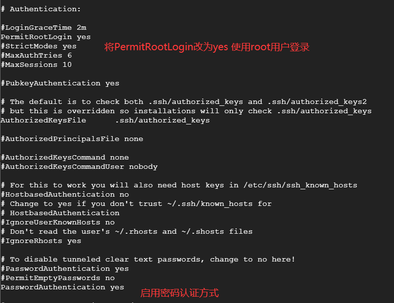

使用SSH连接工具XShll连接服务器

​	环境:谷歌云服务器,CentOS 7或者Ubuntu Server 18.04 LTS

​	使用账号密码的方式

​	步骤:

1.切换到root角色

```shell
sudo -i
```

2.修改SSH配置文件

```shell
vi /etc/ssh/sshd_config
```



3.给root用户设置密码

```shell
passwd root
```

4.重启SSH服务

```shell
service sshd restart
```

​	