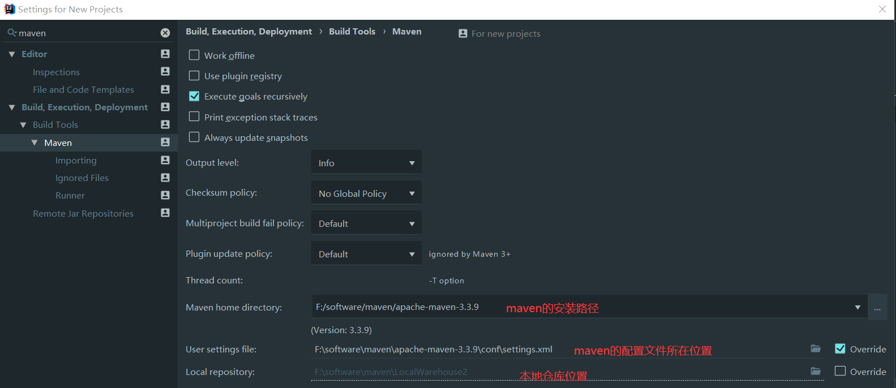

# Maven

## maven是什么?

Maven 是一个项目管理工具，可以对 Java 项目进行构建、依赖管理。

## 为什么使用maven?

在之前的项目中,每次都需要先导入很多jar包,并且出现依赖冲突没有直观显示,使用maven后不用在手动导入很多jar包,

只需要引入jar在仓库对应的坐标即可,大大减小了项目的体积


## 下载与配置

下载地址:<https://maven.apache.org/download.cgi> windows环境下选择二进制压缩包进行下载


### 配置环境变量:

​	可以先在系统变量创建一个MAVEN_HOME指向maven安装路径,然后在path中添加此变量,并指向bin目

录%MAVEN_HOME%\bin,这样做的目的是如果maven换了安装目录只需要更改MAVEN_HOME,而不需要更改path,避免出

现其他问题,配置好后使用mvn - v 命令查看版本


### 阿里镜像

主要的配置文件在conf文件夹中的settings.xml,其默认使用的是maven的中央仓库,为了解决国内下载速度慢的情况

找到mirrors标签添加

```xml
 <mirror>
     <id>alimaven</id>
     <mirrorOf>central</mirrorOf>
     <name>aliyun maven</name> 
     <url>http://maven.aliyun.com/nexus/content/groups/public/</url>
 </mirror> 
```

maven安装后会有一个默认的仓库在c盘用户的文件夹.m2,更改其默认的仓库


### 本地仓库

在settings.xml中配置自定义本地仓库的位置

```xml
<localRepository>磁盘路径</localRepository>
```


### IDEA中配置maven

​	点击左上角File ---> other-settings  ---> settings for new projects

​	搜索maven

​	设置创建新项目时的配置,更改本项目的配置在File ---> setting ---> 中搜索maven做同样的配置



解决IDEA中创建项目慢,因为默认使用的是远程创建 切换成使用本地的配置文件创建项目


使用

​	


