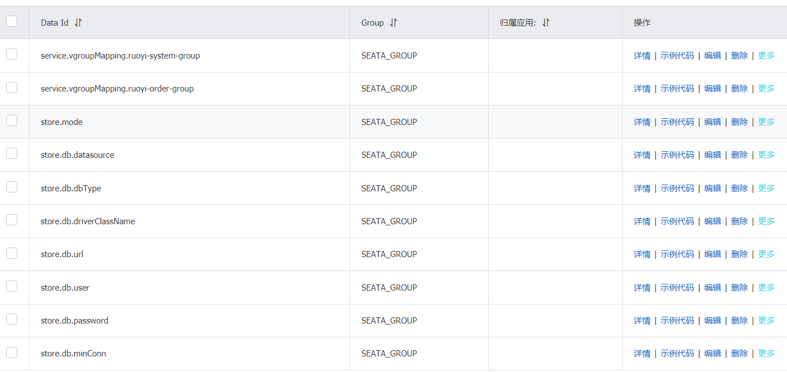

# Seata集合nacos使用

基于windows版,以下的配置中心在另外一个服务器，seata在windows服务器

下载：https://github.com/seata/seata/releases

配置：

## 	新建config.txt文件

```properties
service.vgroupMapping.ruoyi-system-group=default
service.vgroupMapping.ruoyi-order-group=default
store.mode=db
store.db.datasource=druid
store.db.dbType=mysql
store.db.driverClassName=com.mysql.jdbc.Driver
store.db.url=jdbc:mysql://127.0.0.1:3306/ry-seata?useUnicode=true
store.db.user=root
store.db.password=123
store.db.minConn=5
store.db.maxConn=30
store.db.globalTable=global_table
store.db.branchTable=branch_table
store.db.queryLimit=100
store.db.lockTable=lock_table
store.db.maxWait=5000
```

​	放在与seata的conf文件夹同一级目录

## 	service.vgroupMapping怎么写？开启seata配置

```
ruoyi-system-group对应配置文件中的tx-service-group参数
```

```yml
# spring配置
spring:
  redis:
    host: 192.168.84.105
    port: 6379
    password: 123456
  datasource:
    druid:
      stat-view-servlet:
        enabled: true
        loginUsername: admin
        loginPassword: 123456
    dynamic:
      primary: master #设置默认的数据源或者数据源组,默认值即为master
      strict: false #严格匹配数据源,默认false. true未匹配到指定数据源时抛异常,false使用默认数据源
      druid:
        initial-size: 5
        min-idle: 5
        maxActive: 20
        maxWait: 60000
        timeBetweenEvictionRunsMillis: 60000
        minEvictableIdleTimeMillis: 300000
        validationQuery: SELECT 1 FROM DUAL
        testWhileIdle: true
        testOnBorrow: false
        testOnReturn: false
        poolPreparedStatements: true
        maxPoolPreparedStatementPerConnectionSize: 20
        filters: stat,slf4j
        connectionProperties: druid.stat.mergeSql\=true;druid.stat.slowSqlMillis\=5000
      datasource:
        # 主库数据源
        master:
          driver-class-name: com.mysql.cj.jdbc.Driver
          url: jdbc:mysql://192.168.84.105:3306/ry-order?useUnicode=true&characterEncoding=utf8&zeroDateTimeBehavior=convertToNull&useSSL=true&serverTimezone=GMT%2B8
          username: root
          password: lastnine
          # 从库数据源
          # slave:
          # username:
          # password:
          # url:
          # driver-class-name:
      seata: true    # 开启seata代理，开启后默认每个数据源都代理，如果某个不需要代理可单独关闭

# seata配置
seata:
  # 默认关闭，如需启用spring.datasource.dynami.seata需要同时开启
  enabled: true
  # Seata 应用编号，默认为 ${spring.application.name}
  application-id: ${spring.application.name}
  # Seata 事务组编号，用于 TC 集群名
  tx-service-group: ${spring.application.name}-group
  # 关闭自动代理
  enable-auto-data-source-proxy: false
  # 服务配置项
  service:
    # 虚拟组和分组的映射
    vgroup-mapping:
      ruoyi-system-group: default
  config:
    type: nacos
    nacos:
      serverAddr: 192.168.84.105:8848
      group: SEATA_GROUP
      namespace:
  registry:
    type: nacos
    nacos:
      application: seata-server
      server-addr: 192.168.84.105:8848
      namespace:

# mybatis配置
mybatis:
  # 搜索指定包别名
  typeAliasesPackage: com.ruoyi.order
  # 配置mapper的扫描，找到所有的mapper.xml映射文件
  mapperLocations: classpath:mapper/**/*.xml
```

## 新建ry-seata数据库

```sql
DROP DATABASE IF EXISTS `ry-seata`;

CREATE DATABASE  `ry-seata` DEFAULT CHARACTER SET utf8mb4 COLLATE utf8mb4_general_ci;

SET NAMES utf8mb4;
SET FOREIGN_KEY_CHECKS = 0;

USE `ry-seata`;

-- -------------------------------- The script used when storeMode is 'db' --------------------------------
-- the table to store GlobalSession data
CREATE TABLE IF NOT EXISTS `global_table`
(
    `xid`                       VARCHAR(128) NOT NULL,
    `transaction_id`            BIGINT,
    `status`                    TINYINT      NOT NULL,
    `application_id`            VARCHAR(32),
    `transaction_service_group` VARCHAR(32),
    `transaction_name`          VARCHAR(128),
    `timeout`                   INT,
    `begin_time`                BIGINT,
    `application_data`          VARCHAR(2000),
    `gmt_create`                DATETIME,
    `gmt_modified`              DATETIME,
    PRIMARY KEY (`xid`),
    KEY `idx_gmt_modified_status` (`gmt_modified`, `status`),
    KEY `idx_transaction_id` (`transaction_id`)
) ENGINE = InnoDB
  DEFAULT CHARSET = utf8mb4;

-- the table to store BranchSession data
CREATE TABLE IF NOT EXISTS `branch_table`
(
    `branch_id`         BIGINT       NOT NULL,
    `xid`               VARCHAR(128) NOT NULL,
    `transaction_id`    BIGINT,
    `resource_group_id` VARCHAR(32),
    `resource_id`       VARCHAR(256),
    `branch_type`       VARCHAR(8),
    `status`            TINYINT,
    `client_id`         VARCHAR(64),
    `application_data`  VARCHAR(2000),
    `gmt_create`        DATETIME(6),
    `gmt_modified`      DATETIME(6),
    PRIMARY KEY (`branch_id`),
    KEY `idx_xid` (`xid`)
) ENGINE = InnoDB
  DEFAULT CHARSET = utf8mb4;

-- the table to store lock data
CREATE TABLE IF NOT EXISTS `lock_table`
(
    `row_key`        VARCHAR(128) NOT NULL,
    `xid`            VARCHAR(96),
    `transaction_id` BIGINT,
    `branch_id`      BIGINT       NOT NULL,
    `resource_id`    VARCHAR(256),
    `table_name`     VARCHAR(32),
    `pk`             VARCHAR(36),
    `gmt_create`     DATETIME,
    `gmt_modified`   DATETIME,
    PRIMARY KEY (`row_key`),
    KEY `idx_branch_id` (`branch_id`)
) ENGINE = InnoDB
  DEFAULT CHARSET = utf8mb4;

-- for AT mode you must to init this sql for you business database. the seata server not need it.
CREATE TABLE IF NOT EXISTS `undo_log`
(
    `branch_id`     BIGINT(20)   NOT NULL COMMENT 'branch transaction id',
    `xid`           VARCHAR(100) NOT NULL COMMENT 'global transaction id',
    `context`       VARCHAR(128) NOT NULL COMMENT 'undo_log context,such as serialization',
    `rollback_info` LONGBLOB     NOT NULL COMMENT 'rollback info',
    `log_status`    INT(11)      NOT NULL COMMENT '0:normal status,1:defense status',
    `log_created`   DATETIME(6)  NOT NULL COMMENT 'create datetime',
    `log_modified`  DATETIME(6)  NOT NULL COMMENT 'modify datetime',
    UNIQUE KEY `ux_undo_log` (`xid`, `branch_id`)
) ENGINE = InnoDB
  AUTO_INCREMENT = 1
  DEFAULT CHARSET = utf8mb4 COMMENT ='AT transaction mode undo table';
```

## 新建nacos-config.sh文件

放在seata的conf文件夹中

内容如下,需配置nacos地址

```sh
#!/usr/bin/env bash
# Copyright 1999-2019 Seata.io Group.
#
# Licensed under the Apache License, Version 2.0 (the "License");
# you may not use this file except in compliance with the License.
# You may obtain a copy of the License at、
#
#      http://www.apache.org/licenses/LICENSE-2.0
#
# Unless required by applicable law or agreed to in writing, software
# distributed under the License is distributed on an "AS IS" BASIS,
# WITHOUT WARRANTIES OR CONDITIONS OF ANY KIND, either express or implied.
# See the License for the specific language governing permissions and
# limitations under the License.

while getopts ":h:p:g:t:u:w:" opt
do
  case $opt in
  h)
    host=$OPTARG
    ;;
  p)
    port=$OPTARG
    ;;
  g)
    group=$OPTARG
    ;;
  t)
    tenant=$OPTARG
    ;;
  u)
    username=$OPTARG
    ;;
  w)
    password=$OPTARG
    ;;
  ?)
    echo " USAGE OPTION: $0 [-h host] [-p port] [-g group] [-t tenant] [-u username] [-w password] "
    exit 1
    ;;
  esac
done

urlencode() {
  for ((i=0; i < ${#1}; i++))
  do
    char="${1:$i:1}"
    case $char in
    [a-zA-Z0-9.~_-]) printf $char ;;
    *) printf '%%%02X' "'$char" ;;
    esac
  done
}

if [[ -z ${host} ]]; then
    # host=nacos地址
    host=192.168.84.105
fi
if [[ -z ${port} ]]; then
    port=8848
fi
if [[ -z ${group} ]]; then
    group="SEATA_GROUP"
fi
if [[ -z ${tenant} ]]; then
    tenant=""
fi
if [[ -z ${username} ]]; then
    username=""
fi
if [[ -z ${password} ]]; then
    password=""
fi

nacosAddr=$host:$port
contentType="content-type:application/json;charset=UTF-8"

echo "set nacosAddr=$nacosAddr"
echo "set group=$group"

failCount=0
tempLog=$(mktemp -u)
function addConfig() {
  curl -X POST -H "${contentType}" "http://$nacosAddr/nacos/v1/cs/configs?dataId=$(urlencode $1)&group=$group&content=$(urlencode $2)&tenant=$tenant&username=$username&password=$password" >"${tempLog}" 2>/dev/null
  if [[ -z $(cat "${tempLog}") ]]; then
    echo " Please check the cluster status. "
    exit 1
  fi
  if [[ $(cat "${tempLog}") =~ "true" ]]; then
    echo "Set $1=$2 successfully "
  else
    echo "Set $1=$2 failure "
    (( failCount++ ))
  fi
}

count=0
for line in $(cat $(dirname "$PWD")/config.txt | sed s/[[:space:]]//g); do
  (( count++ ))
	key=${line%%=*}
    value=${line#*=}
	addConfig "${key}" "${value}"
done

echo "========================================================================="
echo " Complete initialization parameters,  total-count:$count ,  failure-count:$failCount "
echo "========================================================================="

if [[ ${failCount} -eq 0 ]]; then
	echo " Init nacos config finished, please start seata-server. "
else
	echo " init nacos config fail. "
fi
```

运行 nacos-config.sh 192.168.84.105,运行完后会将config.txt中的配置信息发送到nacos配置中心里



## 修改seata/conf/registry.conf文件

将registry模块和config模块中的配置改为nacos

```
registry {
  # file 、nacos 、eureka、redis、zk、consul、etcd3、sofa
  type = "nacos"
  
  nacos {
    application = "seata-server"
    serverAddr = "192.168.84.105:8848"
    group = "SEATA_GROUP"
    namespace = ""
    cluster = "default"
    username = "nacos"
    password = "nacos"
  }
  eureka {
    serviceUrl = "http://localhost:8761/eureka"
    application = "default"
    weight = "1"
  }
  redis {
    serverAddr = "localhost:6379"
    db = 0
    password = ""
    cluster = "default"
    timeout = 0
  }
  zk {
    cluster = "default"
    serverAddr = "127.0.0.1:2181"
    sessionTimeout = 6000
    connectTimeout = 2000
    username = ""
    password = ""
  }
  consul {
    cluster = "default"
    serverAddr = "127.0.0.1:8500"
    aclToken = ""
  }
  etcd3 {
    cluster = "default"
    serverAddr = "http://localhost:2379"
  }
  sofa {
    serverAddr = "127.0.0.1:9603"
    application = "default"
    region = "DEFAULT_ZONE"
    datacenter = "DefaultDataCenter"
    cluster = "default"
    group = "SEATA_GROUP"
    addressWaitTime = "3000"
  }
  file {
    name = "file.conf"
  }
}

config {
  # file、nacos 、apollo、zk、consul、etcd3
  type = "nacos"
  
  nacos {
    serverAddr = "192.168.84.105:8848"
    namespace = ""
    group = "SEATA_GROUP"
    username = "nacos"
    password = "nacos"
  }
  consul {
    serverAddr = "127.0.0.1:8500"
    aclToken = ""
  }
  apollo {
    appId = "seata-server"
    ## apolloConfigService will cover apolloMeta
    apolloMeta = "http://192.168.1.204:8801"
    apolloConfigService = "http://192.168.1.204:8080"
    namespace = "application"
    apolloAccesskeySecret = ""
    cluster = "seata"
  }
  zk {
    serverAddr = "127.0.0.1:2181"
    sessionTimeout = 6000
    connectTimeout = 2000
    username = ""
    password = ""
    nodePath = "/seata/seata.properties"
  }
  etcd3 {
    serverAddr = "http://localhost:2379"
  }
  file {
    name = "file.conf"
  }
}
```

## 运行seata/bin下的seata-server.sh文件

## 示例

运行两个服务user和order，两个服务使用的不同的数据库，相关的依赖待续。。。。

RemoteSysUserService为在order服务中使用feign远程调用user服务

@GlobalTransactional第一个开启事务的方法必须添加seata的全局事务注解

```java
@Service
public class MyService {

    @Autowired
    private ITOrderService itOrderService;

    @Autowired
    private RemoteSysUserService remoteSysUserService;

    @Transactional
    @GlobalTransactional
    public void add(){
        final TOrder tOrder =
            new TOrder();
        tOrder.setName("order");
        tOrder.setUid(123L);
        itOrderService.insertTOrder(tOrder);

        final SysUser sysUser =
            new SysUser();
        sysUser.setUserName("taoqqqq");
        sysUser.setNickName("taoqqqqnn");
        remoteSysUserService.addUser(sysUser);
        int i = 1 / 0 ;
    }
}
```


## 遇到的问题

### Type id handling not implemented for type java.lang.Object (by serializer of type...

解决方案：将数据库字段为datatime类型的改为timestamp

### 'xxx'.undo_log doesn't exits，某某数据库中undo_log表不存在

解决方案：需要在设计分布式事务的每个数据库中添加一张undo_log表

```sql
CREATE TABLE `ry-order`.undo_log
(
    id            BIGINT(20) NOT NULL AUTO_INCREMENT,
    branch_id     BIGINT(20) NOT NULL,
    xid           VARCHAR(100) NOT NULL,
    context       VARCHAR(128) NOT NULL,
    rollback_info LONGBLOB     NOT NULL,
    log_status    INT(11) NOT NULL,
    log_created   DATETIME     NOT NULL,
    log_modified  DATETIME     NOT NULL,
    PRIMARY KEY (id),
    UNIQUE KEY ux_undo_log (xid, branch_id)
) ENGINE = InnoDB
  AUTO_INCREMENT = 1
  DEFAULT CHARSET = utf8mb4;
```
