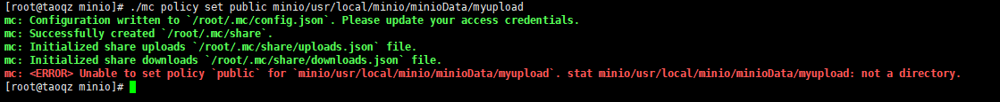
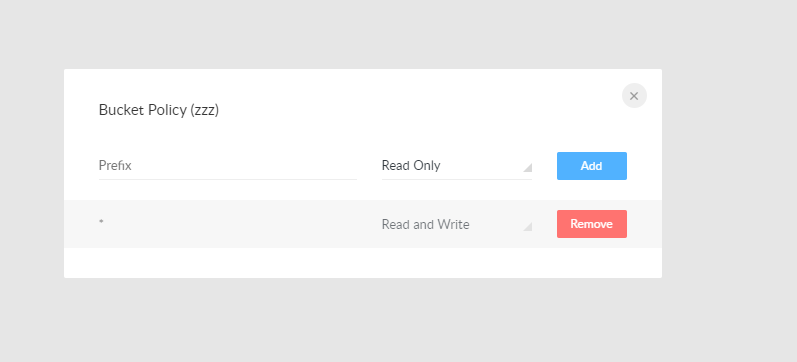

# Linux安装minio

##  minio下载地址

```
http://www.minio.org.cn/download.shtml#/linux
```

## 设置访问权限

​	访问权限的作用: minio中的资源通常需要nginx转发访问,如果想通过浏览器直接访问必须设置公开访问权限public,如果没有权限直接访问访问不到。

使用命令设置bucket的访问权限

```bash
mc policy set public /home/data/minioData/upload
```



在管理员界面设置bucket的访问权限(推荐)




## 后台启动

新建run.sh添加以下内容

添加运行权限

```bash
chmod 777 ./run.sh
```

```bash
# 账号
export MINIO_ACCESS_KEY=minioadmin
# 密码
export MINIO_SECRET_KEY=minioadmin
# nohup minio的server所在路径 server minio的存储文件所在路径
nohup /usr/local/minio/minio server /home/data/minioData &
```

## 结合java,springboot使用

### 依赖

```xml
<dependency>
    <groupId>org.springframework.boot</groupId>
    <artifactId>spring-boot-starter-web</artifactId>
</dependency>

<dependency>
    <groupId>cn.hutool</groupId>
    <artifactId>hutool-all</artifactId>
    <version>5.3.3</version>
</dependency>

<dependency>
    <groupId>io.minio</groupId>
    <artifactId>minio</artifactId>
    <version>6.0.8</version>
</dependency>
```

### 工具类

```java
package xyz.taoqz.utils;


import cn.hutool.core.collection.ConcurrentHashSet;
import cn.hutool.core.io.FileUtil;
import com.sun.javaws.exceptions.InvalidArgumentException;
import io.minio.MinioClient;
import io.minio.errors.*;
import org.slf4j.Logger;
import org.slf4j.LoggerFactory;
import org.springframework.beans.factory.annotation.Value;
import org.springframework.stereotype.Component;
import org.springframework.util.StringUtils;
import org.springframework.web.multipart.MultipartFile;
import org.xmlpull.v1.XmlPullParserException;
import xyz.taoqz.enums.FileBusinessModuleEnum;

import java.io.File;
import java.io.FileInputStream;
import java.io.IOException;
import java.io.InputStream;
import java.security.InvalidKeyException;
import java.security.NoSuchAlgorithmException;
import java.text.SimpleDateFormat;
import java.util.Date;
import java.util.Set;
import java.util.concurrent.atomic.AtomicInteger;

/**
 * 文件上传工具类
 * 上传文件目录结构为：
 * upload / 业务码 / 年月 / 日 / 时分秒毫秒 _ 文件名
 * bucket 和 文件名
 *
 * @author wujin
 * @date 2019/6/25
 */
@Component
public class FileUploadUtilByMinio {

    @Value("${minio.serverUrl}")
    private String serverUrl;
    @Value("${minio.accessKey}")
    private String accessKey;
    @Value("${minio.secretKey}")
    private String secretKey;
    @Value("${minio.tempserverUrl}")
    private String tempserverUrl;
    @Value("${minio.tempaccessKey}")
    private String tempaccessKey;
    @Value("${minio.tempsecretKey}")
    private String tempsecretKey;

    @Value("${minio.defaultBucket}")
    private String defaultBucket;

    @Value("${spring.profiles.active}")
    private String profileActive;
    @Value("${server.port}")
    private String serverPort;

    private final Set<String> bucketCreateSet = new ConcurrentHashSet<>();

    private static final String EMPTY_STRING = "";

    private static final String FILE_SEPARATOR = "/";

    private static final String DATE_STRING = "yyMM/dd";

    private static final String TIME_STRING = "HHmmssSSS";

    private static Logger log = LoggerFactory.getLogger(FileUploadUtilByMinio.class);

    /**
     * 上传文件到 默认模块下
     *
     * @author wujin
     * @date 2019/6/25
     */
    public String uploadByFilePath(String filePath) {
        return uploadByFilePath(filePath, FileBusinessModuleEnum.DEFAULT);
    }

    /**
     * 上传文件到 指定模块下
     *
     * @author wujin
     * @date 2019/6/25
     */
    public String uploadByFilePath(String filePath, FileBusinessModuleEnum bussinessModuleEnum) {
        return uploadByFilePath(filePath, bussinessModuleEnum, getFileNameByFilePath(filePath));
    }

    /**
     * 自定义文件名到 指定模块下
     *
     * @author wujin
     * @date 2019/6/25
     */
    public String uploadByFilePath(String filePath, FileBusinessModuleEnum bussinessModuleEnum, String fileName) {
        return uploadByFilePath(filePath, bussinessModuleEnum, defaultBucket, fileName);
    }

    /**
     * 自定义文件名到  指定模块、指定bucket
     *
     * @author wujin
     * @date 2019/6/25
     */
    private String uploadByFilePath(String filePath, FileBusinessModuleEnum bussinessModuleEnum, String fileBucket, String fileName) {
        try {
            MinioClient minioClient = new MinioClient(tempserverUrl, tempaccessKey, tempsecretKey);
            checkAndCreateBucket(minioClient, fileBucket);
            // 业务名 + 年月日 + 时分秒和文件名
            String objectName = getRandomFilePathByBussiness(bussinessModuleEnum, fileName);
            minioClient.putObject(fileBucket, objectName, filePath);
            log.info("minIO upload success");
            String url = minioClient.getObjectUrl(fileBucket, objectName);
            log.info("minIO upload url====: " + url);
            return FILE_SEPARATOR + fileBucket + FILE_SEPARATOR + objectName;
        } catch (Exception e) {
            log.error("minIO upload Error occurred: " + e);
        }
        return EMPTY_STRING;
    }

    /**
     * @param fileName (包含uuid + 文件名)
     * @author wujin
     * 2019年10月8日9:24:13
     */
    public String uploadForDocConvert(String filePath, String fileName) {
        try {
            MinioClient minioClient = new MinioClient(tempserverUrl, tempaccessKey, tempsecretKey);
            checkAndCreateBucket(minioClient, defaultBucket);
            // 业务名 + 年月/日 + 文件名
            String objectName = profileActive + FILE_SEPARATOR + FileBusinessModuleEnum.QUESTION_BANK_PIC.getBussCode() + FILE_SEPARATOR
                + getDateStringByType(DATE_STRING, new Date()) + FILE_SEPARATOR + fileName;
            minioClient.putObject(defaultBucket, objectName, filePath);
            log.info("minIO upload success");
            String url = minioClient.getObjectUrl(defaultBucket, objectName);
            log.info("minIO upload url====: " + url);
            return FILE_SEPARATOR + defaultBucket + FILE_SEPARATOR + objectName;
        } catch (Exception e) {
            log.error("minIO upload Error occurred: " + e);
        }
        return EMPTY_STRING;
    }


    private static AtomicInteger fileFlag = new AtomicInteger(10000);

    private String getRandomFilePathByBussiness(FileBusinessModuleEnum bussinessModuleEnum, String fileName) {
        String filePath = profileActive + FILE_SEPARATOR + bussinessModuleEnum.getBussCode() + FILE_SEPARATOR
            + getDateStringByType(DATE_STRING, new Date()) + FILE_SEPARATOR
            + getDateStringByType(TIME_STRING, new Date()) + "_" + serverPort + "_" + fileFlag.incrementAndGet() + "f";
        if (!StringUtils.isEmpty(fileName) && fileName.lastIndexOf(".") != -1) {
            String fileType = fileName.substring(fileName.lastIndexOf(".") + 1);
            filePath += ("." + fileType);
        }
        return filePath;
    }

    /**
     * 上传file 到某模块 及默认bucket
     *
     * @author wujin
     * @date 2019/6/26
     */
    public String uploadByMultipartFile(MultipartFile file, FileBusinessModuleEnum bussinessModuleEnum) {
        return uploadByMultipartFile(file, bussinessModuleEnum, defaultBucket);
    }

    public String uploadByFile(File file, FileBusinessModuleEnum bussinessModuleEnum) {
        return uploadByFile(file, bussinessModuleEnum, defaultBucket);
    }

    /**
     * 上传file 到某模块 某bucket
     *
     * @author wujin
     * @date 2019/6/26
     */
    private String uploadByMultipartFile(MultipartFile file, FileBusinessModuleEnum bussinessModuleEnum, String fileBucket) {
        try {
            MinioClient minioClient = new MinioClient(tempserverUrl, tempaccessKey, tempsecretKey);
            checkAndCreateBucket(minioClient, fileBucket);
            // 业务名 + 年月日 + 时分秒和文件名
            String objectName = getRandomFilePathByBussiness(bussinessModuleEnum, file.getOriginalFilename());
            minioClient.putObject(fileBucket, objectName, file.getInputStream(), file.getContentType());
            log.info("minIO upload success");
            /*String url = minioClient.getminioClientObjectUrl(fileBucket,objectName);
            log.info("minIO upload url====: "+url);*/
            return FILE_SEPARATOR + fileBucket + FILE_SEPARATOR + objectName;
        } catch (Exception e) {
            log.error("minIO upload Error occurred: " + e);
        }
        return EMPTY_STRING;
    }

    private String uploadByFile(File file, FileBusinessModuleEnum bussinessModuleEnum, String fileBucket) {
        try {
            MinioClient minioClient = new MinioClient(tempserverUrl, tempaccessKey, tempsecretKey);
            checkAndCreateBucket(minioClient, fileBucket);
            // 业务名 + 年月日 + 时分秒和文件名
            String objectName = getRandomFilePathByBussiness(bussinessModuleEnum, file.getName());
            FileInputStream fileInputStream = new FileInputStream(file);
            minioClient.putObject(fileBucket, objectName,fileInputStream, FileUtil.getMimeType(file.getAbsolutePath()));
            fileInputStream.close();
            log.info("minIO upload success");
            /*String url = minioClient.getminioClientObjectUrl(fileBucket,objectName);
            log.info("minIO upload url====: "+url);*/
            return FILE_SEPARATOR + fileBucket + FILE_SEPARATOR + objectName;
        } catch (Exception e) {
            log.error("minIO upload Error occurred: " + e);
        }
        return EMPTY_STRING;
    }

    public void deleteFileByPath(String filePath) {
        if (!StringUtils.isEmpty(filePath) && FILE_SEPARATOR.equals(filePath.substring(0, 1))) {
            filePath = filePath.substring(1);
            if (filePath.contains(FILE_SEPARATOR)) {
                String bucket = filePath.substring(0, filePath.indexOf(FILE_SEPARATOR));
                String objectName = filePath.substring(filePath.indexOf(FILE_SEPARATOR) + 1);
                try {
                    MinioClient minioClient = new MinioClient(serverUrl, accessKey, secretKey);
                    minioClient.removeObject(bucket, objectName);
                } catch (Exception e) {
                    log.error("minIO upload Error occurred: " + e);
                }
            }
        }
    }

    public String getFileTypeByFileName(String fileName) {
        if (StringUtils.isEmpty(fileName) || fileName.lastIndexOf(".") == -1) {
            return "";
        } else {
            return fileName.substring(fileName.lastIndexOf(".") + 1);
        }
    }

    private String getDateStringByType(String dateType, Date date) {
        SimpleDateFormat sdf = new SimpleDateFormat(dateType);
        return sdf.format(date);
    }

    private String getFileNameByFilePath(String filePath) {
        if (!StringUtils.isEmpty(filePath)) {
            if (filePath.contains(File.separator)) {
                return filePath.substring(filePath.lastIndexOf(File.separator) + 1);
            } else if (filePath.contains("/")) {
                return filePath.substring(filePath.lastIndexOf("/") + 1);
            } else if (filePath.contains("\\")) {
                return filePath.substring(filePath.lastIndexOf("\\") + 1);
            }
        }
        return EMPTY_STRING;
    }

    public InputStream downloadFileByStream(String bucket, String path) {
        InputStream inputStream = null;
        try {
            MinioClient minioClient = new MinioClient(serverUrl, accessKey, secretKey);
            inputStream = minioClient.getObject(bucket, path);

        } catch (InvalidEndpointException | InvalidPortException | InvalidBucketNameException | NoSuchAlgorithmException | InsufficientDataException | IOException | InvalidKeyException | NoResponseException | XmlPullParserException | ErrorResponseException | InternalException  | io.minio.errors.InvalidArgumentException e) {
            e.printStackTrace();
        }
        return inputStream;
    }

    public void downloadFile(String bucket, String path, String targetFile) {
        try {
            MinioClient minioClient = new MinioClient(serverUrl, accessKey, secretKey);
            minioClient.getObject(bucket, path, targetFile);
        } catch (Exception e) {
            e.printStackTrace();
        }
    }

    private void checkAndCreateBucket(MinioClient minioClient, String fileBucket) throws IOException, InvalidKeyException, NoSuchAlgorithmException, InsufficientDataException, InternalException, NoResponseException, InvalidBucketNameException, XmlPullParserException, ErrorResponseException, RegionConflictException {
        if (!bucketCreateSet.contains(fileBucket)) {
            synchronized (bucketCreateSet) {
                boolean isExist = minioClient.bucketExists(fileBucket);
                log.info("Bucket already exists flag:  " + fileBucket);
                if (!isExist) {
                    minioClient.makeBucket(fileBucket);
                }
                bucketCreateSet.add(fileBucket);
            }
        }
    }

    public boolean statObject(String filePath){
        boolean flag = false;
        if (!StringUtils.isEmpty(filePath) && FILE_SEPARATOR.equals(filePath.substring(0, 1))) {
            filePath = filePath.substring(1);
            if (filePath.contains(FILE_SEPARATOR)) {
                String bucket = filePath.substring(0, filePath.indexOf(FILE_SEPARATOR));
                String objectName = filePath.substring(filePath.indexOf(FILE_SEPARATOR) + 1);
                try {
                    MinioClient minioClient = new MinioClient(serverUrl, accessKey, secretKey);
                    minioClient.statObject(bucket, objectName);
                    flag = true;
                } catch (Exception e) {
                    log.error("minIO Object does not exist: " + e);
                }
            }
        }
        return flag;
    }

}
```

### 枚举类

```java
package xyz.taoqz.enums;

import java.util.HashMap;
import java.util.Map;

/**
 * @author wujin
 */

public enum FileBusinessModuleEnum {
    /**
     * 目录
     */
    DEFAULT("default", "通用目录")
        ;
    private final String bussCode;
    private final String bussMsg;

    FileBusinessModuleEnum(String bussCode, String bussMsg) {
        this.bussCode = bussCode;
        this.bussMsg = bussMsg;
    }

    private static final Map<String, FileBusinessModuleEnum> CURRENT_ENUM_MAP = new HashMap<>();

    static {
        for (FileBusinessModuleEnum type : FileBusinessModuleEnum.values()) {
            CURRENT_ENUM_MAP.put(type.getBussCode(), type);
        }
    }

    public static FileBusinessModuleEnum getEnumByCode(String code) {
        return CURRENT_ENUM_MAP.get(code) == null
            ? FileBusinessModuleEnum.DEFAULT : CURRENT_ENUM_MAP.get(code);
    }

    public String getBussCode() {
        return bussCode;
    }


    public String getBussMsg() {
        return bussMsg;
    }

}
```

### application.yml

```yml
server:
  port: 9099
spring:
  profiles:
    active: dev
  servlet:
    multipart:
      max-request-size: 200MB
      max-file-size: 100MB
minio:
  serverUrl: http://39.107.142.3:9000
  accessKey: minio
  secretKey: tao.120908!!!
  tempserverUrl: http://39.107.142.3:9000
  tempaccessKey: minio
  tempsecretKey: tao.120908!!!
  defaultBucket: myupload
```

### controller

```java
@RestController
@RequestMapping("/upload")
public class UploadController {

    private final FileUploadUtilByMinio fileUploadUtilByMinio;

    public UploadController(FileUploadUtilByMinio fileUploadUtilByMinio) {
        this.fileUploadUtilByMinio = fileUploadUtilByMinio;
    }

    @PostMapping
    public String fun(MultipartFile file) {
        fileUploadUtilByMinio.uploadByMultipartFile(file, FileBusinessModuleEnum.BOOK_CATALOG);
        return "OK!!";
    }
}
```

