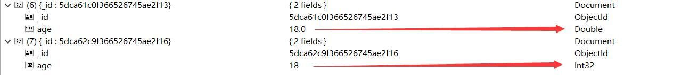
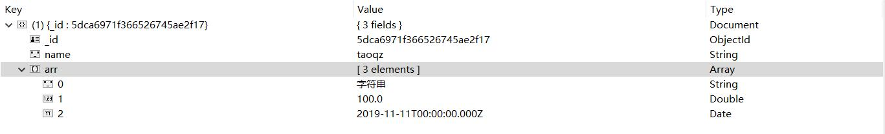

# 1. 简介

​	MongoDB是一个基于分布式文件存储的数据库,是非关系型数据库(NoSQL)

​	分布式文件存储:在mongodb中也叫分片管理,将数据库中存储的数据分散在不同的机器上,减缓了数据库的压力,提高响应速度


# 2. Mongdb与MySQL的区别


## 2.1 结构


|  MySQL   |  MongoDB   |        对应关系         |
| :------: | :--------: | :---------------------: |
| database |  database  |           库            |
|  table   | collection |         表;集合         |
|   row    |  document  | 一行数据(记录);一个文档 |
|  column  |   field    |         列;字段         |

## 	

## 2.2 数据及存储方式


|                   | SQL                                                          | NoSQL                                                        |
| :---------------- | ------------------------------------------------------------ | ------------------------------------------------------------ |
| 存储方式          | 存在特定结构表中                                             | 更加灵活和可扩展,简单说就是在集合中每个文档可以有不相同个数或类型 |
| 表/集合数据的关系 | 必须定义好表和字段结构后才能添加数据,虽然表结构定义后可更新,比较复杂 | 数据可以在任何时候任何地方添加，不需要先定义表               |
| 多表查询          | 可以使用JOIN表连接方式将多个关系数据表中的数据用一条简单的查询语句查询出来 | 大多非关系型数据库不支持(MongoDB 3.2后可以指定*同一*数据库中的集合以执行连接 ) |
| 数据耦合性        | 不允许删除已经被使用的外部数据(外键),规范方式设置外键,也可手动维护 | NoSQL中没有这种强耦合的概念，可以随时删除任何数据            |

## 	

## 2.3 优缺点


|      |                            NoSQL                             |                             SQL                              |
| ---- | :----------------------------------------------------------: | :----------------------------------------------------------: |
| 优点 |                   扩展简单,快速读写,成本低                   | 是所有关系型数据库的通用语言(差别不大),移植性好,数据统计方便直观,事务处理,保持数据的一致性 |
| 缺点 | 不提供对SQL的支持,大部分非关系型数据不支持事务,现有 产品不够成熟(MongoDB4.0提供了事务的API) | 扩展困难,读写慢(当数据量达到一定规模时),成本高(企业级的需要付费的) |


## 2.4 使用场景

​	单从功能上讲,NoSQL几乎所有的功能,在关系型数据库上都能满足,所以选择NoSQL主要是和关系型数据库进

行结合使用,各取所长

​        比如说数据库中的表结构需要经常变化,增加字段,如果在一个百万级数据量的关系型数据库中新增字段会有很

多问题,而使用非关系型数据库极大提升扩展性,也可以作为缓存数据库,典型就是Redis


# 3.数据类型

​	mongodb存储数据的格式为BSON,和JSON很像,是JSON的扩展


mongodb支持的所有的数据类型:

[mongo官网]: https://docs.mongodb.com/manual/reference/operator/query/type/index.html	"mongo官网"


| Type                    | Number | Alias                 | Notes               |
| :---------------------- | :----- | :-------------------- | :------------------ |
| Double                  | 1      | “double”              |                     |
| String                  | 2      | “string”              |                     |
| Object                  | 3      | “object”              |                     |
| Array                   | 4      | “array”               |                     |
| Binary data             | 5      | “binData”             |                     |
| Undefined               | 6      | “undefined”           | Deprecated.         |
| ObjectId                | 7      | “objectId”            |                     |
| Boolean                 | 8      | “bool”                |                     |
| Date                    | 9      | “date”                |                     |
| Null                    | 10     | “null”                |                     |
| Regular Expression      | 11     | “regex”               |                     |
| DBPointer               | 12     | “dbPointer”           | Deprecated.         |
| JavaScript              | 13     | “javascript”          |                     |
| Symbol                  | 14     | “symbol”              | Deprecated.         |
| JavaScript (with scope) | 15     | “javascriptWithScope” |                     |
| 32-bit integer          | 16     | “int”                 |                     |
| Timestamp               | 17     | “timestamp”           |                     |
| 64-bit integer          | 18     | “long”                |                     |
| Decimal128              | 19     | “decimal”             | New in version 3.4. |
| Min key                 | -1     | “minKey”              |                     |
| Max key                 | 127    | “maxKey”              |                     |

​	

​	JSON   :  布尔、数字、字符串、数组和对象

​			没有日期类型,只有一种数字类型,无法区分浮点数和整数,也没法表示正则表达式或者函数

​	BSON : 是一种类JSON的二进制形式的存储格式,有JSON没有的一些数据类型,如Date,BinData(二进制数据)

## 3.1 数值类型

​	mongodb的数值类型默认使用64位浮点型数值,整型可以使用NumberInt(值)或者NumberLong (值)

```javascript
db.emp.insert({age:18})
db.emp.find({age:18}) // 如果有int类型会同时查询出来

{ 
    "_id" : ObjectId("5dca61c0f366526745ae2f13"), 
    "age" : 18.0
}
======================================
// NumberInt 插入 NumberLong 同理
db.emp.insert({age:NumberInt(18)})
// $type : 可以使用此命令查询对应的数据类型
// 可以使用上面表格中的Number 也可以使用 Alias
db.emp.find({age:{$type:"int"}})

{ 
    "_id" : ObjectId("5dca62c9f366526745ae2f16"), 
    "age" : NumberInt(18)
}

```




## 3.2 数组类型

​	

```javascript
db.emp.insert({
    _id:new ObjectId(),
    name:'taoqz',
    arr:[
    	'字符串',
    	100,
    	new Date("2019-11-11")
    ]
})

db.emp.findOne({name:"taoqz"})
// 数组中支持不同的类型
{ 
    "_id" : ObjectId("5dca6971f366526745ae2f17"), 
    "name" : "taoqz", 
    "arr" : [
        "字符串", 
        100.0, 
        ISODate("2019-11-11T00:00:00.000+0000")
    ]
}
```





## 3.3 日期类型

```javascript

// 构建一个格林尼治时间   可以看到正好和我们的时间相差8小时，我们是+8时区，也就是时差相差8
new Date()
new Date("1999-10-09T18:56:01")
// 真实时间是要比下面的时间大八个小时的
ISODate("2019-11-12T08:30:50.060Z")

// 此问题在Java中结合springboot时可以在对应的字段上添加下面注释
@JsonFormat(pattern = "yyyy-MM-dd HH:mm:ss",timezone = "GMT+8")
```


## 3.4 ObjectId

​	ObjectId使用12字节的存储空间，每个字节可以存储两个十六进制数字，所以一共可以存储24个十六进制数

字组成的字符串，在这24个字符串中，前8位表示时间戳，接下来6位是一个机器码，接下来4位表示进程id，最后

6位表示计数器

​	是文档的唯一标识,没有自增,如果不添加id会自动添加一个 "_id" : ObjectId("值")

```javascript
db.emp.insert({_id:new ObjectId(),name:"zz"})
db.emp.findOne({name:"zz"})

{ 
    "_id" : ObjectId("5dca6eb4f366526745ae2f18"), 
    "name" : "zz"
}

```


## 3.5 typeof 和$type

​	

```javascript
typeof 1
number

typeof "zz"
string
```

​	每个数据类型对应一个数字，在MongoDB中可以使用$type操作符查看字段的数据类型

​	$type:根据数据类型查找数据 {字段:{$type:数字}} {字段:{$type:"数据类型"}}

## 3.6 null

​	用于表示空值或者不存在的字段 ,在查询的时候也可能会使用到


# 4.命令行启动

## 4.1 启动服务

​		net start 服务名 (管理员cmd)

## 4.2 运行mongodb

​		mongo 

## 4.3 基本操作

查看所有数据库

```
show dbs
```

查看所有集合

```
show tables | show collections
```

查看当前所在数据库

```
db
```

使用数据库

```
use db_name 
```

删除数据库

```
db.dropDatabase() # 删除当前正在使用的数据库
```

使用集合

```
db.collection_name.find()  # 查所有满足条件数据
db.collection_name.findOne()  # 查满足条件的一条数据
db.collection_name.count()  # 统计集合下面有多少数量的数据
```

删除集合

```
db.collection_name.drop()
```

创建数据库和集合

```
# 当你使用一个不存在的mongo数据库时,就自动创建了一个mongo数据库
# 同理当你往一个空集合里面插入了一条数据之后就自动创建了一个集合
```

查看当前数据库版本

```
db.version()
```

备份数据库

```
// 导出 如果没有设置账号密码 可以省略 
mongodump --host IP --port 端口 -u 用户名 -p 密码 -d 数据库 -o 文件路径
// 导入
mongorestore --host  --port  -d  文件路径
```

# 5.使用

## 5.1 基本概念

​		数据库(database)

​		集合(collection)

​		文档(document)

​		一个数据库由多个集合组成,一个集合中有许多文档,文档是最小的存储单位

##  5.2 添加

### insertOne(对象)

```javascript
// 添加一条数据
db.emp.insertOne({name:"张三"})
// 返回的数据,也可以定义变量接收
{ 
    "acknowledged" : true, 
    "insertedId" : ObjectId("5dca9ef4f366526745ae2f1a")
}

```

### insertMany(数组)

```javascript
// 添加多条数据
db.emp.insertMany([{name:"李四"},{name:"王五"}])
{ 
    "acknowledged" : true, 
    "insertedIds" : [
        ObjectId("5dca9f91f366526745ae2f1c"), 
        ObjectId("5dca9f91f366526745ae2f1d")
    ]
}


```

### 	insert(文档对象或数组)

```javascript
// 添加一条或者多条
db.emp.insert({name:"赵六"})
WriteResult({ "nInserted" : 1 })

db.emp.insert([{name:"田七"},{name:"吴八"}])
BulkWriteResult({
	"writeErrors" : [ ],
	"writeConcernErrors" : [ ],
	"nInserted" : 2,
	"nUpserted" : 0,
	"nMatched" : 0,
	"nModified" : 0,
	"nRemoved" : 0,
	"upserted" : [ ]
})
```


```javascript

// 查询所有
db.emp.find({})
{ 
    "_id" : ObjectId("5dca9f2bf366526745ae2f1b"), 
    "name" : "张三"
}
// ----------------------------------------------
{ 
    "_id" : ObjectId("5dca9f91f366526745ae2f1c"), 
    "name" : "李四"
}
// ----------------------------------------------
{ 
    "_id" : ObjectId("5dca9f91f366526745ae2f1d"), 
    "name" : "王五"
}
// ----------------------------------------------
{ 
    "_id" : ObjectId("5dca9feef366526745ae2f1e"), 
    "name" : "赵六"
}
// ----------------------------------------------
{ 
    "_id" : ObjectId("5dcaa017f366526745ae2f1f"), 
    "name" : "田七"
}
// ----------------------------------------------
{ 
    "_id" : ObjectId("5dcaa017f366526745ae2f20"), 
    "name" : "吴八"
}
// 可以看到在插入时并没有指定id,确自动生成了一个_id
// 在插入的时候如果已经存在了相同的id会报错
// 如果想要存在相同的id的时候不报错而是更新数据 请使用 save方法
```

​	


### save

```javascript
// 当集合中没有此条数据,进行插入
db.emp.save({_id:"1",name:"阿里"})

WriteResult({ "nMatched" : 0, "nUpserted" : 1, "nModified" : 0, "_id" : "1" })

-----------------------------------------------------------------------------
// 有数据时会进行替换,而不是更新,更新会有专门针对字段更新的API
db.emp.save({_id:"1",name:"腾讯",boss:"马化腾"})

// 				一处匹配							 一处修改
WriteResult({ "nMatched" : 1, "nUpserted" : 0, "nModified" : 1 })
-----------------------------------------------------------------------------
// 查询结果
{ 
    "_id" : "1", 
    "name" : "腾讯", 
    "boss" : "马化腾"
}
```


## save和insert的区别

save和insert的区别 如果save没有指定id,直接插入

​				如果save指定了id,并且id已存在会替换已有的文档

## 5.3 删除

​	

```javascript
// 插入两条数据
{ 
    "_id" : ObjectId("5dcaa5445feb59ece4310397"), 
    "name" : "小王", 
    "age" : NumberInt(18)
}
// ----------------------------------------------
{ 
    "_id" : ObjectId("5dcaa5445feb59ece4310398"), 
    "name" : "小红", 
    "age" : NumberInt(18)
}


```


### deteleOne

```javascript
// 参数为空文档会集合中第一条文档
db.student.deleteOne({})

{ 
    "acknowledged" : true, 
    "deletedCount" : 1.0
}
// 两条命令效果一样
// $eq:==   $gt:>   $gte:>=   $lt:<   $lte:<=   $ne:!=  
db.student.deleteOne({age:18})
db.student.deleteOne({age:{$eq:18}})

// 集合中有两行匹配条件但只删除了第一条
{ 
    "acknowledged" : true, 
    "deletedCount" : 1.0
}
```

### deleteMany

```javascript

// 删除多条数据
// 如果传入空文档 会删除整个集合中的数据
db.student.deleteMany({})

{ 
    "acknowledged" : true, 
    "deletedCount" : 2.0
}
// 使用该命令会删除所有的匹配项
db.student.deleteMany({age:18})

{ 
    "acknowledged" : true, 
    "deletedCount" : 2.0
}

```

### remove

```javascript

// 指定删除 会删除所有匹配项
db.student.remove({name:"小王"})
db.student.remove({age:18})
```


## 5.4 查询

### find	

```javascript
// 查询所有
// 直接使用集合名称
db.student.find()
// 指定集合名称
db.getCollection("student").find({})
```


### findOne

```javascript
// 只查询到第一个匹配到的
db.student.findOne({age:{$eq:18}})
// 会查询到所有匹配的
db.student.find({age:{$eq:18}})
```


## 5.5 更新

​	数据

```javascript
{ 
    "_id" : 1.0, 
    "name" : "水浒传", 
    "publisher" : "施耐庵", 
    "tags" : [
        "小说", 
        "电视剧"
    ], 
    "view" : 0.0, 
    "flag" : 1.0
}
// ----------------------------------------------
{ 
    "_id" : 2.0, 
    "name" : "红楼梦", 
    "publisher" : "曹雪芹", 
    "tags" : [
        "小说", 
        "电视剧"
    ], 
    "view" : 0.0, 
    "flag" : 1.0
}
```


### updateOne

```javascript
// 更新 
db.books.updateOne({flag:1},{$set:{name:"newName"}})

{ 
    "acknowledged" : true, 
    "matchedCount" : 1.0, 
    "modifiedCount" : 1.0
}
// 只更新了第一条
{ 
    "_id" : 1.0, 
    "name" : "newName", 
    "publisher" : "施耐庵", 
    "tags" : [
        "小说", 
        "电视剧"
    ], 
    "view" : 0.0, 
    "flag" : 1.0
}
// ----------------------------------------------
{ 
    "_id" : 2.0, 
    "name" : "红楼梦", 
    "publisher" : "曹雪芹", 
    "tags" : [
        "小说", 
        "电视剧"
    ], 
    "view" : 0.0, 
    "flag" : 1.0
}
```


### updateMany

```
// 重新初始化数据后使用该命令会修改所有匹配项
db.books.updateMany({flag:1},{$set:{name:"newName"}})
```


### update

和使用updateOne效果一样


### 结合参数使用

```javascript
// 语法
db.collection.update(
   <query>,
   <update>,
   {
     upsert: <boolean>,
     multi: <boolean>,
     writeConcern: <document>
   }
)

query: 查询的条件
update: 可以配合操作符更新字段
upsert: 可选 当没有匹配项时,是否作为新的对象插入,默认false不插入
multi: 可选 默认false,只更新匹配的第一条记录,如果为true,将跟新所有匹配项


// 例如 可以弥补上面update时只更新一个匹配项
db.books.update({flag:1},{$set:{name:"newName"}},false,true)
// 没有匹配项会添加
db.books.update({name:"西游记"},{name:"西游记"},true)

{ 
    "_id" : 1.0, 
    "name" : "水浒传", 
    "publisher" : "施耐庵", 
    "tags" : [
        "小说", 
        "电视剧"
    ], 
    "view" : 0.0, 
    "flag" : 1.0
}
// ----------------------------------------------
{ 
    "_id" : 2.0, 
    "name" : "红楼梦", 
    "publisher" : "曹雪芹", 
    "tags" : [
        "小说", 
        "电视剧"
    ], 
    "view" : 0.0, 
    "flag" : 1.0
}
// ----------------------------------------------
{ 
    "_id" : ObjectId("5dcab070763517547f7d8d95"), 
    "name" : "西游记"
}
```


# 6.常用操作符

## 	$set

​			在更新时可以一个或多个字段

​			如果更新的字段不存在会添加该字段

```javascript
{ 
    "_id" : 1.0, 
    "name" : "水浒传", 
    "publisher" : "施耐庵", 
    "tags" : [
        "小说", 
        "电视剧"
    ], 
    "view" : 0.0
}
// 更新flag和view字段 但flag字段之前不存在 进行了添加
db.books.update({_id:1},{$set:{flag:11,view:100}})
WriteResult({ "nMatched" : 1, "nUpserted" : 0, "nModified" : 1 })

{ 
    "_id" : 1.0, 
    "name" : "水浒传", 
    "publisher" : "施耐庵", 
    "tags" : [
        "小说", 
        "电视剧"
    ], 
    "view" : 100.0, 
    "flag" : 11.0
}

```


## $unset

​	删除字段

```javascript
{ 
    "_id" : 1.0, 
    "name" : "水浒传", 
    "publisher" : "施耐庵", 
    "tags" : [
        "小说", 
        "电视剧"
    ], 
    "view" : 0.0, 
    "flag" : 1.0
}

// 将flag字段删除,其中flag的值可以随意写不用匹配
db.books.update({_id:1},{$unset:{flag:11}})
WriteResult({ "nMatched" : 1, "nUpserted" : 0, "nModified" : 1 })

{ 
    "_id" : 1.0, 
    "name" : "水浒传", 
    "publisher" : "施耐庵", 
    "tags" : [
        "小说", 
        "电视剧"
    ], 
    "view" : 0.0
}
```


## $inc

​	自增或自减

```javascript
{ 
    "_id" : 1.0, 
    "name" : "水浒传", 
    "publisher" : "施耐庵", 
    "tags" : [
        "小说", 
        "电视剧"
    ], 
    "view" : 0.0
}

// 将view字段自增10
db.books.update({_id:1},{$inc:{view:+10}})
WriteResult({ "nMatched" : 1, "nUpserted" : 0, "nModified" : 1 })

{ 
    "_id" : 1.0, 
    "name" : "水浒传", 
    "publisher" : "施耐庵", 
    "tags" : [
        "小说", 
        "电视剧"
    ], 
    "view" : 10.0
}
```


## $exists

​	匹配字段是否存在

```javascript
// 格式 {字段:{$exists:boolean}} 
// 如果为true 匹配到所有有该字段的文档,包括null值
// false 则匹配没有该字段的文档
db.books.find({flag:{$exists:true}})
```


## $in

​	相当于mysql中的in

​	是否在对应的范围

```javascript
// 会匹配到对应字段在对应范围中的所有文档
db.books.find({_id:{$in:[1,3]}})
```


## $or

​	或者

​	格式:{ $or: [ { <expression1> }, { <expression2> }, ... , { <expressionN> } ] }

```javascript
{ 
    "_id" : 1.0, 
    "name" : "水浒传", 
    "publisher" : "施耐庵", 
    "tags" : [
        "小说", 
        "电视剧"
    ], 
    "view" : 100.0, 
    "flag" : 11.0
}
// ----------------------------------------------
{ 
    "_id" : 2.0, 
    "name" : "西游记", 
    "publisher" : "吴承恩", 
    "tags" : [
        "小说", 
        "电视剧"
    ], 
    "view" : 0.0, 
    "flag" : 0.0
}
// ----------------------------------------------
{ 
    "_id" : 3.0, 
    "name" : "zz"
}
// ----------------------------------------------
{ 
    "_id" : 4.0, 
    "name" : "qwe", 
    "flag" : null
}

// 查询名字水浒传或者view大于等于0或者拥有flag字段的文档
db.books.find({$or:[
    {name:"水浒传"},
   	{view:{$gte:0}},
   	{flag:{$exists:true}}
   ]})

```


## $and

​	并且

​	格式:{ $and: [ { <expression1> }, { <expression2> } , ... , { <expressionN> } ] }


```javascript
{ 
    "_id" : 1.0, 
    "name" : "水浒传", 
    "publisher" : "施耐庵", 
    "tags" : [
        "小说", 
        "电视剧"
    ], 
    "view" : 100.0, 
    "flag" : 11.0
}
// ----------------------------------------------
{ 
    "_id" : 2.0, 
    "name" : "西游记", 
    "publisher" : "吴承恩", 
    "tags" : [
        "小说", 
        "电视剧"
    ], 
    "view" : 100.0
}
// 查询view大于等于100 并且存在flag字段的文档
 db.books.find({$and:[
       {view:{$gte:100}},
       {flag:{$exists:true}}
       ]})

{ 
    "_id" : 1.0, 
    "name" : "水浒传", 
    "publisher" : "施耐庵", 
    "tags" : [
        "小说", 
        "电视剧"
    ], 
    "view" : 100.0, 
    "flag" : 11.0
}
```


## $sort

​	排序

```
// 按照id 倒叙排序 
// -1 从大到小
// 1 从小到大
db.books.find({}).sort({_id:-1})   
```


## $skip $limit

​	[`$skip`](https://docs.mongodb.com/manual/reference/operator/aggregation/skip/index.html#pipe._S_skip) 采用一个正整数，该整数指定要跳过的最大文档数。

​	[`$limit`](https://docs.mongodb.com/manual/reference/operator/aggregation/limit/index.html#pipe._S_limit) 采用一个正整数，该整数指定要传递的最大文档数。

​	作用相当于mysql中的limit 两者可以结合使用

skip(), limilt(), sort()三个放在一起执行的时候，执行的顺序是先 sort(), 然后是 skip()，最后是显示的 limit()。


# 7.操作数组


# 8. 整合springboot简单增删改查

## 	8.1 项目环境

​		mongodb: 4.0.9

​		java:1.8

​		springboot:2.2.0

​		idea : 2019

​		使用了lombok简化实体类的代码

## 	 8.2 pom依赖及配置

```properties
spring.data.mongodb.uri=mongodb://127.0.0.1:27017/testdb
```


```xml
 <parent>
        <groupId>org.springframework.boot</groupId>
        <artifactId>spring-boot-starter-parent</artifactId>
        <version>2.2.0.RELEASE</version>
    </parent>

    <dependencies>

        <dependency>
            <groupId>org.springframework.boot</groupId>
            <artifactId>spring-boot-starter-data-mongodb</artifactId>
        </dependency>
        <dependency>
            <groupId>org.springframework.boot</groupId>
            <artifactId>spring-boot-starter-web</artifactId>
        </dependency>
        
        <dependency>
            <groupId>org.projectlombok</groupId>
            <artifactId>lombok</artifactId>
            <version>1.18.8</version>
        </dependency>

    </dependencies>

```


## 	8.3 代码


#### 实体类

```javascript
@Data
// 指定集合名称
@Document(collection = "students")
public class Student {

    // ObjectId 
    @Id
    private String id;
	// 将mongo中的字段名与pojo中的字段名进行映射,字段名称和mongo字段名一样时会自动进行映射,也就是不写该注解也可以 
    @Field(name = "sid")
    private Integer sid;

    private String name;

    @DateTimeFormat(pattern = "yyyy-MM-dd HH:mm:dd")
    @JsonFormat(pattern = "yyyy-MM-dd HH:mm:dd",timezone = "GMT+8")
    private Date birthday;

    private String classId;

    private Classes classes;

    private String hobbies[];

    // @Transient 如果pojo中有mongo不存在的字段,在映射时进行排除
}
```

#### controller

```javascript
@RestController
@CrossOrigin("*")
@RequestMapping("/student")
public class StudentController {

    @Autowired
    private StudentDao studentDao;

    /**
     * 查询所有
     * @return
     */
    @GetMapping
    public List<Student> fun() {
        return studentDao.findAll();
    }

    /**
     * 添加
     * @param student
     */
    @PostMapping
    public void add(@RequestBody Student student) {
        studentDao.save(student);
    }

    /**
     * 修改
     * @param student
     */
    @PutMapping
    public void edit(@RequestBody Student student) {
        studentDao.update(student);
    }

    /**
     * 根据字段及值 进行删除
     * @param filedName
     * @param value
     */
    @DeleteMapping
    public void deleteByFiledName(@RequestParam(name = "filedName") String filedName, String value) {
        studentDao.deleteByFiledName(filedName, value);
    }

}
```

#### dao

```javascript
@Repository
public class StudentDao {

    @Autowired
    private MongoTemplate mongoTemplate;

    /**
     * 查询所有
     * @return
     */
    public List<Student> findAll(){
        List<Student> all = mongoTemplate.findAll(Student.class);
        for (Student student : all) {
            if (student.getClassId() != null){
                // 拿到每个学生对应的班级id 创建ObjectId对象
                ObjectId objectId = new ObjectId(student.getClassId());
                // 根据班级id查询班级
                Classes one = mongoTemplate.findOne(new Query(Criteria.where("id").is(objectId)), Classes.class);
                // 将班级添加到学生对象中
                student.setClasses(one);
            }
        }
        return all;
    }

    /**
     * 添加
     * @param student
     */
    public void save(Student student) {
        // 可以在笔记中看到两者的区别
        mongoTemplate.insert(student);
//        mongoTemplate.save(student);
    }

    /**
     * 更新
     * @param student
     */
    public void update(Student student) {
        // 查询条件 根据id
        Query id = Query.query(Criteria.where("_id").is(student.getId()));
        // 创建文档对象
        Document document = new Document();
        // 向文档中追加数据 更新哪个字段添加哪个字段
        document.append("name",student.getName()).append("birthday",student.getBirthday())
                .append("hobbies",student.getHobbies());
        // 根据id 根据文档对象进行更新
        // 因为是根据ObjectId进行更新所以唯一 使用updateFirst 只更新第一条
        mongoTemplate.updateFirst(id, Update.fromDocument(document),Student.class);
//        更新所有能匹配的文档
//        mongoTemplate.updateMulti();
    }

    /**
     * 根据字段名称删除文档
     * @param filedName 字段名称
     * @param value 字段对应的值
     */
    public void deleteByFiledName(String filedName,String value){
        Query query = Query.query(Criteria.where(filedName).is(value));
        mongoTemplate.remove(query, Student.class);
    }

}

```


