# MyBatis XML版


MyBatis3官方文档 

 https://mybatis.org/mybatis-3/zh/configuration.html#environments

## 延迟加载

针对有关联关系的对象,只加载单表,在属性需要时进行加载(查询数据库),如果开启了延迟加载,根据配置决定是否延迟加载

可以通过日志测试

```xml
    <settings>
        <!-- 驼峰映射   -->
        <setting name="mapUnderscoreToCamelCase" value="true"/>
        <!--开启日志打印-->
<!--        <setting name="logImpl" value="STDOUT_LOGGING"/>-->
        <setting name="logImpl" value="LOG4J"/>

        <!-- 延迟加载总开关 -->
<!--        延迟加载的全局开关。当开启时，所有关联对象都会延迟加载。
            特定关联关系中可通过设置 fetchType 属性来覆盖该项的开关状态 default:false-->
        <setting name="lazyLoadingEnabled" value="true" />

        <!-- 设置按需加载 default:false （在 3.4.1 及之前的版本中默认为 true）-->
<!--        开启时，任一方法的调用都会加载该对象的所有延迟加载属性。 -->
<!--        否则，每个延迟加载属性会按需加载（参考 lazyLoadTriggerMethods)。-->
<!--        本人测试 单独使用时无论  true或false 都会加载关联属性-->
        <setting name="aggressiveLazyLoading" value="false" />

<!--        lazyLoadTriggerMethods-->
<!--        指定对象的哪些方法触发一次延迟加载。	用逗号分隔的方法列表。-->
<!--        随意指定一个方法 覆盖默认方法测试-->
        <setting name="lazyLoadTriggerMethods" value="getClass"/>
<!--        默认 这四个属性很特殊,都可能会用到所有属性,所以作为默认方法-->
<!--        <setting name="lazyLoadTriggerMethods" value="equals,clone,hashCode,toString"/>-->
    </settings>
```


## 缓存

缓存的意义将⽤户经常查询的数据放在缓存（内存）中，⽤户去查询数据就不⽤从磁盘上(关系型数据库
数据⽂件)查询，从缓存中查询，从⽽提⾼查询效率，解决了⾼并发系统的性能问题。

### 一级缓存

mybatis默认开启一级缓存

```java
TeacherMapper mapper = MyBatisUtil.getMapper(TeacherMapper.class);
System.out.println(mapper.findById(1));
System.out.println(mapper.findById(2));
System.out.println(mapper.findById(1));
```


#### 更新操作会清空缓存

##### update和insert操作

```java
TeacherMapper mapper = MyBatisUtil.getMapper(TeacherMapper.class);
System.out.println(mapper.findById(1));
//        mapper.insert(new Teacher());
mapper.update(new Teacher());
System.out.println(mapper.findById(1));
```


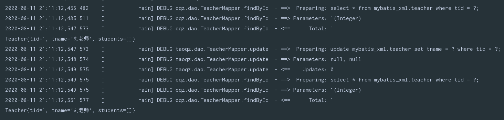

##### delete操作

无论真正是否删除都会清除缓存

```java
TeacherMapper mapper = MyBatisUtil.getMapper(TeacherMapper.class);
System.out.println(mapper.findById(1));
mapper.deleteById(100);
System.out.println(mapper.findById(1));
```


#### 清除缓存

如果是更新操作会清除缓存

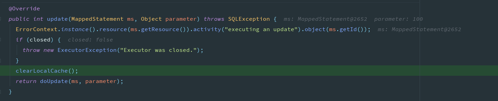

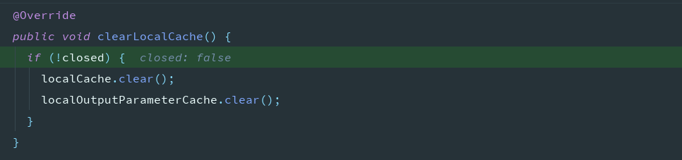

或者缓存的级别是STATEMENT

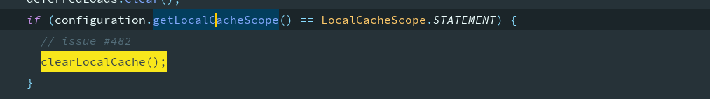

如果不想设置为STATEMENT,但是想清除本次的缓存可以使用SqlSession的清除缓存的方法

```java
sqlSession1.clearCache();
```

最终会落实到PerpetualCache类上

```java
private final Map<Object, Object> cache = new HashMap<>();

@Override
public void clear() {
  cache.clear();
}
```

```java
// 在下面类中存储了全局的配置信息
package org.apache.ibatis.session;
public class Configuration {}
```


#### 一级缓存是SqlSession级别的

​		从下图可以看出,分别使用mapper1查询和mapper2更新,在mapper1中获取仍是更新前的数据,也就是脏数据,可以在配置文件中设置缓存范围

```xml
<setting name="localCacheScope" value="STATEMENT"/>
```

​	这样每次执行完一个Mapper中的语句后都会将一级缓存清除,同时也证实了一级缓存是SqlSession级别的

```java
SqlSession sqlSession1= MyBatisCacheUtil.openSession();
SqlSession sqlSession2 = MyBatisCacheUtil.openSession();
System.out.println(sqlSession1);
System.out.println(sqlSession2);

TeacherMapper mapper1 = sqlSession1.getMapper(TeacherMapper.class);
TeacherMapper mapper2 = sqlSession2.getMapper(TeacherMapper.class);

System.out.println("mapper1 select"+mapper1.findById(1));
System.out.println("mapper1 select"+mapper1.findById(1));
Teacher teacher = new Teacher(1, "Pink老师");
System.out.println("mapper2 update"+mapper2.update(teacher));

System.out.println("mapper1 select"+mapper1.findById(1));
System.out.println("mapper2 select"+mapper2.findById(1));
```


#### 一级缓存的执行流程


##### 跟读源码

几个重点关注的类

```
// 执行sql相关
CachingExecutor
BaseExecutor

// 动态代理相关
Method			package java.lang.reflect;
Invocation

// 缓存相关
Cache
CacheKey
PerpetualCache
```

###### 添加缓存

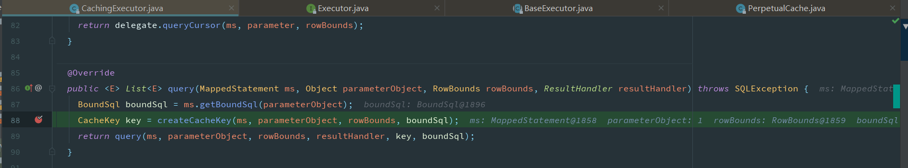


key的组成部分

```
StatementId : nameSpace + 方法id
offset
limit
sql
param
environment
```


从缓存获取

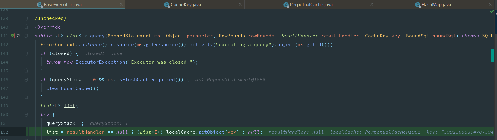

获取不到时从数据库查询


最终还是要落实到PreparedStatement上


将数据保存到PerpetualCache类中定义的

```java
private final Map<Object, Object> cache = new HashMap<>();
```

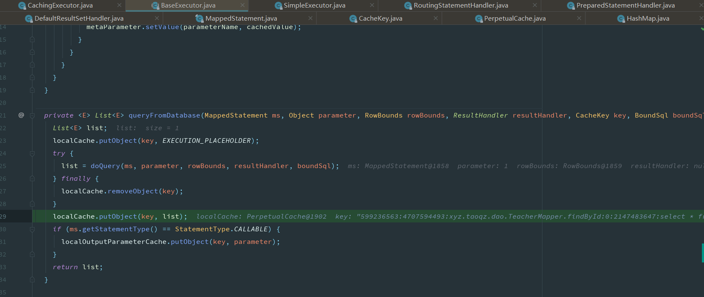

###### 获取缓存

比较key时会用到的方法

CacheKey内部的equals()和hashcode()

```java
 @Override
  public boolean equals(Object object) {
    if (this == object) {
      return true;
    }
    if (!(object instanceof CacheKey)) {
      return false;
    }

    final CacheKey cacheKey = (CacheKey) object;

    if (hashcode != cacheKey.hashcode) {
      return false;
    }
    if (checksum != cacheKey.checksum) {
      return false;
    }
    if (count != cacheKey.count) {
      return false;
    }

    for (int i = 0; i < updateList.size(); i++) {
      Object thisObject = updateList.get(i);
      Object thatObject = cacheKey.updateList.get(i);
      if (!ArrayUtil.equals(thisObject, thatObject)) {
        return false;
      }
    }
    return true;
  }

  @Override
  public int hashCode() {
    return hashcode;
  }
```


### 二级缓存

​	 首先总结一下一级缓存,**默认开启一级缓存**,也就是session级别的,**同一个sqlsession内共享缓存**,但是每次执行**更新操作时会清空缓存**,这里的**更新操作泛指insert、update和delete**,如果想禁用一级缓存则需要把等级调至**STATEMENT**,意为每一条执行语句都会独立执行,不会创建缓存,也可以调用sqlseesion的方法**手动清除缓存**。

​	缓存的接口是**Cache**,最终会落实到**PerpetualCache**类中,该类中定义了一个Map集合,操作缓存数据,也就是在操作该map集合,其中该map集合的key为**CacheKey**,此类会将通过update方法闯入内部的变量进行计算得出hashCode值,具体变量在上面有提出。

​	但由于一级缓存的范围只在sqlsession同一会话级别,如果想把范围缩小可以将范围改为STATEMENT级别,但是将范围扩大就需要使用到二级缓存了

#### 开启二级缓存

从源码可以看出,二级缓存是默认开启的


```xml
<!-- 开启⼆级缓存,是默认开启 -->
<setting name="cacheEnabled" value="true"/>
```

但是二级缓存将范围扩大到了不同的会话,同时颗粒度细分到了namespace,也就是sql映射文件中,需要在使用二级缓存的配置文件中设置

```xml
<cache/>
```

测试是否开启二级缓存,不同的sqlsession是否共享缓存

```java
@Test
public void demo() {
    SqlSession sqlSession1 = MyBatisCacheUtil.openSession();
    SqlSession sqlSession2 = MyBatisCacheUtil.openSession();

    GradeMapper mapper1 = sqlSession1.getMapper(GradeMapper.class);
    GradeMapper mapper2 = sqlSession2.getMapper(GradeMapper.class);

    System.out.println("mapper1  " + mapper1.findById(1));
    System.out.println("mapper2  " + mapper2.findById(1));
    //        sqlSession1.commit();
    //        sqlSession1.close();
    System.out.println("mapper2  " + mapper2.findById(1));

}
```


从上图中可以看到我们预期的不同的sqlsession间共享缓存并没有成功(但是一级缓存还是会生效),将代码改为如下后再次执行

```java
@Test
public void demo() {
    SqlSession sqlSession1 = MyBatisCacheUtil.openSession();
    SqlSession sqlSession2 = MyBatisCacheUtil.openSession();

    GradeMapper mapper1 = sqlSession1.getMapper(GradeMapper.class);
    GradeMapper mapper2 = sqlSession2.getMapper(GradeMapper.class);

    System.out.println("mapper1  " + mapper1.findById(1));
    //        手动提交
    sqlSession1.commit();
    //        或者关闭
    //        sqlSession1.close();
    System.out.println("mapper2  " + mapper2.findById(1));
    System.out.println("mapper2  " + mapper2.findById(1));

}
```

可以看到二级缓存也生效了

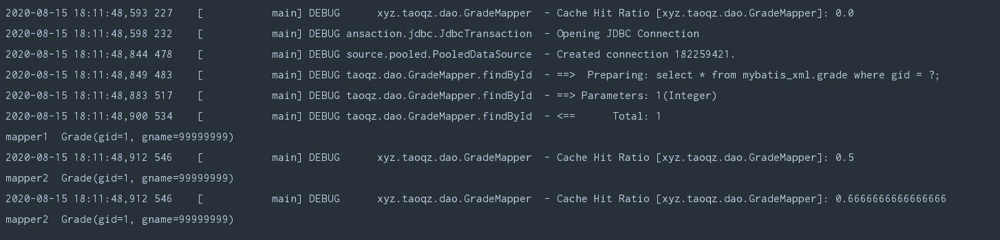

但是需要我们手动提交,自动提交不会生效,这是为什么,追踪提交的源码

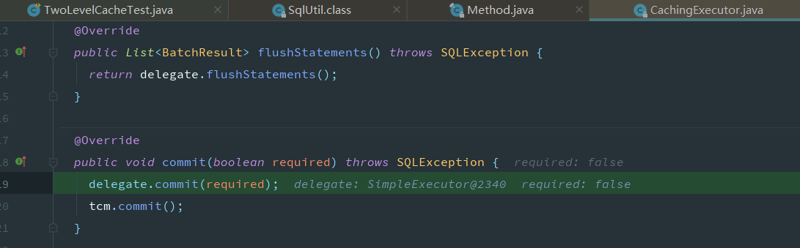


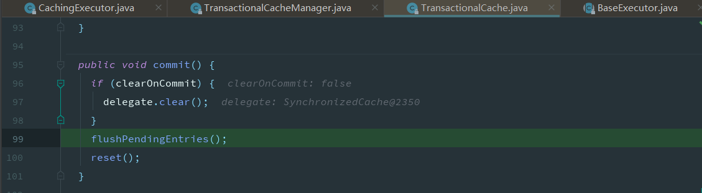

此时还没有开始遍历,缓存中还没有数据


在手动提交后,执行图下方法后才会将数据真正的添加到缓存区中,之前存储在了由TransactionalCacheManager内部的TransactionalCache的

```java
private final Map<Object, Object> entriesToAddOnCommit
```

中,也就是暂存区,是为了避免数据不提交或者数据回滚后造成的数据脏读问题,只有在提交后才会将暂存处存储的数据放至缓存区

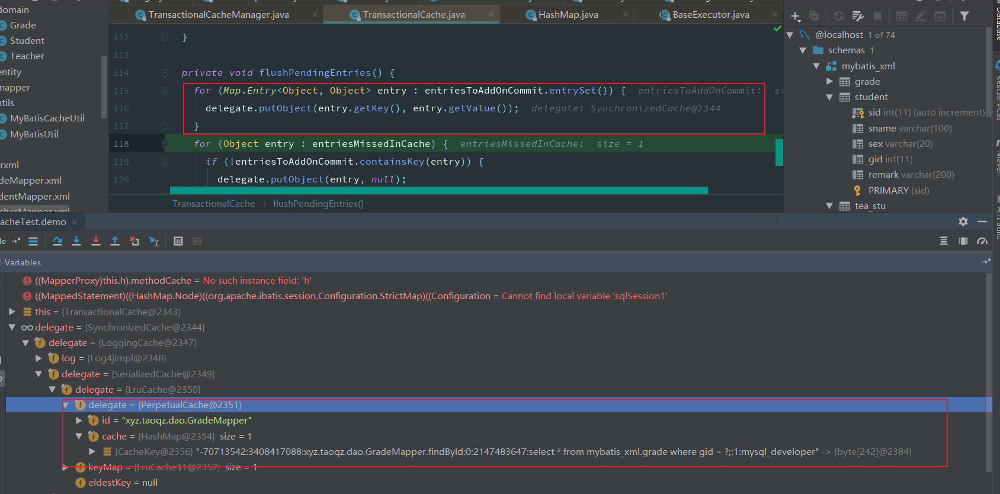

查询时获取缓存,从MappedStatement中获取缓存,此时的缓存是在读取配置文件时,如果添加了缓存的标签,会创建对应的缓存对象

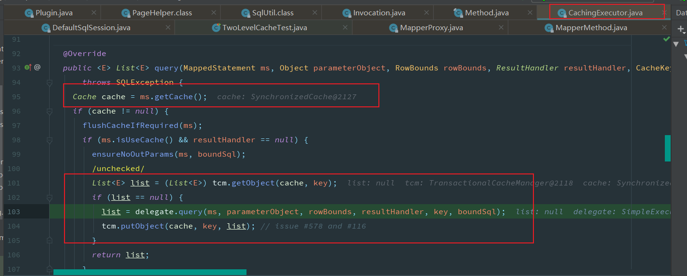

根据映射文件填充MappedStatement

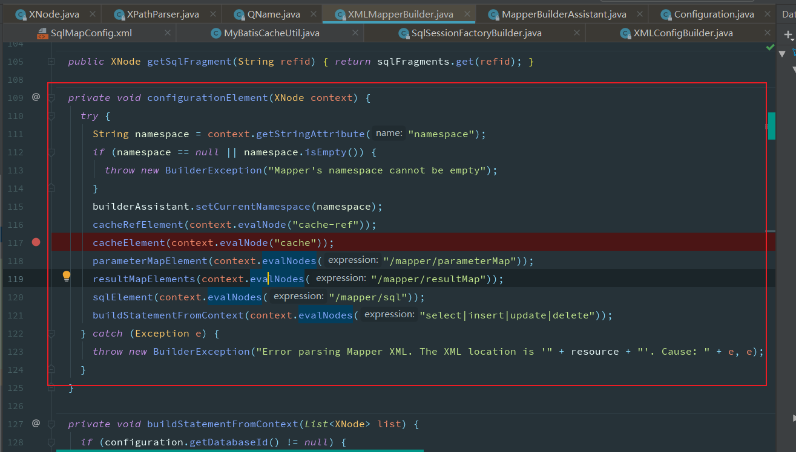

读取缓存相关的配置信息


根据读取到的属性创建Cache


build时对cache做了包装,装饰器模式,具体的装饰链。

```java
SynchronizedCache -> LoggingCache -> SerializedCache -> LruCache -> PerpetualCache。
    
SynchronizedCache：同步Cache，实现比较简单，直接使用synchronized修饰方法。
LoggingCache：日志功能，装饰类，用于记录缓存的命中率，如果开启了DEBUG模式，则会输出命中率日志。
SerializedCache：序列化功能，将值序列化后存到缓存中。该功能用于缓存返回一份实例的Copy，用于保存线程安全。
LruCache：采用了Lru算法的Cache实现，移除最近最少使用的Key/Value。
PerpetualCache： 作为为最基础的缓存类，底层实现比较简单，直接使用了HashMap。
```

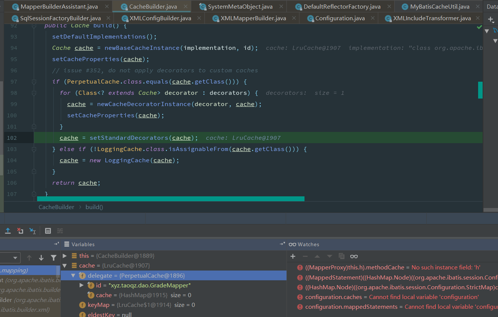

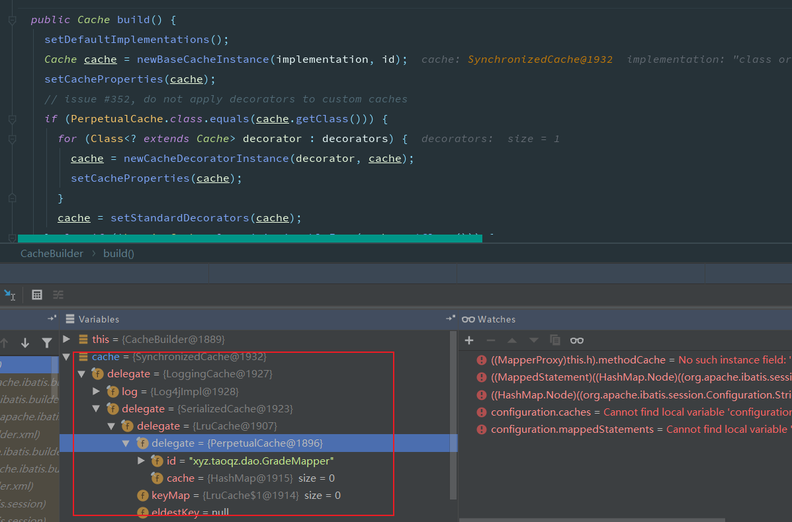

其中我们看到日志输出的命中率就是由LoggingCache做的,还有一层LruCache(队列方式存储缓存)

```java
public class LoggingCache implements Cache {

    private final Log log;
    private final Cache delegate;
    protected int requests = 0;
    protected int hits = 0;

    @Override
    public Object getObject(Object key) {
        // 请求次数
        requests++;
        final Object value = delegate.getObject(key);
        if (value != null) {
            // 命中次数
            hits++;
        }
        if (log.isDebugEnabled()) {
            log.debug("Cache Hit Ratio [" + getId() + "]: " + getHitRatio());
        }
        return value;
    }

    private double getHitRatio() {
        return (double) hits / (double) requests;
    }
}
```

id是映射文件的namespace


获取id将缓存对象添加到Configuration中

 

#### 二级缓存关联查询

虽然二级缓存使用了TransactionalCacheManager和TransactionalCache来保证数据提交后进行缓存的更新,避免了脏读,但是这也只是单个独立的namespace级别的,如果有关联对象,那么关联对象发生变化时,不会进行及时更新(感应不到其他namespace的变化)

效果

```java
@Test
public void refCache(){
    SqlSession sqlSession1 = MyBatisCacheUtil.openSession();
    SqlSession sqlSession2 = MyBatisCacheUtil.openSession();

    GradeMapper gradeMapper = sqlSession1.getMapper(GradeMapper.class);
    SchoolMapper schoolMapper = sqlSession2.getMapper(SchoolMapper.class);
    System.out.println(gradeMapper.findById(1));
    sqlSession1.commit();
    School school = new School();
    school.setCid(1);
    school.setCname("交大");
    schoolMapper.update(school);
    sqlSession2.commit();
    System.out.println(gradeMapper.findById(1));

}
```

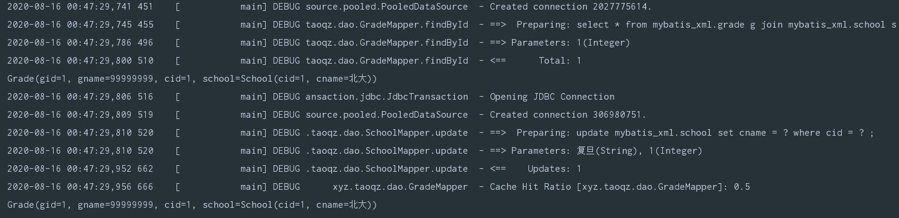

在对应的SchoolMapper.xml中添加

```xml
<cache-ref namespace="xyz.taoqz.dao.GradeMapper"/>
```

后的效果,可以感知主表的更新,也就是将范围扩大到了不同的namespace,其中只要有namespace有更新操作,就会更新共同的Cache

```java
@Test
public void refCache(){
    SqlSession sqlSession1 = MyBatisCacheUtil.openSession();
    SqlSession sqlSession2 = MyBatisCacheUtil.openSession();

    GradeMapper gradeMapper = sqlSession1.getMapper(GradeMapper.class);
    SchoolMapper schoolMapper = sqlSession2.getMapper(SchoolMapper.class);
    System.out.println(gradeMapper.findById(1));
    sqlSession1.commit();
    School school = new School();
    school.setCid(1);
    school.setCname("交大");
    schoolMapper.update(school);
    // 必须手动提交,才会更新缓存
    sqlSession2.commit();
    System.out.println(gradeMapper.findById(1));

}
```


有更新操作时,将对应的cache的标记clearOnCommit改为true,在提交时清空缓存

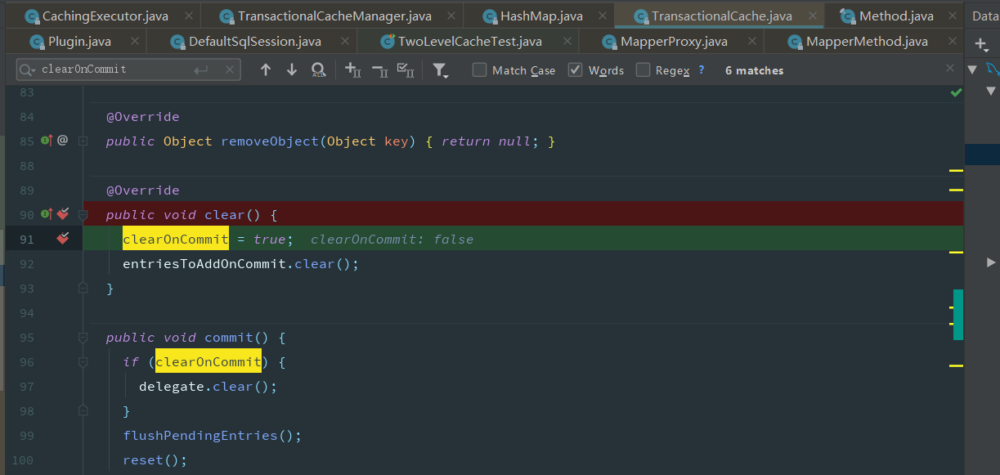

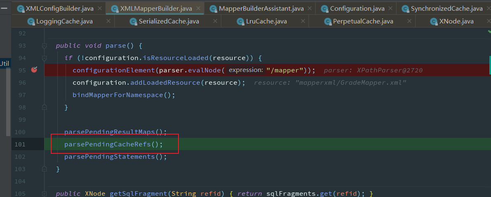


```java
<cache-ref namespace="xyz.taoqz.dao.GradeMapper"/>
```

映射文件中如果有cache-ref 标签,在读取配置文件创建初始信息时,如果其对应名称的cache还没有创建,会将其保存至一个linkedlist集合的尾部,等到对应的namespace的cache创建好时,与其使用同一个cache,以此来达到数据更新时同步更新同一个cache

#### LruCache

其主要实现为如下,map是一个有存储限制的队列map,如果存储过大,将最前面的数据清除,也就是队列,先进先出,从而达到其清除最久未使用的缓存效果

```java
/**
 * Lru (least recently used) cache decorator.
 *
 * @author Clinton Begin
 */
public class LruCache implements Cache {

  private final Cache delegate;
  private Map<Object, Object> keyMap;
  private Object eldestKey;

  public LruCache(Cache delegate) {
    this.delegate = delegate;
    setSize(1024);
  }

  @Override
  public String getId() {
    return delegate.getId();
  }

  @Override
  public int getSize() {
    return delegate.getSize();
  }

  public void setSize(final int size) {
    keyMap = new LinkedHashMap<Object, Object>(size, .75F, true) {
      private static final long serialVersionUID = 4267176411845948333L;

      @Override
      protected boolean removeEldestEntry(Map.Entry<Object, Object> eldest) {
        boolean tooBig = size() > size;
        if (tooBig) {
          eldestKey = eldest.getKey();
        }
        return tooBig;
      }
    };
  }

  @Override
  public void putObject(Object key, Object value) {
    delegate.putObject(key, value);
    cycleKeyList(key);
  }

  @Override
  public Object getObject(Object key) {
    keyMap.get(key); // touch
    return delegate.getObject(key);
  }

  @Override
  public Object removeObject(Object key) {
    return delegate.removeObject(key);
  }

  @Override
  public void clear() {
    delegate.clear();
    keyMap.clear();
  }

  private void cycleKeyList(Object key) {
    keyMap.put(key, key);
    if (eldestKey != null) {
      delegate.removeObject(eldestKey);
      eldestKey = null;
    }
  }

}
```

```java
private Object eldestKey;

@Test
public void demo4(){
    int size = 3;
    LinkedHashMap<Object, Object> map = new LinkedHashMap<>(5);

    map  = new LinkedHashMap<Object, Object>(size, .75F, true) {
        private static final long serialVersionUID = 4267176411845948333L;

        @Override
        protected boolean removeEldestEntry(Map.Entry<Object, Object> eldest) {
            boolean tooBig = size() > size;
            if (tooBig) {
                eldestKey = eldest.getKey();
            }
            return tooBig;
        }
    };

    map.put("1","1");
    map.put("2","2");
    map.put("3","3");
    map.put("4","4");
    System.out.println(map);
}
// 打印结果
// {2=2, 3=3, 4=4}
```

#### 二级缓存注意事项

实体类必须实现Serializable接口(Cache的装饰者其中有一层用到了序列化,可以通过提交后报错查看)

### 自定义缓存


#### 其他配置

这行语句的默认配置

```xml
<cache/>
```

- 映射语句文件中的所有 select 语句的结果将会被缓存。
- 映射语句文件中的所有 insert、update 和 delete 语句会刷新缓存。
- 缓存会使用最近最少使用算法（LRU, Least Recently Used）算法来清除不需要的缓存。
- 缓存不会定时进行刷新（也就是说，没有刷新间隔）。
- 缓存会保存列表或对象（无论查询方法返回哪种）的 1024 个引用。
- 缓存会被视为读/写缓存，这意味着获取到的对象并不是共享的，可以安全地被调用者修改，而不干扰其他调用者或线程所做的潜在修改。

这些属性可以修改

```xml
<cache
  eviction="FIFO"
  flushInterval="60000"
  size="512"
  readOnly="true"/>
```

这个更高级的配置创建了一个 FIFO 缓存，每隔 60 秒刷新，最多可以存储结果对象或列表的 512 个引用，而且返回的对象被认为是只读的，因此对它们进行修改可能会在不同线程中的调用者产生冲突。

可用的清除策略有：

- `LRU` – 最近最少使用：移除最长时间不被使用的对象。
- `FIFO` – 先进先出：按对象进入缓存的顺序来移除它们。
- `SOFT` – 软引用：基于垃圾回收器状态和软引用规则移除对象。
- `WEAK` – 弱引用：更积极地基于垃圾收集器状态和弱引用规则移除对象。

默认的清除策略是 LRU。

flushInterval（刷新间隔）属性可以被设置为任意的正整数，设置的值应该是一个以毫秒为单位的合理时间量。 默认情况是不设置，也就是没有刷新间隔，缓存仅仅会在调用语句时刷新。

size（引用数目）属性可以被设置为任意正整数，要注意欲缓存对象的大小和运行环境中可用的内存资源。默认值是 1024。

readOnly（只读）属性可以被设置为 true 或 false。只读的缓存会给所有调用者返回缓存对象的相同实例。 因此这些对象不能被修改。这就提供了可观的性能提升。而可读写的缓存会（通过序列化）返回缓存对象的拷贝。 速度上会慢一些，但是更安全，因此默认值是 false。

**提示** 二级缓存是事务性的。这意味着，当 SqlSession 完成并提交时，或是完成并回滚，但没有执行 flushCache=true 的 insert/delete/update 语句时，缓存会获得更新。


请注意，缓存的配置和缓存实例会被绑定到 SQL 映射文件的命名空间中。 因此，同一命名空间中的所有语句和缓存将通过命名空间绑定在一起。 每条语句可以自定义与缓存交互的方式，或将它们完全排除于缓存之外，这可以通过在每条语句上使用两个简单属性来达成。 默认情况下，语句会这样来配置：

```xml
<select ... flushCache="false" useCache="true"/>
<insert ... flushCache="true"/>
<update ... flushCache="true"/>
<delete ... flushCache="true"/>
```

鉴于这是默认行为，显然你永远不应该以这样的方式显式配置一条语句。但如果你想改变默认的行为，只需要设置 flushCache 和 useCache 属性。比如，某些情况下你可能希望特定 select 语句的结果排除于缓存之外，或希望一条 select 语句清空缓存。类似地，你可能希望某些 update 语句执行时不要刷新缓存。

## 注意事项

- Mybatis的⼀级缓存是sqlSession级别的。只能访问⾃⼰的sqlSession内的缓存。如果Mybatis与Spring整合了，Spring会⾃动关闭sqlSession的。所以⼀级缓存会失效的。

- ⼀级缓存的原理是map集合，Mybatis默认就⽀持⼀级缓存

- ⼆级缓存是Mapper级别的。只要在Mapper命名空间下都可以使⽤⼆级缓存。需要我们⾃⼰⼿动
	去配置⼆级缓存

- Mybatis的缓存我们可以使⽤Ehcache框架来进⾏管理，Ehcache实现Cache接⼝就代表使⽤Ehcache来环境Mybatis缓存。

- 由于之前写的DaoImpl是有⾮常多的硬编码的。可以使⽤Mapper代理的⽅式来简化开发

	命名空间要与JavaBean的全类名相同
	sql⽚段语句的id要与Dao接⼝的⽅法名相同
	⽅法的参数和返回值要与SQL⽚段的接收参数类型和返回类型相同。


## 问题

### resultMap和resultType的区别

​		两种都可以描述返回值的类型,在返回值为非对象和对象,无论对象是单个对象还是一个集合时都可以使用resultType,当需要使用关联对象的映射时需要使用resultMap,一般使用resultMap即可,一般都作用在select标签上,两者必须选其一,否则会报如下错误

```
Cause: org.apache.ibatis.executor.ExecutorException: A query was run and no Result Maps were found for the Mapped Statement 'xyz.taoqz.domain.Student.findAll'.  It's likely that neither a Result Type nor a Result Map was specified.
```


### 为什么Mapper中的方法不能重载

mybatis在操作时底层会将所有的配置信息读取到Configuration类中，同时mapper中的每个方法也会被保存到一个map里，而这个map的key就是namespace+方法名，而方法重载则是方法名形同参数不同，所以这种存储机制不允许方法重载


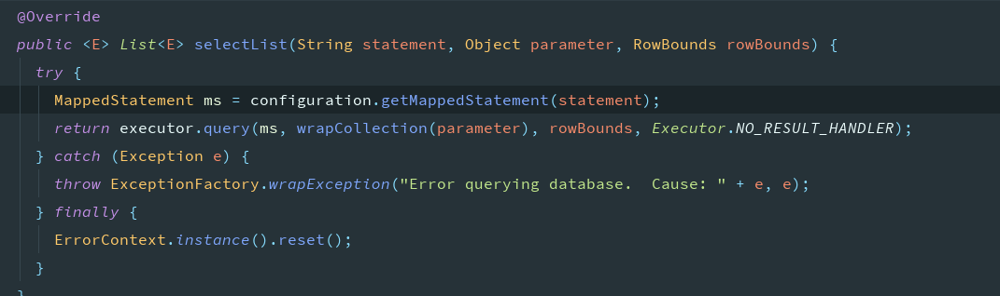


## 博客

http://www.justdojava.com/2019/07/13/MyBatis-OneLevelCache/

https://tech.meituan.com/2018/01/19/mybatis-cache.html

https://mybatis.org/mybatis-3/zh/sqlmap-xml.html#cache

https://www.codenong.com/cs107068256/

https://juejin.im/post/6847902224975314958