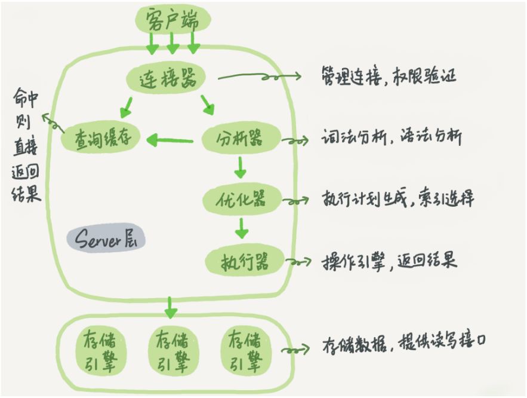

# MySQL架构

## mysql逻辑架构图



大体上mysql分为客户端、Server层、存储引擎层。

Server层包括连接器、查询缓存、分析器、优化器、执行器等，涵盖mysql的大多数核心服务功能，以及所有的内置函数（如日期、时间、数学和加密函数等），所有跨存储引擎的功能都在这一层实现，比如存储过程、触发器、视图等。

而存储引擎层负责数据的存储和提取，支持InnoDB、MyISAM、Memory等，最常用的是InnoDB，其也是mysql5.5.5版本后默认的存储引擎，如果需要使用别的存储引擎，在create table语句后添加engine=memory来指定表所使用的存储引擎。

## 连接器

负责跟客户端建立连接、获取权限、维持和管理连接。

```mysql
mysql -h$host -P$port -u$user -p$password	
```

如果认证成功，连接器回到权限表查出当前用户拥有的权限，之后，这个连接里面的权限判断逻辑，都将依赖与此时读到的权限，这意味着，一个用户建立连接后，即使你用管理员账户对这个用户做了权限的修改，也不会影响之前存在的连接，需要再建立新的连接才会使用新的权限。

连接完成后，如果没有后续的动作，这个连接会处于空闲状态，可以通过命令查询所有连接

```
show processlist;
```

客户端如果太长时间没有动静，连接器会自动断开，这个时间是由参数wait_timeout控制，默认8小时，如果再连接被断开时候，客户端再次发送请求，就会收到一条 Lost connnection to MySQL server during query，此时需要重新连接发送请求。

数据库里面的长连接指如果客户端持续有请求，则一直使用同一个连接，短连接是指每次执行完很少的几次查询就断开连接，下次查询新建一个，但是建立连接的过程复杂，尽量减少创建连接的过程，但是全部使用长连接后，有时mysql占用内存涨的特别快，因为mysql在执行时临时使用的内存时管理在链接对象里面的，这些资源再连接断开的时候才释放，长时间积累下来可能导致内存占用太大，被系统强行杀掉，从现象看就是MySQL异常重启了。

解决方案:

定期断开长连接，如果使用的是5.7版本及以上，可以使用mysql_reset_connnection来重新初始化连接，这个过程不会重连和重新做权限认证。

## 查询缓存

mysql拿到一个查询请求后，会先到查询缓存看看之前是否执行过这条语句，如果存在那么之前的查询结果会被返回，如果不存在，继续执行，执行结果会被缓存，但是查询缓存的失效非常频繁，只要有对一个表的更新，这个表上所有的查询缓存都会被清除，因此查询缓存的命中率会非常低，mysql8.0版本直接将查询缓存的整块功能删掉了。

## 分析器

分析器会先对sql语句进行词法分析，比如通过select关键字识别出来这是一个查询语句，把表名、列名等识别出来，做完这些识别后，就要做 语法分析，根据词法分析的结果，语法分析会根据语法规定判断输入的sql语句是否符合mysql语法。

## 优化器

经过分析器后，mysql就知道你要做什么了，在开始执行之前，还要经过优化器的处理。

优化器是在表里面有多个索引的时候，决定使用哪个索引，或者一个语句有多表关联（join）的时候，决定各个表的连接顺序。比如

```
mysql> select * from t1 join t2 using(ID)  where t1.c=10 and t2.d=20;
```

- 既可以先从表 t1 里面取出 c=10 的记录的 ID 值，再根据 ID 值关联到表 t2，再判断 t2 里面 d 的值是否等于 20。
- 也可以先从表 t2 里面取出 d=20 的记录的 ID 值，再根据 ID 值关联到 t1，再判断 t1 里面 c 的值是否等于 10。

这两种执行方法的逻辑结果是一样的，但是执行的效率会有不同，而优化器的作用就是决定选择使用哪一个方案。

## 执行器

mysql通过分析器知道了你要做什么，通过优化器知道了该怎么做，于是就进入了执行阶段，开始执行语句。

开始执行的时候，要先判断你对所执行的类型或者表是否有权限。

```
mysql> select * from T where ID=10;
 
ERROR 1142 (42000): SELECT command denied to user 'b'@'localhost' for table 'T'
```

1. 调用 InnoDB 引擎接口取这个表的第一行，判断 ID 值是不是 10，如果不是则跳过，如果是则将这行存在结果集中；
2. 调用引擎接口取“下一行”，重复相同的判断逻辑，直到取到这个表的最后一行。
3. 执行器将上述遍历过程中所有满足条件的行组成的记录集作为结果集返回给客户端。

对于有索引的表，执行的逻辑也差不多。第一次调用的是“取满足条件的第一行”这个接口，之后循环取“满足条件的下一行”这个接口，这些接口都是引擎中已经定义好的。

你会在数据库的慢查询日志中看到一个 rows_examined 的字段，表示这个语句执行过程中扫描了多少行。这个值就是在执行器每次调用引擎获取数据行的时候累加的。

在有些场景下，执行器调用一次，在引擎内部则扫描了多行，因此**引擎扫描行数跟 rows_examined 并不是完全相同的。**


