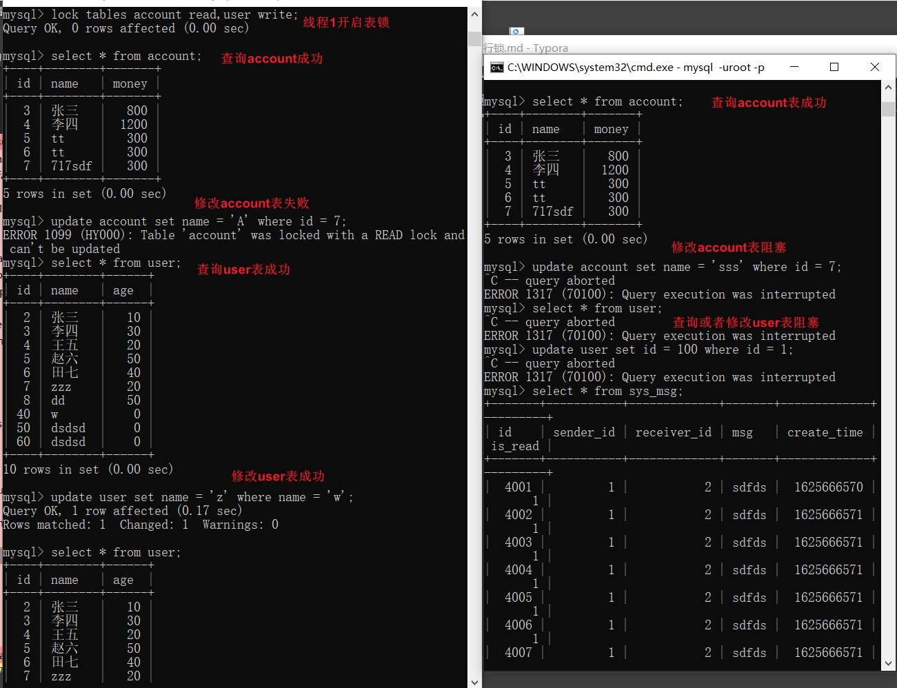
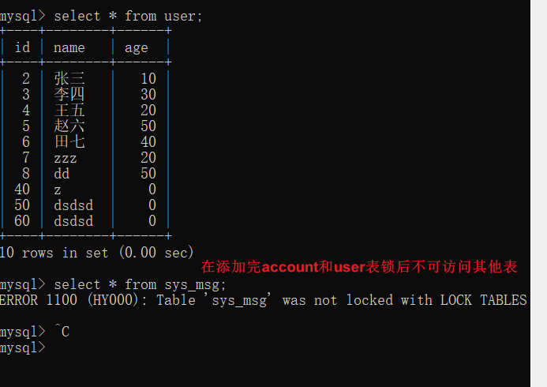
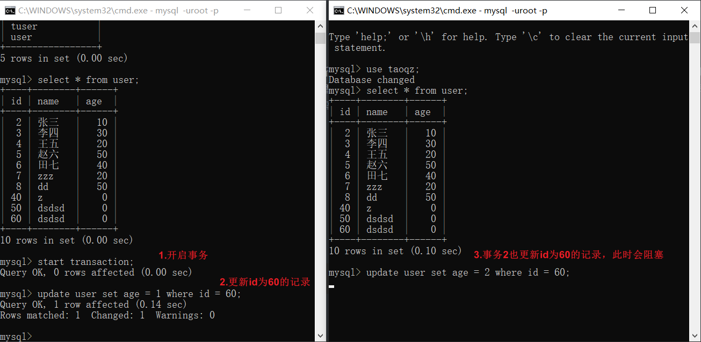
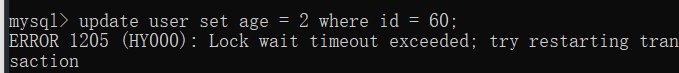
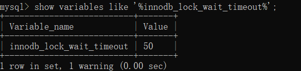
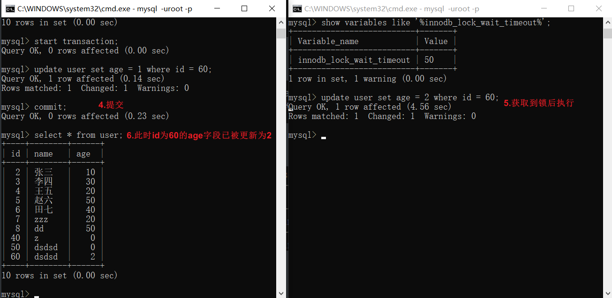
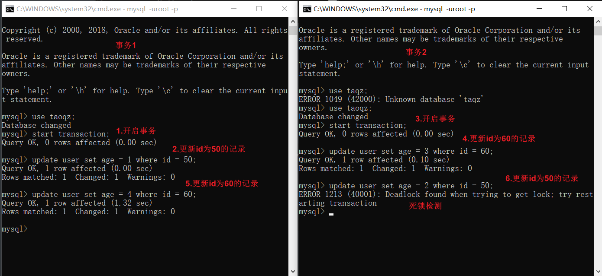

# MySQL锁

## 全局锁

加锁

```
Flush tables with read lock;
```

释放锁

```
unlock tables;
```

加了全局锁后该数据库实例变为只读，当前更新时线程会报以下错误

```
 Can't execute the query because you have a conflicting read lock
```

之后其他线程的以下语句会被阻塞（等待状态）：数据更新语句（数据的增删改）、数据定义语句（包括建表、修改表结构等）和更新类事务的提交语句。

**全局锁的典型使用场景是，做全库逻辑备份。**也就是把整库每个表都 select 出来存成文本。

但是该方法会导致整个系统只读，系统业务失效，官方推荐方式使用

mysqldump配合–single-transaction参数，这样在导数据之前就会启动一个事务，来确保拿到一致性视图，但是引擎必须支持事务（可重复读隔离级别），所以遇到MyISAM引擎时只能使用FTWRL备份了。

set global readonly=true和FTWRL的区别

FTWRL所在的客户端连接异常断开连接后，mysql会自动释放锁，整个库回到正常更新的状态，而前者如果客户端发生异常，则数据库就会一直保持readonly状态。


## 表级锁

语法

```
lock tables tableName read/write;
unlock tables;
```

左为上锁的客户端1，右为测试的客户端2



客户端1



另一种表锁是MDL（metadata lock）,其不需要显示使用，在访问一个表的时候会被自动加上。MDL的作用是保证读写的正确性，假如一个线程正在查询遍历一个表中的数据，而执行期间另一个线程对该表结构做了变更，此时拿到的数据与表结构对不上，因此从5.5版本开始引入了MDL，当对一个表做增删改查操作的时候，加MDL读锁（当前线程只读不可写，其他线程可读写阻塞），当对表结构变更操作时加MDL写锁（当前线程可读写，其他线程读写阻塞）。

- 读锁之间不互斥，因此你可以有多个线程同时对一张表增删改查。
- 读写锁之间、写锁之间是互斥的，用来保证变更表结构操作的安全性。因此，如果有两个线程要同时给一个表加字段，其中一个要等另一个执行完才能开始执行。


## 行锁

​		行锁是在各个引擎层由各个引擎实现的，并不是所有的引擎都支持行锁，MyISAM就不支持行锁，所以MyISAM引擎中一张表任何时刻只能有一个更新执行。InnoDB是支持行锁的，这也是InnoDB替代MyISAM成为默认存储引擎的重要原因之一。行锁就是同一个时刻同一个记录只能有一个事务可以更新，其他事务要等这个事务处理完成才能更新。

​	

并且如果事务2等待超时会退出并抛出异常



超时时间由参数 innodb_lock_wait_timeout 控制



当 事务1 commit; 后 并且在超时时间内获取到锁后事务2自动执行



如果事务中需要锁多个行，要把最有可能造成锁冲突，最可能影响并发度的锁尽量往后放。


## 死锁和死锁检测

下图可以看到事务1先更新id为50的记录，获取id为50的行锁，事务2更新id为60的记录获取id为60的行锁，事务1在执行更新id为60的记录时发现有锁阻塞，事务2更新id为50的记录时，死锁检测，发现存在死锁。

死锁检测是由参数 innodb_deadlock_detect 控制的，on代表开启（默认开启），死锁检测会主动回滚死锁链条中的某一个事务，让其他事务得以继续执行。



有A B 两行

```
 Deadlock found when trying to get lock; try restarting transaction
```

A 行 等待50秒

```
 Lock wait timeout exceeded; try restarting transaction
```

解代码层面决思路：控制并发度。。。，在设计上解决，将在一行上的逻辑改为多行，当然也就带来了维护多行的麻烦。。。


