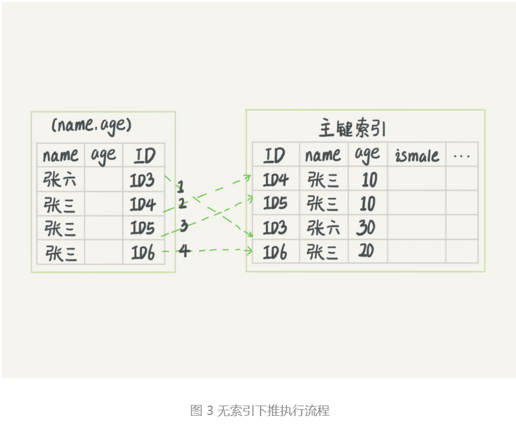
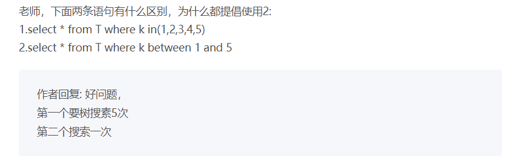

# MySQL索引

## 索引类型

索引类型分为主键索引和非主键索引


主键索引的叶子节点存的是整行数据，在InnoDB里，主键索引也被称为聚簇索引。

非主键索引的叶子节点内容是主键的值，在InnoDB里，非主键索引也被称为二级索引。

### **基于主键索引和普通索引的查询有什么区别？**

- 如果语句是 select * from T where ID=500，即主键查询方式，则只需要搜索 ID 这棵 B+ 树；
- 如果语句是 select * from T where k=5，即普通索引查询方式，则需要先搜索 k 索引树，得到 ID 的值为 500，再到 ID 索引树搜索一次。这个过程称为回表。

也就是说，基于非主键索引的查询需要多扫描一棵索引树。因此，我们在应用中应该尽量使用主键查询。


## 回表

普通索引的叶子节点存储的是 该索引值 -> ID(主键值)，通过索引找到对应的主键值后会到主键索引（主键索引的叶子节点存储的是页，页里面可以有多行，找到对应的页后进行遍历返回符合条件的行）里面进行回表获取完整数据。

## 覆盖索引（针对的是查询的列）

如果执行的语句，需要获取的列（select column1,colunm2 ...）在查询时用到了索引，并且查询的列都包含在索引中，此时索引就已经“覆盖”了查询请求，因此可以直接提供查询结果，不需要回表，可以减少树的搜索次数并显著提高查询性能，这就是覆盖索引。

例子：有一张市民表，存储市民信息，一般可能会用身份证号去查市民信息，但是如果有一个高频请求，是通过身份证号查姓名，此时可以将身份证号和姓名建立一个联合索引，如果查该市民的全部信息，可以走该索引然后回表，如果只需要名称，也可以走该索引并且可以直接返回信息，不需要回表。

## 最左前缀原则（针对的是where后的查询条件）

B+树这种索引结构，可以利用索引的“最左前缀”，来定位记录。


可以看到，索引项是按照索引定义里面出现的字段顺序排序的。

当你的逻辑需求是查到所有名字是“张三”的人时，可以快速定位到 ID4，然后向后遍历得到所有需要的结果。

如果你要查的是所有名字第一个字是“张”的人，你的 SQL 语句的条件是"where name like ‘张 %’"。这时，你也能够用上这个索引，查找到第一个符合条件的记录是 ID3，然后向后遍历，直到不满足条件为止。

可以看到，不只是索引的全部定义，只要满足最左前缀，就可以利用索引来加速检索。这个最左前缀可以是联合索引的最左 N 个字段，也可以是字符串索引的最左 M 个字符。

建立联合索引时，如何安排索引内的字段顺序

第一原则是如果通过调整顺序，可以少维护一个索引，那么这个顺序往往是优先考虑的。

如果既有a,b的联合查询，又有a,b的单独查询，此时如果查询条件只有b,是用不了（a,b）的联合索引的，便需要在创建一个b字段的索引，此时要考虑的原则就是空间了，也就是说如果b字段的占用比a字段大，那么可以将联合索引的顺序更换为（b,a）,然后再创建占用较小的a字段对应的索，联合查询时将b字段放在前，a字段放在后，这样联合查询和单独的简单查询都可以有优化的执行效果。

## 索引下推（针对的是查询的条件）

最左前缀可以用于在索引中定位记录，那么不符合最左前缀部分的会怎么样

已知有（name,age）的联合索引。

```
mysql> select * from tuser where name like '张 %' and age=10 and ismale=1;
```

最左前缀原则可以帮我们找到满足条件Id为3的记录，在mysql5.6之前只能从Id3一个个回表，到主键索引上找出数据行，再对比其他字段值，再mysql5.6之后引入了索引下推计划，可以在索引遍历过程中，对索引中包含的字段在做判断，直接过滤掉不满足条件的记录，减少回表次数。




## 思考题

```sql
# 重建索引k
alter table T drop index k;
alter table T add index(k);
# 重建主键索引
alter table T drop primary key;
alter table T add primary key(id);
```

为什么要重建索引。索引可能因为删除，或者页分裂等原因，导致数据页有空洞，重建索引的过程会创建一个新的索引，把数据按顺序插入，这样页面的利用率最高，也就是索引更紧凑、更省空间。

重建索引 k 的做法是合理的，可以达到省空间的目的。但是，重建主键的过程不合理。不论是删除主键还是创建主键，都会将整个表重建。所以连着执行这两个语句的话，第一个语句就白做了。这两个语句，你可以用这个语句代替 ： alter table T engine=InnoDB。

13章见详解

innodb_file_per_table

## 好问题

1.

一张表两个字段id, uname,id主键，uname普通索引
SELECT * FROM test_like WHERE uname LIKE 'j'/ 'j%' / '%j'/ '%j%'
模糊查询like后面四种写法都可以用到uname的普通索引

添加一个age字段
like后面的'%j'/ '%j%' 这两种情况用不到索引
把select * 改为 select id / select uname / select id,uname
like后面'j'/ 'j%' / '%j'/ '%j%' 这四种情况又都可以用到uname普通索引

建立uname,age的联合索引
模糊查询还是 LIKE 'j'/ 'j%' / '%j'/ '%j%'四种情况
其中select id / select uname / select id,uname
会用到uname的普通索引
select * 会用到uname,age的组合索引

1. 因为表中只有id,uname这两个字段，使用uname的普通索引可以获取到全部数据，用到了覆盖索引（%j 和 %j% 用到了索引，但却不能利用索引进行快速定位，需要全盘扫描索引）
2. 添加一个age字段后，select * 时 %j 和 %j%用不到索引是因为普通索引uname中的数据不包含age字段，还需要进行回表，索引没有使用到索引，当把select * 改为 select [id,uname] 时，可以利用索引覆盖特性上述1
3. 在新增新建一个联合索引（uname,age），当获取的列为 [id，uname]时情况与1相同，当为*时，mysql判断使用（uname,age）的联合索引为最佳并且不需要回表（覆盖索引，上述1）。

2.

​	where c order by b limit 1；获取满足c并且b值最小的行

​	如果只有c索引没有b索引，那需要扫描所有满足c条件的行，在进行排序后才能得到b值最小的行。

​	如果建立（c,b）的联合索引，那么在建立索引时b已经被排好了序，满足c的第一行自然就是当前条件下b值最小的行。

3.



如果k是索引列，那么between时可以先找到最小范围的，然后再遍历n次，in时mysql不知道参数是否连续的，所以只能挨个搜索。

如果k不是索引列，看到评论的朋友说的很好：in的时候需要比对里面的所有值，而between只需要比对最小值和最大值即可。


## 普通索引和唯一索引如何选择

普通索引，一把梭

### 查询方面

因为索引是经过排序的，普通索引在查找时需要找到下一个不是指定的元素，然后结束循环，所以差距是很小的

### 更新方面

关于元素重复的问题，效率微乎其微，重要的是更新这个操作，

要更新的目标页在内存中

唯一索引：找到元素左右的位置，在判断两个位置中间有没有与元素值冲突

普通索引：找到指定元素的左右的位置，直接插入值

要更新的目标页不在内存中

唯一索引：需要将数据页读入内存，判断到没有冲突，插入这个值，语句执行结束；

普通索引：则是将更新记录在 change buffer，语句执行就结束了


```sql
-- force index(a) 强制使用a索引
select * from t force index(a) where a between 10000 and 20000;/*Q2*/
```


## 总结：

1.索引的作用：提高数据查询效率
2.常见索引模型：哈希表、有序数组、搜索树
3.哈希表：键 - 值(key - value)。
4.哈希思路：把值放在数组里，用一个哈希函数把key换算成一个确定的位置，然后把value放在数组的这个位置
5.哈希冲突的处理办法：链表
6.哈希表适用场景：只有等值查询的场景
7.有序数组：按顺序存储。查询用二分法就可以快速查询，时间复杂度是：O(log(N))
8.有序数组查询效率高，更新效率低
9.有序数组的适用场景：静态存储引擎。
10.二叉搜索树：每个节点的左儿子小于父节点，父节点又小于右儿子
11.二叉搜索树：查询时间复杂度O(log(N))，更新时间复杂度O(log(N))
12.数据库存储大多不适用二叉树，因为树高过高，会适用N叉树
13.InnoDB中的索引模型：B+Tree
14.索引类型：主键索引、非主键索引
主键索引的叶子节点存的是整行的数据(聚簇索引)，非主键索引的叶子节点内容是主键的值(二级索引)
15.主键索引和普通索引的区别：主键索引只要搜索ID这个B+Tree即可拿到数据。普通索引先搜索索引拿到主键值，再到主键索引树搜索一次(回表)
16.一个数据页满了，按照B+Tree算法，新增加一个数据页，叫做页分裂，会导致性能下降。空间利用率降低大概50%。当相邻的两个数据页利用率很低的时候会做数据页合并，合并的过程是分裂过程的逆过程。
17.从性能和存储空间方面考量，自增主键往往是更合理的选择。

思考题：
如果删除，新建主键索引，会同时去修改普通索引对应的主键索引，性能消耗比较大。
删除重建普通索引貌似影响不大，不过要注意在业务低谷期操作，避免影响业务。


