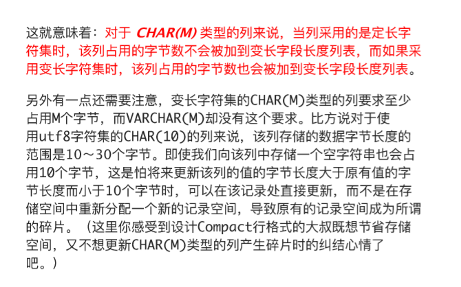

## varchar最多能存储多少个字符?char和varchar的区别?

https://learn.blog.csdn.net/article/details/103341778

https://zhuanlan.zhihu.com/p/86259276

首先char最多可以存储255个字符,而不是255个字节,可以使用例子做验证

首先创建一个表,指定字符长度为256

```
CREATE TABLE 'luck' (
    'content' char(256)
);
#  Column length too big for column 'content' (max = 255); use BLOB or TEXT instead
#  报错提示最大为255,那我们把它修改为255并可以创建成功
#  接下来验证255是最大字节数还是最大字符数
#  首先测试用的mysql使用的utf-8编码,英文字符占一个字节,中文占3个字节
#  在分别插入255个英文字符和中文字符后都没有报错并添加成功,两者再多添加一个都会报错,可以得知255为char存储的最大字符数
```

进一步验证

再使用命令查看插入255个字符后所占字节的长度

```
select content,char_length(content),length(content) from luck;
```

分别是插入255个中文和255个英文字符所得的字符长度和字节长度,可以看到中文的使用了765个字节,是因为使用的是

utf-8编码,一个中文字符会占用3个字节(gbk中中文占用2个字节)


通过搜索在查看mysql技术内幕一书后看到,在mysql4.1版本开始,char(n)中的n指的是字符的长度,而不是之前版本的字节长度,在不同的字符集下,char类型列内部存储的可能不是定长的数据

也就是说在InnoDB存储引擎下使用多字节的字符编码,会把char类型视为变长字符类型,因此可以认为在多字节字符集的情况下,char和varchar的实际行存储基本是没有区别的


那varchar呢,首先可以根据上图了解到varchar最多存储65535个字节,那在创建一个表测试一下

```
CREATE TABLE luck (
    content varchar(65535)
);
# Column length too big for column 'content' (max = 21845); use BLOB or TEXT instead
# 他会提示最大可存储21845个字符,可以确定varchar中填写的参数也是字符数量,只不过有总字节数的限制
# 那我们把varchar中的字符数改为varchar(21845)
CREATE TABLE luck (
    content varchar(21845)
);
# Row size too large. The maximum row size for the used table type, not counting BLOBs, is 65535. You have to change some columns to TEXT or BLOBs
```

运行后,可以看到还是提示过大,这是为什么,我们先把varchar的字符数调到varchar(21844),会发现表创建成功了,这是为什么

因为varchar类型(可变长字段)在计算可存储的字符数有一些条件

在mysql5.1中默认将记录保存为Compact行格式

```
# 查看表所用的行格式
SHOW TABLE STATUS LIKE 'luck'
```


可以看到Compact行格式下,不仅会记录真实的数据,还会记录一些记录的信息

计算可用字符数有一个公式:(最大行大小(65535) - null标识列占用字节数 - 长度标识字节数) / 单个字符所在字符集占用字节数

其中的null标识列便是null值列表,每8个允许为null的列会占用一个字节,每行共享

其中的长度标识则是变长字段长度列表,如果该可变字段允许存储的最大字节数(字符数量x指定编码下一个字符占用的字节数)超过255字节并且真实存储的字节数超过127字节,则使用2个字节,否则使用1个字节

有了这些条件,我们来算一下为什么提示说的21845也不行,首先我们使用的是utf-8编码,也就是一个字符会占用1~3个字节,假如存储的全是中文则为21845x3=65535,正好等于65535,前面我们说到一条记录不止有真实的数据,还有记录的额外信息,如果加上这些额外信息占用的字节65535就不够用了,所以也就超出了范围

有了这些前提条件,我们可以通过公式得知,假设该可变字段存储的最大字节数超过了255,并且真实存储的字节数也超过了127个字节,因为要把情况想到最极端长度标识字节数为2个字节,则得出最大的字符数为

(65535-1(默认创建的列是允许为空的,只有一个字段)-2(长度标识字节数))/3(utf8编码) = 21844

尝试着创建表

```sql
CREATE TABLE luck (
    content varchar(21844)
);
# completed in 12 ms
# 创建成功
```

前面说到的最大行大小65535又是什么意思呢

指的是表中所有的字段加起来的总字节数不能超过65536

```sql
CREATE TABLE luck (
    content varchar(21843),
    name varchar(1)
);
# Row size too large. The maximum row size for the used table type, not counting BLOBs, is 65535. You have to change some columns to TEXT or BLOBs
```

我们使用21844可以成功创建一张表,但现在分开创建却又创建不了表是什么原因呢,再套一下公式

(21843+1)x3+1+2+1=65536

我们来解析一下为什么是这样

首先(21843+1)x3表示了最多可以存储的字节数,这个我们可以从上面使用21844成功创建表得知

+1则表示记录的null列值列表,由于是行字段共享的空间,所以还是占一个字节

+2则表示列varchar(21843)的长度标识字节数

+1则是varchar(1)的长度标识字节数

所以加起来超过了总行大小,我们再来验证一下null值列表记录所占的空间是否共享

把这两个字段都设置为非空

```
CREATE TABLE luck(
    content varchar(21843) not null ,
    name varchar(1) not null
);
# completed in 16 ms
```

运行成功

所以我们可以得知null值列表所占的字节数是所有列共享的,同时也就证明了每条记录的长度标识字节数并不共享空间

有遗留的问题(未解决),char如果采⽤变⻓字符集时,该列占⽤的字节数也会被加到变⻓字段⻓度列表,按照这个说法name char(1)应该执行失败

```
# 运行失败
create table luck(
    content varchar(21843),
    name varchar(1)
);
# 运行成功
create table luck(
    content varchar(21843),
    name char(1)
);
```

2020.03.20查看官方文档解决


char和varchar的区别

官方资料

https://dev.mysql.com/doc/refman/5.7/en/char.html

https://dev.mysql.com/doc/refman/5.7/en/storage-requirements.html

https://dev.mysql.com/doc/refman/5.7/en/string-type-syntax.html

https://dev.mysql.com/doc/refman/5.7/en/column-count-limit.html


其他非官方资料



https://blog.csdn.net/Gane_Cheng/article/details/52316408

总结:

在mysql5.0版本以上char和varchar中的参数都是字符数,但是char有固定长度限制0-255,在创建表时可以不指定,默认为1,char在存储值时会用空格填充到指定的长度,当char的值被检索到时,删除那些用来填充的空格

而varchar列中的值是可变长度的字符串,创建表时必须指定长度,长度可以指定到0-65535(其中65535字节是最大行大小,所有列共享),其最多可以存储的字符数和其所在编码有关