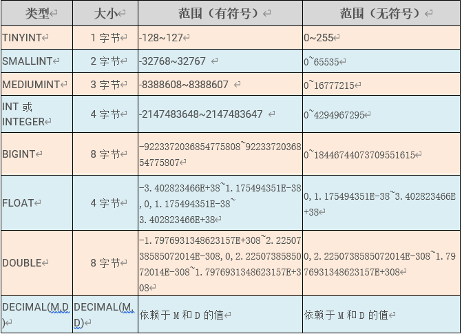
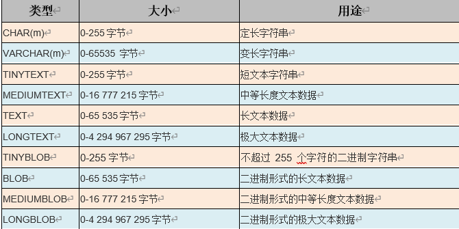

# 数据库

## 什么是数据库?

数据库就是存储数据的仓库,数据库按照特定的格式将数据存储在磁盘文件中,用户可以对数据库中的数据进行增删改查操作

## 什么是表、行、列?以及它们的关系?

表是某种特定数据类型的结构化清单,如果把这张表想象为一张网格,网格中垂直的列为表列,水平则为表行。假如现在有一张顾客表,每一行则是一个顾客的信息,比如手机号,住址等,而列则是所有顾客的某种信息,比如所有的名称

# 简单了解mysql

mysql也是一种DBMS(数据库管理系统),数据库软件。同时mysql拥有最多的使用者,这得益于它的许多优点,开源,性能好,支持事务,可信赖,简单使用等。

mysql在使用时默认是不分大小写的

登录

```sql
# 这几个参数分别为用户名 密码 ip 端口
mysql -uroot -p123 -hlocalhost -P3306
```

在输入sql命令时必须以;(分号)或者\g作为结束

```sql
# 切换到指定库
use databaseName;
#查看该库下所有表
show tables;
# 查看表结构
show columns from tableName;
# 查看表结构
describe book;
# 更改字符集
set names 字符编码;
```

虽然在安装时指定了数据的编码为utf-8,但是windows默认编码为gbk,使用 set names gbk;便可看中文数据

```sql
set names gbk;
--等同于下面三条,,将client,connection,result的编码一致
set character_set_client=gbk; 
set character_set_connection=gbk;
set character_set_results=gbk;
```

查看mysql内部设置的编码

```
show variables like 'character%';
```

通过查看表结构得到


Field:字段名称 Type:数据类型 Null:是否允许为null

Key:键信息 	Default:默认值	Extra:其他信息(auto_increment自增)

前面说到表中应该至少有一个主键保证每行数据的唯一性,但是如果我们手动给主键值,太麻烦也不太显示,auto_increment自增则可以解决这个问题,每新添加一行数据都会自动分配一个可用编号

# mysql中sql分类

## 什么是SQL?

sql是专门用来和数据通信的语言,也就是说可以用sql来操纵数据,但是sql并不是某个特定厂商专有的语言,不过大部分的关系型数据库都支持sql,不过不完全相同

### DDL:数据库定义语言

用来定义数据库对象,也就是创建、修改、删除,数据库、表、列等

关键字:create alter drop truncate等

操作对象:数据库,表

特点:负责"骨架"操作,不操作数据

DDL之数据库常用操作

```sql
# 创建数据库,使用安装时指定的默认编码
create database name;
# 指定字符编码创建
create database name character set utf-8(字符)
# 查看所有数据库
show database;
# 查看数据库的定义信息
show create database name;
# 切换使用指定数据库
use databaseName;
# 删除数据库
drop database name;
```

DDL之表操作

常用数据类型

| 类型          | 用途       |
| ------------- | ---------- |
| int           | 表示整数   |
| float/double  | 表示小数   |
| date/datetime | 表示时间   |
| char/varchar  | 表示字符串 |

```sql
# 创建表
create table 表名(
字段名 类型(长度) [约束],
字段名 类型(长度) [约束]
...
)
# 查看数据库中所有表
show tables;
# 查看表结构
desc 表名;
# 修改表结构
# 添加列
alter table 表名 add 列名 类型(长度);
# 修改表列类型长度及约束
alter table 表名 modify 表名 类型(长度);
# 修改列名
alter table 表名 change 旧列名 新列名 类型(长度) [约束];
# 删除列
alter table 表名 drop 列名;
# 修改表名
alter table 表名 rename to 新表名;
# 修改表的字符集
alter table 表名 character set 字符集;
# 删除表
drop table 表名;
```


### DML:数据库操作语言

用来对数据库中表的记录进行更新(插入/修改/删除数据也会涉及到DQL)

关键字:insert update delete等

操作对象:行数据

常用操作

#### 插入

注意事项

值与字段必须对应,个数相同,类型相同

值的数据大小必须在字段的长度范围内

除了数值类型外,其他的字段类型的值必须使用引号括起(建议单引号)

如果插入空值,可以不写字段,或者插入null

```sql
#向表中插入某些字段
insert into 表(字段1,字段2,字段3...) values(值1,值2,值3);
#向表中插入所有字段,字段的顺序为创建表时的顺序
insert into 表 values(值1,值2,值3...)
```

#### 更新

注意事项

列名的类型与修改的值要一致

修改值的时候不能超过最大长度

除了数值类型类型外,其他的字段类型的值必须使用引号括起

```
-- 更新所有记录的指定字段
update 表名 set 字段名=值,字段名=值,...;
-- 更新符号条件记录的指定字段
update 表名 set 字段名=值,字段名=值,...where 条件;
```

#### 删除

```
delete from 表名 [where 条件];
truncate table 表名;
```

两者的区别

两种方式都可删除表中所有记录

delete一条一条删除,不清空auto_increment记录数,效率低,可回滚;

truncate直接将表删除,重新创建表,会重置auto_increment的值,重新开始,效率高,不可回滚

### DQL:数据库查询语言

用来查询数据库中表的记录

关键字:select from where等

```sql
select [distinct] 
*| 列名,列名
from 表
where 条件
```

#### 别名查询

使用关键字as,可省略

```
表别名:select * from 表名 [as] 别名;
列别名:select 列名 [as] 别名 from 表名;
```

#### 排序

通过order by语句可以将查询后的结果进行排序,放置在select语句的最后

```
select * from 表名 order by 排序字段 asc|desc;
asc 升序(默认)
desc 降序
```

#### 聚合

之前做的查询都是横向的,都是根据条件进行一行一行的判断,而是用聚合函数查询是纵向查询,对一列值的计算,然后返回一个单一的值,聚合函数会忽略空值

```
count(字段):统计指定列不为null的记录行数
sum(字段):计算指定列的数值和,如果指定列类型不是数值类型,那么计算结果为0
max(字段):计算指定列的最大值,如果指定列是字符串类型,那么使用字符串排序运算
min(字段):计算指定列的最小值,如果指定列是字符串类型,那么使用字符串排序运算
max(avg):计算指定列平均值,如果指定列不是数值类型,那么计算结果为0
```

#### 分组

使用group by字句对查询信息进行分组,其中分组字段可写多个

```
select 字段1,字段2... from 表名 group by 分组字段 having 分组条件;
```

having用于对分组后的数据进行过滤,与where类似
having与where的区别

where是在分组前对数据进行过滤,主要针对行,where后面不可使用分组函数(统计函数)

having是在分组后对数据进行过滤,主要针对列,having后面可以使用分组函数

#### 分页

在数据量大的情况下,需要对数据进行分页显示

```
select 字段1,字段2... from 表名 limit m,n;
m:整数,代表从第几条索引!索引!索引!(0)开始,计算方式(当前页-1)*每页显示条数
n:整数,代表查询多少条数据
例如
select 子段1 from 表名 limit 0,5; 代表第一页,一页5条
```

#### 条件查询


#### 执行顺序

书写顺序

```
select 字段 from 表名 where 条件 group by 字段 having 条件 order by 字段
```

执行顺序

1.from 表名

2.where 条件

3.group by 字段 字段值相同的数据会划分成一组

4.having 条件 将每组分别进行一次运算

5.select 字段  把每组中的第一条数据取出来,合并成一张新伪表,展示指定字段

6.order by 字段 对新伪表进行最后的排序

### DCL:数据库控制语言

用来进行用户管理、权限管理

# MySQL数据类型

## 整数类型

在涉及金额时建议使用decimal(9,2)类型,前面的9代表整数的长度(9-2),后面的2代表小数的长度,,不够两位补0,超出小数点的范围进行四舍五入



## 日期类型


TIMESTAMP:时间戳,可以在java8新日期时间API中了解

## 字符串、二进制文本类型




# 使用数据处理函数

文本处理函数


日期时间处理函数


数值处理函数


重要的加减日期函数

```
select subdate(now(),interval '3 5' day_hour );
# 30天内的信息
select * from Student where bir >= now() and
        bir <= date_add(now(),interval 30 day );
```


```
# 根据指定日期格式化
select date_format(now(),'%Y/%m/%d %H:%i:%s');
```

| 格式 | 描述                                           |
| :--- | :--------------------------------------------- |
| %a   | 缩写星期名                                     |
| %b   | 缩写月名                                       |
| %c   | 月，数值                                       |
| %D   | 带有英文前缀的月中的天                         |
| %d   | 月的天，数值(00-31)                            |
| %e   | 月的天，数值(0-31)                             |
| %f   | 微秒                                           |
| %H   | 小时 (00-23)                                   |
| %h   | 小时 (01-12)                                   |
| %I   | 小时 (01-12)                                   |
| %i   | 分钟，数值(00-59)                              |
| %j   | 年的天 (001-366)                               |
| %k   | 小时 (0-23)                                    |
| %l   | 小时 (1-12)                                    |
| %M   | 月名                                           |
| %m   | 月，数值(00-12)                                |
| %p   | AM 或 PM                                       |
| %r   | 时间，12-小时（hh:mm:ss AM 或 PM）             |
| %S   | 秒(00-59)                                      |
| %s   | 秒(00-59)                                      |
| %T   | 时间, 24-小时 (hh:mm:ss)                       |
| %U   | 周 (00-53) 星期日是一周的第一天                |
| %u   | 周 (00-53) 星期一是一周的第一天                |
| %V   | 周 (01-53) 星期日是一周的第一天，与 %X 使用    |
| %v   | 周 (01-53) 星期一是一周的第一天，与 %x 使用    |
| %W   | 星期名                                         |
| %w   | 周的天 （0=星期日, 6=星期六）                  |
| %X   | 年，其中的星期日是周的第一天，4 位，与 %V 使用 |
| %x   | 年，其中的星期一是周的第一天，4 位，与 %v 使用 |
| %Y   | 年，4 位                                       |
| %y   | 年，2 位                                       |

# 数据库三范式

 什么是范式

设计关系数据库时，遵从不同的规范要求，设计出合理的关系型数据库，这些不同的规范要求被称为不同的范式，各种范式呈递次规范，越高的范式数据库冗余越小。

第一范式：数据库表中不能出现重复记录,每一列都是不可分割的原子数据项,同一列不能有多个值

例如：电话号码 - > 手机号 座机号      

第二范式：**一个表中只能保存一种数据，不可以把多种数据保存在同一张数据库表中**。只要数据列中出现数据重复，就要把表拆分开来。(要求所有非主键字段完全依赖主键,不能产生部分依赖)

比如:

根据第一范式,表中记录不能重复,且需要主键,所以设置了联合主键有如下一张表


,但是其中学生姓名依赖学生编号,教师姓名依赖教师编号,产生了部分依赖,所以需要将其拆分成两张表,另外还需新建一张表用来存储对应关系,经典的多对多关系

第三范式：在2NF基础上,非主键字段不能传递依赖于主键字段


例如这张表中确定主键学生编号,学生姓名依赖学生编号,班级名称依赖于班级编号,而班级编号依赖与学生编号,此时便产生了传递依赖的情况

需要将其拆分成两张表,一张学生表,一张班级表,在学生表中创建外键指向班级表中的主键班级编号,一对多

https://www.jianshu.com/p/3e97c2a1687b

