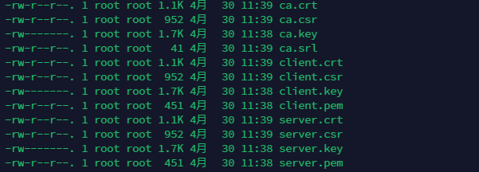

```nginx
server {
    # 服务器端口使用443，开启ssl, 这里ssl就是上面安装的ssl模块
    listen       443 ssl;
    # 域名，多个以空格分开
    server_name  www.taoqz.xyz;

    # ssl证书地址
    ssl_certificate     /etc/nginx/https/3870913_www.taoqz.xyz.pem;  # pem文件的路径
    ssl_certificate_key  /etc/nginx/https/3870913_www.taoqz.xyz.key; # key文件的路径

    # ssl验证相关配置
    ssl_session_timeout  5m;    #缓存有效期
    ssl_ciphers ECDHE-RSA-AES128-GCM-SHA256:ECDHE:ECDH:AES:HIGH:!NULL:!aNULL:!MD5:!ADH:!RC4;    #加密算法
    ssl_protocols TLSv1 TLSv1.1 TLSv1.2;    #安全链接可选的加密协议
    ssl_prefer_server_ciphers on;   #使用服务器端的首选算法
 location / {
        root   html;
        index  index.html index.htm;
    }
}

server {
    listen       80;
    server_name  www.taoqz.xyz;
    return 301 https://$server_name$request_uri;
}
```

生成认证文件

```bash
# 生成服务器端私钥
openssl genrsa -out server.key 2048
# 生成服务器端公钥
openssl rsa -in server.key -pubout -out server.pem


# 生成客户端私钥
openssl genrsa -out client.key 2048
# 生成客户端公钥
openssl rsa -in client.key -pubout -out client.pem


# 生成 CA 私钥
openssl genrsa -out ca.key 2048
# X.509 Certificate Signing Request (CSR) Management.
openssl req -new -key ca.key -out ca.csr
# X.509 Certificate Data Management.
openssl x509 -req -in ca.csr -signkey ca.key -out ca.crt


# 服务器端需要向 CA 机构申请签名证书，在申请签名证书之前依然是创建自己的 CSR 文件
openssl req -new -key server.key -out server.csr
# 向自己的 CA 机构申请证书，签名过程需要 CA 的证书和私钥参与，最终颁发一个带有 CA 签名的证书
openssl x509 -req -CA ca.crt -CAkey ca.key -CAcreateserial -in server.csr -out server.crt

# client 端
openssl req -new -key client.key -out client.csr
# client 端到 CA 签名
openssl x509 -req -CA ca.crt -CAkey ca.key -CAcreateserial -in client.csr -out client.crt
```



```nginx
# ssl证书地址
  ssl_certificate     /etc/nginx/conf.d/server.crt;  # pem文件的路径
  ssl_certificate_key  /etc/nginx/conf.d/server.key; # key文件的路径
```

