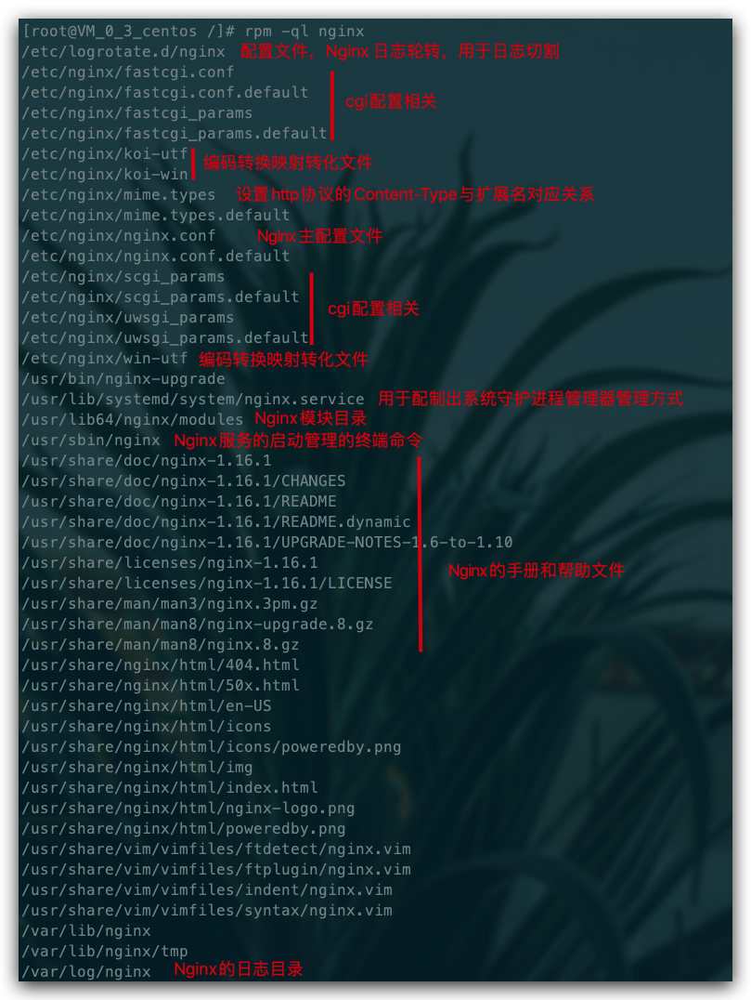
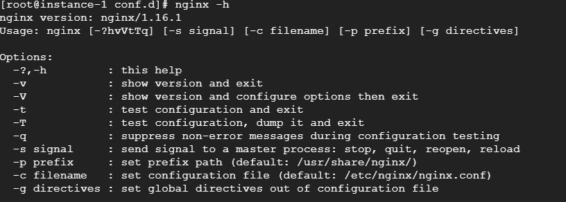
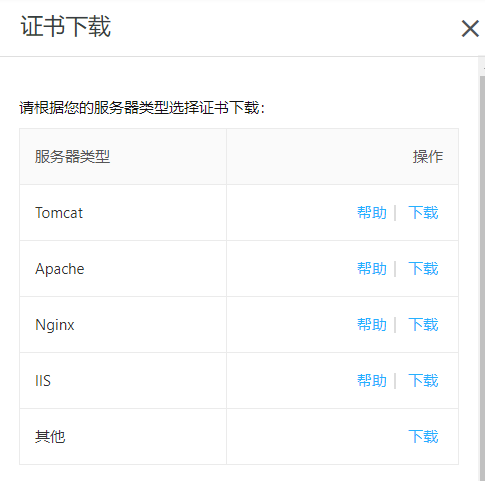

# Nginx

##  概述

Nginx 是一款高性能的 HTTP 服务器/反向代理服务器及电子邮件（IMAP/POP3）代理服务器。由俄罗斯的程序设计师 Igor Sysoev 所开发，官方测试 Nginx 能够支支撑 5 万并发链接，并且 CPU、内存等资源消耗却非常低，运行非常稳定。

## 应用场景

- HTTP 服务器：Nginx 是一个 HTTP 服务可以独立提供 HTTP 服务。可以做网页静态服务器。
- 虚拟主机：可以实现在一台服务器虚拟出多个网站。例如个人网站使用的虚拟主机。
- 反向代理，负载均衡：当网站的访问量达到一定程度后，单台服务器不能满足用户的请求时，需要用多台服务器集群可以使用 Nginx 做反向代理。并且多台服务器可以平均分担负载，不会因为某台服务器负载高宕机而某台服务器闲置的情况

## 环境

Centos7、nginx1.16.1

## 安装

```shell
# 安装
yum install nginx
# 查看版本
nginx -v
```

## nginx相关文件

其中/etc/nginx为主要配置文件所在目录

```shell
# 查看nginx相关文件
rpm -ql nginx
```



## 防火墙

如果开启了防火墙,需要开启指定端口或者在服务器厂商配置中设置防火墙规则

```shell
systemctl start firewalld  # 开启防火墙
systemctl stop firewalld   # 关闭防火墙
systemctl status firewalld # 查看防火墙开启状态，显示running则是正在运行
firewall-cmd --reload      # 重启防火墙，永久打开端口需要reload一下

# 添加开启端口，--permanent表示永久打开，不加是临时打开重启之后失效
firewall-cmd --permanent --zone=public --add-port=8888/tcp

# 查看防火墙，添加的端口也可以看到
firewall-cmd --list-all
```

## 安装node&nvm&git

node:用来运行javascript代码,由于js代码只能在浏览器运行会有很多限制,node.js为其提供了运行环境

nvm:nvm和npm的区别,npm可以集中管理依赖,可以是官方第三方开发者发布的一些优秀的工具,可以使用npm下载,而node.js更新的频率很快,可能依赖在作者发布时使用的node版本和当前自己使用的node版本冲突用不了,则可使用nvm下载指定的node版本。

```shell
# 下载 nvm，或者看官网的步骤 https://github.com/nvm-sh/nvm#install--update-script
curl -o- https://raw.githubusercontent.com/nvm-sh/nvm/v0.35.3/install.sh | bash

source   ~/.bashrc    # 安装完毕后，更新配置文件即可使用 nvm 命令
nvm ls-remote         # 查看远程 node 版本
nvm install v12.16.3  # 选一个你要安装的版本安装，我这里选择 12.16.3
nvm list              # 安装完毕查看安装的 node 版本
node -v               # 查看是否安装好了

yum install git   # git 安装
```

## nginx常用命令

可使用-h查看所有命令



```shell
nginx -s reload  # 向主进程发送信号，重新加载配置文件，热重启
nginx -s reopen	 # 重启 Nginx
nginx -s stop    # 快速关闭
nginx -s quit    # 等待工作进程处理完成后关闭
nginx -T         # 查看当前 Nginx 最终的配置
nginx -t -c <配置路径>    # 检查配置是否有问题，如果已经在配置目录，则不需要-c
```

`systemctl` 是 Linux 系统应用管理工具 `systemd` 的主命令，用于管理系统，我们也可以用它来对 Nginx 进行管理，相关命令如下：

```shell
systemctl start nginx    # 启动 Nginx
systemctl stop nginx     # 停止 Nginx
systemctl restart nginx  # 重启 Nginx
systemctl reload nginx   # 重新加载 Nginx，用于修改配置后
systemctl enable nginx   # 设置开机启动 Nginx
systemctl disable nginx  # 关闭开机启动 Nginx
systemctl status nginx   # 查看 Nginx 运行状态
```

## windows下常用命令

```shell
# 启动
start nginx
# 查看是否运行
tasklist /fi "imagename eq nginx.exe"
# 检查配置文件是否正确
nginx -t -c /nginx安装路径/conf/nginx.conf
# 重新加载配置文件
nginx -s reload 
# 快速停止
nginx -s stop
# 完整有序的关闭
nginx -s quit
```

## nginx配置语法

/etc/nginx/nginx.conf为nginx的主要配置文件

### 配置文件结构图

```
main        # 全局配置，对全局生效
├── events  # 配置影响 Nginx 服务器或与用户的网络连接
├── http    # 配置代理，缓存，日志定义等绝大多数功能和第三方模块的配置
│   ├── upstream # 配置后端服务器具体地址，负载均衡配置不可或缺的部分
│   ├── server   # 配置虚拟主机的相关参数，一个 http 块中可以有多个 server 块
│   ├── server
│   │   ├── location  # server 块可以包含多个 location 块，location 指令用于匹配 uri
│   │   ├── location
│   │   └── ...
│   └── ...
└── ...
```

### 配置语法规则

1. 配置文件由指令与指令块构成；
2. 每条指令以 `;` 分号结尾，指令与参数间以空格符号分隔；
3. 指令块以 `{}` 大括号将多条指令组织在一起；
4. `include` 语句允许组合多个配置文件以提升可维护性；
5. 使用 `#` 符号添加注释，提高可读性；
6. 使用 `$` 符号使用变量；
7. 部分指令的参数支持正则表达式；

### 典型配置

```
user  nginx;                        # 运行用户，默认即是nginx，可以不进行设置
worker_processes  1;                # Nginx 进程数，一般设置为和 CPU 核数一样
error_log  /var/log/nginx/error.log warn;   # Nginx 的错误日志存放目录
pid        /var/run/nginx.pid;      # Nginx 服务启动时的 pid 存放位置

events {
    use epoll;     # 使用epoll的I/O模型(如果你不知道Nginx该使用哪种轮询方法，会自动选择一个最适合你操作系统的)
    worker_connections 1024;   # 每个进程允许最大并发数
}

http {   # 配置使用最频繁的部分，代理、缓存、日志定义等绝大多数功能和第三方模块的配置都在这里设置
    # 设置日志模式
    log_format  main  '$remote_addr - $remote_user [$time_local] "$request" '
                      '$status $body_bytes_sent "$http_referer" '
                      '"$http_user_agent" "$http_x_forwarded_for"';

    access_log  /var/log/nginx/access.log  main;   # Nginx访问日志存放位置

    sendfile            on;   # 开启高效传输模式
    tcp_nopush          on;   # 减少网络报文段的数量
    tcp_nodelay         on;
    keepalive_timeout   65;   # 保持连接的时间，也叫超时时间，单位秒
    types_hash_max_size 2048;

    include             /etc/nginx/mime.types;      # 文件扩展名与类型映射表
    default_type        application/octet-stream;   # 默认文件类型

    include /etc/nginx/conf.d/*.conf;   # 加载子配置项
    
    server {
    	listen       80;       # 配置监听的端口
    	server_name  localhost;    # 配置的域名
    	
    	location / {
    		root   /usr/share/nginx/html;  # 网站根目录
    		index  index.html index.htm;   # 默认首页文件
    		deny 172.168.22.11;   # 禁止访问的ip地址，可以为all
    		allow 172.168.33.44；# 允许访问的ip地址，可以为all
    	}
    	
    	error_page 500 502 503 504 /50x.html;  # 默认50x对应的访问页面
    	error_page 400 404 error.html;   # 同上
    }
}
```

server 块可以包含多个 location 块，location 指令用于匹配 uri，语法：

```
location [ = | ~ | ~* | ^~] uri {
	...
}
```

指令后面：

1. `=` 精确匹配路径，用于不含正则表达式的 uri 前，如果匹配成功，不再进行后续的查找；
2. `^~` 用于不含正则表达式的 uri 前，表示如果该符号后面的字符是最佳匹配，采用该规则，不再进行后续的查找；
3. `~` 表示用该符号后面的正则去匹配路径，区分大小写；
4. `~*` 表示用该符号后面的正则去匹配路径，不区分大小写。跟 `~` 优先级都比较低，如有多个location的正则能匹配的话，则使用正则表达式最长的那个；

如果 uri 包含正则表达式，则必须要有 `~` 或 `~*` 标志。

### 全局变量

Nginx 有一些常用的全局变量(内置预定义变量)，你可以在配置的任何位置使用它们，如下表：

| 全局变量名         | 功能                                                         |
| :----------------- | :----------------------------------------------------------- |
| `$host`            | 请求信息中的 `Host`，如果请求中没有 `Host` 行，则等于设置的服务器名，不包含端口 |
| `$request_method`  | 客户端请求类型，如 `GET`、`POST`                             |
| `$remote_addr`     | 客户端的 `IP` 地址                                           |
| `$args`            | 请求中的参数                                                 |
| `$arg_PARAMETER`   | `GET` 请求中变量名 PARAMETER 参数的值，例如：`$http_user_agent`(Uaer-Agent 值), `$http_referer`... |
| `$content_length`  | 请求头中的 `Content-length` 字段                             |
| `$http_user_agent` | 客户端agent信息                                              |
| `$http_cookie`     | 客户端cookie信息                                             |
| `$remote_addr`     | 客户端的IP地址                                               |
| `$remote_port`     | 客户端的端口                                                 |
| `$http_user_agent` | 客户端agent信息                                              |
| `$server_protocol` | 请求使用的协议，如 `HTTP/1.0`、`HTTP/1.1`                    |
| `$server_addr`     | 服务器地址                                                   |
| `$server_name`     | 服务器名称                                                   |
| `$server_port`     | 服务器的端口号                                               |
| `$scheme`          | HTTP 方法（如http，https）                                   |

### 配置server

基于端口的虚拟主机

一个http指令块中可以有多个server指令块,可以监听不同的端口。同时在主配置文件(/etc/nginx/nginx.conf)的http指令块中有一行配置为

```
include /etc/nginx/conf.d/*.conf
```

表示该文件夹下所有的*.conf文件都会被该主配置文件作为子配置项进行加载

使用阿里云开通的域名做demo,首先在阿里云的域名解析中设置一个二级域名并将二级域名的ip地址指向服务器ip,设置完毕后在 **/etc/nginx/conf.d**下创建一个以.conf为结尾的文件,并写入如下内容

```shell
server {
    # 配置监听端口
    listen       81;
    # 配置域名
    server_name  gcp.taoqz.xyz;
    location / {
        # 网站的根目录
        root   /usr/share/nginx/html/tao;
        # 网站的首页
        index  index.html;
    }
}
```

配置完成后再配置文件目录下使用命令测试配置文件是否有误

```shell
# 测试配置文件
nginx -t
# 成功时输出的内容
#nginx: the configuration file /etc/nginx/nginx.conf syntax is ok
#nginx: configuration file /etc/nginx/nginx.conf test is successful

# 使nginx重新加载配置
nginx -s reload
```

在**/usr/share/nginx/html**下创建tao文件夹,在tao下创建html文件内容如下

```
<!DOCTYPE html>
<html lang="en">
<head>
    <meta charset="UTF-8">
    <title>Title</title>
</head>
<body>
    <h3>
        Taoqz.xzy
    </h3>
</body>
</html>
```

使用浏览器访问 域名:82 便可访问到该主页,并且可以通过该域名访问其他端口

## 配置反向代理

```shell
# 进入主配置文件
vi /etc/nginx/nginx.conf
```

在http指令块中新添加一个server指令块

```shell
    server {
        listen       80;
#       server_name  gcp.taoqz.xyz;
        
        location / {
#		  配置代理的最终目标,当访问80端口时会自动跳转至b站       
#          proxy_pass http://www.bilibili.com;
#		 也可以通过该配置,访问本机中不同的服务	
          proxy_pass http://127.0.0.1:82;
        }
    
#		也可以根据不同的请求路径转发到不同的端口       
#		假设该路径为测试路径        
        location ~ /test {
#          proxy_pass http://127.0.0.1:8080;
        }
        
#		假设该路径为生产路径   
        location ~ /dev {    
#          proxy_pass http://127.0.0.1:8081;
        }
    }
```

也可使用upstream配置代理的方式,例如

```shell
# 该指令配置在http指令块中,同样支持配置多个
# myserver 为自定义
upstream myserver {
	# server为固定
	server 192.168.xx.xxx:9091;
}

# 在具体的server指令块中添加,即可达到使用代理的方式配置虚拟主机
location / {
	proxy_pass http://tomcatServer1;
}	
```

其他指令

1. `proxy_set_header`：在将客户端请求发送给后端服务器之前，更改来自客户端的请求头信息；
2. `proxy_connect_timeout`：配置 Nginx 与后端代理服务器尝试建立连接的超时时间；
3. `proxy_read_timeout`：配置 Nginx 向后端服务器组发出 read 请求后，等待相应的超时时间；
4. `proxy_send_timeout`：配置 Nginx 向后端服务器组发出 write 请求后，等待相应的超时时间；
5. `proxy_redirect`：用于修改后端服务器返回的响应头中的 Location 和 Refresh。

## 跨域配置

### 什么是跨域?

```
跨域是跨域名的访问，当两个系统间域名不同，ip不同，子域名不同，协议不同，端口不同等都会引起跨域问题。
```

### 跨域产生的原因?

	1.浏览器的同源策略，引起了跨域问题，当然不是所有的跨域都会引起跨域问题，比如从本地数据库请求数据不会引起跨域问题。
	
	2.跨域问题是浏览器对ajax请求的一种安全限制，一个页面发起的ajax请求只能用于当前页面同域名的路径，避免跨站攻击。
	3.如果域名和端口都相同，但是请求路径不同，不属于跨域。
### 解决跨域

1.可以使用反向代理的方式解决

2.配置header头

```
server {
  listen       80;
  server_name  be.sherlocked93.club;
  
	add_header 'Access-Control-Allow-Origin'$http_origin;   # 全局变量获得当前请求origin，带cookie的请求不支持*
	add_header 'Access-Control-Allow-Credentials''true';    # 为 true 可带上 cookie
	add_header 'Access-Control-Allow-Methods''GET, POST, OPTIONS';  # 允许请求方法
	add_header 'Access-Control-Allow-Headers'$http_access_control_request_headers;  # 允许请求的 header，可以为 *
	add_header 'Access-Control-Expose-Headers''Content-Length,Content-Range';
	
  if ($request_method = 'OPTIONS') {
		add_header 'Access-Control-Max-Age' 1728000;   # OPTIONS 请求的有效期，在有效期内不用发出另一条预检请求
		add_header 'Content-Type''text/plain; charset=utf-8';
		add_header 'Content-Length' 0;
    
		return 204;                  # 200 也可以
  }
  
  location / {
  	root  /usr/share/nginx/html/be;
  	index index.html;
  }
}
```

## 配置gzip

gzip压缩需要浏览器配合支持

在**/etc/nginx/conf.d**下创建文件**gzip.conf**,内容如下

```
gzip on; # 默认off，是否开启gzip
gzip_types text/plain text/css application/json application/x-javascript text/xml application/xml application/xml+rss text/javascript;

# 上面两个开启基本就能跑起了，下面的愿意折腾就了解一下
gzip_static on;
gzip_proxied any;
gzip_vary on;
gzip_comp_level 6;
gzip_buffers 16 8k;
# 建议添加,文件低于1kb不会进行压缩,否则可能会导致压缩后的文件比原本的文件还要大
# gzip_min_length 1k;
gzip_http_version 1.1;
```

相关配置解释

```
gzip_types：要采用 gzip 压缩的 MIME 文件类型，其中 text/html 被系统强制启用；
gzip_static：默认 off，该模块启用后，Nginx 首先检查是否存在请求静态文件的 gz 结尾的文件，如果有则直接返回该 .gz 文件内容；
gzip_proxied：默认 off，nginx做为反向代理时启用，用于设置启用或禁用从代理服务器上收到相应内容 gzip 压缩；
gzip_vary：用于在响应消息头中添加 Vary：Accept-Encoding，使代理服务器根据请求头中的 Accept-Encoding 识别是否启用 gzip 压缩；
gzip_comp_level：gzip 压缩比，压缩级别是 1-9，1 压缩级别最低，9 最高，级别越高压缩率越大，压缩时间越长，建议 4-6；
gzip_buffers：获取多少内存用于缓存压缩结果，16 8k 表示以 8k*16 为单位获得；
gzip_min_length：允许压缩的页面最小字节数，页面字节数从header头中的 Content-Length 中进行获取。默认值是 0，不管页面多大都压缩。建议设置成大于 1k 的字节数，小于 1k 可能会越压越大；
gzip_http_version：默认 1.1，启用 gzip 所需的 HTTP 最低版本；
```

​	    这个配置可以插入到 http 模块整个服务器的配置里，也可以插入到需要使用的虚拟主机的 `server` 或者下面的 `location` 模块中，当然像上面我们这样写的话就是被 include 到 http 模块中了。

## 负载均衡

负载均衡建立在现有网络结构之上，它提供了一种廉价有效透明的方法扩展网络设备和服务器的带宽、增加吞吐量、加强网络数据处理能力、提高网络的灵活性和可用性。

负载均衡，英文名称为 Load Balance，其意思就是分摊到多个操作单元上进行执行，例如 Web 服务器、FTP 服务器、企业关键应用服务器和其它关键任务服务器等，从而共同完成工作任务。

在nginx中配置负载均衡

在**/etc/nginx/conf.d**下创建一个junheng.conf,内容如下

```shell
# 配置一个代理,指向本机两个不同的端口,用于测试负载均衡
# myserver 自定义的名称,最好不要加下划线
upstream myserver {
	# ip_hash;  # ip_hash 方式
	# fair;   # fair 方式
	server 127.0.0.1:8081;  # 负载均衡目的服务地址
	server 127.0.0.1:8082 weight=2;   # weight 方式，不写默认为 1
}
 
 server {
 	# 监听本机80端口,测试时访问该端口
 	listen 80;
 	location / {
 		# 此处的myserver对应上面 upstream后的名称,名称中最好不要加_ 下划线
 		proxy_pass http://myserver;
 		proxy_connect_timeout 10;
	 }
 }
```

再创建两个配置文件

my8081.conf

```shell
server {
    # 配置监听端口
    listen       8081;
    location / {
        # 网站的根目录
        root   /usr/share/nginx/html/my8081;
        # 网站的首页
        index  index.html;
    }
}
```

my8082.conf

```shell
server {
    # 配置监听端口
    listen       8082;
    location / {
        # 网站的根目录
        root   /usr/share/nginx/html/my8082;
        # 网站的首页
        index  index.html;
    }
}
```

并在**/usr/share/nginx/html**下分别创建文件夹和对应的index.html,在html中写入对应配置的端口号,用于查看负载均衡的效果

### nginx负载均衡策略

1. **轮询**，默认方式，每个请求按时间顺序逐一分配到不同的后端服务器，如果后端服务挂了，能自动剔除；
2. **weight**，权重分配，指定轮询几率，权重越高，在被访问的概率越大，用于后端服务器性能不均的情况；
3. **ip_hash**，每个请求按访问 IP 的 hash 结果分配，这样每个访客固定访问一个后端服务器，可以解决动态网页 session 共享问题。负载均衡每次请求都会重新定位到服务器集群中的某一个，那么已经登录某一个服务器的用户再重新定位到另一个服务器，其登录信息将会丢失，这样显然是不妥的；
4. **fair**（第三方），按后端服务器的响应时间分配，响应时间短的优先分配，依赖第三方插件 nginx-upstream-fair，需要先安装；

### server 后缀配置解析

- `upstream`：每个设备的状态:

- `down`：表示当前的 `server` 暂时不参与负载

- `weight`：默认为 1 `weight` 越大，负载的权重就越大。

- `max_fails`：允许请求失败的次数默认为 1 当超过最大次数时，返回 `proxy_next_upstream` 模块定义的错误

- `fail_timeout`:`max_fails` 次失败后，暂停的时间。

- `backup`：其它所有的非 `backup` 机器 `down` 或者忙的时候，请求 `backup` 机器。所以这台机器压力会最轻

  

总结:只是在upstream指令块中多添加了几个不同的服务器地址映射关系,然后根据nginx的策略达到负载均衡

## 适配PC和移动端

根据用户的不同设备返回不同样式的站点,大型网站在开发时可能会采用分开编写的方式,不做响应式,根据用户请求的**user-agent**来进行判断

在**/etc/nginx/conf.d**下创建一个 pcormo.conf文件,内容如下

```shell
server {
    listen 80;

    location / {
        root  /usr/share/nginx/html/pc;
        # 判断请求头是否为移动端,如果为移动端,覆盖设置网站端点为mobile
        if ($http_user_agent ~* '(Android|webOS|iPhone|iPod|BlackBerry)') {
            root /usr/share/nginx/html/mobile;
        }
        index index.html;
    }
}
```

在**/usr/share/nginx/html**文件夹下分别创建pc和mobile文件夹,并且在两个文件夹下分别创建两个index.html,其中内容有区别即可,使用浏览器进行访问,测试移动端时使用F12点击左上角的手机/平板小图标即可

## 配置HTTPS

在阿里云申请SSL证书并且审核通过后,进行如下配置

参考链接:https://yq.aliyun.com/articles/672835

查看所有端口使用情况	netstat -lntp 

停止指定端口 kill 21307

将一下代码配置到nginx的配置文件中,其中key和pem是阿里云认证成功后提供的,根据服务器类型进行相应的下载并应用



```shell
server {
    # 服务器端口使用443，开启ssl, 这里ssl就是上面安装的ssl模块
    listen       443 ssl;
    # 域名，多个以空格分开
    server_name  www.taoqz.xyz;

    # ssl证书地址
    ssl_certificate     /etc/nginx/https/3870913_www.taoqz.xyz.pem;  # pem文件的路径
    ssl_certificate_key  /etc/nginx/https/3870913_www.taoqz.xyz.key; # key文件的路径

    # ssl验证相关配置
    ssl_session_timeout  5m;    #缓存有效期
    ssl_ciphers ECDHE-RSA-AES128-GCM-SHA256:ECDHE:ECDH:AES:HIGH:!NULL:!aNULL:!MD5:!ADH:!RC4;    #加密算法
    ssl_protocols TLSv1 TLSv1.1 TLSv1.2;    #安全链接可选的加密协议
    ssl_prefer_server_ciphers on;   #使用服务器端的首选算法
 location / {
        root   html;
        index  index.html index.htm;
    }
}

# 监听80端口,并且将请求重定向至https
server {
    listen       80;
    server_name  www.taoqz.xyz;
    return 301 https://$server_name$request_uri;
}
```


## 其他常用技巧

### 图片防盗链

```shell
server {
  listen       80;
  server_name  *.taoqz.xyz;
  
  # 图片防盗链
  location ~* \.(gif|jpg|jpeg|png|bmp|swf)$ {
    valid_referers none blocked 192.168.0.2;  # 只允许本机 IP 外链引用
    if ($invalid_referer){
      return 403;
    }
  }
}
```

### 请求过滤

```shell
# 非指定请求全返回 403
if ( $request_method !~ ^(GET|POST|HEAD)$ ) {
  return 403;
}

location / {
  # IP访问限制（只允许IP是 192.168.0.2 机器访问）
  allow 192.168.0.2;
  deny all;
  
  root   html;
  index  index.html index.htm;
}
```

### 配置图片、字体等静态文件缓存

由于图片、字体、音频、视频等静态文件在打包的时候通常会增加了 hash，所以缓存可以设置的长一点，先设置强制缓存，再设置协商缓存；如果存在没有 hash 值的静态文件，建议不设置强制缓存，仅通过协商缓存判断是否需要使用缓存

```shell
# 图片缓存时间设置
location ~ .*\.(css|js|jpg|png|gif|swf|woff|woff2|eot|svg|ttf|otf|mp3|m4a|aac|txt)$ {
	expires 10d;
}

# 如果不希望缓存
expires -1;
```

### HTTP请求转发到HTTPS

配置好HTTPS但同时HTTP还是可以访问的,可以将其转发到HTTPS

```shell
server {
    listen      80;
    server_name www.taoqz.xyz;

    # 单域名重定向
    if ($host = 'www.sherlocked93.club'){
        return 301 https://www.taoqz.xyz$request_uri;
    }
    # 全局非 https 协议时重定向
    if ($scheme != 'https') {
        return 301 https://$server_name$request_uri;
    }

    # 或者全部重定向
    return 301 https://$server_name$request_uri;

    # 以上配置选择自己需要的即可，不用全部加
}
```


## 遇到的问题

在初次使用时修改配置文件中的启动端口,遇到如下错误

```shell
bind() to 0.0.0.0:8090 failed (13: Permission denied)
```

解决方式

```shell
semanage port -l | grep http_port_t
```

从上面的输出中可以看到，使用强制模式的SELinux，http只允许绑定到列出的端口。解决方案是将要绑定的端口添加到列表中

```shell
semanage port -a -t http_port_t  -p tcp 8090
# 如出现已定义的情况( Port tcp/8082 already defined)可将 -a 改为 -m
semanage port -m -t http_port_t  -p tcp 8082
```

## 参考链接

[https://www.funtl.com/zh/apache-dubbo-codeing/%E4%BB%80%E4%B9%88%E6%98%AF-Nginx.html#%E6%9C%AC%E8%8A%82%E8%A7%86%E9%A2%91](https://www.funtl.com/zh/apache-dubbo-codeing/什么是-Nginx.html#本节视频)


https://mp.weixin.qq.com/s?__biz=Mzg2OTA0Njk0OA==&mid=2247486730&idx=1&sn=2031330f25c91be1b1bbb4b48aeba63e&chksm=cea242c1f9d5cbd7896d2f3ccdc474afcba389e1f469bda8e125ee5e9cac3d68588eeb675dd6&scene=126&sessionid=1588727246&key=cbc079077f0681e356fcb12704c163affecc46215be17bc7d4581215976af2708a4c88e0f2e59bdf3c5a9e2a99440c66f3ad70a2d7205244c3a785614b6712a875d8a18f0d8a2c92508874e478783aa0&ascene=1&uin=OTc3ODM2OTA4&devicetype=Windows+10&version=62080079&lang=zh_CN&exportkey=A4dNeu1H5t2edCZrAPdB1%2Fk%3D&pass_ticket=m8SSL7pQd0nGH068CX8BK%2BkrUZqjZkUrcsA%2BkVD2CcJXaVClTYXs9QOfLUweFFyP


