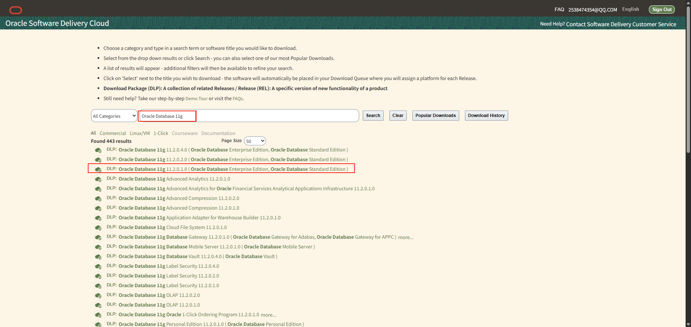
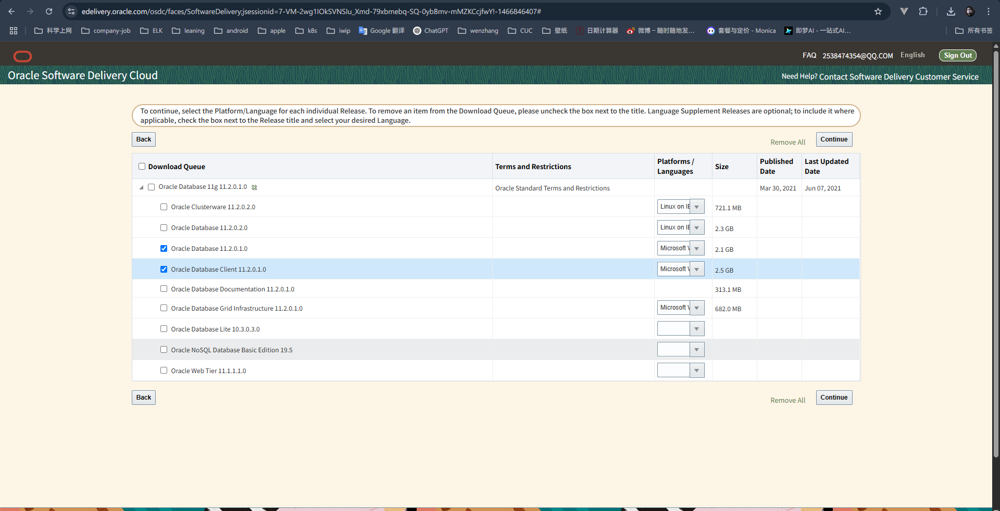
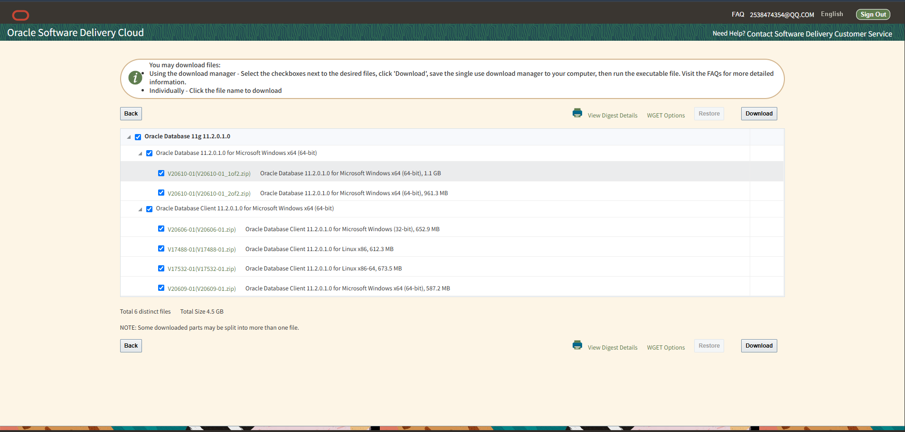
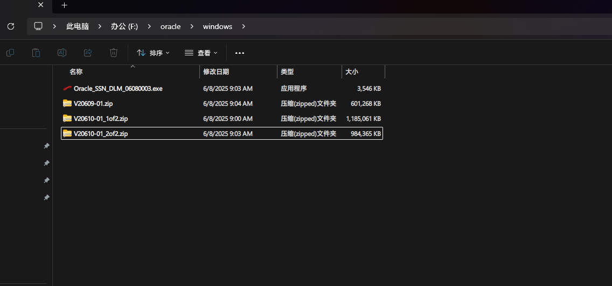
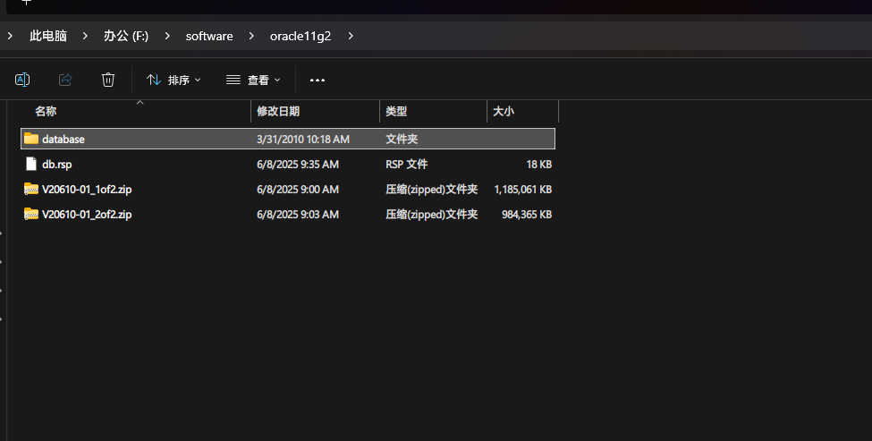
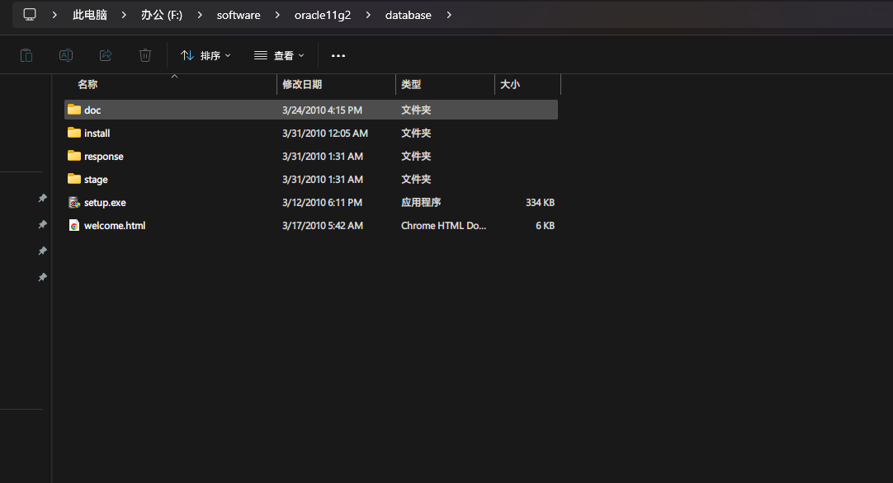
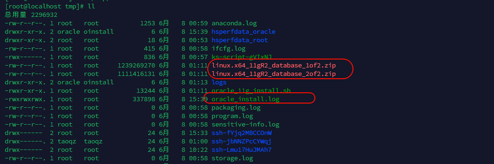

# oracle安装教程

服务器版本：Oracle Database11g Enterprise Edition Release11.2.0.1.0-64 bit Production


## 环境

Linux 环境

Centos7.9 CentOS-7-x86_64-DVD-2009.iso

Windows环境

win10


## 安装包

去oracle官网查找相关安装包

https://edelivery.oracle.com/osdc/faces/SoftwareDelivery;jsessionid=fYBhh6gMvAHp2zcsAqPJ0Y-6sVnovb3NF8q2ZhtrcQLns2gA4puI!-1466846407



在此处选择操作系统



可以找到windows和linux对应的安装包



勾选完成后官网会给一个Oracle_SSN_DLM_xxxxxxxx.exe的文件，运行后界面会进行下载勾选的安装包



将两个压缩包解压得到一个完整的安装包 database下



选择setup.exe文件进行安装




## linux安装

linux同样会有两个压缩包

linux.x64_11gR2_database_1of2.zip

linux.x64_11gR2_database_2of2.zip

我这里是使用的脚本一键安装的方式

脚本地址：

https://gitee.com/YonChao/oracle11g.centos7.install.git




## windows安装

windows安装过程

https://www.shulanxt.com/uncategorized/oraclejc-11g-setup

使用navicat创建数据库（表空间和用户）

https://cloud.tencent.com/developer/article/2105287


## 注意事项

Linux安装过程

需要注意的是如果是新装的系统，需要更换包依赖

修复DNS

```shell
echo "nameserver 223.5.5.5" > /etc/resolv.conf
echo "nameserver 8.8.8.8" >> /etc/resolv.conf
```

将源依赖文件夹备份

```shell
cp /etc/yum.repos.d /etc/yum.repos.d.bak
```

下载新的包依赖

http://mirrors.aliyun.com/repo/Centos-7.repo

```shell
# 清除缓存并生成新缓存
yum clean all
yum makecache

# 安装必要工具
yum -y install wget net-tools
```


