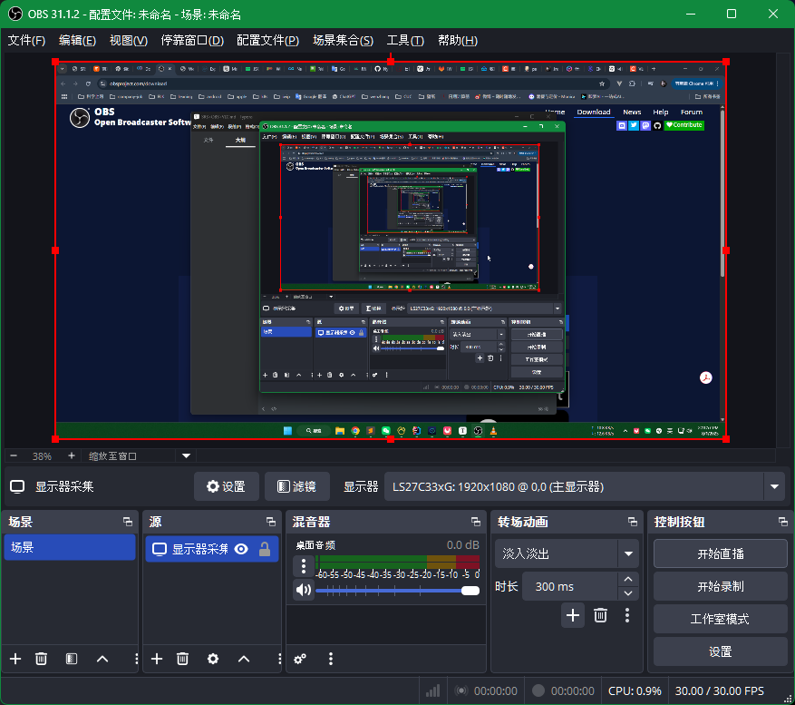
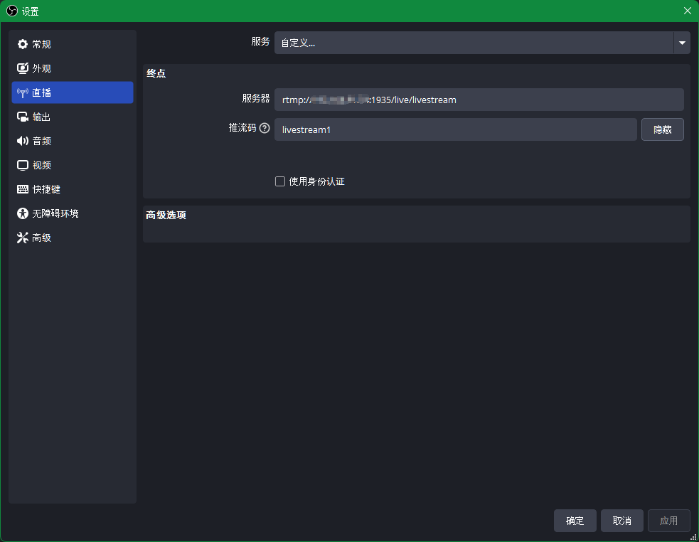
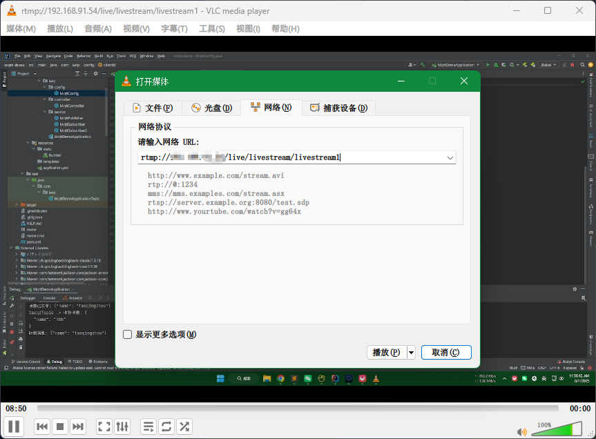
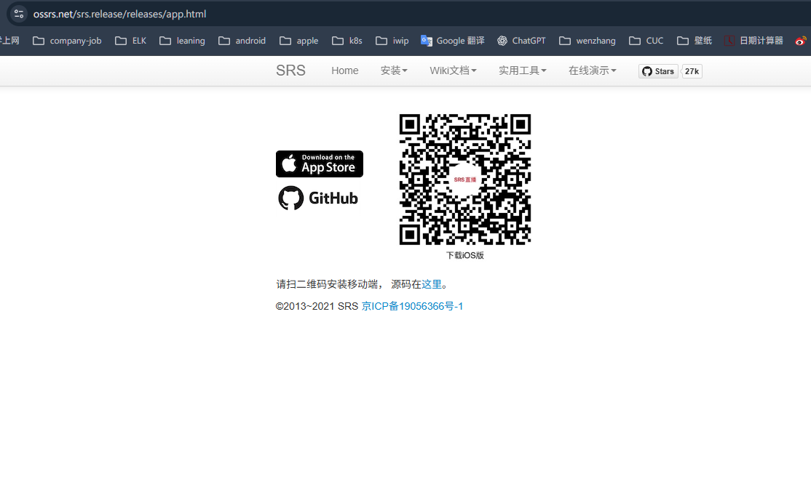

# SRS + OBS + VLC

​	

​	SRS是一个开源的（[MIT协议](https://ossrs.net/lts/zh-cn/license)）简单高效的实时视频服务器，支持RTMP、WebRTC、HLS、HTTP-FLV、SRT、MPEG-DASH和GB28181等协议。 SRS媒体服务器和[FFmpeg](https://ffmpeg.org/)、[OBS](https://obsproject.com/)、[VLC](https://www.videolan.org/)、 [WebRTC](https://webrtc.org/)等客户端配合使用，提供[流的接收和分发](https://ossrs.net/lts/zh-cn/docs/v5/doc/getting-started)的能力，是一个典型的发布 （推流）和订阅（播放）服务器模型。 SRS支持互联网广泛应用的音视频协议转换，比如可以将[RTMP](https://ossrs.net/lts/zh-cn/docs/v5/doc/rtmp)或[SRT](https://ossrs.net/lts/zh-cn/docs/v5/doc/srt)， 转成[HLS](https://ossrs.net/lts/zh-cn/docs/v5/doc/hls)或[HTTP-FLV](https://ossrs.net/lts/zh-cn/docs/v5/doc/flv)或[WebRTC](https://ossrs.net/lts/zh-cn/docs/v5/doc/webrtc)等协议。

​	OBS是一个免费的推流直播工具。

​	VLC是一个免费的视频播放器。

​	我们将使用这三个工具搭建一个可以推流+直播+观看的平台。


## SRS

直播是SRS经典使用场景


### 官方文档

https://ossrs.net/lts/zh-cn/docs/v5/doc/getting-started


### 使用docker部署

```shell
# 部署SRS
docker run --rm -it -p 1935:1935 -p 1985:1985 -p 8080:8080 \
    registry.cn-hangzhou.aliyuncs.com/ossrs/srs:5
    
# 使用FFmpeg的Docker推流到本机 测试是否正常http://服务器ip:8080/players/srs_player.html?schema=http   
docker run --rm -it registry.cn-hangzhou.aliyuncs.com/ossrs/srs:encoder \
  ffmpeg -stream_loop -1 -re -i doc/source.flv -c copy \
    -f flv rtmp://换成部署SRS的服务器ip/live/livestream    
```


### SRS 控制台

http://服务器ip:1985/console


### SRS LivePlayer

http://服务器ip:8080/players/srs_player.html?schema=http


## OBS

使用OBS推流到 SRS 服务器

### OBS下载地址

https://obsproject.com/download

点击右下角的设置 -> 直播 -> 服务器（rtmp://服务器ip:1935/live/livestream）-> 推流码（观看时需追加到地址上 例如：rtmp://服务器ip/live/livestream/livestream1）






## VLC

使用VLC观看直播

打开VLC -> 顶部菜单栏 媒体 -> 打开网络串流 -> 输入刚才的推流地址 -> rtmp://服务器ip/live/livestream/livestream1




## HTML  FLV直播播放

```html
<!DOCTYPE html>
<html>
<head>
    <meta charset="UTF-8">
    <title>FLV直播播放</title>
    <script src="https://cdn.bootcdn.net/ajax/libs/flv.js/1.6.2/flv.min.js"></script>
</head>
<body>
<video id="videoElement" controls autoplay style="width: 800px; height: 450px;"></video>

<script>
    if (flvjs.isSupported()) {
        var videoElement = document.getElementById('videoElement');
        var flvPlayer = flvjs.createPlayer({
            type: 'flv',
            url: 'http://服务器ip:8080/live/livestream/livestream1.flv'
        });
        flvPlayer.attachMediaElement(videoElement);
        flvPlayer.load();
        flvPlayer.play();
    } else {
        alert("您的浏览器不支持 FLV.js");
    }
</script>
</body>
</html>
```


## SRS直播手机端

