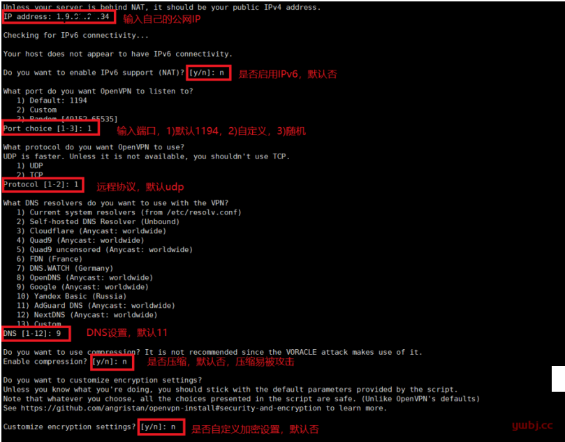
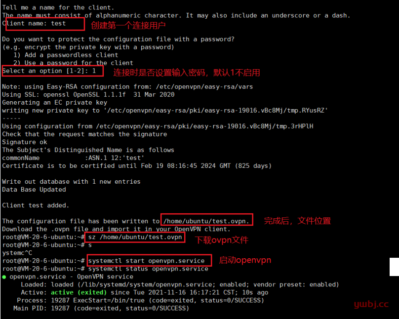
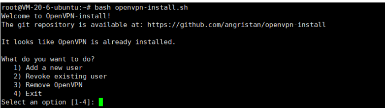

# openvpn

搭建openvpn


## 脚本地址

```url
https://github.com/angristan/openvpn-install.git
```

```shell
curl -O https://raw.githubusercontent.com/angristan/openvpn-install/master/openvpn-install.sh
chmod +x openvpn-install.sh
```


## 步骤如下








## 使用

上面的步骤完成后会生成一个 *.ovpn的问题，将该文件导入openvpn的客户端即可