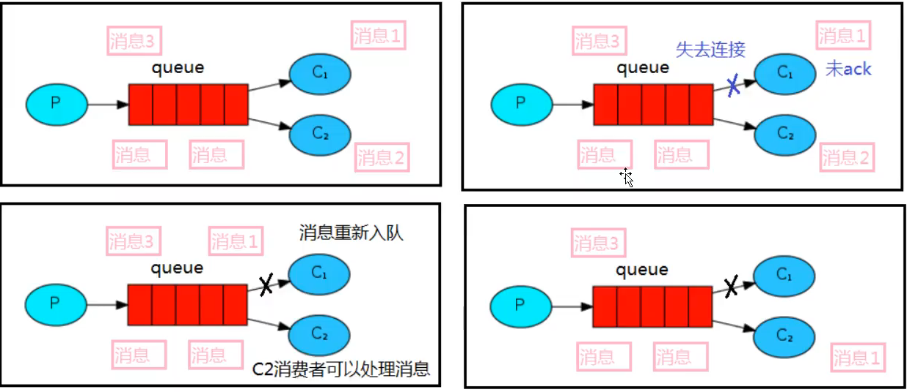

# Rabbitmq

## 应用场景

### 流量削峰

比如秒杀下订单时会有大量用户在同一时间请求服务，可能会导致服务因此宕机，可以引入消息队列，对请求进行排队和限制，然后慢慢消化

### 应用解耦

一个模块的处理需要强依赖另一个模块时，假如被依赖的模块出现故障，自然也会影响调用模块的运行，引入消息队列后，可将先将请求参数保存至消息队列中，被依赖模块从消息队列中获取请求参数

### 异步处理

假如一个服务调用另一个服务时间较久时，可以使用消息队列进行异步处理，将请求参数发送至消息队列，再由服务获取消息队列中的数据进行慢慢消化（还比如一些不需要强制关联的操作，注册和发送邮箱确认，注册后可以立即给出响应，发邮件的操作可以依靠消息队列去做）

## 核心术语

生产者 ：产生消息发送至消息队列

交换机 :  接收消息，发送至绑定的指定队列

队列 : 存储接收来自交换机分配的消息

消费者：消费消息，对消息做处理

连接：生产者和消费者与消息队列的TCP连接

信道：为了解决频繁创建连接消耗资源的问题，一个连接中可有多个信道发送消息

broker:  exchage（交换机） + queue（队列）

vhost（多租户）: 多个用户可以通过vhost标识权限区分消息队列，也就是可以有多个broker


## 支持模式

### helloworld（代码示例）

```java
public static final String queue_name = "hello";

    public static void main(String[] args) throws IOException, TimeoutException {
        // 创建连接工厂
        ConnectionFactory factory = new ConnectionFactory();
        factory.setHost("127.0.0.1");
        factory.setUsername("admin");
        factory.setPassword("admin");

        // 创建连接
        final Connection connection = factory.newConnection();
        // 获取信道
        final Channel channel = connection.createChannel();
        // 创建队列
        /**
         * 队列名称
         * 是否持久化 默认false
         * 队列是否进行消息共享（默认只有一个消费者可以消费）
         * 是否自动删除，最后一个消费者断开连接以后，该队列是否自动删除
         * 其他参数
         */
        channel.queueDeclare(queue_name, false, false, false, null);

        String message = "HelloWorld！";
        /**
         * 交换机
         * 路由key值，本次为队列名称
         * 其他参数
         * 消息体
         */
        channel.basicPublish("", queue_name, null, message.getBytes(StandardCharsets.UTF_8));
    }
```

```java
public static String queue_name = "hello";

    public static void main(String[] args) throws IOException, TimeoutException {

        final ConnectionFactory factory = new ConnectionFactory();
        factory.setHost("127.0.0.1");
        factory.setUsername("admin");
        factory.setPassword("admin");

        final Connection connection = factory.newConnection();
        final Channel channel = connection.createChannel();

        DeliverCallback deliverCallback = (consumerTag, message) -> {
            System.out.println(new String(message.getBody()));
        };

        CancelCallback cancelCallback = consumerTag -> {
            System.out.println("消息被中断");
        };

        /**
         * 消费哪个队列
         * 消费成功是否自动应答 true 自动应答
         * 消费者未成功消费的回调
         * 消费者取消消费回调
         */
        channel.basicConsume(queue_name, true, deliverCallback, cancelCallback);
    }
```


### workqueue

会遇到生产者大量生产消息的场景，消费者可以转为工作线程，工作线程之间是竞争关系，消息被其中一个工作线程（队列）消费后，不允许被其他工作线程消费，也就是不能重复消费（rabbitmq默认会轮询消费）


## 消息应答机制（ack）

为了保证消息不丢失，rabbitmq引入了消息应答机制，消费者在接收到消息并且处理该消息之后，告诉rabbitmq它已经处理了，rabbitmq可以把该消息删除了

### 自动应答

需要在高吞吐量和数据传输安全性方面做权衡（需要良好的情况），也就是消费者接收后就自动应答了，此时会有消息在处理的过程中出现问题的情况

### 手动应答

手动应答的好处是可以批量应答并且减少网络拥堵

### 批量应答（同样不推荐使用）

消费者从信道中获取消息，信道中有多少条消息取决与队列向信道里放了多少条消息，如果有多条消息时选择使用批量应答，假如在第一条消息处理时就选择了应答，但是后几条消息还没有被处理，不确定是否会成功，所以会有消息丢失的可能

### 消息自动重新入队（代码示例）

如果消费者由于某些原因失去连接（通道关闭，连接关闭或者TCP断开连接），导致消息未发送ack确认，rabbitmq将了解到消息未完全处理，并将对其重新排队。如果此时其他消费者可以处理，它将很快将其重新分发给另一个消费者。这样即使某个消费者偶尔死亡，也可以确保消息不回丢失。



可以创建两个消费者，生产两条消息，手动停止一个消费者，检测消息是否会重新入队会被另一个消费者所消费

```java
public static final String queue_name = "ack_queue";

    public static void main(String[] args) throws IOException, TimeoutException {
        final Channel channel = RabbitMQUtil.getChannel();

        System.out.println("消费者1开始接收消息。。。");
        DeliverCallback deliverCallback = (consumerTag, message) -> {
            System.out.println("process...");
                System.out.println(new String(message.getBody()));
            // 消息唯一Id   是否批量应答
            channel.basicAck(message.getEnvelope().getDeliveryTag(), false);
            System.out.println("end");
        };

        // 手动应答
        boolean autoAck = false;
        channel.basicConsume(queue_name, autoAck, deliverCallback, (consumerTag) -> {
            System.out.println("消息取消发送");
        });
    }
```


## 持久化

### 队列持久化

服务重启后，队列还存在，但消息已经不在了

```java
//    如果队列已经在指定的vhost消息队列中存在，就会出现此异常，需要删掉重新建队列
//    Caused by: com.rabbitmq.client.ShutdownSignalException: channel error; protocol method: #method<channel.close>(reply-code=406, reply-text=PRECONDITION_FAILED - inequivalent arg 'durable' for queue 'hello' in vhost '/': received 'true' but current is 'false', class-id=50, method-id=10)
public static final String queue_name = "hello";
public static final String durable_queue_name = "durable_queue";

public static void main(String[] args) throws IOException, TimeoutException {
    final Channel channel = RabbitMQUtil.getChannel();
    boolean durable = true;
    channel.queueDeclare(durable_queue_name, durable, false, false, null);
    String msg = "durable_msg";
    channel.basicPublish("", durable_queue_name, null, msg.getBytes(StandardCharsets.UTF_8));
}
```

### 消息持久化

服务重启后，队列和消息都存在

```java
public static final String durable_queue_name = "durable_queue";

public static void main(String[] args) throws IOException, TimeoutException {
    final Channel channel = RabbitMQUtil.getChannel();
    boolean durable = true;
    channel.queueDeclare(durable_queue_name, durable, false, false, null);
    String msg = "durable_msg——PERSISTENT_TEXT_PLAIN";
    // MessageProperties.PERSISTENT_TEXT_PLAIN 要求消息持久化
    channel.basicPublish("", durable_queue_name, MessageProperties.PERSISTENT_TEXT_PLAIN, msg.getBytes(StandardCharsets.UTF_8));
}
```


## 不公平分发

如果使用轮询，对消费能力强的消费端是一种浪费，当然对于消费能力弱的消费端来说就是压力较大

通过在消费端设置信道改为不公平分发（经测试如果有两个消费端，虽然只在运行较慢一端设置也可生效，只在运行较快一端设置不生效，最好都设置），默认0轮询

```java
// 在每个消费端设置不公平分发
channel.basicQos(1);
```


## 预取值

  相当于消费者的权重

```java
// 预取值
int prefetchCount = 5;
channel.basicQos(prefetchCount);
```


## 发布确认

保证消息不丢失的重要功能，前面的持久化（队列、消息持久化）虽然也能保证消息不丢失，但是在消息发送的过程宕机了，消息有可能丢失。

**这里的发布确认指生产者发送消息至rabbitmq服务端时是否发送成功。**

### 单个确认发布

生产者端设置

```java
final Channel channel = RabbitMQUtil.getChannel();
// 开启消息发布确认
channel.confirmSelect();
final String queueName = UUID.randomUUID().toString();
//        channel.queueDeclare(queueName, false, false, false, null);

final StopWatch stopWatch = new StopWatch();
stopWatch.start();
for (int i = 0; i < queue_count; i++) {
    final String msg = UUID.randomUUID().toString();
    //            channel.basicPublish("", queueName, null, msg.getBytes(StandardCharsets.UTF_8));
    // 如果没有开启消息确认,报错会在下行发生 (交换机sss不存在)
    channel.basicPublish("sss", "qqqq", null, msg.getBytes(StandardCharsets.UTF_8));
    //            (x.exchange交换机存在,qqqq队列不存在时也能发布成功,但消息无法路由会被直接丢弃,但是生产者并不知道没有路由,此时需学习发布确认高级篇)
    //            channel.basicPublish("x.exchange", "qqqq", null, msg.getBytes(StandardCharsets.UTF_8));
    // 单个消息确认
    // 如果开启消息确认,报错会在下行发生,报错内容一样,但是异常名称不同
    final boolean flag = channel.waitForConfirms();
    if (flag) {
        System.out.println("消息：" + msg + "发布成功");
    } else {
        System.out.println("消息：" + msg + "发送失败");
    }
}
stopWatch.stop();
System.out.println(stopWatch.getTime());
```

发布速度慢

### 批量确认发布

发布速度快，但追踪不到发送失败的具体消息

### 异步确认发布

在发送消息之前声明监听器

```java

/**
  * 消息发布成功回调
  * 消息发布失败回调
  *      deliveryTag： 消息的标记
  *      multiple： 是否未批量确认
  */
channel.addConfirmListener(
    (deliveryTag, multiple) -> {
        System.out.println("消息发送成功：" + deliveryTag + "   " + multiple);
    }, (deliveryTag, multiple) -> {
        System.out.println("消息发送失败：" + deliveryTag + "   " + multiple);
    }
);
```

#### 如何处理未确认的消息

 因为发布消息和确认消息是两个线程，可以使用并发类存储所有的消息，将成功发布的消息删除，剩余的就是未处理的消息。


## 交换机Exchanges

​	RabbitMQ消息传递模型的核心思想是：**生产者生产的消息从不会直接发送到队列。**实际上，通常生产者甚至都不知道这些消息传递到了哪些队列中。

​	相反，**生产者只能将消息发送到交换机**，交换机工作的内容非常简单，一方面它接收来自生产者的消息，另一方面将它们推入队列。交换机必须确切知道如何处理收到的消息。是应该把这些消息放到特定队列还是说把它们放到许多队列中还是应该丢弃他们。这就由交换机的类型来决定。

### Exchanges的类型

扇出（fanout），直接（direct），主题（topic）

### 无名exchange

```java
/**
  * 交换机名称（空字符串表示默认或无名称交换机(RabbitMQ会有一个默认的交换机)）
  * 路由key值（routingKey），本次为队列名称（消息能路由发送到队列中是由routingKey(bindingKey)绑定的key指定的）
  * 其他参数
  * 消息体
  */
channel.basicPublish("", queue_name, null, message.getBytes(StandardCharsets.UTF_8));
```

### 临时队列

```java
// 创建临时(一个具有随即名称的)队列，一旦消费者断开连接后队列会自动删除
String queueName = channel.queueDeclare().getQueue();
```

### 绑定（bingdings）

banding其实是exchange和queue之间的桥梁。


### Fanout（扇出）

fanout模式下会将所有消息发送至所有绑定到该交换机的所有队列（跟routingKey无关）

RabbitMQUtil

```java
public static Channel getChannel() throws IOException, TimeoutException {
    final ConnectionFactory factory =
        new ConnectionFactory();
    factory.setHost("127.0.0.1");
    factory.setUsername("admin");
    factory.setPassword("admin");
    final Connection connection = factory.newConnection();
    final Channel channel = connection.createChannel();
    return channel;
}
```

```java
public static final String exchange_name = "fanout_exchange";

public static void main(String[] args) throws Exception {
    final Channel channel = RabbitMQUtil.getChannel();
    // fanout(扇出)：将所有发送到交换机的消息路由到所有与它绑定的queue中
    channel.exchangeDeclare(exchange_name, BuiltinExchangeType.FANOUT);

    final Scanner scanner = new Scanner(System.in);
    while (true) {
        final String msg = scanner.nextLine();
        channel.basicPublish(exchange_name, "", null, msg.getBytes(StandardCharsets.UTF_8));
    }
}
```

```java
public static final String exchange_name = "fanout_exchange";

public static void main(String[] args) throws Exception {
    final Channel channel = RabbitMQUtil.getChannel();
    channel.exchangeDeclare(exchange_name, BuiltinExchangeType.FANOUT);

    // 创建临时队列，消费者断开连接后队列自动删除
    final String queueName = channel.queueDeclare().getQueue();

    // 将队列绑定至交换机
    channel.queueBind(queueName,exchange_name,"");

    channel.basicConsume(queueName,true,(consumerTag,msg) -> {
        System.out.println("消费者1接收到消息："+new String(msg.getBody()));
    },(consumerTag)-> {});
}
```

### Direct（直接）

直接模式下会将消息发送至与交换机绑定后并且routingKey完全匹配的队列中

```java
public static final String exchange_name = "direct_exchange";

public static void main(String[] args) throws Exception {
    final Channel channel = RabbitMQUtil.getChannel();
    channel.exchangeDeclare(exchange_name, BuiltinExchangeType.DIRECT);
    final Scanner scanner = new Scanner(System.in);
    while (true) {
        System.out.println("请输入routingkey");
        final String routingKey = scanner.nextLine();
        System.out.println("请输入msg");
        final String msg = scanner.nextLine();
        channel.basicPublish(exchange_name, routingKey, null, msg.getBytes(StandardCharsets.UTF_8));
    }
}
```

```java
public static final String exchange_name = "direct_exchange";

public static void main(String[] args) throws Exception {
    final Channel channel = RabbitMQUtil.getChannel();
    channel.exchangeDeclare(exchange_name, BuiltinExchangeType.DIRECT);

    final String queueName = channel.queueDeclare().getQueue();
    channel.queueBind(queueName, exchange_name, "c1");
    System.out.println(queueName);

    // 多个队列绑定同一个routingKey
    final String queueName2 = channel.queueDeclare().getQueue();
    channel.queueBind(queueName2, exchange_name, "c1");
    System.out.println(queueName2);

    // 一个队列绑定多个routingKey
    //        channel.queueBind(queueName, exchange_name, "c3");

    channel.basicConsume(queueName, true, ((consumerTag, message) -> {
        System.out.println("消费者1接收到消息：" + new String(message.getBody()));
    }), (consumerTag, sig) -> {
    });

    channel.basicConsume(queueName2, true, ((consumerTag, message) -> {
        System.out.println("消费者1接收到消息_：" + queueName2 + new String(message.getBody()));
    }), (consumerTag, sig) -> {
    });
}
```

```java
public static final String exchange_name = "direct_exchange";

public static void main(String[] args) throws Exception{
    final Channel channel = RabbitMQUtil.getChannel();
    channel.exchangeDeclare(exchange_name, BuiltinExchangeType.DIRECT);

    final String queueName = channel.queueDeclare().getQueue();
    channel.queueBind(queueName,exchange_name,"c2");
    channel.basicConsume(queueName,true,((consumerTag, message) -> {
        System.out.println("消费者2接收到消息："+new String(message.getBody()));
    }),(consumerTag, sig) -> {});
}
```


### 主题（topic）

​	topic模式下的routingKey匹配会更加灵活，但也必须满足一定的要求，**它必须是一个单词列表，以点号分隔开**，这些单词可以是任意单词，比如"abc.aaa.ccc","s.asf.vdf",这个单词列表最多不能超过255个字节。

​	规则：***（星号）可以代替一个单词；#（＃号）可以代替零个或多个单词。**

​	注意：**当一个队列绑定键是#，那么这个队列将接收所有数据，就有点像fanout了；如果队列绑定键当中没有#和*出现，那么该队列绑定类型就是direct了。**


消费者1

```java
public static final String excange_name = "topic_exchange";
public static final String routingKey = "*.orange.*";
public static final String queue_name = "Q1";

public static void main(String[] args) throws Exception {
    // 获取信道
    final Channel channel = RabbitMQUtil.getChannel();
    // 声明并创建队列
    channel.queueDeclare(queue_name, false, false, false, null);
    // 声明并创建交换机
    channel.exchangeDeclare(excange_name, BuiltinExchangeType.TOPIC);
    // 将队列绑定至交换机
    channel.queueBind(queue_name, excange_name, routingKey);

    // 接收消息
    channel.basicConsume(queue_name, true, (consumerTag, message) -> {
        System.out.println("队列Q1接收到消息：" + new String(message.getBody()) + "所属routingKey：" + message.getEnvelope().getRoutingKey());
    }, (consumerTag) -> {
    });
}
```

消费者2

```java
public static final String excange_name = "topic_exchange";
public static final String routingKeyOne = "*.*.rabbit";
public static final String routingKeyTwo = "lazy.#";
public static final String queue_name = "Q2";

public static void main(String[] args) throws Exception {
    // 获取信道
    final Channel channel = RabbitMQUtil.getChannel();
    // 声明并创建队列
    channel.queueDeclare(queue_name, false, false, false, null);
    // 声明并创建交换机
    //        channel.exchangeDeclare(excange_name, BuiltinExchangeType.TOPIC);
    // 将队列绑定至交换机
    channel.queueBind(queue_name, excange_name, routingKeyOne);
    channel.queueBind(queue_name, excange_name, routingKeyTwo);

    // 接收消息
    channel.basicConsume(queue_name, true, (consumerTag, message) -> {
        System.out.println("队列Q2接收到消息：" + new String(message.getBody()) + "所属routingKey：" + message.getEnvelope().getRoutingKey());
    }, (consumerTag) -> {
    });
}
```

生产者

```java
public static final String exchange_name = "topic_exchange";

public static void main(String[] args) throws Exception {
    final Channel channel = RabbitMQUtil.getChannel();
    //        channel.exchangeDeclare(exchange_name, BuiltinExchangeType.TOPIC);

    final Map<String, String> map = new HashMap<>();
    map.put("quick.orange.rabbit", "被队列Q1Q2接收");
    map.put("lazy.orange.elephant", "被队列Q1Q2接收");
    map.put("quick.orange.fox", "被队列Q1接收");
    map.put("lazy.brown.fox", "被队列Q2接收");
    map.put("lazy.pink.rabbit", "虽然满足两个绑定但只被Q2队列（两个routingKey绑定到了同一个队列上）接收一次");
    map.put("quick.brown.fox", "不匹配任何绑定不会被任何队列接收会被丢弃");
    map.put("quick.orange.male.rabbit", "是四个单词不会匹配任何绑定会被丢弃");
    map.put("lazy.orange.male.rabbit", "是四个单词会匹配到队列Q2");

    for (Map.Entry<String, String> entry : map.entrySet()) {
        final String routingKey = entry.getKey();
        final String message = entry.getValue();
        channel.basicPublish(exchange_name, routingKey, null, message.getBytes(StandardCharsets.UTF_8));
    }
}
```

console1

```
队列Q1接收到消息：被队列Q1Q2接收所属routingKey：lazy.orange.elephant
队列Q1接收到消息：被队列Q1Q2接收所属routingKey：quick.orange.rabbit
队列Q1接收到消息：被队列Q1接收所属routingKey：quick.orange.fox
```

console2

```
队列Q2接收到消息：被队列Q1Q2接收所属routingKey：lazy.orange.elephant
队列Q2接收到消息：被队列Q2接收所属routingKey：lazy.brown.fox
队列Q2接收到消息：被队列Q1Q2接收所属routingKey：quick.orange.rabbit
队列Q2接收到消息：虽然满足两个绑定但只被Q2队列（两个routingKey绑定到了同一个队列上）接收一次所属routingKey：lazy.pink.rabbit
队列Q2接收到消息：是四个单词会匹配到队列Q2所属routingKey：lazy.orange.male.rabbit
```

## 死信队列

死信队列本质和正常队列没有区别，用来保存队列因为各种原因无法被消费的消息

应用场景：为了保证订单业务信息数据不丢失；用户下单成功并点击支付后指定时间未支付时自动失效


#### 消息TTL（过期时间）过期

```java
public static final String normal_exchange = "normal_exchange";
public static final String normal_routingKey = "normal_routingKey";

public static void main(String[] args) throws Exception {
    final Channel channel = RabbitMQUtil.getChannel();
    // 设置消息的TTL时间 10s build的单位为ms
    final AMQP.BasicProperties properties = new AMQP.BasicProperties().builder().expiration("10000").build();
    for (int i = 0; i < 10; i++) {
        String message = "info" + i;
        channel.basicPublish(normal_exchange, normal_routingKey, properties, message.getBytes(StandardCharsets.UTF_8));
        //            channel.basicPublish(normal_exchange, normal_routingKey, null, message.getBytes(StandardCharsets.UTF_8));
    }
}
```

```java
// 普通交换机和队列
public static final String normal_exchange = "normal_exchange";
public static final String normal_routingKey = "normal_routingKey";
public static final String normal_queue_name = "normal_queue";
// 接收死信的交换机和队列
public static final String dead_exchange = "dead_exchange";
public static final String dead_routingKey = "dead_routingKey";
public static final String dead_queue_name = "dead_queue";

public static void main(String[] args) throws Exception {
    final Channel channel = RabbitMQUtil.getChannel();

    // 声明并创建普通和死信交换机
    channel.exchangeDeclare(normal_exchange, BuiltinExchangeType.DIRECT);
    channel.exchangeDeclare(dead_exchange, BuiltinExchangeType.DIRECT);

    // 声明并创建普通和死信队列
    channel.queueDeclare(dead_queue_name, false, false, false, null);

    final Map<String, Object> arguments = new HashMap<>();
    // 设置消息过期时间 单位ms,该参数建议设置在生产者，扩展性高
    //        arguments.put("x-message-ttl", 10000);
    // 为正常队列设置死信交换机
    arguments.put("x-dead-letter-exchange", dead_exchange);
    // 为正常队列设置死信routingKey
    arguments.put("x-dead-letter-routing-key", dead_routingKey);
    channel.queueDeclare(normal_queue_name, false, false, false, arguments);

    // 绑定队列
    channel.queueBind(dead_queue_name, dead_exchange, dead_routingKey);
    channel.queueBind(normal_queue_name, normal_exchange, normal_routingKey);

    channel.basicConsume(normal_queue_name, true, normal_routingKey, (consumerTag, message) -> {
        System.out.println("消费者接收消息：" + new String(message.getBody()));
    }, (consumer) -> {
    });
}
```

重要代码

生产者

```java
// 设置消息的TTL时间 10s build的单位为ms
final AMQP.BasicProperties properties = new AMQP.BasicProperties().builder().expiration("10000").build();
// 发送消息
channel.basicPublish(normal_exchange, normal_routingKey, properties, message.getBytes(StandardCharsets.UTF_8));
```

或者在消费者设置

```java
final Map<String, Object> arguments = new HashMap<>();
// 设置消息过期时间 单位ms,该参数建议设置在生产者，扩展性高
//        arguments.put("x-message-ttl", 10000);
// 为正常队列设置死信交换机
arguments.put("x-dead-letter-exchange", dead_exchange);
// 为正常队列设置死信routingKey
arguments.put("x-dead-letter-routing-key", dead_routingKey);
channel.queueDeclare(normal_queue_name, false, false, false, arguments);
```

启动消费者创建交换机和队列后关闭，再开启生产者


过期后进死信队列


#### 队列达到最大长度

```java
// 普通交换机和队列
public static final String normal_exchange = "normal_exchange";
public static final String normal_routingKey = "normal_routingKey";
public static final String normal_queue_name = "normal_queue";

// 接收死信的交换机和队列
public static final String dead_exchange = "dead_exchange";
public static final String dead_routingKey = "dead_routingKey";
public static final String dead_queue_name = "dead_queue";

public static void main(String[] args) throws Exception{
    final Channel channel = RabbitMQUtil.getChannel();

    // 声明并创建普通和死信交换机
    channel.exchangeDeclare(normal_exchange, BuiltinExchangeType.DIRECT);
    //        channel.exchangeDeclare(dead_exchange, BuiltinExchangeType.DIRECT);

    // 声明并创建普通和死信队列
    //        channel.queueDeclare(dead_queue_name, false, false, false, null);

    // 由于参数改变需要先删除原来的队列，再新建
    //        channel.queueDelete(normal_queue_name);
    final Map<String, Object> arguments = new HashMap<>();
    // 为正常队列设置死信交换机
    arguments.put("x-dead-letter-exchange", dead_exchange);
    // 为正常队列设置死信routingKey
    arguments.put("x-dead-letter-routing-key", dead_routingKey);
    // 为正常队列设置queue最大长度 一定要是数字类型 5 。。。
    arguments.put("x-max-length", 5);
    channel.queueDeclare(normal_queue_name, false, false, false, arguments);

    // 绑定队列
    //        channel.queueBind(dead_queue_name, dead_exchange, dead_routingKey);
    channel.queueBind(normal_queue_name, normal_exchange, normal_routingKey);

    channel.basicConsume(normal_queue_name, true, normal_routingKey, (consumerTag, message) -> {
        System.out.println("消费者接收消息：" + new String(message.getBody()));
    }, (consumer) -> {
    });
}
```

重要代码

消费者设置参数

```java
final Map<String, Object> arguments = new HashMap<>();
// 为正常队列设置死信交换机
arguments.put("x-dead-letter-exchange", dead_exchange);
// 为正常队列设置死信routingKey
arguments.put("x-dead-letter-routing-key", dead_routingKey);
// 为正常队列设置queue最大长度 一定要是数字类型 5 。。。
arguments.put("x-max-length", 5);
channel.queueDeclare(normal_queue_name, false, false, false, arguments);
```


#### 消息被拒绝

```java
// 普通交换机和队列
public static final String normal_exchange = "normal_exchange";
public static final String normal_routingKey = "normal_routingKey";
public static final String normal_queue_name = "normal_queue";

// 接收死信的交换机和队列
public static final String dead_exchange = "dead_exchange";
public static final String dead_routingKey = "dead_routingKey";
public static final String dead_queue_name = "dead_queue";

public static void main(String[] args) throws Exception {
    final Channel channel = RabbitMQUtil.getChannel();

    // 声明并创建普通和死信交换机
    channel.exchangeDeclare(normal_exchange, BuiltinExchangeType.DIRECT);

    // 由于参数改变需要先删除原来的队列，再新建
    channel.queueDelete(normal_queue_name);
    final Map<String, Object> arguments = new HashMap<>();
    // 为正常队列设置死信交换机
    arguments.put("x-dead-letter-exchange", dead_exchange);
    // 为正常队列设置死信routingKey
    arguments.put("x-dead-letter-routing-key", dead_routingKey);
    channel.queueDeclare(normal_queue_name, false, false, false, arguments);

    // 绑定队列
    channel.queueBind(normal_queue_name, normal_exchange, normal_routingKey);

    boolean autoAck = false;
    channel.basicConsume(normal_queue_name, autoAck, normal_routingKey, (consumerTag, message) -> {
        final String msg = new String(message.getBody());
        if (msg.equals("info4")) {
            System.out.println("消费者接收消息：" + msg + "并拒绝接收消息");
            // requeue 是否重新放回正常队列，选择否
            channel.basicReject(message.getEnvelope().getDeliveryTag(), false);
        } else {
            System.out.println("消费者接收消息：" + msg);
            channel.basicAck(message.getEnvelope().getDeliveryTag(), false);
        }
    }, (consumer) -> {
    });
```

重要代码

消费者

```java
boolean autoAck = false;
channel.basicConsume(normal_queue_name, autoAck, normal_routingKey, (consumerTag, message) -> {
    final String msg = new String(message.getBody());
    if (msg.equals("info4")) {
        System.out.println("消费者接收消息：" + msg + "并拒绝接收消息");
        // requeue 是否重新放回正常队列，选择否
        channel.basicReject(message.getEnvelope().getDeliveryTag(), false);
    } else {
        System.out.println("消费者接收消息：" + msg);
        channel.basicAck(message.getEnvelope().getDeliveryTag(), false);
    }
}, (consumer) -> {
});
```


## 延迟队列

​		延迟队列最重要的特性就体现再它的延时属性上，延时队列中的元素是希望在指定时间到了以后或之前取出和处理，简单来说，延时队列就是用来存放需要在指定时间被处理的元素的队列。

#### 使用场景

订单在10分钟之内未支付则自动取消。

用户注册成功后，如果三天内没有登录则进行短信提醒。

用户发起退款，如果三天内没有得到处理则通知相关运营人员。

#### TTL

​		TTL是RabbitMQ中一个消息或队列的属性，表明一条消息或者该队列中的所有消息的最大存活时间，单位为毫秒，如果消息在设置的指定时间内没有被消费，则会成为死信，如果同时配置了队列的TTL和消息的TTL，会使用较小的TTL值。

#### 消息设置TTL

```java
rabbitTemplate.convertAndSend(x_exchange, xc_routingKey, "消息来自ttl为10的队列QA：" + msg, message -> {
    message.getMessageProperties().setExpiration(ttl);
    return message;
});
```

#### 队列设置TTL

```java
@Bean("QB")
public Queue QB() {
    // 或者使用 map参数 x-message-ttl
    return QueueBuilder.durable(qb_queue)
        .deadLetterExchange(dead_y_exchange)
        .deadLetterRoutingKey(dead_yd_routingKey)
        .ttl(30000)
        .build();
}
```

#### 区别

​		如果设置了队列的TTL时间，消息一旦过期，就会被丢弃（如果配置了死信队列，会被丢到死信队列中），如果配置了消息的TTL时间，当投递到消费者队列中时，如果消费者队列由消息积压的情况，消息可能还会存活较长时间，如果不设置TTL，表示消息永远不会过期，如果设置为0，表示除非可以直接投递消息到消费者，否则该消息将会被丢弃。

#### 整合springboot

##### pom.xml

```xml
<!--        lombok,这里使用其日志注解-->
<dependency>
    <groupId>org.projectlombok</groupId>
    <artifactId>lombok</artifactId>
</dependency>
<!--        mvc 主要依赖-->
<dependency>
    <groupId>org.springframework.boot</groupId>
    <artifactId>spring-boot-starter-web</artifactId>
</dependency>
<!--        rabbitmq 主要依赖-->
<dependency>
    <groupId>org.springframework.boot</groupId>
    <artifactId>spring-boot-starter-amqp</artifactId>
</dependency>
</dependencies>
```

##### application.yml

```yaml
spring:
  rabbitmq:
    host: 127.0.0.1
    port: 5672
    username: admin
    password: admin
```

##### 配置类


根据上图声明并创建交换机、队列，并进行绑定。

```java
package xyz.taoqz.bootlearn.config;

import org.springframework.amqp.core.*;
import org.springframework.beans.factory.annotation.Qualifier;
import org.springframework.context.annotation.Bean;
import org.springframework.context.annotation.Configuration;

/**
 * RabbitMQConfig
 *
 * @author taoqz
 * @date 2021/6/27 19:37
 */
@Configuration
public class RabbitMQConfig {

    private final String x_exchange = "x.exchange";
    private final String qa_queue = "QA";
    private final String qb_queue = "QB";
    private final String qc_queue = "QC";
    private final String xa_routingKey = "XA";
    private final String xb_routingKey = "XB";
    private final String xc_routingKey = "XC";

    private final String dead_y_exchange = "dead.y.exchange";
    private final String dead_qd_queue = "QD";
    private final String dead_yd_routingKey = "YD";

    @Bean("xExchange")
    public DirectExchange xExchange() {
        return new DirectExchange(x_exchange);
    }

    @Bean("QA")
    public Queue QA() {
        return QueueBuilder.durable(qa_queue)
            .deadLetterExchange(dead_y_exchange)
            .deadLetterRoutingKey(dead_yd_routingKey)
            .ttl(10000)
            .build();
    }

    @Bean("QB")
    public Queue QB() {
        return QueueBuilder.durable(qb_queue)
            .deadLetterExchange(dead_y_exchange)
            .deadLetterRoutingKey(dead_yd_routingKey)
            .ttl(30000)
            .build();
    }

    @Bean("QC")
    public Queue QC() {
        return QueueBuilder.durable(qc_queue)
            .deadLetterExchange(dead_y_exchange)
            .deadLetterRoutingKey(dead_yd_routingKey)
            .build();
    }

    @Bean
    public Binding QABindingXExchange(@Qualifier("QA") Queue qa,
                                      @Qualifier("xExchange") DirectExchange xExchange){
        return BindingBuilder.bind(qa).to(xExchange).with(xa_routingKey);
    }

    @Bean
    public Binding QBBindingXExchange(@Qualifier("QB") Queue qb,
                                      @Qualifier("xExchange") DirectExchange xExchange){
        return BindingBuilder.bind(qb).to(xExchange).with(xb_routingKey);
    }

    @Bean
    public Binding QCBindingXExchange(@Qualifier("QC") Queue qc,
                                      @Qualifier("xExchange") DirectExchange xExchange){
        return BindingBuilder.bind(qc).to(xExchange).with(xc_routingKey);
    }

    @Bean("yExchange")
    public DirectExchange yExchange() {
        return new DirectExchange(dead_y_exchange);
    }

    @Bean("QD")
    public Queue QD() {
        return QueueBuilder.durable(dead_qd_queue)
            .build();
    }

    @Bean
    public Binding QDBindingXExchange(@Qualifier("QD") Queue qd,
                                      @Qualifier("yExchange") DirectExchange yExchange){
        return BindingBuilder.bind(qd).to(yExchange).with(dead_yd_routingKey);
    }
}
```

##### 生产者

```java
@Slf4j
@RestController
@RequestMapping("/rabbitmq")
public class RabbitMQController {

    private final String x_exchange = "x.exchange";
    private final String xa_routingKey = "XA";
    private final String xb_routingKey = "XB";
    private final String xc_routingKey = "XC";

    private final RabbitTemplate rabbitTemplate;

    public RabbitMQController(RabbitTemplate rabbitTemplate) {
        this.rabbitTemplate = rabbitTemplate;
    }

    @GetMapping("/sendTtlMsg/{msg}")
    public String sendTtlMsg(@PathVariable String msg) {
        rabbitTemplate.convertAndSend(x_exchange, xa_routingKey, "消息来自ttl为10的队列QA：" + msg);
        rabbitTemplate.convertAndSend(x_exchange, xb_routingKey, "消息来自ttl为30的队列QA：" + msg);
        log.info("发送消息，时间：{}", new Date().toString());
        return "sendTtl OK!";
    }

    @GetMapping("/sendExpirationMsg/{msg}/{ttl}")
    public String sendExpirationMsg(@PathVariable String msg, @PathVariable String ttl) {
        rabbitTemplate.convertAndSend(x_exchange, xc_routingKey, "消息来自ttl为10的队列QA：" + msg, message -> {
            message.getMessageProperties().setExpiration(ttl);
            return message;
        });
        log.info("发送消息，ttl:{}，当前时间：{}", ttl, new Date().toString());
        return "sendExpirationMsg OK!";
    }
}
```

##### 消费者

```java
package xyz.taoqz.bootlearn.rabbitmqlistener;

import com.rabbitmq.client.Channel;
import lombok.extern.slf4j.Slf4j;
import org.springframework.amqp.core.Message;
import org.springframework.amqp.rabbit.annotation.RabbitListener;
import org.springframework.stereotype.Component;

import java.util.Date;

/**
 * TtlListener
 *
 * @author taoqz
 * @date 2021/6/27 20:04
 */
@Slf4j
@Component
public class TtlListener {

    @RabbitListener(queues = "QD")
    public void receiveD(Message message, Channel channel) {
        final String msg = new String(message.getBody());
        log.info("当前时间：{}，接收到消息：{}", new Date().toString(), msg);
    }

}
```

##### sendTtlMsg

两个队列分别配置10s和30s的消息ttl时间


##### sendExpirationMsg

消息分别设置不同的ttl时间，先发送20s后发送10s，可以看到没有达到想要的效果，10s的消息没有被先消费，而是等待20s的消息消费后在消费，这是设置单纯消息过期时间的问题。

因为RabbitMQ只会检查第一个消息是否过期，如果过期则丢进死信队列，如果第一个消息的延时时间比第二个消息的延时时间还长，第二个消息不回被优先执行。


### 通过插件实现延迟队列

下载

```
https://www.rabbitmq.com/community-plugins.html
```

放在rabbitmq的plugins文件夹下

安装

xxx 为插件名（不包括后缀）

```shell
rabbitmq-plugins enable xxx
```

安装成功后需要重新启动服务生效，在创建新的交换机时会提供一种新的类型 x-delayed-message


```java
package xyz.taoqz.bootlearn.config;

import org.springframework.amqp.core.*;
import org.springframework.beans.factory.annotation.Qualifier;
import org.springframework.context.annotation.Bean;
import org.springframework.context.annotation.Configuration;

import java.util.HashMap;
import java.util.Map;

/**
 * DelayQueueConfig
 *
 * @author taoqz
 * @date 2021/6/27 21:05
 */
@Configuration
public class DelayQueueConfig {

    private final String delay_exchange = "delay.exchange";
    private final String delay_queue = "delay.queue";
    private final String delay_routingKey = "delay.routingKey";

    /**
     * 自定义交换机
     *
     * @return
     */
    @Bean("delayExchange")
    public CustomExchange delayExchange() {
        final Map<String, Object> args = new HashMap<>();
        // 添加标头,否则报错：Invalid argument, 'x-delayed-type' must be an existing exchange type
        args.put("x-delayed-type", "direct");
        return new CustomExchange(delay_exchange, "x-delayed-message", true, false, args);
    }

    @Bean("delayQueue")
    public Queue delayQueue() {
        return new Queue(delay_queue);
    }

    @Bean
    public Binding delayBinding(@Qualifier("delayExchange") CustomExchange delayExchange,
                                @Qualifier("delayQueue") Queue delayQueue) {
        return BindingBuilder.bind(delayQueue).to(delayExchange).with(delay_routingKey).noargs();
    }
}
```

```java
@Slf4j
@RestController
@RequestMapping("/rabbitmq")
public class RabbitMQController {

    private final String delay_exchange = "delay.exchange";
    private final String delay_routingKey = "delay.routingKey";

    @GetMapping("/sendDelayMsg/{msg}/{delayTime}")
    public String sendDelayMsg(@PathVariable String msg, @PathVariable Integer delayTime) {
        rabbitTemplate.convertAndSend(delay_exchange, delay_routingKey, "消息来自delayTime为" + delayTime + "的队列QA：" + msg, message -> {
            message.getMessageProperties().setDelay(delayTime);
            return message;
        });
        log.info("发送消息，delayTime:{}，当前时间：{}", delayTime, new Date().toString());
        return "sendExpirationMsg OK!";
    }
}
```

```java
package xyz.taoqz.bootlearn.rabbitmqlistener;

import com.rabbitmq.client.Channel;
import lombok.extern.slf4j.Slf4j;
import org.springframework.amqp.core.Message;
import org.springframework.amqp.rabbit.annotation.RabbitListener;
import org.springframework.stereotype.Component;

import java.util.Date;

/**
 * DelayListener
 *
 * @author taoqz
 * @date 2021/6/27 21:16
 */
@Slf4j
@Component
public class DelayListener {

    private final String delay_queue = "delay.queue";

    @RabbitListener(queues = delay_queue)
    public void receiveDelay(Message message, Channel channel) {
        final String msg = new String(message.getBody());
        log.info("当前时间：{}，接收到消息：{}", new Date().toString(), msg);
    }
}
```

效果

可以看到时效短的消息被先消费了，之前的延迟队列是通过消息再指定时间内没有被消费会被丢进死信队列的机制实现延迟队列，而是用插件方式，延时的操作直接由交换机控制，失效到了才会发送到消费者。


## 发布确认高级

这里的发布确认既有生产者发送至rabbitmq的发布确认，又包括了rabbitmq是否成功发送至消费者的发布确认。

相当于一套完整的消息发送确认。


配置文件

```yml
spring:
  rabbitmq:
    publisher-confirm-type: correlated
```

```java
@Configuration
public class ConfirmConfig {

    // 交换机
    private static final String exchange_name = "confirm.exchange";
    // 队列
    private static final String queue_name = "confirm.queue";
    // 路由
    private static final String routing_key_name = "confirm.routing.key";

    @Bean("confirmExchange")
    public DirectExchange confirmExchange(){
        return new DirectExchange(exchange_name);
    }

    @Bean("confirmQueue")
    public Queue confirmQueue(){
        return QueueBuilder.durable(queue_name).build();
    }

    @Bean
    public Binding binding(@Qualifier("confirmExchange") DirectExchange confirmExchange,
                           @Qualifier("confirmQueue") Queue confirmQueue){
        return BindingBuilder.bind(confirmQueue).to(confirmExchange).with(routing_key_name);
    }
}
```

```java
@Slf4j
@Component
public class Consumer {

    public static final String queue_name = "confirm.queue";

    @RabbitListener(queues = queue_name)
    public void receive(Message message, Channel channel) {
        log.info("接收到队列：" + queue_name + " 的消息：" + new String(message.getBody()));
//        log.in(new String(message.getBody()));
    }
}
```

```java
@Slf4j
@Component
public class MyConfirmCallback implements RabbitTemplate.ConfirmCallback {
    @Override
    public void confirm(CorrelationData correlationData, boolean ack, String cause) {
        final String id = correlationData.getId();
        if (ack) {
            log.info("交换机已接收到id为：" + id + "的消息");
        } else {
            log.info("交换机接收不到id为：" + id + "的消息，原因为：" + cause);
        }
    }
}
```

```java
@Slf4j
@Component
public class MyReturnCallback implements RabbitTemplate.ReturnsCallback {
    @Override
    public void returnedMessage(ReturnedMessage returned) {
        final String exchange = returned.getExchange();
        final String message = new String(returned.getMessage().getBody());
        final String routingKey = returned.getRoutingKey();
        final int replyCode = returned.getReplyCode();
        final String replyText = returned.getReplyText();
        log.info("交换机：" + exchange + " routingkey：" + routingKey + " 消息：" + message + " replyCode：" + replyCode + " replyText： " + replyText);
    }
}
```

```java
@Slf4j
@Component
@Controller
@RequestMapping("/publish")
public class Publisher {

    // 交换机
    public static final String exchange_name = "confirm.exchange";
    // 队列
    public static final String queue_name = "confirm.queue";
    // 路由
    public static final String routing_key_name = "confirm.routing.key";

    private final RabbitTemplate rabbitTemplate;
    private final MyConfirmCallback myConfirmCallback;
    private final MyReturnCallback returnCallback;

    public Publisher(RabbitTemplate rabbitTemplate, MyConfirmCallback myConfirmCallback, MyReturnCallback returnCallback) {
        this.rabbitTemplate = rabbitTemplate;
        this.myConfirmCallback = myConfirmCallback;
        this.returnCallback = returnCallback;
    }

    @PostConstruct
    public void init(){
        // 注入消息发送至交换机的消息确认回调
        rabbitTemplate.setConfirmCallback(myConfirmCallback);

        /**
         * true: 交换机无法将消息路由时，会将该消息返回给生产者
         * false: 交换机无法将消息路由时，直接丢弃消息
         */
        rabbitTemplate.setMandatory(true);
        // 注入消息无法被消费时的回调（回退消息）
        rabbitTemplate.setReturnsCallback(returnCallback);
    }

    @ResponseBody
    @RequestMapping("/sendMsg/{msg}")
    public String publish(@PathVariable String msg) {
        // 消息无法路由
        final CorrelationData correlationData1 = new CorrelationData("1");
        rabbitTemplate.convertAndSend(exchange_name, routing_key_name+"ss", msg.getBytes(StandardCharsets.UTF_8), correlationData1);

        // 交换机不存在，接收不到消息
        final CorrelationData correlationData2 = new CorrelationData("2");
        rabbitTemplate.convertAndSend(exchange_name + "sdf", routing_key_name, msg.getBytes(StandardCharsets.UTF_8), correlationData2);
        return "OK!";
    }
    
//    交换机：confirm.exchange routingkey：confirm.routing.keyss 消息：zzzzzzzzzzzzz replyCode：312 replyText： NO_ROUTE
//    交换机已接收到id为：1的消息
//    Shutdown Signal: channel error; protocol method: #method<channel.close>(reply-code=404, reply-text=NOT_FOUND - no exchange 'confirm.exchangesdf' in vhost '/', class-id=60, method-id=40)
//    交换机接收不到id为：2的消息，原因为：channel error; protocol method: #method<channel.close>(reply-code=404, reply-text=NOT_FOUND - no exchange 'confirm.exchangesdf' in vhost '/', class-id=60, method-id=40)    
```

## vue使用rabbitmq

index.vue

```js
<template>
  <div>
    rabbitmq
    <button @click="sssss">11111</butto>
  </di>
</templat>

<script>
// rabbitmq-plugins enable rabbitmq_stomp
//

// import Stomp from 'stompjs'
import z from './mqtt'
import Stomp from 'stompjs'
import {MQTT_SERVICE, MQTT_USERNAME, MQTT_PASSWORD, MQTT_host, MQTT_topic} from './mqtt'

export default {
  data() {
    return {
      title: '测试信息',
      client: Stomp.client(MQTT_SERVICE), listData: []
    }
  },
  created() {
    this.onConnected()// stomp连接mq
  },
  methods: {
    sssss() {
      // 订阅频道
      // const topic = MQTT_topic;
      // const topic = '/queue/';
      // const topic = '/quse/';
      const topic = '/queue/helloworldQueue';
      this.client.subscribe(topic, this.responseCallback, this.onFailed)
    },
    async onConnected(frame) {
      await this.client.connect(MQTT_USERNAME, MQTT_PASSWORD, this.onConnected, this.onFailed, MQTT_host) // this.client.connect(MQTT_USERNAME,MQTT_PASSWORD, this.onConnected, this.onFailed)//   有的是不需要MQTT_host的，不需要的话，就不用传这个参数 }
    },
    onFailed: function (frame) {
      console.log('MQ Failed:' + frame)
    },
    responseCallback: function (frame) {
      // 接收消息处理
      console.log('MQ msg=>', frame.body)
      this.title = frame.body;
    },
    // connect() {
    // 初始化mqtt客户端，并连接mqtt服务 const headers = { login: MQTT_USERNAME, password: MQTT_PASSWORD }
  },
}
</scrip>
```

mqtt.js

```js
export const MQTT_SERVICE = 'ws://127.0.0.1:15674/ws' // mqtt服务地址
export const MQTT_USERNAME = 'admin' // mqtt连接用户名
export const MQTT_PASSWORD = 'admin' // mqtt连接密码
export const MQTT_host = '/' // v-host
export const MQTT_topic = '/exchange/js-top/helloworldQueue' // 订阅频道
// /helloworldQueue
```


