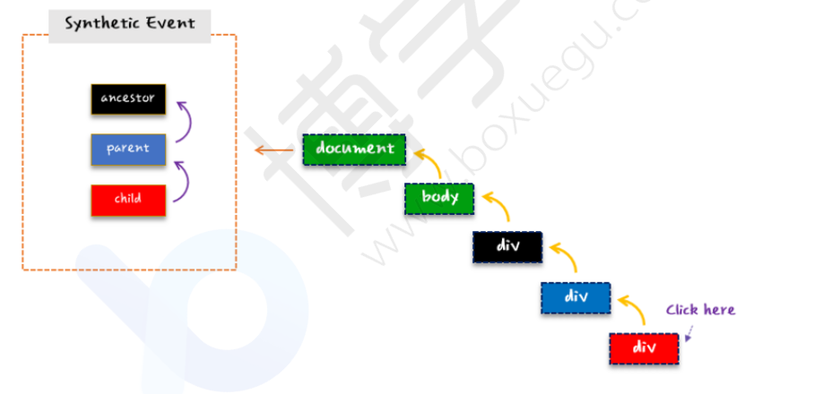
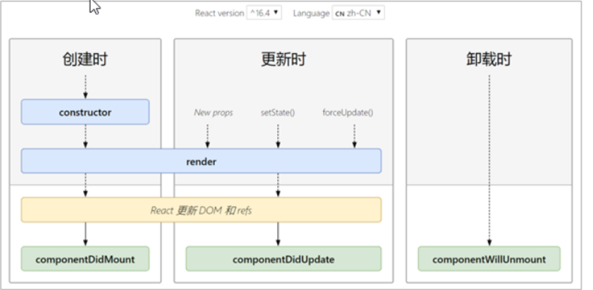
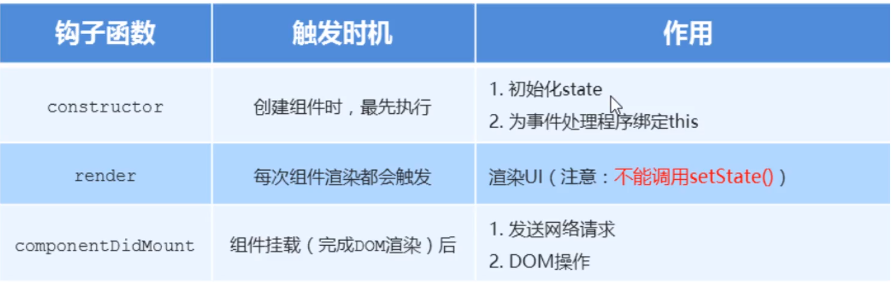
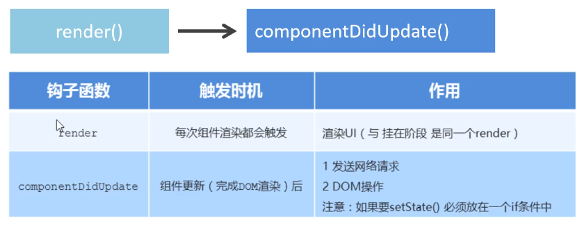
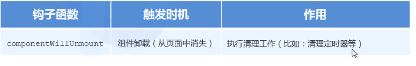
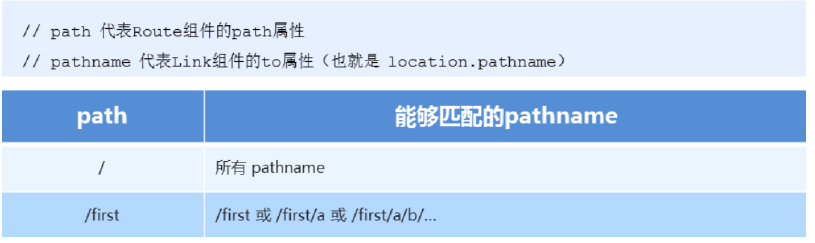

# React

## React是什么?

React是一个用于构建用户界面的javaScript库，起源于facebook的内部项目，后续在13年开源了出来。


## 特点

- 声明式

  你只需要描述UI看起来是什么样式，就跟写HTML一样，React负责渲染UI

- 基于组件

  组件时React最重要的内容，组件表示页面中的部分内容

- 学习一次，随处使

  使用React可以开发Web应用，使用React可以开发移动端，可以开发VR应用


## 创建项目

使用脚手架创建项目,充分利用 Webpack，Babel，ESLint等工具辅助项目开发
零配置，无需手动配置繁琐的工具即可使用
关注业务，而不是工具配置

```shell
# 安装
npm install -g create-react-app
# 创建项目
npx create-react-app my-app
# 启动项目
npm start 或者 yarn start
# 默认端口
http://localhost:3000/
```

创建项目时遇到的问题

npx 创建项目失败,解决参考https://blog.csdn.net/yinaoxiong/article/details/81839935

将npm安装目录添加到Path环境变量中,需要在node的环境变量之上

## 项目目录

```shell
# 项目所需的依赖包
node_modules
# 一些静态文件
public
# 项目源码
src
#其中有几个较为重要的文件
# 主页面
public\index.html
# 项目入口
src\index.js
```

index.js

```react
// ./index.js文件是项目的入口
// 负责创建组件,元素
import React from 'react';
// 包含的是与DOM操作相关的内容
import ReactDOM from 'react-dom';
// 默认样式
import './index.css';
// 引入组件
// import App from './App';
import * as serviceWorker from './serviceWorker';

// render 渲染
ReactDOM.render(
  <React.StrictMode>
    {/*<App />*/}
    456
  </React.StrictMode>,
  //  渲染到了 ./public/index.html中有个div其id为root的页面里
  document.getElementById('root')
);

// If you want your app to work offline and load faster, you can change
// unregister() to register() below. Note this comes with some pitfalls.
// Learn more about service workers: https://bit.ly/CRA-PWA
serviceWorker.unregister();
```


## JSX

### JSX是什么?

JSX是JavaScript XML 的简写，表示在JavaScript代码中写HTML格式的代码

优势：声明式语法更加直观，与HTML结构相同，降低了学习成本，提升开发效率

### 脚手架中使用JSX

- JSX 不是标准的ECMAScript语法，它是ECMAScript的语法拓展
- 需要使用babel编译处理后，才能在浏览器环境中使用
- create-react-app脚手架中已经默认有该配置，无需手动配置
- 编译JSX语法的包： @bable/preset-reac

### 语法

#### 嵌入表达式

可以在js中写html代码,并且可以使用占位符的方式获取值,不支持if或for

```react
// 定义变量,值是一个html中的语法
let username = 'taoqz';
// 嵌入式表达式
let msg = <h1>Hello World : <span>{username},</span><span>age:{10+10}</span></h1>;
ReactDOM.render(
  <React.StrictMode>
      {msg}
  </React.StrictMode>,
  document.getElementById('root')
);
```

方法

```react
function show(user){
    return user.username+':'+user.age
}
let msg = <h1>{show({username:'tao',age:12})}</h1>
ReactDOM.render(
  <React.StrictMode>
      {msg}
  </React.StrictMode>,
  document.getElementById('root')
);
```

#### 条件渲染

```react
function checkAge(user){
    return user.username+','+(user.age >= 18 ? '成年' : '未成年')
}
let msg = <h1>{checkAge({username:'tao',age:12})}</h1>
ReactDOM.render(
  <React.StrictMode>
      {msg}
  </React.StrictMode>,
  document.getElementById('root')
);
```

#### 列表渲染

```react
let users = [{id:1,username:'zs'},{id:2,username:'lisi'}];
let msg = <h1>{
     users.map((item,index) => {
         // 需要加key否则控制台会报错
         // Each child in a list should have a unique "key" prop.
            return <p key={index}>id:{item.id} username:{item.username}</p>
         }
     )}</h1>;
ReactDOM.render(
  <React.StrictMode>
      {msg}
  </React.StrictMode>,
  document.getElementById('root')
);
```

#### 属性处理

```react
import imgUrl from './logo512.png'
// 都可以用
// let msg = <div></div>;
// 设置内部样式 把样式当做一个对象
let msg = <div></div>;
ReactDOM.render(
  <React.StrictMode>
      {msg}
  </React.StrictMode>,
  document.getElementById('root')
);

```

```react
// 引入外部样式
import  './style.css'
// 之前在html中使用的是class,但es6中class是关键字,react提供了className来制定具体的样式
let msg = <div></div>;
ReactDOM.render(
  <React.StrictMode>
      {msg}
  </React.StrictMode>,
  document.getElementById('root')
);
```

#### JSX原理

Babel 会把 JSX 转译成一个名为 React.createElement() 函数调用。

可以将JSX语法编写的代码复制到该网站进行查看

```
https://babeljs.io/repl/#?
babili=false&browsers=&build=&builtIns=false&spec=false&loose=false&code_lz=MYew
dgzgLgBApgGzgWzmWBeGAKAUDGAHgAsBGGYBAQwggDkrUMAiAcwCc44oBLMV5gD58BGAAlECEABoYAdx
DsEAEwCEIwgHoywgJQBuIA&debug=false&forceAllTransforms=false&shippedProposals=fal
se&circleciRepo=&evaluate=true&fileSize=false&timeTravel=false&sourceType=module
&lineWrap=false&presets=es2015%2Creact%2Cstage-
2&prettier=false&targets=&version=7.6.4&externalPlugins=
```

其会被转换为如下代码

```javascript
var element = React.createElement("h1", {
  className: "greeting"
}, "Hello, world!");
```

- 第一个参数:元素名称
- 第二个参数:元素的属性,传递的是一个对象
- 第三个参数:元素内容,也可以是其他子元素

```react
let element = React.createElement('div',null,React.createElement('span',null,'Hello World'))
console.log(element);
let msg = <div><span>Hello World!!!</span></div>;
ReactDOM.render(
  <React.StrictMode>
      {element}
      {msg}
  </React.StrictMode>,
  document.getElementById('root')
);
```

这两种书写方式最后生成的html代码是一样的,但是使用JSX语法更加简单清晰

其中控制台输出的内容是一个对象,其中有几个属性

```javascript
key: null // key没有指定，因为不是一个列表。
type: "div" // 表示元素的类型。
//在这个div中是有子元素的。可以查看props属性
props://在props中有一个children属性，表示的就是子元素，这里是一个span，而在span中还有children属性，表示的就是span中的具体内容了。
```


## React组件基本应用

组件是React中的一等公民,使用React就是在用组件,组件表示页面中的部分功能,多个组件实现完整的页面功能,特点是可复用,独立和可组合。

### 创建函数组件

关于函数组件的几个约定

- 函数名称必须以大写字母开头
- 函数组件必须有返回值,表示该组件的结构
- 如果返回值为null,表示不渲染任何内容

```
# 首字母没有大写报错
index.js:1 Warning: The tag <message> is unrecognized in this browser. If you meant to render a React component, start its name with an uppercase letter.
```

```react
// 使用普通函数的方式创建
// function Message(){
//     return(
//         <div>
//             <h1>Hello World!!</h1>
//         </div>
//     )
// }
// 使用箭头函数,效果是一样的
let Message = () => <div><span>Hello World React</span></div>
ReactDOM.render(
  <React.StrictMode>
      <Message/>
  </React.StrictMode>,
  document.getElementById('root')
);
```

props组件传值

```react
// 使用props
// let Message = (props) => <div><span>name:{props.name},age:{props.age}</span></div>;
// 使用解构表达式
let Message = ({name,age}) => <div><span>name:{name},age:{age}</span></div>;
ReactDOM.render(
  <React.StrictMode>
      <Message name='zs' age='18'/>
  </React.StrictMode>,
  document.getElementById('root')
);
```

### 使用类创建组件

- 类名称必须大写字母开头
- 类组件需继承React.Component父类,从而可以使用父类中提供的方法或者属性
- 类组件必须有render(){}方法
- render方法中必须要有return()返回值

```react
import React,{Component} from 'react'
// class Message extends React.Component{
class Message extends Component{
    render(){
        return(
            <div>
                <span>Hello React !!!</span>
            </div>
        )
    }
}
```

### 组件封装

在src中创建目录(自定义),编写js文件

```react
import React,{Component} from 'react'
class Message extends Component{
    render(){
        return(
            <div>
                <span>Hello React </span>
            </div>
        )
    }
}
// 导出
export default Message;
```

```react
// 在index.js文件中导入使用
import React from 'react';
import Message from './components/Message'
ReactDOM.render(
    <React.StrictMode>
        <Message />
    </React.StrictMode>,
    document.getElementById('root')
);
```


## 组件中的事件处理

### 事件绑定

类组件

必须使用this调用,表示当前类组件的引用

```react
import React,{Component} from 'react'
export default class Message extends Component{
    handClick(){
        console.log('hello react')
    }
    render(){
        return(
            <div>
                <span>Hello React </span>
				{/*必须写this*/}
                <button onClick={this.handClick}>点击</button>
            </div>
        )
    }
}
```

函数组件

不用写this

```react
import React from 'react'

function ShowMessage() {
    function handleClick() {
        console.log('函数组件')
    }
    return (
        <button onClick={handleClick}>点击</button>
    )
}

export default ShowMessage;
```

### 事件对象

可以通过事件处理函数的参数获取到事件对象，只不过在React中把事件对象叫做：合成事件。

合成事件:兼容所有浏览器,保留浏览器原生事件相同的接口。包括 阻止事件流传播stopPropagation() 和 事件默认行为preventDefault()

```react
import React from 'react'

function ShowMessage() {
    // e代表事件对象
    function handleClick(e) {
        console.log('点击事件');
        // 可以拿到触发事件的元素
        console.log(e.target)
        // 可以拿到元素的属性值
        console.log(e.target.value)
    }

    // 用于阻止链接跳转
    function stopJump(e) {
        console.log('阻止了链接跳转')
        e.preventDefault()
    }

    return(
        <div>
            <button onClick={handleClick} value='react'>点击</button>
            <a onClick={stopJump} href="http://www.baidu.com" target='black'>百度</a>
        </div>
    )
}
export default ShowMessage;
```

 在异步中无法拿到事件对象,需要提前定义变量保存,比如

```javascript
let {} = e;
```


### 事件流问题

React中默认的事件传播方式为冒泡

```react
import React,{Component}from 'react'
const styles = {
    child: {
        width: "100px",
        height: "100px",
        backgroundColor: "red"
    },
    parent: {
        width: "150px",
        height: "150px",
        backgroundColor: "blue"
    },
    ancestor: {
        width: "200px",
        height: "200px",
        backgroundColor: "black"
    }
}
class EventMessage extends Component{
    render() {
        return(
            <div
                onClick={() => {
                    console.log("ancestor")
                }}
                style={styles.ancestor}>
                <div
                    onClick={() => {
                        console.log("parent");
                    }}
                    style={styles.parent}>
                    <div
                        onClick={() => {
                            console.log("child");
                        }}
                        style={styles.child}>
                    </div>
                </div>
            </div>
        )
    }
}
export default EventMessage
```

### 事件委托

在React事件系统中，所有的事件都是绑定在document元素，虽然我们在某个react元素上绑定了事件，但是，最后事件都委托给document统一触发。如下图所示：



使用e.stopPropagation( )阻止事件的传播

## 组件状态

有状态组件:指的是用类创建的组件

无状态组件:指的是用函数创建的组件

状态其实就是数据,如果需要对数据进行操作或者更新数据使用有状态,如果只是展示使用函数式组件就可以了

```react
import React,{Component} from 'react'

export default class Calc extends Component{

    // 第一种方式,在构造中定义state数据,优先级比第二种方式高
    // constructor(){
    //     super();
    //     this.state={
    //         count:0
    //     }
    // }

    // 第二种方式,直接在类中定义state数据
    state = {
        count : 1
    };

    render(){
        return(
            <div>
                当前count值:{this.state.count}
                {/*调用setState()方法修改数据,并且会自动调用render进行重新渲染*/}
                <button onClick={() => this.setState({count:this.state.count+1})}>点击+1</button>
            </div>
        )
    }
}
```

## 事件处理中的this指向问题

### 箭头函数

```react
import React,{Component} from 'react'

export default class Calc2 extends Component{

    state = {
        count: 0
    };

    // changeState(){
        //Cannot read property 'setState' of undefined
        //this为undefined
        // this.setState({count:this.state.count+1})
    // }

    // 解决方法,使用箭头函数的方式
    changeState = () => {
        this.setState({count:this.state.count+1})
    };

    render(){
        return(
            <div>
                count:{this.state.count}
                <button onClick={this.changeState}>点击</button>
            </div>
        )
    }
}
```

### bind

```react
import React,{Component} from 'react'

export default class Calc extends Component{

    constructor(){
        super();
        this.state={
            count:0
        }
        // 将this绑定到方法中
        this.changeState = this.changeState.bind(this)
    }

    changeState() {
        this.setState({count:this.state.count+10})
    };

    render(){
        return(
            <div>
                当前count值:{this.state.count}
                <button onClick={this.changeState}>点击+1</button>
            </div>
        )
    }
}
```


## setState方法原理

### 异步执行和同步执行

setState方法更新数据的操作是异步的,比如在同一个方法中调用多次setState方法,只会执行一次,并且render方法也只会执行一次。

但在有些情况下是同步的比如(原生事件)

```react
  changeState() {
        // 只会执行一次,并且render方法也只会执行一次
        // this.setState({count:this.state.count+1})
        // console.log(this.state.count)
        // 和上次拿到的结果是一样的,因为是异步执行的
        // this.setState({count:this.state.count+1})
        // console.log(this.state.count)
        // 同步的,会执行两次
        setTimeout(() => {
            this.setState({count:this.state.count+1})
            console.log(this.state.count)
            this.setState({count:this.state.count+1})
            console.log(this.state.count)
        })
    };
```

### setState第二种语法

需求:第二次的setState需要拿到第一次setState方法进行更新后的结果,可以使用该语法

```react
import React,{Component} from 'react'

export default class Calc extends Component{

    constructor(){
        super();
        this.state={
            count:10
        };
        // 将this绑定到方法中
        this.changeState = this.changeState.bind(this)
    }

    changeState=() => {
       this.setState((state,props) => {
           return {
               count: state.count+1
           }
       });
       // 需要注意的是,改语法也是异步执行的,打印的是更新前的数据
        console.log(this.state.count)
        // 可以拿到第一次更新后的state,并进行操作
        this.setState((state,props) => {
            return {
                count: state.count+1
            }
        });
        // 和第一个打印的结果是一样的,更加证明了此方式是异步的
        console.log(this.state.count)
    };

    render(){
        return(
            <div>
                当前count值:{this.state.count}
                <button onClick={this.changeState}>点击+1</button>
            </div>
        )
    }
}
```

### setState的第二个参数

```react
import React,{Component} from 'react'

export default class StateParm extends Component{

    state = {
        count:10
    };
    // 将状态的更新，封装到一个方法中
        handleCountChange=()=>{
            this.setState((state,props)=>{
                return {
                    count:state.count+1
                }
            },()=>{
    // 第二个参数，状态更新完成后，立即执行
                console.log('状态更新完成:',this.state.count);
            });
    //立即输出count的值.会在上一个打印之前执行，因为是异步
               console.log('count:',this.state.count);
    };
    render(){
        return(
            <div>
                计算器:{this.state.count}
                <button onClick={this.handleCountChange}>计算</button>
            </div>
        )
    }
}
```


## 表单组价

### 受控组件

在React中关于表单分为两部分内容，受控组件和非受控组件。

受控组件:通常为表单,需要自行将元素的值绑定到state中

```react
import React,{Component}from 'react'
class App extends Component{
    state={
        num:10,
        city: '1'
    };
    handleChange=e=>{
        this.setState({
            num:e.target.value
        })
    };
    changeCity=e=>{
        this.setState({city:e.target.value})
    };
    render(){
        return (
            <div>
                {this.state.num}
                {/*将value绑定到state中,在修改事件中使用setState方法更新数据*/}
                <input type="text" value={this.state.num} onChange=
                    {this.handleChange}/>
                    <select value={this.state.city} onChange={this.changeCity}>
                        <option value="0">北京</option>
                        <option value="1">上海</option>
                        <option value="2">深圳</option>
                    </select>
            </div>
        )
    }
}
export default App
```

#### 表单优化

如果有很多的元素标签需要绑定,会很麻烦,所以进行改进

```react
import React,{Component}from 'react'
class App extends Component{
    state={
        num:10,
        content:'Hello',
        city:'shanghai',
        isChecked:true
    }
    handleChange=e=>{
        // 获取当前的元素.
        const target = e.target;
        //判断元素的类型,复选框比较特殊 需要拿其checked属性,所以需要判断一下
        const value=target.type==='checkbox'?target.checked:target.value;
        console.log(value);
        //这里可以演示复选框值的变化情况
        //获取name
        const name=target.name;
        this.setState({
            // 注意这里需要添加方括号
            [name]:value
        })
    }
    render(){
        return (
            <div>
                {this.state.num}
                {this.state.content}
                {this.state.city}
                <hr/>
                <input type="text" name="num" value={this.state.num} onChange=
                    {this.handleChange}/>
                <textarea value={this.state.content} name="content" onChange=
                    {this.handleChange}></textarea>
                <select value={this.state.city} name="city" onChange=
                    {this.handleChange}>
                    <option value='beijing'>北京</option>
                    <option value='shanghai'>上海</option>
                    <option value='guangzhou'>广州</option>
                </select>
                复选框<input type="checkbox" name="isChecked" checked=
                {this.state.isChecked} onChange={this.handleChange}/>
            </div>
        )
    }
}
export default App
```


### 非受控组件

非受控组件，不在受状态state的控制。它需要借助于ref, 使用元素DOM方式获取表单元素值。
ref的作用就是用来获取DOM的，所以说这种方式是直接操作DOM的方式。

具体的实现步骤如下：
调用 React.createRef() 方法创建ref对象
将创建好的 ref 对象添加到文本框中
通过ref对象获取到文本框的值

```react
import React,{Component}from 'react'
class App extends Component{
    constructor(){
        super()
//创建ref,将创建好的ref赋值给当前的this
        this.txtRef= React.createRef()
    }
    getValue=()=>{
        //获取文本框中的值（注意这里需要添加current）
        console.log(this.txtRef.current.value)
    }
    render(){
        return (
            <div>
                {/* 将创建好的ref与当前文本框关联起来 */}
                <input type="text" ref={this.txtRef}/>
                <button type="button" onClick={this.getValue}>获取文本框中的值
                </button>
            </div>
        )
    }
}
export default App
```


## 添加删除案例

```react
import React,{Component,Fragment} from 'react'

export default class TodoList extends Component{

    state = {
        list:[
            {id:1,name:'张三'},
            {id:2,name:'李四'},
        ],
        // 不能设置为null会报错
        inputValue: ''
    };

    changeInputValue=(e) => {
        // 将输入框的值绑定到state中
        this.setState({
            inputValue:e.target.value
        })
    };

    addEle= ()=>{
        // 获取最新的id
        let id= Number.parseInt(this.state.list[this.state.list.length-1].id)
        // 创建对象
        const newEle = {id:id+1,name:this.state.inputValue}
        // 添加新元素,并进行修改
        this.setState({
            list: [...this.state.list,newEle]
        })
        // 添加后清空输入框
        this.setState({inputValue:''})
    }

    // 删除
    deleteEle= (index)=> {
        const list = [...this.state.list]
        // 集合删除方法,前面是索引,后面是个数
        list.splice(index,1)
        this.setState({list:list})
    }

    render(){
        const {list} = this.state;
        return(
            // 可以当做根标签,不会生成html
            <Fragment>
                <input type="text" value={this.state.inputValue} onChange={this.changeInputValue}/>
                <button onClick={this.addEle}>添加</button>
                {
                   list.map((item,index) => {
                       return <li key={index}>id:{item.id},name:{item.name}
                                <button onClick={()=> this.deleteEle(index)}>删除</button>
                              </li>
                   })
                }
            </Fragment>
        )
    }
}
```


## props组件通信

### 函数式组件传值

```react
import React,{Component}from 'react'
function show(props) {
    return(
        <div>
            <span>name:{props.name},age:{props.age}</span>
        </div>
    )
}
export default show;
```

```react
<Props name={'zs'} age={18}/>
```

### 类组件传值

```react
import React,{Component}from 'react'

export default class App extends Component{
    render(){
        return(
            <div>
                {/*需要使用this指定,传值的方式一样*/}
                <span>name:{this.props.name},age:{this.props.age}</span>
            </div>
        )
    }
}
```

### props特点

- 可以传递任意类型
- props传递的数据时只读的不可修改
- 在类组件中需要将props传递给super

```react
import React,{Component}from 'react'

export default class App extends Component{

    // 在构造函数中获取props
    constructor(props){
        super(props)
        console.log('props=',props)
    }

    render(){
        // 可以拿到特殊类型的值(数组)
        console.log(this.props)
        // 调用传递的方法
        this.props.fn()
        // Cannot assign to read only property 'name' of object '#<Object>'
        // 只读不可被修改
        // this.props.name = 'zz'
        return(
            <div>
                {/*需要使用this指定*/}
                <span>name:{this.props.name},age:{this.props.age}</span>
            </div>
        )
    }
}
```

```react
       // 传递特殊类型,数组和方法
       <Props name={'lisi'} age={10} hobbies={['游泳','健身']} fn={()=>console.log('传递方法')}/>
```

### children属性

可以通过this.props.children拿到标签中的内容

拿文本数据

```react
import React,{Component}from 'react'

export default class App extends Component {

    constructor(props) {
        super(props);
        console.log(props)
    }
    render(){
        return(
            <div>children属性:{this.props.children}</div>
        )
    }

}
```

```react
 <Children>我是children属性</Children>
```

传入组件

```react
import Children from './props/Children'
function Show(){
    return(
        <button>我是按钮</button>
    )
}
ReactDOM.render(
    <React.StrictMode>
        <Children><Show/></Children>
    </React.StrictMode>,
    document.getElementById('root')
);

```

传入函数

```react
 <Children>{()=>{console.log('传递函数')}}</Children>
```

获取

```react
render(){
	this.props.children()
	return(
		<div>children属性:</div>
	)
 }
```

传递多个子标签

```react
  <div>
    {
        React.Children.map(this.props.children,e=>{
            return React.cloneElement(e,{style:{color:'red'}});
        })
    }
</div>
```

```react
 <Children><p>123</p><span>456</span></Children>
```

### props校验

有时候我们对传递过来的数据进行相应的操作,如果传递的数据不正确,自然会影响程序的执行,所以可以通过校验的方式在传递时就明确规定其参数的格式。

安装依赖

```
npm i prop-types
```

导入包

```js
import PropTypes from 'prop-types'
```

在需要获取props中的值的组件中定义规则

```react
Verify.propTypes = {
    users: PropTypes.array
}
```

传值,类型不对会报错

```react
  {/*Failed prop type: Invalid prop `users` of type `object` supplied to `Verify`, expected `array`*/}
  {/*<Verify users={{name:'lisi'}}/>*/}
  <Verify users={[{name:'lisi'},{name:'zs'}]}/>
```

其他规则,官方地址

```
https://react-1251415695.cos-website.ap-chengdu.myqcloud.com/docs/typechecking-with-proptypes.html
```

### props默认值

如果没有传递值会使用默认值

在组件内定义

```react
Verify.defaultProps = {
    num: 10
}
```

### 父向子传值

定义父组件

```react
import React,{Component} from 'react'
import Child from './Child'
export default class Father extends Component{
    state = {
        name: 'zs'
    }
    render(){
        return(
            <div>
                {this.state.name}
                <Child name={this.state.name}/>
            </div>
        )
    }
}
```

定义子组件

```react
import React,{Component} from 'react'
export default class Child extends Component{

    render(){
        return(
            <div>
                我是子组件,这是通过父组件传递的值:{'name:'+this.props.name}
            </div>
        )
    }
}
```

### 子向父传值

定义父组价

```react
import React from 'react'
import Son from './Son.js'
class Parent extends React.Component{
    state = {
        parentMsg:''
    }
// 定义一个回调函数，接收子组件传递过来的数据。
    getChildMsg=(data)=>{
        console.log('来自子组件的数据:',data);
// 把子组件传递过来的数据赋值给父组件的状态，然后在页面上进行展示。
        this.setState({
            parentMsg:data
        })
    }
    render() {
        return (
            <div>
                父组件：{this.state.parentMsg}
                //将该函数作为属性的值，传递给子组件。
                <Son getMsg={this.getChildMsg}></Son>
            </div>
        )
    }
}
export default Parent
```

定义子组件

```react
import React from 'react'
export default class Son extends React.Component{
    state ={
        msg:'Hello World'
    }
    handleClick=()=>{
    // 子组件调用父组件中传递过来的回调函数。把数据传递到父父组件中
        this.props.getMsg(this.state.msg)
    }
    render() {
        return (
            <div>
                <p>我是子组件:</p>
                <button onClick={this.handleClick}>给父组件传递数据</button>
            </div>
        )
    }
}
```

### 兄弟传值

相当于使用父组件做中间管理人

父组件

```react
import React,{Component,Fragment} from 'react'
import Child1 from './Child1'
import Child2 from './Child2'

export default class Parent extends Component{

    // 在父组件中定义公共数据
    state = {
        num: 0
    }

    // 在父组件中定义修改数据的方法
    addNum = ()=>{
        this.setState({num:this.state.num+1})
    }

    render(){
        return(
            <Fragment>
                {/*分别将数据和方法传递给子组件*/}
                {/*用来展示数据*/}
                <Child1 num={this.state.num}/>
                {/*用来修改数据*/}
                <Child2 addNum={this.addNum}/>
            </Fragment>
        )
    }
}
```

兄弟组件

```react
import React,{Component,Fragment} from 'react'

export default class Child1 extends Component{
    render(){
        return(
            <Fragment>
                我用来展示数据:{this.props.num}
            </Fragment>
        )
    }
}
```

```react
import React,{Component,Fragment} from 'react'

export default class Child1 extends Component{
    render(){
        return(
            <Fragment>
                <p>我用来修改数据</p>
                <button onClick={()=>this.props.addNum()}>+1</button>
            </Fragment>
        )
    }
}
```

### 自定义事件通信

导入依赖

```
npm install events --save
```

创建events.js

```react
// 导入events包并导出对象 做数据管理
import {EventEmitter} from "events";
export default new EventEmitter();
```

创建两个组件(需要相互传递数据的组件)

```react
import React,{Component} from 'react'
// 导入自定义的events.js
import emitter from './events'
export default class Child1 extends Component{

    constructor(){
        super()
        this.state = {
            num: 0,
        }
        // 在构造函数中监听事件,事件触发后执行
        // data为传递的参数
        //index.js:1 Warning: Can't call setState on a component that is not yet mounted. This is a no-op, but it might indicate a bug in your application. Instead, assign to `this.state` directly or define a `state = {};` class property with the desired state in the Child1 component.
        // 出现错误,需要在声明周期中使用
        this.eventEmitter = emitter.addListener('changeNum',(data)=>{
            console.log(data)
            this.setState({
                num:this.state.num+1
            })
        })
    }

    // 使用该方式可以解决上警告
    // componentDidMount() {
    //     // 组件装载完成以后声明一个自定义事件
    //     this.eventEmitter = emitter.addListener('changeNum', (data) => {
    //         console.log(data)
    //         this.setState({
    //             num:this.state.num+1
    //         })
    //     });
    // }


    render(){
        return(
            <div>
                <p>
                    组件1,显示数据:{this.state.num}
                </p>
            </div>
        )
    }

}
```

```react
import React,{Component} from 'react'
// 导入自定义的events.js
import emitter from './events'

export default class Child2 extends Component{

    render(){
        return(
            <div>
                <p>
                    组件2,传递数据:
                    {/*使用emit方法指定监听方法名称并传递参数*/}
                    <button onClick={() => emitter.emit('changeNum',10)}>点击</button>
                </p>
            </div>
        )
    }
}
```

创建index.js,并导入两个组件用于显示

```react
import React,{Component} from 'react'
import Child1 from './Child1'
import Child2 from './Child2'
export default class App extends Component{

    render(){
        return(
            <div>
              {/*分别导入两个js文件用于展示  */}
              <Child1/>
              <Child2/>
            </div>
        )
    }
}
```

src/index.js

```react
import React from 'react';
import ReactDOM from 'react-dom';
// 不指定js文件默认会导入其文件夹下的index.js
import MyEvents from './byvalue/myevents'

ReactDOM.render(
    <React.StrictMode>
        <MyEvents/>
    </React.StrictMode>,
    document.getElementById('root')
);
```

## 跨级组件通信

如果组件有多个层级,组件传值之间会很麻烦,使用跨级组件通信可以直接跨级进行组件之间的通信。

```react
import React,{Component} from 'react'
const {Provider,Consumer} = React.createContext()
export default class Index extends Component{
    render(){
        return(
            // Provider作为根节点 将数据添加到value中
            <Provider value='ZS'>
              <div>
                <Node></Node>
              </div>
            </Provider>
        )
    }
}

const Node = (props)=>{
    return(
        <SubNode></SubNode>
    )
}
const SubNode =props=>{
    return (
        <div>
            <Child></Child>
        </div>
    )
}
const Child =props=>{
    return (
        <div>
            {/*拿到传递的数据*/}
            <Consumer>
                {
                    data => <span>我是子节点:{data}</span>
                }
            </Consumer>
        </div>
    )
}
```

## 生命周期

组件从被创建到挂载到页面中运行,再到组件不用的时候卸载的过程

只有类组件才有生命周期,函数组件没有

意义:有助于理解组件的运行方式,完成更复杂的组件功能,分析组件错误原因等

钩子函数:声明周期的每个阶段总是会有一些方法被调用,这些方法就是声明周期中的钩子函数,可以在不同阶段操作组件。

### 声明周期的阶段




### 挂载阶段

执行时机:组件创建时(页面加载时)

钩子函数执行顺序下图排列顺序



```react
import React,{Component} from 'react'
export default class App extends Component{

    constructor(props) {
        super(props);
        console.log('constructor===1')
    }

    render(){
        console.log('render===2')
        return(
            <div>
                render
            </div>
        )
    }

    componentDidMount() {
        console.log('componentDidMount===3')
    }
}
```

### 更新阶段

执行时机:setState(),forceUpdate(),组件接收到新的props

说明:以上三者任意一种变化,组件就会重新渲染



```react
import React,{Component} from 'react';
class App extends Component{
    constructor(props){
        super(props);
        console.log('生命周期----constructor');
    }
    // 组件更新后（完成DOM渲染）执行该方法
    // 参数是上一次的props数据
    componentDidUpdate(prevProps){
    // 在该方法中，可以发送AJAX请求，执行DOM操作。
    // console.log('声明周期---componentDidUpdate')
        console.log(document.getElementById('btn'))
        // 直接调用会出错,类似递归,调用setState后重新渲染执行render,render执行后会调用componentDidUpdate钩子函数,无限循环
        // 进行判断上一次的数据和现在的数据是否一致,不一致才会执行
        // 如果需要使用ajax请求,也需要写在判断中,因为ajax获取数据后可能也需要更新相应的数据状态
        if (prevProps.data!==this.props.data){
            this.setState({})
        }
    }
    handleClick=()=>{
        this.forceUpdate();//强制渲染组件
    }
    render(){
        console.log('生命周期----render');
        return (
            <div>
                <button id='btn' onClick={this.handleClick}>点击</button>
            </div>
        )
    }
}
export default App;
```

### 卸载时

执行时机:组件从页面中消失

作用:用来做清理操作




```react
import React,{Component} from 'react';
import WillUnmount from "./WillUnmount";
export default class Message extends Component{
    // 定义状态
    state = {
        count:0
    };
    handleClick=()=>{
        this.setState({
            count:this.state.count+1
        })
    };
    // 展示组件内容
    render(){
        console.log('生命周期----render');
        return (
            <div>
                {
                    // 当count值增加到6时组件将被卸载 在对应的组件中会执行componentWillUnmount方法
                    this.state.count>6?<p>组件消失</p>:<WillUnmount count=
                                                                {this.state.count}/>
                }
                <button id='btn' onClick={this.handleClick}>计算</button>
            </div>
        )
    }
}

```

```react
import React,{Component} from 'react';
class WillUnmount extends Component{
    render(){
        return (
            <div>
                <h1>计算结果:{this.props.count}</h1>
            </div>
        )
    }
    //组件从页面中消失后，执行该方法。
    componentWillUnmount(){
        console.log('生命周期---componentWillUnmount')
    }
}
export default WillUnmount
```

### shouldComponentUpdate

作用:

- 当组件要更新的时候,询问一下是否要真正的跟新
- 如果该方法返回的是false,表示不更新,也就是不执行render函数
- 该方法默认返回true

```react
    // nextProps:当组件被更新的时候，props更新后的内容
    // nextState:当组件被更新的时候，state更新后的内容。
    shouldComponentUpdate(nextProps, nextState) {
        // 当组件被更新后，nextProps与当前的props的内容不相等，表示item.title的值发生了变化，这时返回 true表示更新子组件，否则返回false,不更新子组件。
        if(nextProps.item.title!==this.props.item.title){
            return true
        }else{
            return false
        }
    }
```

## axios发送Ajax请求

下载依赖

```
npm i axios
```

```react
import React,{Component} from 'react'
import axios from 'axios'

export default class App extends Component{

    constructor() {
        super();
    }

    componentDidMount() {
        axios.get('/api/findAll').then(() => {
            console.log('获取数据')
        }).catch(() => {
            console.log('网络异常')
        })
    }

    render() {
        return(
            <div>
                
            </div>
        )
    }

}
```


## 虚拟DOM

虚拟DOM本质上就是一个JS对象,用来描述你希望在屏幕上看到的内容,操作虚拟DOM比操作真实DOM的性能高,它会把所有的操作都会合并，只会对比刚开始的状态和最后的状态，两者中找出不同，再同步到真实的DOM中，这就大大减少了真实的dom操作,以及真实DOM的对比，取而代之创建的都是JS对象，对比的也是JS对象，通过这种方式，React实现了性能的极大飞跃。

## diff算法

diff算法其实就是在数据model发生变化时,用于对比新旧虚拟DOM变化的一种算法,有同级比较,如果同一个层级上的节点发生了变化不会在进行比较,直接修改所有的子字节,节省了比较的性能,使用key作为每个虚拟DOM的唯一标识,用于快速对比,但不要使用数据的索引,因为数据的索引会发生变化,无法保证原始的虚拟DOM上的key值和新的虚拟DOM上的key值相同了。

## 路由	

前端路由就是让用户从一个视图页面导航到另一个视图页面。

### 安装

```
npm add react-router-dom
```

### 入门例子

```react
import React,{Component} from 'react'
// 导入包 把BrowserRouter重命名为Router
import {HashRouter as Router,Route,Link} from "react-router-dom";

class App extends Component{
    render(){
        return(
            // 使用Router包裹整个内容
            <Router>
                <div>
                    {/*作为导航菜单*/}
                    <Link to='/show'>展示信息</Link>
                    {/*配置路由规则*/}
                    <Route path='/show' component={Show}/>
                </div>
            </Router>
        )
    }
}

class Show extends Component{
    render(){
        return(
            <div>
                Hello World
            </div>
        )
    }
}

export default App;
```

### 路由组件说明

Router组件:包裹整个应用,一个React应用只需要使用一次,有两种常见的Router

​	HashRouter:使用URL的哈希值实现,访问路径:http://localhost:3000/#/show

​	BrowserRouter:使用H5的History API实现,访问路径:http://localhost:3000/show

Link组件:用于指定导航链接,最终会被编译为a标签

Route组件:指定路由展示组件相关信息,指定路由规则

​	path属性:路由规则,需和Link组件中to属性值对饮

​	component属性:所展示的组件

​	Route写在哪儿,渲染出来的组件就在哪儿

### 编程式导航

```react
import React,{Component} from 'react';
class Login extends Component{
    handleClick = () =>{
        // 跳转
        this.props.history.push('/home');
    }
    render(){
        return (
            <div>
                <button onClick={this.handleClick}>登录</button>
            </div>
        )
    }
}
export default Login
```

```react
import React,{Component} from 'react';
class Home extends Component{

    goBack= ()=>{
        // 退回
        this.props.history.go(-1)
    }

    render(){
        return (
            <div>
                <h3>网站首页</h3>
                <button onClick={this.goBack}>返回</button>
            </div>
        )
    }
}
export default Home
```

```react
import React,{Component} from 'react';
import {BrowserRouter as Router,Link,Route} from "react-router-dom";

import Login from './learn/login/Login'
import Home from './learn/login/Home'
class App extends Component{
  render(){
    return(
        <Router>
          <div>
            <Link to='/login'>登录页面</Link>
            <Route path='/login' component={Login}/>
            <Route path='/home' component={Home}/>
          </div>
        </Router>
    )
  }
}

export default App;

```

### 默认路由

进入页面默认显示的页面,只需要将路由规则中的path改为/即可

```
<Route path='/' component={Home}/>
```

### 路由匹配模式

#### 模糊匹配,默认

出现的问题,如果写path的值是/ 会匹配到所有的路径



#### 精准匹配

为Route组件添加exact属性

```react
<Route path='/' exact component={Home}/>
```

当path和link中的to完全相同时才会匹配

### 路由参数

路由配置

```react
<Router>
	<div>
		<Link to='/home/123'>首页</Link>
         {/*不带参数无法跳转*/}
         {/*<Link to='/home'>首页2</Link>*/}
		<Route path='/home/:id' component={Home}/>
	</div>
</Router>
// 另一种方式获取id值 http://localhost:3000/home?id=1
// {this.props.location.search.split('=')[1]}
```

获取参数

```react
componentDidMount() {
    console.log(this.props.match.params.id)
}
```

### Switch组件应用

假如有两个路由一个带参数,一个是多级路径,如果点击多级路径会同时匹配到带参数的path,便会显示多个组件,Switch可以解决这个问题,匹配到其中一个路径后不会匹配其他路径。

```react
 <Router>
 	<div>
		 <Link to='/home/123'>首页</Link>
 		<Link to='/home/sub'>首页</Link>
 		<Route path='/home/:id' component={Home}/>
 		<Route path='/home/sub' component={Home}/>
	 </div>
 </Router>
```

修改后的

```react
<Router>
    <div>
   	 <Link to='/home/123'>首页</Link>
        <Link to='/home/sub'>首页</Link>
        <Switch>
            {/*根据业务需要将优先级大的放到前面*/}
            <Route path='/home/sub' component={Home}/>
            <Route path='/home/:id' component={Home}/>
        </Switch>
    </div>
</Router>              
```

### 路由嵌套

Topics.js

```react
import React,{Component} from 'react';
import {Route,Link} from 'react-router-dom';
class Topic extends Component{
    render(){
        return (
            <div>
                <h3>{this.props.match.params.topicId?
                    this.props.match.params.topicId:'请单击选择'}</h3>
            </div>
        )
    }
}
class Topics extends Component{
    constructor(props){
        super(props);
        // console.log(this.props.match.url);//获取传递过来的url,也就是/topics
        this.match=this.props.match
    }
    render(){
        return (<div>
                <h2>主题列表</h2>
                <ul>
                    <li>
                        <Link to={`${this.match.url}/vue`}>Vue内容</Link>
                    </li>
                    <li>
                        <Link to={`${this.match.url}/react`}>React内容</Link>
                    </li>
                    <li>
                        <Link to={`${this.match.url}/js`}>Js内容</Link>
                    </li>
                    <Route path={`${this.match.url}`} exact component={Topic}>
                    </Route>
                    <Route path={`${this.match.url}/:topicId`} component=
                        {Topic}></Route>
                </ul>
            </div>
        )
    };
}
export default Topics;
```

App.js

```react
import React,{Component} from 'react';
import {BrowserRouter as Router,Link,Route,Switch} from "react-router-dom";

import Home from './learn/params/Home'
import Topics from './learn/路由嵌套/Topic'
class App extends Component{
  render(){
    return(
        <Router>
          <div>
            <ul>
              <li>
                <Link to='/'>Home</Link>
              </li>

              <li>
                {/* url地址发生了变化 */}
                <Link to='/topics'>Topics</Link>
              </li>
            </ul>
            <hr/>
             <Route path='/' exact component={Home}></Route>
             <Route path='/topics' component={Topics}></Route>
          </div>
        </Router>
    )
  }
}

export default App;
```

### 路由封装和404处理

普通页面组件

```react
import React,{Component} from 'react';
class About extends Component{
    render(){
        return (
            <div>
                About页面
            </div>
        )
    }
}
export default About;
```

```react
import React,{Component} from 'react';
class Home extends Component{

    constructor(props) {
        super(props);
        console.log(props)
    }


    render(){
        return (
            <div>
                Home页面
                {/*{this.props.location.search}*/}
                {/*{this.props.location.state.name}*/}
            </div>
        )
    }
}
export default Home;
```

404页面

```react
import React,{Component} from 'react';
import {BrowserRouter as Router,Route,Switch,Redirect} from 'react-router-dom';
class NotFound extends Component{
    render(){
        return(
            <div>
                该组件不存在
            </div>
        )
    }
}
export default NotFound
```

嵌套路由

```react
import React,{Component} from 'react';
class Topic extends Component{
    render(){
        return (
            <div>
                <h3>{this.props.match.params.topicId?
                    this.props.match.params.topicId:'请单击选择'}</h3>
            </div>
        )
    }
}
export default Topic
```

```react
import React,{Component} from 'react';
import {Route,Link} from 'react-router-dom';
class Topics extends Component{
    constructor(props){
        super(props);
        // console.log(this.props.match.url);//获取传递过来的url,也就是/topics
        this.match=this.props.match
        console.log(this.props)
    }
    render(){
        return (
            <div>
                <h2>主题列表</h2>
                <ul>
                    <li>
                        <Link to='/topics/vue'>Vue内容</Link>
                    </li>
                    <li>
                        <Link to='/topics/react'>React内容</Link>
                    </li>
                    <li>
                        <Link to='/topics/js'>Js内容</Link>
                    </li>
                </ul>
                {this.props.children}
            </div>
        )
    };
}
export default Topics;
```

路由封装

```react
import React,{Component} from 'react';
import {BrowserRouter as Router,Route,Switch} from 'react-router-dom';
import Home from './Home'
import About from './About'
import Topics from './Topics'
import Topic from './Topic'
import App from '../App'
import NotFound from './NotFound'
class IRouter extends Component{
    render(){
        return(
            <Router>
                {/* <div> */}
                <App>
                    <Switch>
                        <Route path='/' exact component={Home}></Route>
                        <Route path='/about' exact component={About}></Route>
                        {/*<Route path='/topics' component={Topics}></Route>*/}
                        {/*Route 也可以跟上一个render函数，来进行渲染相应的组件内容。*/}
                        <Route path='/topics' render={()=>
                            <Topics>
                                <Route path='/topics' component={Topic}></Route>
                                <Route path='/topics/:topicId' component={Topic}>
                                </Route>
                            </Topics>}>
                        </Route>
                        {/* 配置404，这里不需要指定path属性。 */}
                        <Route component={NotFound}></Route>
                    </Switch>
                </App>
                {/* </div> */}
            </Router>
        )
    }
}
export default IRouter
```

index.js

```react
import React from 'react';
import ReactDOM from 'react-dom';
import IRouter from './routers/router';
ReactDOM.render(
  <React.StrictMode>
    <IRouter />
  </React.StrictMode>,
  document.getElementById('root')
);
```

### 重定向

```react
{
    <Redirect to={{
        pathname:'/home',
        search:'id=1'
    }}/>
}
```


